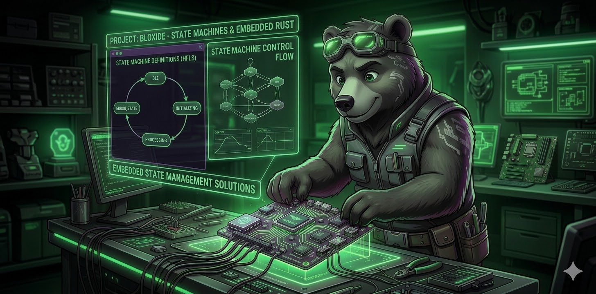

# Bloxide

<p align="center">
  
</p>

**Hierarchical state machine actors for Rust — runtime-agnostic, from Embassy bare-metal to Tokio.**

[](https://github.com/bloxide-com/bloxide/actions/workflows/lint-and-test.yml)
[](LICENSE)
[](https://doc.rust-lang.org/edition-guide/rust-2021/)

Bloxide is a hierarchical state machine (HSM) + actor messaging framework. Domain actors ("bloxes") are generic over a `Runtime` trait so the same state machine logic runs on Embassy bare-metal *and* Tokio without modification. A separate runtime crate wires channels, spawns tasks, and drives the state machine.

---

## Features

- **Hierarchical state machines** — composite states, event bubbling, entry/exit callbacks, run-to-completion dispatch
- **Runtime-agnostic actors** — blox code depends only on `bloxide-core`; never imports a runtime
- **Built-in supervisor** — reusable OTP-inspired supervisor blox manages child actor lifecycle out of the box
- **Tokio runtime** — `bloxide-tokio` provides `TokioRuntime`, async channels, and `spawn` wired to Tokio
- **Embassy-ready** — `bloxide-core` supports a `runtime-embassy` feature flag for bare-metal targets

---

## Quick look

A blox is a state machine plus a set of components (handles, receivers, extended state). Here is a trimmed view of the demo wiring with the Tokio runtime:

```rust
// Create channels for Root blox
let (root_handle, root_rx) =
    TokioMessageHandle::create_channel_with_size(1, DEFAULT_CHANNEL_SIZE);

// Build and run the supervisor (manages Root's lifecycle)
let supervisor_blox = Blox::<SupervisorComponents<TokioRuntime>>::new(
    supervisor_receivers,
    supervisor_extended_state,
    supervisor_handles,
);

tokio::spawn(async move {
    Box::new(supervisor_blox).run().await;
});
```

The identical blox types run on Embassy by swapping `TokioRuntime` for an Embassy `Runtime` impl — no changes to the blox code itself.

---

## Repository layout

```
bloxide/
├── crates/            # core library crates
│   ├── bloxide-core/      # HSM engine, MachineSpec, BloxRuntime, TestRuntime (no_std)
│   ├── bloxide-log/       # feature-gated logging macros (log / defmt / no-op)
│   ├── bloxide-macros/    # proc macros: #[derive(StateTopology)], transitions!, #[blox_event]
│   ├── bloxide-spawn/     # dynamic actor spawning and peer introduction
│   ├── bloxide-supervisor/ # reusable OTP-style supervisor
│   └── bloxide-timer/     # timer service: set_timer / cancel_timer
├── runtimes/          # runtime implementations
│   ├── bloxide-embassy/   # Embassy runtime (embedded target)
│   └── bloxide-tokio/     # Tokio runtime (std target)
├── examples/          # worked examples (ping-pong, pool/worker)
│   ├── messages/          # shared message crates
│   ├── actions/           # action trait crates
│   ├── bloxes/            # ping, pong, worker, pool
│   ├── embassy-demo-impl/ # concrete behavior types (e.g. PingBehavior)
│   ├── embassy-demo/
│   ├── tokio-demo/
│   └── tokio-pool-demo/
├── spec/              # architecture docs and per-blox specs
│   ├── architecture/      # 00–11 design docs
│   ├── bloxes/            # per-blox specs (ping, pong, supervisor)
│   └── templates/         # blox-spec template
└── .github/workflows/ # CI: copyright, fmt, clippy, tests, rustdoc
```

---

## Running the examples

```bash
# Ping-pong with OTP supervision, timer-driven pause, and full HSM tracing
RUST_LOG=trace cargo run --bin tokio-demo

# Worker pool with dynamic spawning
RUST_LOG=info cargo run --bin tokio-pool-demo

# Embassy (std target, simulates embedded)
RUST_LOG=trace cargo run --bin embassy-demo
```

---

## Crates

| Crate | Path | `no_std` | Purpose |
|---|---|:---:|---|
| `bloxide-core` | `crates/bloxide-core` | ✅ | HSM engine, `MachineSpec`, `BloxRuntime`, `StateMachine`, `TestRuntime` |
| `bloxide-macros` | `crates/bloxide-macros` | ✅¹ | `#[derive(StateTopology)]`, `#[derive(BloxCtx)]`, `transitions!`, `#[blox_event]` |
| `bloxide-log` | `crates/bloxide-log` | ✅ | Feature-gated logging macros (`log` / `defmt` / no-op) |
| `bloxide-timer` | `crates/bloxide-timer` | ✅ | `TimerCommand`, `TimerQueue`, `set_timer`, `cancel_timer` |
| `bloxide-supervisor` | `crates/bloxide-supervisor` | ✅ | `SupervisorSpec`, `ChildGroup`, `ChildPolicy`, `GroupShutdown` |
| `bloxide-spawn` | `crates/bloxide-spawn` | ✅ | Dynamic actor spawning and peer introduction |
| `bloxide-embassy` | `runtimes/bloxide-embassy` | — | Embassy runtime: `EmbassyRuntime`, `channels!`, `actor_task!`, `spawn_child!` |
| `bloxide-tokio` | `runtimes/bloxide-tokio` | — | Tokio runtime: `TokioRuntime`, `channels!`, `actor_task!`, `spawn_child!` |

¹ Proc-macro crates compile for the host; they have no `no_std` impact on the target binary.

---

## License

Licensed under the [MIT License](LICENSE).
