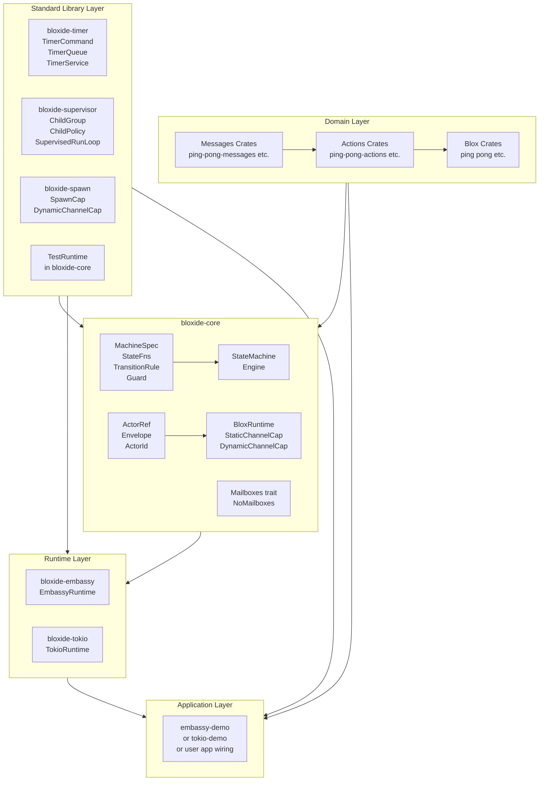
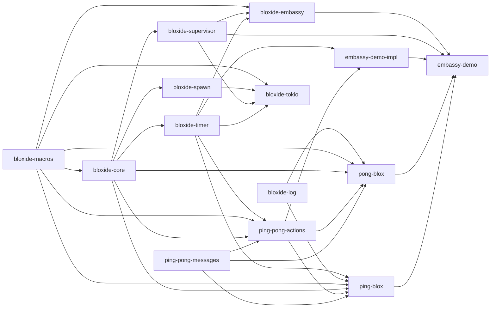

# System Architecture

Bloxide is a hierarchical state machine (HSM) + actor messaging framework for Rust,
targeting embedded systems (Embassy) and server environments (Tokio) while remaining
runtime-agnostic and fully testable without an executor.

## Layer Diagram



**Key rule**: arrows show dependency direction. Domain crates depend on `bloxide-core`
and standard library crates only — never on a runtime crate. Runtime internals never appear in blox code.

## Crate Dependency Graph



> `bloxide-log` is an independent crate with no dependency on `bloxide-core`. It is consumed directly by blox crates and the wiring binary. `bloxide-macros` is a proc-macro crate (host-compiled); it does not affect `no_std` targets.

## Separation of Concerns Rules

| Layer | What it contains | What it must NOT contain |
|-------|-----------------|--------------------------|
| Messages crates | Plain data enums/structs | Runtime types, `ActorRef` |
| Blox crates | `MachineSpec` impl, `Ctx`, state handlers, `Event` enum | Runtime imports, executor types |
| `bloxide-core` | `MachineSpec`, `StateMachine`, `ActorRef`, `BloxRuntime`, `StaticChannelCap`, `DynamicChannelCap`, `Mailboxes` | Tokio, Embassy, OS imports |
| `bloxide-timer` | `TimerCommand`, `TimerId`, `TimerQueue`, `HasTimerRef`, `set_timer`, `cancel_timer`, `TimerService` trait | Runtime imports, executor types |
| `bloxide-supervisor` | `LifecycleCommand`, `ChildLifecycleEvent`, `ChildGroup`, `ChildPolicy`, `GroupShutdown`, `HasChildren`, action functions, `SupervisedRunLoop` trait | Runtime imports, executor types |
| `bloxide-spawn` | `SpawnCap` trait, `DynamicChannelCap`, `SpawnCap` impl for `TestRuntime` | Runtime imports, executor types |
| Runtime crates | `BloxRuntime` + `StaticChannelCap` + `TimerService` + `SupervisedRunLoop` impls, `run_root` / `run_supervised_actor` | Domain logic |
| Application/Wiring | Channel creation, `ActorRef` injection, task spawning | Business logic |

## Multi-Mailbox Model

Each actor has **one typed mailbox per message type** it can receive. The actor's
`Event` enum wraps all receivable types. The `Mailboxes` trait selects across them
in priority order. See [07-typed-mailboxes.md](07-typed-mailboxes.md).

## Supervision

A supervisor is a reusable `MachineSpec` provided by `bloxide-supervisor`. It
receives `ChildLifecycleEvent` from the runtime (generated by observing
`DispatchOutcome` in the supervised run loop) and applies its configured
`ChildPolicy` (restart or stop) with `GroupShutdown` via `ChildGroup<R>`.
See [08-supervision.md](08-supervision.md).

## Runtime Selection

| Runtime | Best for | Features |
|---------|----------|----------|
| `bloxide-embassy` | Embedded systems, `no_std` targets | `StaticChannelCap`, `TimerService`, `SupervisedRunLoop` |
| `bloxide-tokio` | Server applications, native targets | `StaticChannelCap`, `DynamicChannelCap`, `TimerService`, `SupervisedRunLoop`, `SpawnCap` |
| `TestRuntime` | Unit tests, no executor needed | `DynamicChannelCap`, `SpawnCap` (via `bloxide-spawn/test_impl`) |

## User-Land Application Layout

```
my-app/
  messages/
    my-blox-foo-messages/   # shared message types; no runtime dependency
    my-blox-bar-messages/
  actions/
    my-blox-foo-actions/    # traits + generic action fns; no runtime dependency
    my-blox-bar-actions/
  my-app-impl/              # concrete behavior/storage types injected by wiring
  bloxes/
    my-blox-foo/            # MachineSpec impl; generic over R: BloxRuntime; exports prelude
    my-blox-bar/
  wiring/
    my-app-embassy/         # setup() fn using channels!, actor_task!/actor_task_supervised!, Ctx::new(); prelude imports
    # or for Tokio:
    my-app-tokio/           # setup() fn using channels!, actor_task!, spawn_child_dynamic!; prelude imports
```

The reusable supervisor comes from `bloxide-supervisor`; applications typically do
not define a separate `supervisor/` blox crate.

Wiring binaries use prelude wildcard imports to avoid multi-line framework boilerplate:

```rust
// For Embassy:
use bloxide_embassy::prelude::*;      // StateMachine, ActorRef, EmbassyRuntime, channels!, …
use bloxide_supervisor::prelude::*;   // ChildGroup, HasChildren, ChildPolicy, GroupShutdown, action functions
use my_blox_foo::prelude::*;          // FooCtx, FooSpec
use my_blox_bar::prelude::*;          // BarCtx, BarSpec

// For Tokio:
use bloxide_tokio::prelude::*;        // StateMachine, ActorRef, TokioRuntime, channels!, spawn_child_dynamic!, …
use bloxide_supervisor::prelude::*;   // ChildGroup, HasChildren, ChildPolicy, GroupShutdown, action functions
use my_blox_foo::prelude::*;
use my_blox_bar::prelude::*;
```

## Feature Flags (`bloxide-core`)

| Flag | Enables | Default |
|------|---------|---------|
| _(none)_ | `heapless` fixed-capacity containers, `no_std` | ✓ |
| `alloc` | `alloc::vec::Vec` for state paths | — |
| `std` | `std::vec::Vec`, implies `alloc` | — |
| `tracing` | `tracing::trace!` hooks in the engine | — |
