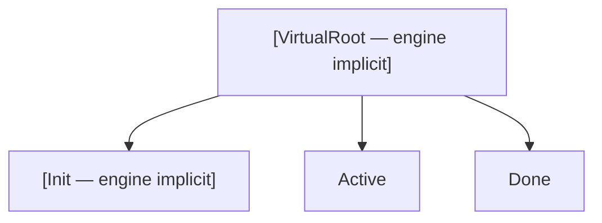
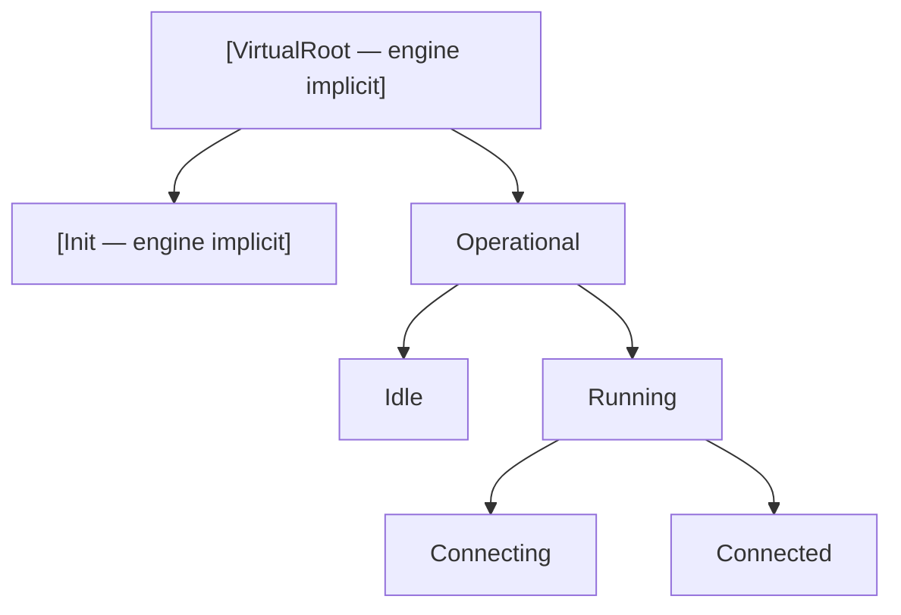
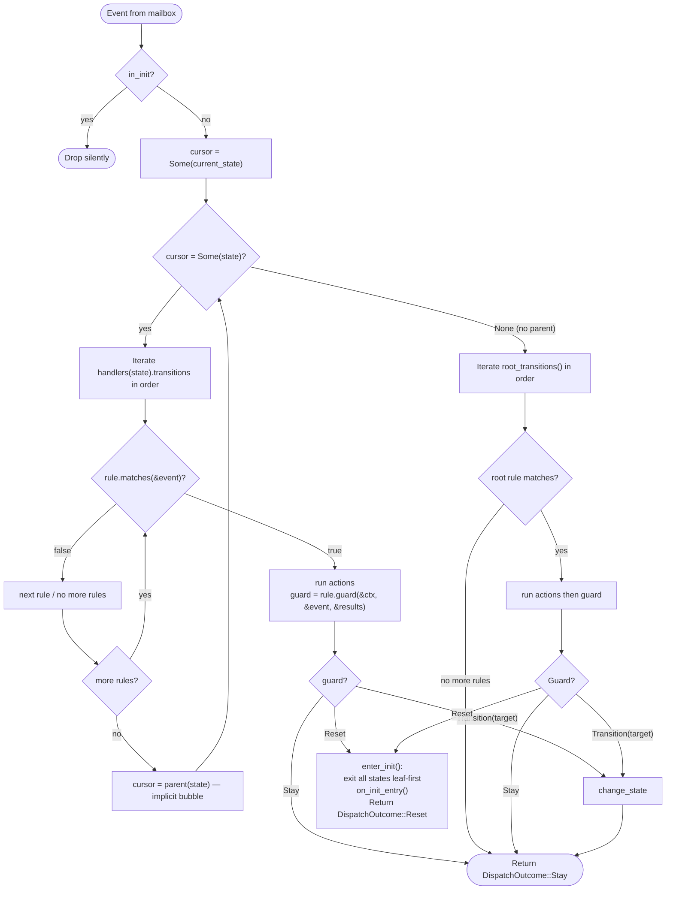
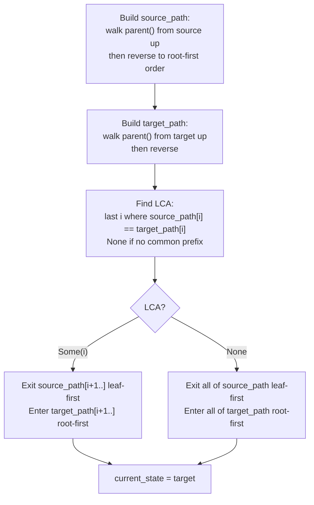

# HSM Engine

The engine lives in `bloxide-core`. It implements hierarchical state machine (HSM) semantics: parent fallback, LCA-based transitions, and run-to-completion dispatch.

## Engine-Implicit Root and Init

Neither `Root` nor `Init` appear in the user's `State` enum. Both are engine-managed:

- **Root** is implicit. Top-level user states return `None` from `parent()`. The engine prepends a virtual root when building state paths for LCA computation — it is never entered or exited.

- **Init** is implicit. Construction is **silent** — no callbacks fire. The machine starts in `Init` and waits for the runtime to call `machine.start()`. `on_init_entry` fires when the machine re-enters `Init` after a `reset()` call — it is for resetting domain state (counters, timers, etc.) only. All events dispatched while in `Init` are **silently dropped** — unless `is_start(&event)` returns `true`, in which case the machine exits Init and enters `initial_state()`. The runtime bypasses this by calling `start()` directly.

## State Hierarchy Concept

States form a tree. Only **leaf states** (states with no children) may be active. Composite (non-leaf) states exist solely to group children and provide shared transition rules for implicit bubbling.



> This is the `PingState` topology (simplified). `VirtualRoot` and `Init` are engine-implicit — not in the user's `State` enum. `Active` and `Done` are user-declared leaf states.

A deeper example showing nested composite states:



Events bubble up from the active leaf through each ancestor until one handles it, or the root rules catch it.

## Core API

### `MachineSpec` trait (`spec.rs`)

```rust
pub trait MachineSpec: Sized + 'static {
    type State: StateTopology;
    type Event: EventTag + Send + 'static;
    type Ctx: 'static;
    type Mailboxes<R: BloxRuntime>: Mailboxes<Self::Event>;

    const HANDLER_TABLE: &'static [&'static StateFns<Self>];

    // First operational leaf state entered after start():
    fn initial_state() -> Self::State;

    // Called when machine re-enters Init after reset() — domain-state reset only:
    fn on_init_entry(ctx: &mut Self::Ctx);

    // Optional: called when leaving Init (just before entering initial_state()):
    fn on_init_exit(_ctx: &mut Self::Ctx) {}

    // Returns true if state is terminal (runtime emits ChildLifecycleEvent::Done):
    fn is_terminal(_state: &Self::State) -> bool { false }

    // Returns true if state is an error state (runtime emits ChildLifecycleEvent::Failed).
    // is_error takes precedence over is_terminal — if both return true, only Failed is emitted:
    fn is_error(_state: &Self::State) -> bool { false }

    // Returns true if event should transition the actor out of Init.
    // Used when dispatch() is called directly (e.g. in test fixtures).
    // The runtime calls start() directly and does not rely on this.
    fn is_start(_event: &Self::Event) -> bool { false }

    // Root-level fallback rules (empty for most actors, override if needed):
    fn root_transitions() -> &'static [StateRule<Self>] { &[] }
}
```

### `StateMachine` — runtime-facing methods

```rust
impl<S: MachineSpec> StateMachine<S> {
    /// Construct silently in Init. No callbacks fire.
    pub fn new(ctx: S::Ctx) -> Self;

    /// Exit Init and enter initial_state(). Called by the runtime (run_supervised_actor).
    /// Returns DispatchOutcome::Started(state) if successful.
    /// Returns DispatchOutcome::Stay if already operational (idempotent).
    pub fn start(&mut self) -> DispatchOutcome<S::State>;

    /// Exit all operational states and re-enter Init. Called by the runtime on Terminate.
    /// Calls on_exit for each state leaf-first, then on_init_entry.
    /// Returns DispatchOutcome::Reset if successful.
    /// Returns DispatchOutcome::AlreadyInit if already in Init (idempotent).
    pub fn reset(&mut self) -> DispatchOutcome<S::State>;

    /// Dispatch a domain event. Silently dropped if in Init.
    pub fn dispatch(&mut self, event: S::Event) -> DispatchOutcome<S::State>;

    /// Shared reference to the machine context.
    pub fn ctx(&self) -> &S::Ctx;

    /// Mutable reference to the machine context.
    pub fn ctx_mut(&mut self) -> &mut S::Ctx;

    /// Current operational leaf state, or None if in Init.
    pub fn current_state(&self) -> Option<S::State>;
}
```

### `DispatchOutcome`

```rust
pub enum DispatchOutcome<State> {
    /// Non-Start event received while in Init — event blocked by design.
    /// The machine remains in Init waiting for a Start event.
    NotStarted,
    /// Event dispatched to an operational machine; no rule matched anywhere
    /// (implicit Stay — machine state is unchanged).
    Unhandled,
    /// `reset()` called while already in Init — no-op idempotency case.
    AlreadyInit,
    /// Machine left Init and entered the initial leaf state (from start()).
    Started(State),
    /// No transition — state unchanged.
    Stay,
    /// A transition occurred to this new leaf state.
    Transition(State),
    /// A guard returned Guard::Reset — machine exited all operational
    /// states and re-entered engine-implicit Init.
    Reset,
}
```

The runtime inspects `DispatchOutcome` after every call to generate `ChildLifecycleEvent` for the supervisor:
- `Started(s)` or `Transition(s)` where `is_error(&s)` → emits `ChildLifecycleEvent::Failed` (`is_error` takes precedence over `is_terminal`)
- `Started(s)` or `Transition(s)` where `is_terminal(&s)` → emits `ChildLifecycleEvent::Done`
- `Started(s)` → emits `ChildLifecycleEvent::Started`
- `Reset` → emits `ChildLifecycleEvent::Reset`
- `NotStarted`, `Unhandled`, `AlreadyInit`, `Stay` → no supervisor notification

### `StateFns` — handler table for one state

```rust
pub struct StateFns<S: MachineSpec + 'static> {
    pub on_entry:    &'static [fn(&mut S::Ctx)],
    pub on_exit:     &'static [fn(&mut S::Ctx)],
    pub transitions: &'static [StateRule<S>],
}
```

All function pointers are static (`fn`, not `dyn Fn`). All mutable state lives in `Ctx`. The `transitions` slice is evaluated in declaration order; the first matching rule wins. If no rule matches, the event implicitly bubbles to the parent state.

`on_entry` and `on_exit` are slices — multiple actions compose by listing them: `on_entry: &[increment_round, send_initial_ping]`.

### `StateRule` and `Guard`

```rust
pub struct TransitionRule<S: MachineSpec, G> {
    pub event_tag: u8,
    pub matches:  fn(&S::Event) -> bool,
    pub actions:  &'static [fn(&mut S::Ctx, &S::Event) -> ActionResult],
    pub guard:    fn(&S::Ctx, &ActionResults, &S::Event) -> G,
}

pub type StateRule<S> = TransitionRule<S, Guard<S>>;

pub enum Guard<S: MachineSpec> {
    Transition(LeafState<S::State>),
    Stay,
    Reset,  // exits entire operational chain and re-enters Init
}
```

> `LeafState<S::State>` is a newtype that `debug_assert!`s the target is a leaf state at construction. The `transitions!` proc macro wraps targets in `LeafState::new` automatically — user-facing syntax is unchanged.

### Root Rules

Root rules use the same `StateRule<S>` type as state-level rules — `root_transitions()` returns `&'static [StateRule<Self>]`. Both state-level and root-level rules have access to `Transition`, `Stay`, and `Reset` via `Guard<S>`. There is no separate `RootRule` type in the codebase; the `root_transitions!` macro generates `StateRule` items, identical to what `transitions!` generates.

Root rules are evaluated when an event bubbles past all user-declared ancestor states. Most actors leave `root_transitions()` at its default `&[]` — unhandled events are silently dropped. Since `Guard::Reset` is available in any transition rule (state-level or root-level), actors can self-terminate from any handler without needing root rules.

## Operational Dispatch Algorithm



**Run-to-completion**: the entire dispatch loop runs to `Return` before the actor consumes the next mailbox message.

## LCA Transition Algorithm

When `change_state(source, target)` is called:



`LCA = None` occurs when source and target are in different top-level subtrees (no shared user ancestor). The engine exits everything from source up to the virtual root, then enters everything from the virtual root down to target.

### Exit/Entry ordering example

Transition from `Connected` → `Idle` in the deep hierarchy above:

```
source_path (root-first): [Operational, Running, Connected]
target_path (root-first): [Operational, Idle]
LCA = Operational (index 0)

Exit (leaf → LCA, not including LCA):
  Connected.on_exit
  Running.on_exit

Entry (LCA child → target, including target):
  Idle.on_entry
```

### Cross-subtree transition (LCA = None)

Transition from `Idle` → `Active` when they are in different top-level subtrees:

```
source_path: [OldGroup, Idle]
target_path: [NewGroup, Active]
LCA = None (no common prefix)

Exit all source: Idle.on_exit, OldGroup.on_exit
Enter all target: NewGroup.on_entry, Active.on_entry
```

### Self-transition

`Transition(current_state)` — the LCA is forced to the **virtual parent** of the current state. If the state is top-level (no user parent), LCA = None, causing full exit + re-entry. Use `Guard::Stay` to stay without re-entering.

## `StateMachine` construction

```rust
let machine = StateMachine::new(ctx);
// Construction is silent: no callbacks fire. Machine is in Init.
// on_init_entry does NOT fire here.
// The runtime calls machine.start() when it receives LifecycleCommand::Start.
```

## Reset Semantics

Both `machine.reset()` (runtime-initiated) and `Guard::Reset` (returned by any transition guard) invoke the same `enter_init()` engine method. The engine:

1. Exits the current leaf state (`on_exit` for each action in the slice)
2. Exits every ancestor up to the virtual root (`on_exit` for each)
3. Calls `on_init_entry` — for domain-state reset only (counters, cancel timers, etc.)
4. Sets phase to `Init`
5. Returns `DispatchOutcome::Reset`

**The full LCA exit chain is absolute.** Neither `machine.reset()` nor `Guard::Reset` skips any `on_exit` handler — every state from the current leaf up to the topmost ancestor fires its exit actions before `on_init_entry` runs.

**Two paths to Reset, identical behavior:**

- **Runtime-initiated**: the runtime calls `machine.reset()` in response to `LifecycleCommand::Terminate`. This is how supervisors terminate children.
- **Self-initiated**: a transition guard at any level (state or root) returns `Guard::Reset`. This is how actors self-terminate in response to domain events (e.g., a supervisor resetting itself after all children have shut down).

**Reset is valid from any operational state.** `on_exit` handlers must be safe to call unconditionally.

Example — Reset while in `Paused` (child of `Operating`):

```
current_state = Paused
source_path = [Operating, Paused]

Reset exits:
  Paused.on_exit      ← must handle "timer may not be running"
  Operating.on_exit   ← must handle "counter may be 0"
Then:
  on_init_entry()     ← resets round counter; no supervisor notification needed
```

## `is_terminal` and Done Detection

Actors with terminal states override `is_terminal`:

```rust
fn is_terminal(state: &PingState) -> bool {
    matches!(state, PingState::Done)
}
```

The runtime checks `is_terminal` after `DispatchOutcome::Started(s)` and `DispatchOutcome::Transition(s)`. If it returns `true`, the runtime emits `ChildLifecycleEvent::Done { child_id }` to the supervisor. The actor itself does nothing special in `Done::on_entry` — no supervisor notification required.

## Topology Invariants

The `parent()` function must form a **tree**:

1. Every chain of `parent()` calls from any state must terminate at `None` (no cycles).
2. Two root-first paths from any pair of states either share a monotone common prefix and then diverge, or share no prefix at all (no DAG re-convergence).
3. `parent()` returns `None` only for top-level states (those that are direct children of the virtual root). There can be multiple top-level states.

The `find_lca` algorithm relies on invariant (2). A `debug_assert!` in the engine detects DAG topologies in debug builds. The recommended verification test:

```rust
#[test]
fn test_topology_no_cycles() {
    use std::collections::HashSet;
    for &s in &ALL_STATES {
        let mut seen = HashSet::new();
        let mut cursor = Some(s);
        while let Some(c) = cursor {
            assert!(seen.insert(c), "cycle at {:?}", c);
            cursor = MySpec::parent(c);
        }
    }
}
```
