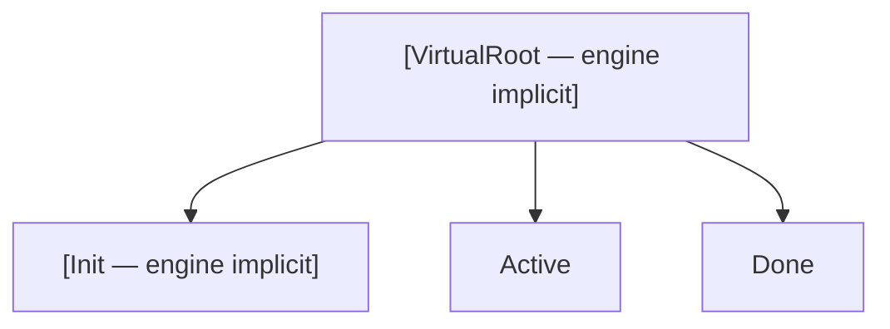
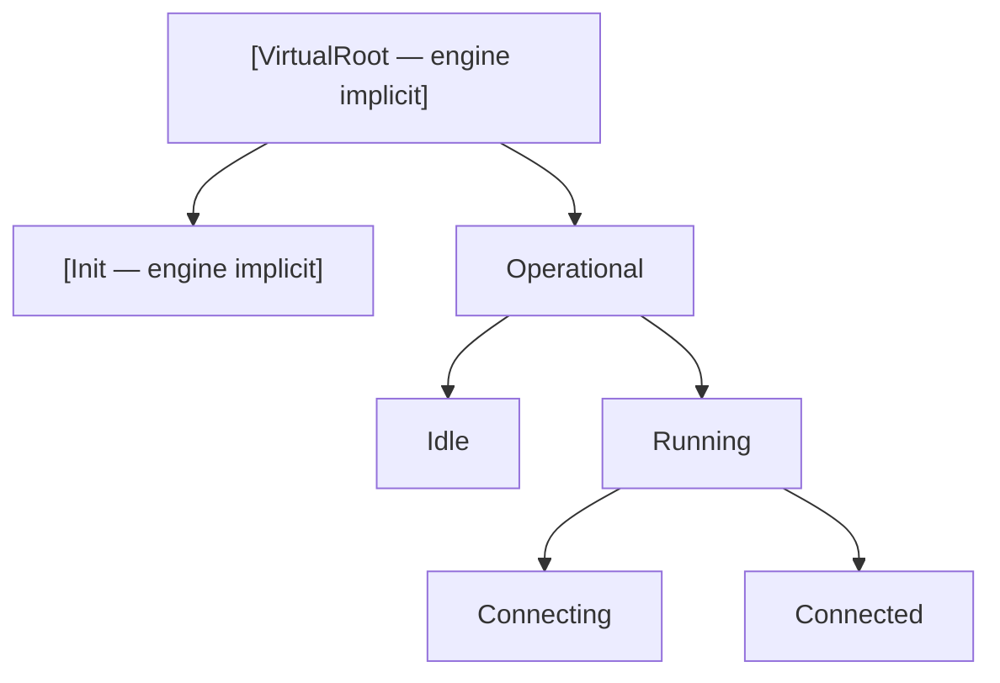
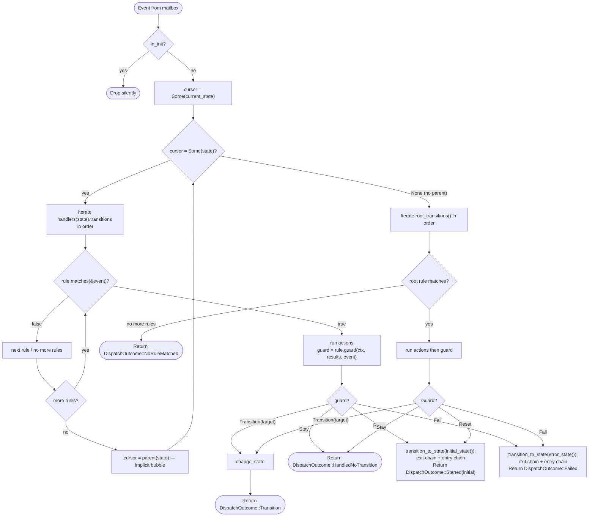
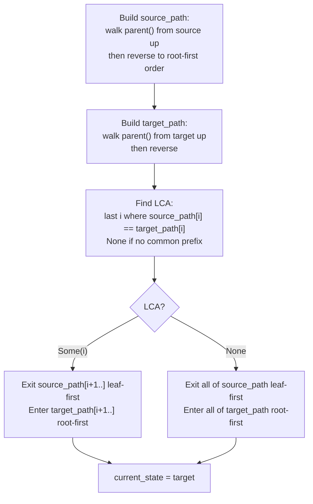

# HSM Engine

> **When would I use this?** Use this document when implementing `MachineSpec`,
> understanding the dispatch algorithm, Init/start/reset behavior, LCA transitions,
> or the VirtualRoot lifecycle handler. This is the canonical reference for the HSM engine.

The engine lives in `bloxide-core`. It implements hierarchical state machine (HSM) semantics: parent fallback, LCA-based transitions, and run-to-completion dispatch.

## Engine-Implicit Root and Init

Neither `VirtualRoot` nor `Init` appear in the user's `State` enum. Both are engine-managed:

- **VirtualRoot** is implicit. Top-level user states return `None` from `parent()`. The engine prepends VirtualRoot when building state paths for LCA computation — VirtualRoot contains the lifecycle handler table (`root_transitions()` from `MachineSpec`) and intercepts `LifecycleCommand` variants *before* user-declared states see them. If `root_transitions()` returns `&[]`, all lifecycle commands are handled by the engine's default rules: `Start` → exit Init, enter `initial_state()`; `Reset` → full exit chain, then entry chain for `initial_state()` (immediately operational, no `on_init_entry`, returns `Started`); `Stop` → full exit chain to Init, fire `on_init_entry`, returns `Stopped`; `Ping` → respond with `ChildLifecycleEvent::Alive`. `Abort` and `Kill` are not lifecycle commands — see [Four-Level Lifecycle](#four-level-lifecycle-reset--stop--abort--kill) below.

- **Init** is implicit. Construction is **silent** — no callbacks fire. The machine starts in `Init` and waits for a `LifecycleCommand::Start` event to be dispatched. `on_init_entry` fires **only** when the machine re-enters `Init` via `LifecycleCommand::Stop` — it is for resetting domain state (counters, timers, etc.) only. It does **not** fire on `Reset` (which goes directly to `initial_state()`) or on `Guard::Fail` (which goes to `error_state()`). All non-lifecycle events dispatched while in `Init` are **silently dropped**. Lifecycle commands are handled at VirtualRoot level, so the machine in Init still processes Start/Reset/Stop/Ping via the engine's lifecycle handler.

## Four-Level Lifecycle: `reset → stop → abort → kill`

Bloxide has four distinct lifecycle levels, ordered from gentlest to most forceful:

| Level | Mechanism | Through dispatch? | Exit callbacks? | `on_init_entry`? | End state | `DispatchOutcome` | Restartable? |
|-------|-----------|-------------------|-----------------|------------------|-----------|-------------------|--------------|
| **Reset** | `LifecycleCommand::Reset` | ✅ | ✅ Full exit chain | ❌ (skips Init) | `initial_state()` — immediately operational | `Started(initial)` | ✅ immediately |
| **Stop** | `LifecycleCommand::Stop` | ✅ | ✅ Full exit chain | ✅ (cleanup) | `Init` — suspended | `Stopped` | ✅ via `Start` |
| **Abort** | `AbortCommand::Abort { child_id }` | ❌ (run loop breaks) | ❌ None | ❌ | Task ends (cooperative) | `Aborted` | ✅ via respawning |
| **Kill** | `R::Kill::kill(abort_handle)` | ❌ (runtime ripcord) | ❌ None | ❌ | Task gone — permanently dead | (nothing) | ❌ permanently |

### Reset

`LifecycleCommand::Reset` goes through `dispatch()`. The engine:
1. Runs `on_exit` for every state from the current leaf up to the root (full exit chain)
2. Runs `on_entry` for the `initial_state()` path (root-to-leaf)
3. Sets current state to `initial_state()`
4. Returns `DispatchOutcome::Started(initial_state)`

**Reset skips Init entirely.** No `on_init_entry` or `on_init_exit` fires. The `on_entry` callbacks for `initial_state()` are responsible for resetting domain state. The actor is immediately operational — the supervisor does not need to send `Start` separately.

### Stop

`LifecycleCommand::Stop` goes through `dispatch()`. The engine:
1. Runs `on_exit` for every state from the current leaf up to the root
2. Calls `on_init_entry(&mut Ctx)` — for resource cleanup / domain state reset
3. Sets current state to `Init`
4. Returns `DispatchOutcome::Stopped`

The actor sits suspended in `Init`. To resume, the supervisor sends `Start`, which calls `on_init_exit` and enters `initial_state()`.

### Abort

`AbortCommand::Abort { child_id }` is sent on a dedicated **abort mailbox** (separate from the lifecycle mailbox). The actor's run loop polls it alongside lifecycle and domain mailboxes. When `AbortCommand::Abort` is received, the run loop breaks — the task ends cooperatively. No `dispatch()` is called, no exit callbacks fire, no `on_init_entry` fires.

The runtime synthesizes `DispatchOutcome::Aborted` and sends `ChildLifecycleEvent::Aborted` to the supervisor. The task is ended but was not externally destroyed — restarting requires respawning a new task.

### Kill

`R::Kill::kill(abort_handle)` is the external ripcord. It immediately aborts the task in place — works even on stuck/deadlocked actors that aren't polling any mailbox. No callbacks, no dispatch, no mailbox. The task is permanently dead.

The supervisor receives no `DispatchOutcome` for a killed actor; it learns the actor is gone through the runtime's task-completion signal.

## State Hierarchy Concept

States form a tree. Only **leaf states** (states with no children) may be active. Composite (non-leaf) states exist solely to group children and provide shared transition rules for implicit bubbling.



> This is the `PingState` topology (simplified). `VirtualRoot` and `Init` are engine-implicit — not in the user's `State` enum. `Active` and `Done` are user-declared leaf states. Lifecycle commands (Start, Reset, Stop, Ping) are matched against VirtualRoot's transition rules *first*, before any user-declared state sees them.

A deeper example showing nested composite states:



Events bubble up from the active leaf through each ancestor until one handles it, or VirtualRoot catches it. Lifecycle commands are special: VirtualRoot intercepts them regardless of current state (including Init) and applies the appropriate lifecycle transition.

## Core API

### `MachineSpec` trait (`spec.rs`)

```rust
pub trait MachineSpec: Sized + 'static {
    type State: StateTopology;
    type Event: EventTag + Send + 'static;
    type Ctx: 'static;
    type Mailboxes<R: BloxRuntime>: Mailboxes<Self::Event>;

    const HANDLER_TABLE: &'static [&'static StateFns<Self>];

    // First operational leaf state entered after start():
    fn initial_state() -> Self::State;

    // Called ONLY when the machine enters Init via LifecycleCommand::Stop.
    // Does NOT fire on Reset (goes to initial_state()) or Fail (goes to error_state()).
    // Domain-state cleanup only:
    fn on_init_entry(ctx: &mut Self::Ctx);

    // Optional: called when leaving Init (just before entering initial_state()):
    fn on_init_exit(_ctx: &mut Self::Ctx) {}

    // Returns true if state is terminal (runtime emits ChildLifecycleEvent::Done):
    fn is_terminal(_state: &Self::State) -> bool { false }

    // Returns true if state is an error state (runtime emits ChildLifecycleEvent::Failed).
    // is_error takes precedence over is_terminal — if both return true, only Failed is emitted:
    fn is_error(_state: &Self::State) -> bool { false }

    /// The error state to enter on Guard::Fail. Default: same as initial_state().
    fn error_state() -> Self::State { Self::initial_state() }

    // Root-level rules for domain events that bubble past all user-declared states.
    // Empty for most actors — unhandled events are silently dropped.
    // Lifecycle commands (Start, Reset, Stop, Ping) are intercepted at VirtualRoot
    // before any user state sees them, not handled here.
    fn root_transitions() -> &'static [StateRule<Self>] { &[] }
}
```

### `MachineSpec` quick map: `State` -> `StateFns` -> `HANDLER_TABLE`

For most bloxes, the state enum and handler table mapping are generated from `bloxide.toml`:

```toml
[topology]

[[topology.states]]
name = "Ready"

[[topology.states]]
name = "Done"
```

Run `cargo blox generate` to produce `src/generated/topology.rs` with `CounterState` and the `counter_state_handler_table!` macro:

```rust
pub use crate::generated::topology::CounterState;

impl<R: BloxRuntime, B: CountsTicks + 'static> MachineSpec for CounterSpec<R, B> {
    // ...
    const HANDLER_TABLE: &'static [&'static StateFns<Self>] =
        counter_state_handler_table!(Self);
}
```

`state.as_index()` is used to index `HANDLER_TABLE`, so variant order and handler-table
order must stay aligned. Using the generated `*_state_handler_table!(Self)` macro avoids
manual ordering mistakes. See the API docs in
`crates/bloxide-core/src/spec.rs` (`MachineSpec::HANDLER_TABLE`) for details.

### `StateMachine` — runtime-facing methods

```rust
impl<S: MachineSpec> StateMachine<S> {
    /// Construct silently in Init. No callbacks fire.
    pub fn new(ctx: S::Ctx) -> Self;

    /// Dispatch an event (domain or lifecycle). All events, including
    /// LifecycleCommand variants (Start, Reset, Stop, Ping), flow through
    /// this method. VirtualRoot intercepts lifecycle commands before user states.
    /// Abort and Kill do NOT go through dispatch() — they are handled by the run loop.
    /// 
    /// Lifecycle outcomes:
    /// - Start (from Init) → Started(initial_state)
    /// - Start (already operational) → HandledNoTransition (idempotent)
    /// - Reset → Started(initial_state) (full exit chain, then entry chain for initial_state(); no on_init_entry)
    /// - Stop → Stopped (full exit chain to Init, fires on_init_entry, task stays alive)
    /// - Ping → HandledNoTransition (emits Alive event)
    /// 
    /// Non-dispatch lifecycle (handled by run loop, not dispatch()):
    /// - Abort → Aborted (cooperative self-termination via AbortCommand, task ends)
    /// - Kill → (ripcord: R::Kill::kill(abort_handle), immediate task abort, no callbacks, no DispatchOutcome)
    pub fn dispatch(&mut self, event: S::Event) -> DispatchOutcome<S::State>;

    /// Shared reference to the machine context.
    pub fn ctx(&self) -> &S::Ctx;

    /// Mutable reference to the machine context.
    pub fn ctx_mut(&mut self) -> &mut S::Ctx;

    /// Current operational leaf state, or None if in Init.
    pub fn current_state(&self) -> Option<S::State>;
}
```

Lifecycle is driven entirely through `dispatch()` with LifecycleCommand events. VirtualRoot handles these commands internally, and the runtime observes DispatchOutcome to emit ChildLifecycleEvents to supervisors.

### `DispatchOutcome`

```rust
pub enum DispatchOutcome<State> {
    /// No rule matched anywhere (event bubbled to VirtualRoot with no match).
    NoRuleMatched,
    /// Rule matched but guard returned Stay.
    HandledNoTransition,
    /// Transition occurred to a user state.
    Transition(MachineState<State>),
    /// Left Init via Start command, or Reset to initial_state().
    Started(MachineState<State>),
    /// Transitioned to terminal state.
    Done(MachineState<State>),
    /// Actor failed via Guard::Fail or entered error state.
    Failed,
    /// Actor stopped to Init via LifecycleCommand::Stop.
    Stopped,
    /// Actor aborted cooperatively via AbortCommand (Kill produces no DispatchOutcome).
    Aborted,
    /// Actor responded to Ping.
    Alive,
}
```

> **Note:** The `Reset` variant has been removed. `Reset` now returns `Started(initial_state)` — the actor is immediately operational, not suspended in Init.

### Lifecycle Command Handling at VirtualRoot

Lifecycle commands are detected via `event.as_lifecycle_command()` and handled *before* any state handler sees them:

| Command | Behavior | DispatchOutcome |
|---------|----------|-----------------|
| `Start` | If in Init: exit Init, enter `initial_state()` | `Started(MachineState::State(state))` |
| `Start` | If already operational: no-op (idempotent) | `HandledNoTransition` |
| `Reset` | Full exit chain → enter `initial_state()` (immediately operational, skips Init) | `Started(MachineState::State(state))` |
| `Stop` | Full exit chain → Init (suspended, can be restarted via Start) | `Stopped` |
| `Ping` | Respond with health notification | `Alive` |

`Abort` and `Kill` are not `LifecycleCommand` variants — they bypass dispatch entirely (see [Four-Level Lifecycle](#four-level-lifecycle-reset--stop--abort--kill) above).

The runtime inspects `DispatchOutcome` after every call to generate `ChildLifecycleEvent` for the supervisor:
- `Started(s)` where `is_error(&s)` → emits `ChildLifecycleEvent::Failed` (`is_error` takes precedence over `is_terminal`)
- `Started(s)` where `is_terminal(&s)` → emits `ChildLifecycleEvent::Done`
- `Started(s)` → emits `ChildLifecycleEvent::Started` (covers both Start and Reset)
- `Done(s)` → emits `ChildLifecycleEvent::Done`
- `Failed` → emits `ChildLifecycleEvent::Failed`
- `Stopped` → emits `ChildLifecycleEvent::Stopped`
- `Aborted` → emits `ChildLifecycleEvent::Aborted`
- `Alive` → emits `ChildLifecycleEvent::Alive`
- `NoRuleMatched`, `HandledNoTransition`, `Transition` → no supervisor notification (not forwarded)

### `StateFns` — handler table for one state

```rust
pub struct StateFns<S: MachineSpec + 'static> {
    pub on_entry:    &'static [fn(&mut S::Ctx)],
    pub on_exit:     &'static [fn(&mut S::Ctx)],
    pub transitions: &'static [StateRule<S>],
}
```

All function pointers are static (`fn`, not `dyn Fn`). All mutable state lives in `Ctx`. The `transitions` slice is evaluated in declaration order; the first matching rule wins. **Bubbling is implicit**: if no rule matches in the current state, the engine moves the cursor to the parent and evaluates that state's rules. No manual "return Parent" — bubbling happens automatically when no rule matches.

`on_entry` and `on_exit` are slices — multiple actions compose by listing them: `on_entry: &[increment_round, send_initial_ping]`.

### `StateRule` and `Guard`

```rust
pub struct TransitionRule<S: MachineSpec, G> {
    pub event_tag: u8,
    pub matches:  fn(&S::Event) -> bool,
    pub actions:  &'static [fn(&mut S::Ctx, &S::Event) -> ActionResult],
    pub guard:    fn(&S::Ctx, &ActionResults, &S::Event) -> G,
}
```

> **`ActionResult` vs `ActionResults`**: Each action returns `ActionResult` (Ok/Err). The engine collects all action results into `ActionResults` before calling the guard. Guards receive `&ActionResults` to inspect failures (e.g. `results.any_failed()`) and decide the transition.

```rust
pub type StateRule<S> = TransitionRule<S, Guard<S>>;

pub enum Guard<S: MachineSpec> {
    Transition(LeafState<S::State>),
    Stay,
    /// Self-reset: go directly to initial_state(), skipping Init entirely.
    /// Fires full exit chain + entry chain for initial_state().
    /// Does NOT call on_init_entry. Returns Started.
    Reset,
    /// Go to error_state(), report Failed to supervisor.
    /// Fires full exit chain + entry chain for error_state().
    /// Does NOT call on_init_entry. Returns Failed.
    Fail,
}
```

> `LeafState<S::State>` is a newtype that `debug_assert!`s the target is a leaf state at construction. The codegen emits `LeafState::new(...)` directly from TOML `to = "StateName"` entries in `[[topology.transitions]]` — no proc macro is involved.

### Guard::Reset vs Guard::Fail

Both are actor-returned guards (from handler tables), not supervisor-sent commands:

- **`Guard::Reset`** — goes directly to `initial_state()`. Full exit chain fires, then entry chain for `initial_state()`. Returns `DispatchOutcome::Started`. Skips Init. Used when the actor wants to self-restart cleanly.

- **`Guard::Fail`** — goes to `error_state()` (defaults to `initial_state()`). Full exit chain fires, then entry chain for `error_state()`. Returns `DispatchOutcome::Failed`. Skips Init. Does NOT fire `on_init_entry`. Used for error propagation — the supervisor sees `Failed` and applies its `ChildPolicy`.

### Root Rules

Root rules use the same `StateRule<S>` type as state-level rules — `root_transitions()` returns `&'static [StateRule<Self>]`. Both state-level and root-level rules have access to `Transition`, `Stay`, `Reset`, and `Fail` via `Guard<S>`. There is no separate `RootRule` type in the codebase. State-level rules are generated by `bloxide-codegen` from `[[topology.transitions]]` entries in `blox.toml`; root-level rules are still expressed via the hand-written `MachineSpec::root_transitions()` trait method (defaulting to `&[]`), since the TOML schema has no `root_transitions` key.

Root rules are evaluated when an event bubbles past all user-declared ancestor states. Most actors leave `root_transitions()` at its default `&[]` — unhandled events are silently dropped. Since `Guard::Reset` and `Guard::Fail` are available in any transition rule (state-level or root-level), actors can self-reset or self-fail from any handler without needing root rules.

## Operational Dispatch Algorithm



**Run-to-completion**: the entire dispatch loop runs to `Return` before the actor consumes the next mailbox message.

## LCA Transition Algorithm

When `change_state(source, target)` is called:



`LCA = None` occurs when source and target are in different top-level subtrees (no shared user ancestor). The engine exits everything from source up to the virtual root, then enters everything from the virtual root down to target.

### Exit/Entry ordering example

Transition from `Connected` → `Idle` in the deep hierarchy above:

```
source_path (root-first): [Operational, Running, Connected]
target_path (root-first): [Operational, Idle]
LCA = Operational (index 0)

Exit (leaf → LCA, not including LCA):
  Connected.on_exit
  Running.on_exit

Entry (LCA child → target, including target):
  Idle.on_entry
```

### Cross-subtree transition (LCA = None)

Transition from `Idle` → `Active` when they are in different top-level subtrees:

```
source_path: [OldGroup, Idle]
target_path: [NewGroup, Active]
LCA = None (no common prefix)

Exit all source: Idle.on_exit, OldGroup.on_exit
Enter all target: NewGroup.on_entry, Active.on_entry
```

### Stay vs self-transition

- **`Guard::Stay`** — the machine remains in the current state. No `on_exit` or `on_entry` fires. Use when a rule handles an event with side effects but no state change.
- **`Transition(current_state)`** (self-transition) — the LCA is forced to the **virtual parent** of the current state. If the state is top-level (no user parent), LCA = None, causing full exit + re-entry. Use when you need `on_exit` and `on_entry` to fire (e.g. retry loops that reset state on entry).

## `StateMachine` construction and Init

```rust
let machine = StateMachine::new(ctx);
// Construction is silent: no callbacks fire. Machine is in Init.
// on_init_entry does NOT fire here.
// The runtime dispatches LifecycleCommand::Start to exit Init and enter initial_state().
```

**Init semantics:**
- `new(ctx)` — machine enters Init silently. No `on_init_entry` fires.
- `dispatch(LifecycleCommand::Start)` — exits Init, enters `initial_state()`. Returns `Started(state)`. If already operational, returns `HandledNoTransition` (idempotent).
- `dispatch(LifecycleCommand::Reset)` — exits all operational states leaf-first, enters `initial_state()` directly (skips Init). Returns `Started(state)`. No `on_init_entry` fires.
- `dispatch(LifecycleCommand::Stop)` — exits all operational states leaf-first, calls `on_init_entry`, sets phase to `Init`. Returns `Stopped`.

## Reset Semantics

`dispatch(LifecycleCommand::Reset)` (runtime-initiated) and `Guard::Reset` (returned by any transition guard) both go directly to `initial_state()`. The engine:

1. Exits the current leaf state (`on_exit` for each action in the slice)
2. Exits every ancestor up to the root (`on_exit` for each)
3. Enters `initial_state()` by running `on_entry` for each state in the path (root-to-leaf)
4. Sets current state to `initial_state()`
5. Returns `DispatchOutcome::Started(initial_state)`

**Reset skips Init entirely.** No `on_init_entry` or `on_init_exit` fires. The `on_entry` callbacks for `initial_state()` are responsible for resetting domain state. The actor is immediately operational — the supervisor sees `Started` and does not need to send `Start`.

**Two paths to Reset, identical behavior:**

- **Runtime-initiated**: the runtime dispatches `LifecycleCommand::Reset` in response to a supervisor command. This is how supervisors restart children.
- **Self-initiated**: a transition guard at any level (state or root) returns `Guard::Reset`. This is how actors self-restart in response to domain events (e.g., a supervisor resetting itself after all children have shut down).

**Reset is valid from any operational state.** `on_exit` handlers must be safe to call unconditionally.

Example — Reset while in `Paused` (child of `Operating`), where `initial_state()` is `Active`:

```
current_state = Paused
source_path = [Operating, Paused]
target_path = [Operating, Active]   (assuming Active is also under Operating)

Reset exits:
  Paused.on_exit      ← must handle "timer may not be running"
  (Operating.on_exit does NOT fire — it's the LCA)

Reset enters:
  Active.on_entry     ← resets round counter, sends initial ping
```

If `initial_state()` is in a different subtree (LCA = None), the full exit AND entry chains fire.

## `is_terminal` and Done Detection

Actors with terminal states override `is_terminal`:

```rust
fn is_terminal(state: &PingState) -> bool {
    matches!(state, PingState::Done)
}
```

The runtime checks `is_terminal` after `DispatchOutcome::Started(s)`. If it returns `true`, the runtime emits `ChildLifecycleEvent::Done { child_id }` to the supervisor. The actor itself does nothing special in `Done::on_entry` — no supervisor notification required.

## Topology Invariants

The `parent()` function must form a **tree**:

1. Every chain of `parent()` calls from any state must terminate at `None` (no cycles).
2. Two root-first paths from any pair of states either share a monotone common prefix and then diverge, or share no prefix at all (no DAG re-convergence).
3. `parent()` returns `None` only for top-level states (those that are direct children of the virtual root). There can be multiple top-level states.

The `find_lca` algorithm relies on invariant (2). A `debug_assert!` in the engine detects DAG topologies in debug builds. The recommended verification test:

```rust
#[test]
fn test_topology_no_cycles() {
    use std::collections::HashSet;
    for &s in &ALL_STATES {
        let mut seen = HashSet::new();
        let mut cursor = Some(s);
        while let Some(c) = cursor {
            assert!(seen.insert(c), "cycle at {:?}", c);
            cursor = MySpec::parent(c);
        }
    }
}
```

## Related Docs

- **Dispatch semantics** → This file
- **State topology definition** → `crates/bloxide-core/src/topology.rs`
- **MachineSpec trait** → `crates/bloxide-core/src/spec.rs`
- **Handler patterns** → `spec/architecture/05-handler-patterns.md`
- **Declarative transitions (blox.toml)** → `skills/building-with-bloxide/reference.md` → `[[topology.transitions]]`
- **Four-level lifecycle** → This file → [Four-Level Lifecycle](#four-level-lifecycle-reset--stop--abort--kill)
- **Supervision policies** → `spec/architecture/08-supervision.md`
