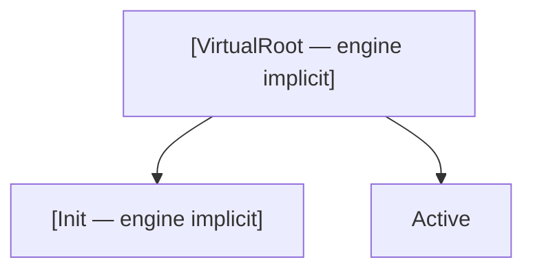
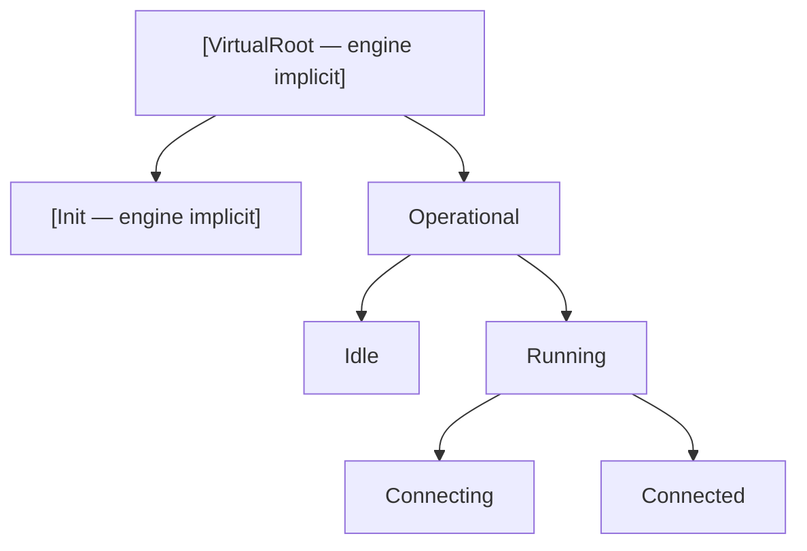
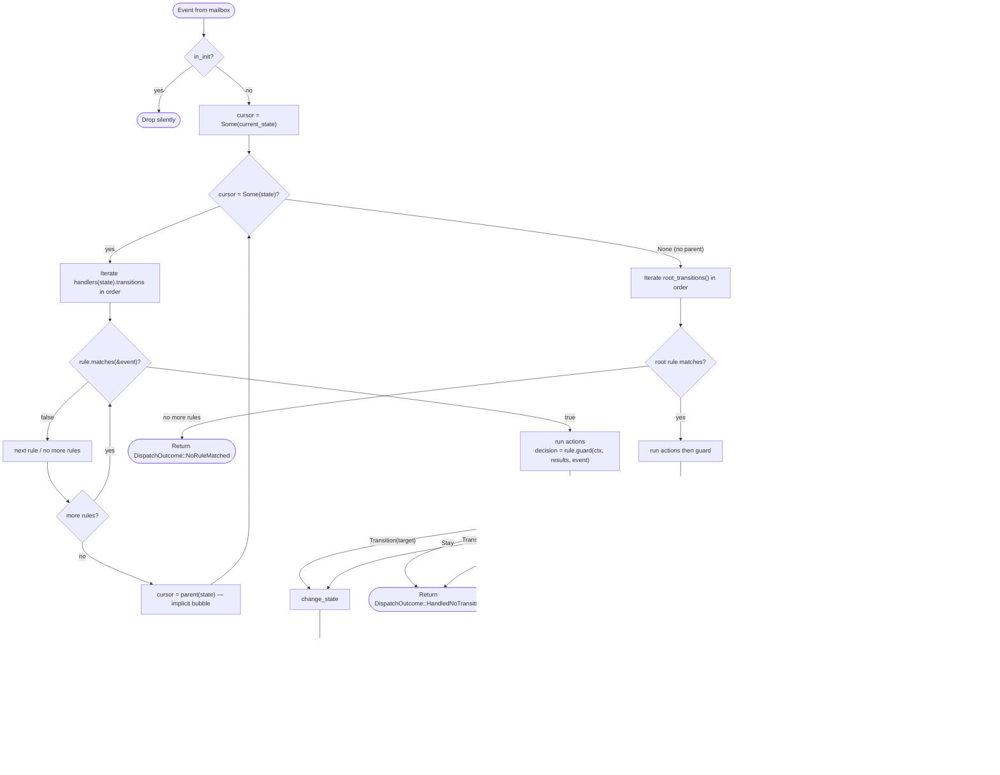
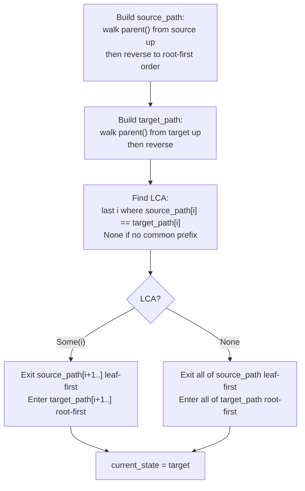

# HSM Engine & Lifecycle

> **When would I use this?** Use this document when implementing `MachineSpec`,
> understanding the dispatch algorithm, the five-level lifecycle
> (`reset → stop → done → abort → kill`), Init/start/reset behavior, LCA
> transitions, or how supervisors observe `DispatchOutcome`. This is the
> canonical reference for the HSM engine and the unified lifecycle model. For
> the supervision policy layer, see `08-supervision.md`.

The engine lives in `bloxide-core`. It implements hierarchical state machine (HSM) semantics: parent fallback, LCA-based transitions, and run-to-completion dispatch.

Bloxide actors use a **unified lifecycle model**: every event — including
lifecycle commands such as `Start`, `Reset`, and `Stop` — flows through a
single `dispatch()` entry point and is routed by the engine's VirtualRoot
handling. There is no separate "lifecycle track" that bypasses dispatch. This
keeps the state machine the single source of truth for all state transitions
and lets the runtime observe every lifecycle-relevant outcome through one
return type, `DispatchOutcome`.

## Engine-Implicit Root and Init

Neither `VirtualRoot` nor `Init` appear in the user's `State` enum. Both are engine-managed:

- **VirtualRoot** is implicit. Top-level user states return `None` from `parent()`. The engine prepends VirtualRoot when building state paths for LCA computation and intercepts `LifecycleCommand` variants *before* any rule evaluation — lifecycle commands never reach user handler tables or `root_transitions()`. `root_transitions()` is a **domain-event fallback**, evaluated only when a domain event bubbles past all user-declared states; it is not the lifecycle handler table. The engine's built-in lifecycle handling: `Start` → exit Init (fire `on_init_exit`), enter `initial_state()`; `Reset` → LCA-based `change_state` to `initial_state()` (immediately operational, no `on_init_entry`, returns `Started`; from Init this is equivalent to `Start` and fires `on_init_exit`); `Stop` → full exit chain to Init, fire `on_init_entry`, returns `Stopped`; `Ping` → respond with `ChildLifecycleEvent::Alive`. `Abort` and `Kill` are not lifecycle commands — see [Five-Level Lifecycle](#five-level-lifecycle-reset--stop--done--abort--kill) below.

- **Init** is implicit. Construction is **silent** — no callbacks fire. The machine starts in `Init` and waits for a `LifecycleCommand::Start` event to be dispatched. `on_init_entry` has a default empty implementation and fires **only** when the machine re-enters `Init`: via `LifecycleCommand::Stop`, `Decision::Stop`, `Decision::Done`, or `Decision::Fail` when `error_state()` is `None`. It is for resetting domain state (counters, timers, etc.) only. It does **not** fire at construction, on `Reset` (which goes directly to `initial_state()`), on `Decision::Fail` when `error_state()` is `Some(state)` (which goes to that state), or on `Abort`/`Kill` (which bypass dispatch). All non-lifecycle events dispatched while in `Init` are **silently dropped** (dispatch returns `HandledNoTransition`). Lifecycle commands are intercepted by the engine regardless of current state, so the machine in Init still processes Start/Reset/Stop/Ping.

## Five-Level Lifecycle: `reset → stop → done → abort → kill`

Bloxide has five distinct lifecycle levels, ordered from gentlest to most forceful:

| Level | Mechanism | Through dispatch? | Exit callbacks? | `on_init_entry`? | End state | `DispatchOutcome` | Restartable? |
|-------|-----------|-------------------|-----------------|------------------|-----------|-------------------|--------------|
| **Reset** | `LifecycleCommand::Reset` or `Decision::Reset` | ✅ | ✅ LCA-based (ancestors at/above the LCA do not fire `on_exit`) | ❌ (skips Init) | `initial_state()` — immediately operational | `Started(initial)` | ✅ immediately |
| **Stop** | `LifecycleCommand::Stop` or `Decision::Stop` | ✅ | ✅ Full exit chain | ✅ (cleanup) | `Init` — suspended, run loop stays alive | `Stopped` | ✅ via `Start`/`Reset` |
| **Done** | `Decision::Done` | ✅ | ✅ Full exit chain | ✅ (same cleanup as Stop) | `Init` — but the run loop **always ends the task** | `Done` | ❌ task ended — supervisor deregisters (respawn to run again) |
| **Abort** | `AbortCommand::Abort { child_id }` | ❌ (run loop breaks) | ❌ None | ❌ | Task ends (cooperative) | `Aborted` | ✅ via respawning |
| **Kill** | `R::Kill::kill(handle)` | ❌ (runtime ripcord) | ❌ None | ❌ | Task gone — permanently dead | (nothing) | ❌ permanently |

### Reset

`LifecycleCommand::Reset` goes through `dispatch()`. The engine:
1. Runs LCA-based `change_state` to `initial_state()` — `on_exit` fires only for states *below* the LCA (see [Reset Semantics](#reset-semantics))
2. Runs `on_entry` for the `initial_state()` path below the LCA
3. Sets current state to `initial_state()`
4. Returns `DispatchOutcome::Started(initial_state)`

**Reset skips Init entirely.** No `on_init_entry` or `on_init_exit` fires (a Reset *from* Init is the exception — it is equivalent to Start and fires `on_init_exit`). The `on_entry` callbacks for `initial_state()` are responsible for resetting domain state. The actor is immediately operational — the supervisor does not need to send `Start` separately.

### Stop

`LifecycleCommand::Stop` (or `Decision::Stop` from a guard closure) goes through `dispatch()`. The engine:
1. Runs `on_exit` for every state from the current leaf up to the root (full exit chain — Init sits outside the user state tree, so no LCA applies)
2. Calls `on_init_entry(&mut Ctx)` — for resource cleanup / domain state reset
3. Sets current state to `Init`
4. Returns `DispatchOutcome::Stopped`

The actor sits suspended in `Init`. The run loop stays alive — only `Abort` or `Done` ends the task. To resume, the supervisor sends `Start` (or `Reset`), which calls `on_init_exit` and enters `initial_state()`. Stop in Init is idempotent: the engine returns `Stopped` again without re-firing `on_init_entry`, so the supervisor's shutdown bookkeeping always gets its acknowledgment.

### Done

`Decision::Done` (returned by a guard closure) goes through `dispatch()` and runs the **same cleanup ritual as Stop**:

1. Runs `on_exit` for every state from the current leaf up to the root (full exit chain)
2. Calls `on_init_entry(&mut Ctx)` — for resource cleanup
3. Sets current state to `Init`
4. Returns `DispatchOutcome::Done`

The difference is at the run loop: `Done` **always ends the task** (like `Aborted`), regardless of `exit_on_stop`. This is clean self-termination — the actor declares its work complete. `Done` is not a terminal *state* (there is no `is_terminal`); it is a decision outcome that runs the Init cleanup ritual and then finishes the task.

The supervisor sees `ChildLifecycleEvent::Done` and **deregisters the child** (`ChildGroup::deregister`) — no `ChildPolicy` restart is triggered, because Done is success, not a fault. Deregistration drops the child's refs. Use `Decision::Stop` for suspend/resume, `Decision::Done` for normal completion, `Decision::Fail` for faults.

### Abort

`AbortCommand::Abort { child_id }` is sent on a dedicated **abort mailbox** (separate from the lifecycle mailbox). The actor's run loop polls it alongside lifecycle and domain mailboxes. When `AbortCommand::Abort` is received, the run loop breaks — the task ends cooperatively. No `dispatch()` is called, no exit callbacks fire, no `on_init_entry` fires.

The runtime synthesizes `DispatchOutcome::Aborted` and sends `ChildLifecycleEvent::Aborted` to the supervisor. The task is ended but was not externally destroyed — restarting requires respawning a new task.

### Kill

`R::Kill::kill(handle)` is the external ripcord. It immediately aborts the task in place — works even on stuck/deadlocked actors that aren't polling any mailbox. No callbacks, no dispatch, no mailbox. The task is permanently dead.

There is no `DispatchOutcome` for a killed actor — a destroyed task never gets to report one. When the supervisor itself invokes the ripcord (`ChildPolicy::Kill`), its own `ChildGroup` bookkeeping synthesizes `ChildLifecycleEvent::Killed` directly (`record_killed()`).

### KillCapability

`KillCapability` is a runtime-facing capability trait (Tier 2), not a blox-facing trait. Only supervisors and the wiring layer hold kill handles; actors never see `KillCapability`. It exists solely to back `ChildPolicy::Kill` — the ripcord-only, forcible-termination path. Cooperative cleanup is `ChildPolicy::Abort` (which sends an `AbortCommand` and lets the child self-terminate); `KillCapability` is not involved in that path.

```rust
// In bloxide-core/src/capability.rs
pub trait KillCapability<R: BloxRuntime> {
    type Handle: Clone + Send + 'static;
    fn kill(handle: Self::Handle);
}
```

Two implementations:

- **`Kill`** — for dynamic runtimes (Tokio). Lives in `bloxide-spawn` (it requires the `SpawnCap` bound); `Handle` is the cloneable `KillHandle`.
- **`NoKill`** — for static runtimes (Embassy), defined in `capability.rs`. `Handle = ()` (a ZST); `kill` is a no-op, because static actors cannot be aborted at runtime.

The supervisor stores the concrete handle per child in its `ChildEntry` registry (the `kill_handle` field) — not a trait object. There is no `Arc<dyn KillCapability>` and no dynamic dispatch: the handle is a concrete, clonable value supplied by the runtime, and the supervisor invokes `R::Kill::kill(handle)` only when its policy is `ChildPolicy::Kill` and immediate, non-cooperative cleanup is required.

## One Dispatch Pipeline

All mailboxes (lifecycle and domain) feed a single dispatch pipeline. Each event is handed to `StateMachine::dispatch()`. Inside `dispatch`, the engine checks whether the event carries a `LifecycleCommand` (via the `LifecycleEvent::as_lifecycle_command` trait method). If it does, the engine handles it at VirtualRoot level before any rule table is consulted. Otherwise the event is routed through the user's state handler tables, bubbling from the active leaf up to VirtualRoot.

```
All mailboxes (lifecycle + domain)
        │
        ▼
   dispatch(event)
        │
        ├── event carries LifecycleCommand?  ──►  VirtualRoot handles it
        │                                              (Start / Reset / Stop / Ping)
        │
        └── domain event  ──►  active leaf → ancestors → VirtualRoot
                               (user handler tables, then root_transitions())
```

`Abort` and `Kill` are **not** `LifecycleCommand` variants — they bypass dispatch entirely. `Abort` is received on a separate abort mailbox and breaks the run loop. `Kill` is a runtime capability call that destroys the task.

### The Mailbox Event Wrapper (`LifecycleEvent`)

Lifecycle commands are not dispatched as a bare enum through domain mailboxes. Each actor's event type wraps `LifecycleCommand` in one of its own variants and implements the `LifecycleEvent` trait so the engine can recognise it:

```rust
pub trait LifecycleEvent: EventTag {
    /// Returns the lifecycle command if this event wraps one.
    /// Returns None for domain events.
    fn as_lifecycle_command(&self) -> Option<LifecycleCommand> { None }
}
```

`dispatch()` calls `as_lifecycle_command()` on every event. When it returns `Some(cmd)`, the engine routes the command to `handle_lifecycle` and never consults any rule table for that event — neither state handlers nor `root_transitions()`. When it returns `None`, the event is treated as a domain event and flows through the normal leaf-to-root rule lookup.

Supervised children additionally receive lifecycle commands on a **dedicated lifecycle stream** (`RunConfig::supervised(lc, notify)`): the run loop polls that stream first and calls `handle_lifecycle` directly. The wrapped `Lifecycle` variant is the same engine interception one level down — used when lifecycle commands arrive through the event stream (e.g. `RunConfig::bare()`, or the generated `start()`/`reset()`/`stop()`/`ping()` constructors).

This wrapper design is what makes the lifecycle model "unified": lifecycle commands travel through the same mailbox machinery and the same VirtualRoot handling as domain events, rather than being intercepted by the runtime before the state machine ever sees them.

### Mailbox Priority Ordering

The run loop polls its inputs in strict priority order: **lifecycle → abort → domain**. Within the domain set, the `Mailboxes` trait polls its constituent streams in **priority order**: the first stream in the tuple is always polled first, and when it has a message that message is returned immediately without checking later streams. Order domain streams by descending urgency.

This guarantees that a `Stop` or `Reset` sent while domain messages are backlogged is still observed promptly: the lifecycle stream is drained before any queued domain event.

`Mailboxes::poll_next` returns `Poll<Option<E>>`:

- `Poll::Ready(Some(event))` when any stream has a message.
- `Poll::Ready(None)` only when **all** streams have closed (all-streams-close semantics, issue #134) — a single closed stream does **not** shut down the actor.
- `Poll::Pending` when no message is ready but at least one stream is still open.

## State Hierarchy Concept

States form a tree. Only **leaf states** (states with no children) may be active. Composite (non-leaf) states exist solely to group children and provide shared transition rules for implicit bubbling.


```mermaid
flowchart TD
    VR["[VirtualRoot — engine implicit]"]
    Init["[Init — engine implicit]"]
    Active

    VR --> Init
    VR --> Active
```

> This is the `PingState` topology (simplified). `VirtualRoot` and `Init` are engine-implicit — not in the user's `State` enum. `Active` is a user-declared leaf state. Lifecycle commands (Start, Reset, Stop, Ping) are intercepted by the engine at VirtualRoot level *first*, before any user-declared state sees them. Actors self-suspend via `Decision::Stop` instead of reaching a terminal state.

A deeper example showing nested composite states:


```mermaid
flowchart TD
    VR["[VirtualRoot — engine implicit]"]
    Init["[Init — engine implicit]"]
    Operational
    Idle
    Running
    Connecting
    Connected

    VR --> Init
    VR --> Operational
    Operational --> Idle
    Operational --> Running
    Running --> Connecting
    Running --> Connected
```

Events bubble up from the active leaf through each ancestor until one handles it, or VirtualRoot catches it. Lifecycle commands are special: the engine intercepts them regardless of current state (including Init) and applies the appropriate lifecycle transition.

## Core API

### `MachineSpec` trait (`spec.rs`)

```rust
pub trait MachineSpec: Sized + 'static {
    type State: StateTopology;
    type Event: EventTag + LifecycleEvent + Send + 'static;
    type Ctx: 'static;
    type Mailboxes<R: BloxRuntime>: Mailboxes<Self::Event>;

    const HANDLER_TABLE: &'static [&'static StateFns<Self>];

    // First operational leaf state entered after Start:
    fn initial_state() -> Self::State;

    // Called when entering Init — via LifecycleCommand::Stop, Decision::Stop,
    // Decision::Done, or Decision::Fail when error_state() is None.
    // Does NOT fire at construction, on Reset (which skips Init), or on
    // Abort/Kill (which bypass dispatch). Default: empty.
    // Domain-state cleanup only:
    fn on_init_entry(_ctx: &mut Self::Ctx) {}

    // Optional: called when leaving Init via Start (or Reset from Init,
    // which is equivalent to Start), just before entering initial_state():
    fn on_init_exit(_ctx: &mut Self::Ctx) {}

    // User-defined error recovery state for Decision::Fail:
    // - Some(state): transition to this state (exit/entry chains fire).
    //   Must be a leaf — construction debug_asserts this.
    // - None (default): go to Init (exit chain + on_init_entry fire).
    // Either way the supervisor sees DispatchOutcome::Failed:
    fn error_state() -> Option<Self::State> { None }

    // Returns true if state is an error state. dispatch() converts a
    // transition into an error state into DispatchOutcome::Failed, and the
    // runtime emits ChildLifecycleEvent::Failed:
    fn is_error(_state: &Self::State) -> bool { false }

    // Root-level rules for domain events that bubble past all user-declared states.
    // Empty for most actors — unhandled events are silently dropped.
    // Lifecycle commands (Start, Reset, Stop, Ping) are intercepted by the engine
    // before any rule evaluation — they never reach these rules.
    fn root_transitions() -> &'static [StateRule<Self>] { &[] }
}
```

### `MachineSpec` quick map: `State` -> `StateFns` -> `HANDLER_TABLE`

For most bloxes, the state enum and handler table mapping are generated from `blox.toml`:

```toml
[topology]

[[topology.states]]
name = "Ready"

[[topology.states]]
name = "Active"
```

Run `cargo blox generate` to produce `src/generated/topology.rs` with `CounterState` and the `counter_state_handler_table!` macro:

```rust
pub use crate::generated::topology::CounterState;

impl<R: BloxRuntime> MachineSpec for CounterSpec<R> {
    // ...
    const HANDLER_TABLE: &'static [&'static StateFns<Self>] =
        counter_state_handler_table!(Self);
}
```

`state.as_index()` is used to index `HANDLER_TABLE`. The generated
`*_state_handler_table!(Self)` macro derives the table order mechanically from
the same `[[topology.states]]` list as the enum itself, so variant order and
handler-table order cannot drift. Construction `debug_assert!`s
`HANDLER_TABLE.len() == State::STATE_COUNT` (engine.rs `StateMachine::new`),
and lookups are bounds-checked in debug builds. See the API docs in
`crates/bloxide-core/src/spec.rs` (`MachineSpec::HANDLER_TABLE`) for details.

### `StateMachine` — runtime-facing methods

```rust
impl<S: MachineSpec> StateMachine<S> {
    /// Construct silently in Init. No callbacks fire.
    /// Debug-asserts HANDLER_TABLE length matches STATE_COUNT, and that
    /// initial_state() (and error_state() when Some) are leaf states.
    pub fn new(ctx: S::Ctx) -> Self;

    /// Dispatch an event (domain or lifecycle). All events flow through this
    /// method; events carrying a LifecycleCommand are delegated to
    /// handle_lifecycle before any rule evaluation. Abort and Kill do NOT go
    /// through dispatch() — they are handled by the run loop / runtime.
    ///
    /// Lifecycle outcomes:
    /// - Start (from Init) → Started(initial_state) — fires on_init_exit
    /// - Start (already operational) → HandledNoTransition (idempotent)
    /// - Reset (from Init) → Started(initial_state) — equivalent to Start, fires on_init_exit
    /// - Reset (operational) → Started(initial_state) — LCA-based change_state to
    ///   initial_state(); no on_init_entry / on_init_exit
    /// - Stop (operational) → Stopped (full exit chain to Init, fires on_init_entry)
    /// - Stop (in Init) → Stopped (idempotent ack; on_init_entry does NOT re-fire)
    /// - Ping → Alive (emits Alive event)
    ///
    /// Non-dispatch lifecycle (handled by run loop, not dispatch()):
    /// - Abort → Aborted (cooperative self-termination via AbortCommand, task ends)
    /// - Kill → (ripcord: R::Kill::kill(handle), immediate task abort, no callbacks, no DispatchOutcome)
    pub fn dispatch(&mut self, event: S::Event) -> DispatchOutcome<S::State>;

    /// Handle a lifecycle command directly at VirtualRoot level.
    /// dispatch() delegates to this when as_lifecycle_command() returns
    /// Some(cmd); the run loop also calls it directly for messages on the
    /// dedicated lifecycle stream and for auto_start.
    pub fn handle_lifecycle(&mut self, cmd: LifecycleCommand) -> DispatchOutcome<S::State>;

    /// Shared reference to the machine context.
    pub fn ctx(&self) -> &S::Ctx;

    /// Mutable reference to the machine context.
    pub fn ctx_mut(&mut self) -> &mut S::Ctx;

    /// Current state: implicit Init or an operational user state.
    pub fn current_state(&self) -> MachineState<S::State>;
}
```

`MachineState` tracks the current state — the moral equivalent of `Option<S::State>` that semantically distinguishes the engine's implicit `Init` from any user-declared state that happens to be named "Init":

```rust
pub enum MachineState<S> {
    /// Implicit Init state — machine is in lifecycle wait state.
    Init,
    /// One of the user's declared operational states.
    State(S),
}

impl<S> MachineState<S> {
    /// Returns true if the machine is in implicit Init.
    pub fn is_init(&self) -> bool;

    /// Returns the operational state, or None in Init.
    pub fn as_state(&self) -> Option<&S>;
}
```

Users may declare their own domain state also named `Init` with no conflict, because the engine's `Init` is never a variant of the user's enum.

Lifecycle is driven entirely through `dispatch()` with LifecycleCommand events. The engine handles these commands internally at VirtualRoot level, and the runtime observes DispatchOutcome to emit ChildLifecycleEvents to supervisors.

### `DispatchOutcome`

```rust
pub enum DispatchOutcome<State> {
    /// No rule matched anywhere (event bubbled to VirtualRoot with no match).
    NoRuleMatched,
    /// Rule matched but the guard returned Decision::Stay.
    HandledNoTransition,
    /// Transition occurred to a user state.
    Transition(MachineState<State>),
    /// Left Init via Start command, or reset directly to initial_state()
    /// via Reset command or Decision::Reset. Actor is immediately operational.
    Started(MachineState<State>),
    /// Actor failed via Decision::Fail, or a transition entered an error state.
    Failed,
    /// Actor stopped to Init via LifecycleCommand::Stop or Decision::Stop.
    /// Exit chain and on_init_entry fired. Actor is suspended in Init.
    Stopped,
    /// Actor self-terminated cleanly via Decision::Done. Exit chain and
    /// on_init_entry fired (same cleanup as Stop), then the run loop exits —
    /// the task ends. The supervisor deregisters the child.
    Done,
    /// Actor aborted via AbortCommand on the abort mailbox. No callbacks
    /// fired. Synthesized by the run loop, never returned by dispatch().
    Aborted,
    /// Actor responded to Ping.
    Alive,
}
```

> **Note:** `DispatchOutcome` has no `Killed` variant — a killed actor's task is destroyed externally and never reports an outcome. `ChildLifecycleEvent::Killed` still exists; it is synthesized directly by the supervisor's `ChildGroup` bookkeeping (see [Kill](#kill)).

### Lifecycle Command Handling at VirtualRoot

Lifecycle commands are detected via `event.as_lifecycle_command()` and handled by `handle_lifecycle` *before* any state handler sees them:

| Command | Behavior | DispatchOutcome |
|---------|----------|-----------------|
| `Start` | If in Init: fire `on_init_exit`, enter `initial_state()` | `Started(MachineState::State(state))` |
| `Start` | If already operational: no-op (idempotent) | `HandledNoTransition` |
| `Reset` | LCA-based `change_state` to `initial_state()` (immediately operational, skips Init; from Init equivalent to `Start` — fires `on_init_exit`) | `Started(MachineState::State(state))` |
| `Stop` | Full exit chain + `on_init_entry` → Init (suspended, restartable via `Start`/`Reset`) | `Stopped` |
| `Stop` | If already in Init: idempotent ack — `on_init_entry` does NOT re-fire | `Stopped` |
| `Ping` | Respond with health notification | `Alive` |

`Abort` and `Kill` are not `LifecycleCommand` variants — they bypass dispatch entirely (see [Five-Level Lifecycle](#five-level-lifecycle-reset--stop--done--abort--kill) above).

### `StateFns` — handler table for one state

```rust
pub struct StateFns<S: MachineSpec + 'static> {
    pub on_entry:    &'static [fn(&mut S::Ctx)],
    pub on_exit:     &'static [fn(&mut S::Ctx)],
    pub transitions: &'static [StateRule<S>],
}
```

All function pointers are static (`fn`, not `dyn Fn`). All mutable state lives in `Ctx`. The `transitions` slice is evaluated in declaration order; the first matching rule wins. **Bubbling is implicit**: if no rule matches in the current state, the engine moves the cursor to the parent and evaluates that state's rules. No manual "return Parent" — bubbling happens automatically when no rule matches.

`on_entry` and `on_exit` are slices — multiple actions compose by listing them: `on_entry: &[increment_round, send_initial_ping]`.

### `StateRule` and `Decision`

```rust
pub struct TransitionRule<S: MachineSpec, G> {
    pub event_tag: u8,
    pub matches:  fn(&S::Event) -> bool,
    pub actions:  &'static [ActionFn<S>],  // fn(&mut S::Ctx, &S::Event) -> ActionResult
    pub guard:    fn(&S::Ctx, &ActionResults, &S::Event) -> G,
}
```

Terminology: the **guard** is the `guard` closure field above (and the `condition` predicates in TOML `[[topology.transitions.guards]]`) — a pure predicate over `&Ctx` and `&ActionResults`. The **`Decision`** is the enum the guard returns after evaluation.

> **`ActionResult` vs `ActionResults`**: Each transition action function returns `ActionResult` (Ok/Err) — the uniform contract. Codegen wrappers return the function's result verbatim; they do not discard it and append `Ok`. The engine collects all action results into `ActionResults` before calling the guard. Guards inspect `results.any_failed()`, `results.all_ok()`, or `results.failure_count()` and decide the transition. Entry/exit actions are a separate, infallible contract (`fn(&mut Ctx)`).

```rust
pub type StateRule<S> = TransitionRule<S, Decision<S>>;

pub enum Decision<S: MachineSpec> {
    /// Transition to target. When target == current_state this is a
    /// self-transition: fires on_exit then on_entry.
    Transition(LeafState<S::State>),
    /// Stay in the current state. No on_exit or on_entry fires.
    Stay,
    /// Self-reset: go directly to initial_state(), skipping Init entirely.
    /// LCA-based change_state: exit chain below the LCA, entry chain for
    /// initial_state(). Does NOT call on_init_entry or on_init_exit.
    /// Returns Started. The actor is immediately operational.
    Reset,
    /// Self-suspend: go to Init (full exit chain + on_init_entry).
    /// Returns Stopped. The actor is suspended in Init; the run loop stays
    /// alive (only Abort or Done ends the task). The supervisor can later
    /// send Start or Reset to resume.
    Stop,
    /// Self-terminate cleanly: full exit chain + on_init_entry (same
    /// cleanup ritual as Stop), then the task ENDS instead of suspending.
    /// Returns Done. The supervisor deregisters the child — no restart
    /// policy triggered. Use for normal completion.
    Done,
    /// Error propagation: go to error_state() when Some (LCA-based
    /// change_state; the state must be a leaf), or to Init when None
    /// (full exit chain + on_init_entry). Returns Failed.
    Fail,
}
```

> `LeafState<S::State>` is a newtype that `debug_assert!`s the target is a leaf state at construction. The codegen emits `LeafState::new(...)` directly from TOML `to = "StateName"` entries in `[[topology.transitions]]` — no proc macro is involved.

### Decision::Reset vs Decision::Stop vs Decision::Done vs Decision::Fail

All four are actor-returned decisions (from guard closures), not supervisor-sent commands:

- **`Decision::Reset`** — goes directly to `initial_state()` via LCA-based `change_state`: ancestors at/above the LCA do NOT fire `on_exit`; the entry chain for `initial_state()` fires. Returns `DispatchOutcome::Started`. Skips Init — no `on_init_entry`/`on_init_exit`. Used when the actor wants to self-restart cleanly.

- **`Decision::Stop`** — goes to `Init`. Full exit chain fires (leaf-to-root — Init is outside the user state tree, so no LCA applies), then `on_init_entry` fires. Returns `DispatchOutcome::Stopped`. The actor is suspended in Init; the run loop stays alive (only `Abort` or `Done` ends the task). The supervisor sees `Stopped` and can later send `Start` to resume. Used when the actor wants to self-suspend (e.g. a supervisor self-stopping after all children have stopped).

- **`Decision::Done`** — runs the same cleanup as `Decision::Stop` (full exit chain + `on_init_entry`, ends in `Init`), but returns `DispatchOutcome::Done` and the run loop **always** ends the task. The supervisor deregisters the child — no `ChildPolicy` restart. Used for normal completion (e.g. a counter that reached its target).

- **`Decision::Fail`** — goes to `error_state()` when `Some(state)` (LCA-based `change_state`; entry chain fires), or to `Init` when `None` (the default — full exit chain + `on_init_entry` fire). Returns `DispatchOutcome::Failed`. Used for error propagation — the supervisor sees `Failed` and applies its `ChildPolicy`. Supervised actors stay alive, parked in their (absorbing) error state, until the policy acts (`Reset` revives); root/unsupervised actors exit on `Failed`.

### Root Rules

Root rules use the same `StateRule<S>` type as state-level rules — `root_transitions()` returns `&'static [StateRule<Self>]`. Both state-level and root-level rules can return **all six `Decision` variants** — `Transition`, `Stay`, `Reset`, `Stop`, `Done`, and `Fail`. There is no separate `RootRule` type in the codebase. State-level rules are generated by `bloxide-codegen` from `[[topology.transitions]]` entries in `blox.toml`; root-level rules are still expressed via the hand-written `MachineSpec::root_transitions()` trait method (defaulting to `&[]`), since the TOML schema has no `root_transitions` key.

Root rules are evaluated when a domain event bubbles past all user-declared ancestor states. Most actors leave `root_transitions()` at its default `&[]` — unhandled events are silently dropped. Since all six `Decision` variants are available in any transition rule (state-level or root-level), actors can self-reset, self-stop, self-terminate, or self-fail from any handler without needing root rules.

## Supervisor Observation of DispatchOutcome

`dispatch()` returns a `DispatchOutcome`; the run loop passes it to `report_outcome` (supervision.rs), which translates it into a `ChildLifecycleEvent` and sends it to the supervisor's notify channel. Only lifecycle-relevant outcomes produce a notification — `NoRuleMatched`, `HandledNoTransition`, and `Transition` are internal state-machine events the supervisor does not need to see:

| `DispatchOutcome` | `ChildLifecycleEvent` | Supervisor Action |
|-------------------|-----------------------|-------------------|
| `Started(s)` where `is_error(&s)` is false | `Started` | Record child as running (covers both Start and Reset) |
| `Started(s)` where `is_error(&s)` is true | `Failed` | Apply `ChildPolicy` |
| `Failed` | `Failed` | Apply `ChildPolicy` (Reset, Stop, Abort, or Kill) |
| `Stopped` | `Stopped` | `record_stopped()` — child suspended in Init |
| `Done` | `Done` | `deregister()` — clean completion, no restart policy |
| `Aborted` | `Aborted` | `record_aborted()` — child permanently done |
| `Alive` | `Alive` | `handle_alive()` — record child as responsive |
| `NoRuleMatched` | — | (not forwarded) |
| `HandledNoTransition` | — | (not forwarded) |
| `Transition(_)` | — | (not forwarded) |

Two outcomes never appear in this table as-is:

- **Transition into an error state** never reaches the runtime as `Transition`: `dispatch()` converts it to `Failed` before returning, so the supervisor always sees `Failed`.
- **`Killed`** has no `DispatchOutcome` at all. `ChildLifecycleEvent::Killed` is synthesized directly by the supervisor's `ChildGroup` when the supervisor itself kills the child (`record_killed()`) — a killed actor never gets to report.

Because the supervisor is itself a state machine actor, it handles these `ChildLifecycleEvent` messages through its own `dispatch()` pipeline and state handler tables — the same unified mechanism as every other actor. There is no special "supervisor channel" that bypasses dispatch: child lifecycle events arrive as ordinary domain events on the supervisor's mailbox and are routed through the supervisor's handler tables, where they trigger policy actions such as sending `Reset` to restart a failed or stopped child, sending `AbortCommand::Abort` for cooperative self-termination (`ChildPolicy::Abort`), or invoking `R::Kill::kill(handle)` to forcibly remove one (`ChildPolicy::Kill`).

This observer model means actors have **zero knowledge of their supervisor**. There is no `supervisor_ref` in actor context, no lifecycle messages in the actor's event enum beyond the wrapper for `LifecycleCommand`, and no rules for `Reset`/`Stop`/`Ping` in the actor's own handler tables. The actor simply runs its state machine and returns `DispatchOutcome` values; the supervisor watches those outcomes and decides what to do.

## `ChildLifecycleEvent`

Defined in `bloxide-core/src/lifecycle.rs`. The runtime generates these automatically by observing `DispatchOutcome` (`report_outcome`) — except `Killed`, which the supervisor synthesizes itself when it invokes the kill capability. No actor code sends them.

```rust
pub enum ChildLifecycleEvent {
    Started { child_id: ActorId },  // child exited Init or was Reset (now operational)
    Failed  { child_id: ActorId },  // child entered an error state (is_error) or returned Decision::Fail
    Stopped { child_id: ActorId },  // child stopped via LifecycleCommand::Stop or Decision::Stop (in Init, suspended)
    Done    { child_id: ActorId },  // child self-terminated cleanly via Decision::Done (task ended — deregister, no restart)
    Aborted { child_id: ActorId },  // child was aborted via AbortCommand, task has ended (cooperative)
    Killed  { child_id: ActorId },  // child was killed via KillCapability (external destruction; synthesized by the supervisor's ChildGroup)
    Alive   { child_id: ActorId },  // child responded to Ping (healthy)
}
```

## Operational Dispatch Algorithm


```mermaid
flowchart TD
    A([Event from mailbox]) --> B{in_init?}
    B -->|"yes"| DROP([Drop silently])
    B -->|"no"| C["cursor = Some(current_state)"]
    C --> D{"cursor = Some(state)?"}

    D -->|"yes"| E["Iterate handlers(state).transitions in order"]
    E --> F{"rule.matches(&event)?"}
    F -->|"false"| G["next rule / no more rules"]
    G --> H{"more rules?"}
    H -->|"yes"| F
    H -->|"no"| I["cursor = parent(state) — implicit bubble"]
    I --> D

    F -->|"true"| J["run actions\ndecision = rule.guard(ctx, results, event)"]
    J --> K{decision?}
    K -->|"Transition(target)"| L[change_state]
    K -->|Stay| M([Return DispatchOutcome::HandledNoTransition])
    K -->|Reset| R["transition_to_state(initial_state()):\nLCA exit/entry chains\nReturn DispatchOutcome::Started(initial)"]
    K -->|Stop| STOP["full exit chain + on_init_entry:\nReturn DispatchOutcome::Stopped"]
    K -->|Done| DONE["full exit chain + on_init_entry:\nReturn DispatchOutcome::Done"]
    K -->|Fail| RF["error_state() Some → transition_to_state(state)\nNone → transition_to_init\nReturn DispatchOutcome::Failed"]

    D -->|"None (no parent)"| N["Iterate root_transitions() in order"]
    N --> O{"root rule matches?"}
    O -->|"no more rules"| NRM([Return DispatchOutcome::NoRuleMatched])
    O -->|"yes"| P["run actions then guard"]
    P --> Q{decision?}
    Q -->|"Transition(target)"| L
    Q -->|Stay| M
    Q -->|Reset| R
    Q -->|Stop| STOP
    Q -->|Done| DONE
    Q -->|Fail| RF

    L --> ERR{"is_error(target)?"}
    ERR -->|"no"| TRANS([Return DispatchOutcome::Transition])
    ERR -->|"yes"| FAILT([Return DispatchOutcome::Failed])
```

This is the domain-event path. Lifecycle commands are intercepted before this algorithm runs (see [One Dispatch Pipeline](#one-dispatch-pipeline)), and error states are absorbing: a domain event dispatched while in an error state returns `HandledNoTransition` without evaluating any rules.

**Run-to-completion**: the entire dispatch loop runs to `Return` before the actor consumes the next mailbox message.

## LCA Transition Algorithm

When `change_state(source, target)` is called:


```mermaid
flowchart TD
    A["Build source_path:\nwalk parent() from source up\nthen reverse to root-first order"] --> B
    B["Build target_path:\nwalk parent() from target up\nthen reverse"] --> C
    C["Find LCA:\nlast i where source_path[i] == target_path[i]\nNone if no common prefix"] --> D
    D{"LCA?"}
    D -->|"Some(i)"| E["Exit source_path[i+1..] leaf-first\nEnter target_path[i+1..] root-first"]
    D -->|None| F["Exit all of source_path leaf-first\nEnter all of target_path root-first"]
    E --> G["current_state = target"]
    F --> G
```

`LCA = None` occurs when source and target are in different top-level subtrees (no shared user ancestor). The engine exits everything from source up to the virtual root, then enters everything from the virtual root down to target.

### Exit/Entry ordering example

Transition from `Connected` → `Idle` in the deep hierarchy above:

```
source_path (root-first): [Operational, Running, Connected]
target_path (root-first): [Operational, Idle]
LCA = Operational (index 0)

Exit (leaf → LCA, not including LCA):
  Connected.on_exit
  Running.on_exit

Entry (LCA child → target, including target):
  Idle.on_entry
```

### Cross-subtree transition (LCA = None)

Transition from `Idle` → `Active` when they are in different top-level subtrees:

```
source_path: [OldGroup, Idle]
target_path: [NewGroup, Active]
LCA = None (no common prefix)

Exit all source: Idle.on_exit, OldGroup.on_exit
Enter all target: NewGroup.on_entry, Active.on_entry
```

### Stay vs self-transition

- **`Decision::Stay`** — the machine remains in the current state. No `on_exit` or `on_entry` fires. Use when a rule handles an event with side effects but no state change.
- **`Transition(current_state)`** (self-transition) — the LCA is forced to the **virtual parent** of the current state. If the state is top-level (no user parent), LCA = None, causing full exit + re-entry. Use when you need `on_exit` and `on_entry` to fire (e.g. retry loops that reset state on entry).

## `StateMachine` construction and Init

```rust
let machine = StateMachine::new(ctx);
// Construction is silent: no callbacks fire. Machine is in Init.
// on_init_entry does NOT fire here.
// The runtime dispatches LifecycleCommand::Start to exit Init and enter initial_state().
```

**Init semantics:**
- `new(ctx)` — machine enters Init silently. No `on_init_entry` fires.
- `dispatch(LifecycleCommand::Start)` — fires `on_init_exit`, exits Init, enters `initial_state()`. Returns `Started(state)`. If already operational, returns `HandledNoTransition` (idempotent).
- `dispatch(LifecycleCommand::Reset)` — if in Init, equivalent to Start: fires `on_init_exit` and enters `initial_state()`. If operational, LCA-based `change_state` to `initial_state()` (skips Init). Returns `Started(state)`. No `on_init_entry` fires.
- `dispatch(LifecycleCommand::Stop)` — exits all operational states leaf-first, calls `on_init_entry`, sets phase to `Init`. Returns `Stopped`. If already in Init, returns `Stopped` (idempotent — `on_init_entry` does NOT re-fire).

## Reset Semantics

`dispatch(LifecycleCommand::Reset)` (runtime-initiated) and `Decision::Reset` (returned by any guard closure) both go directly to `initial_state()` via the same `transition_to_state` path. The engine:

1. From Init: fires `on_init_exit`, then runs the entry chain for `initial_state()` (equivalent to Start)
2. From an operational state: LCA-based `change_state` — `on_exit` fires only for states *below* the LCA; `on_entry` fires for the path from below the LCA down to `initial_state()`
3. Sets current state to `initial_state()`
4. Returns `DispatchOutcome::Started(initial_state)`

**Reset skips Init entirely.** No `on_init_entry` fires (`on_init_exit` fires only when resetting *from* Init). The `on_entry` callbacks for `initial_state()` are responsible for resetting domain state. The actor is immediately operational — the supervisor sees `Started` and does not need to send `Start`.

**Two paths to Reset, identical behavior:**

- **Runtime-initiated**: the runtime dispatches `LifecycleCommand::Reset` in response to a supervisor command. This is how supervisors restart children.
- **Self-initiated**: a guard closure at any level (state or root) returns `Decision::Reset`. This is how actors self-restart in response to domain events (e.g., a supervisor resetting itself after all children have shut down).

**Reset is valid from any operational state.** `on_exit` handlers must be safe to call unconditionally.

Example — Reset while in `Paused` (child of `Operating`), where `initial_state()` is `Active`:

```
current_state = Paused
source_path = [Operating, Paused]
target_path = [Operating, Active]   (assuming Active is also under Operating)

Reset exits:
  Paused.on_exit      ← must handle "timer may not be running"
  (Operating.on_exit does NOT fire — it's the LCA)

Reset enters:
  Active.on_entry     ← resets round counter, sends initial ping
```

If `initial_state()` is in a different subtree (LCA = None), the full exit AND entry chains fire.

## Self-Suspension and Self-Termination: Decision::Stop and Decision::Done

Actors can self-suspend by returning `Decision::Stop` from any transition rule. The engine:

1. Runs `on_exit` for every state from the current leaf up to the root (full exit chain — Init is outside the user state tree, so no LCA applies)
2. Calls `on_init_entry(&mut Ctx)` — for resource cleanup / domain state reset
3. Sets current state to `Init`
4. Returns `DispatchOutcome::Stopped`

The runtime emits `ChildLifecycleEvent::Stopped { child_id }` to the supervisor. The actor's run loop stays alive in Init — only `Abort` or `Done` ends the task. The supervisor can later send `Start` to resume the actor from `initial_state()`.

`Decision::Done` runs the identical cleanup but returns `DispatchOutcome::Done`, and the run loop **always** ends the task. The supervisor deregisters the child — no `ChildPolicy` restart fires. This is how an actor declares normal completion.

This is also how supervisors self-stop: when all children have stopped, the supervisor returns `Decision::Stop`, reports `Stopped` to its own supervisor (or `run` with `RunConfig::root` sees `Stopped` and returns), and the task exits cleanly.

## Topology Invariants

The `parent()` function must form a **tree**:

1. Every chain of `parent()` calls from any state must terminate at `None` (no cycles).
2. Two root-first paths from any pair of states either share a monotone common prefix and then diverge, or share no prefix at all (no DAG re-convergence).
3. `parent()` returns `None` only for top-level states (those that are direct children of the virtual root). There can be multiple top-level states.

The `find_lca` algorithm relies on invariant (2). A `debug_assert!` in the engine detects DAG topologies in debug builds. The recommended verification test:

```rust
#[test]
fn test_topology_no_cycles() {
    use std::collections::HashSet;
    for &s in &ALL_STATES {
        let mut seen = HashSet::new();
        let mut cursor = Some(s);
        while let Some(c) = cursor {
            assert!(seen.insert(c), "cycle at {:?}", c);
            cursor = MySpec::parent(c);
        }
    }
}
```

## Engine Surface Reference

Small-print details of the engine's public surface that blox and wiring authors
rely on. (Canonical source: `crates/bloxide-core/src/`.)

### RunConfig variants (`runloop.rs`)

All actors run the unified `run()` loop; behavior is selected entirely by config:

| Variant | Use | Lifecycle | Abort | Notify | auto_start | exit_on_stop | exit_on_fail |
|---|---|---|---|---|---|---|---|
| `RunConfig::root()` | root supervisor/actor | — | — | — | no | yes | yes |
| `RunConfig::supervised(lc, notify)` | supervised child | ✓ | — | ✓ | no | no | no |
| `RunConfig::supervised_with_abort(lc, ab, notify)` | supervised child + kill | ✓ | ✓ | ✓ | no | no | no |
| `RunConfig::unsupervised()` | standalone actor | — | — | — | yes | yes | yes |
| `RunConfig::bare()` | tests | — | — | — | no | yes | yes |

The loop polls lifecycle → abort → domain in priority order, reports outcomes via
`report_outcome` (supervision.rs), and yields via `R::yield_now()` after each message.
It exits when:

- `exit_on_stop` is true and `DispatchOutcome::Stopped` is observed
- `exit_on_fail` is true and `DispatchOutcome::Failed` is observed
- `DispatchOutcome::Aborted` is observed (always exits)
- `DispatchOutcome::Done` is observed (always exits — clean self-termination)
- the lifecycle or abort stream returns `Ready(None)` (stream closed — always fatal)
- ALL domain streams return `Ready(None)` (all-streams-close — no domain sender remains anywhere)

When `exit_on_stop` is false (supervised actors), `Stopped` is NOT terminal — the
actor self-suspends to Init and the task stays alive, waiting for a future `Start`
or `Reset` from the supervisor. Likewise, when `exit_on_fail` is false, `Failed` is
NOT terminal — the actor parks in its absorbing error state and the supervisor's
`ChildPolicy` decides (`Reset` revives it). Root and unsupervised actors still exit
on `Failed`.

### Absorbing error states

When the current state is an error state (`S::is_error(&state) == true`), domain
events are absorbed: dispatch returns `HandledNoTransition` without evaluating
state rules OR `root_transitions()` (`engine.rs` — "Error states are absorbing").
The only way out of an error state is a lifecycle `Reset` (or `Start` from Init
after a `Stop`).

### Generated event enums carry a Lifecycle variant

Codegen emits for each blox event enum (e.g. `PingEvent`):

- A `Lifecycle(LifecycleCommand)` variant with tag `LIFECYCLE_TAG` (254)
- Constructors `start()` / `reset()` / `stop()` / `ping()`
- A `LifecycleEvent` impl so `dispatch()` can intercept commands at VirtualRoot
- A `_Phantom` marker variant when the event type has unused generic parameters;
  its `event_tag` is `WILDCARD_TAG` (255), never a domain tag

Domain variants are tagged 0..=253 by declaration order; `WILDCARD_TAG` (255) is
the rule-level sentinel.

### Wildcard fallback guards

In `[[topology.transitions.guards]]`, `condition = "_"` is the explicit wildcard
fallback arm. When guards are present, the transition-level `target` is already
the implicit fallback — use `condition = "_"` only when you want the fallback
written as a guard arm (see `crates/bloxes/counter/blox.toml`).

### `[[topology.entry]]` / `[[topology.exit]]`

Per-state entry/exit action lists in `blox.toml`:

```toml
[[topology.entry]]
state = "Paused"
actions = ["Self::schedule_pause_timer"]

[[topology.exit]]
state = "Paused"
actions = ["Self::cancel_pause_timer"]
```

Entry/exit actions are infallible (`fn(&mut Ctx)` — no `ActionResult`).

### `tracing` feature (`tracing.rs`)

`bloxide-core` has an optional `tracing` Cargo feature that instruments the
engine with `tracing::trace!` calls. Trace points: `trace_on_entry!`,
`trace_on_exit!`, `trace_init_entry!`, `trace_init_exit!`,
`trace_init_drop_event!`, `trace_on_event_received!`, and
`trace_on_transition!` (the last records source, target, and LCA). With the
feature off, every macro compiles to a no-op — no runtime cost in production
builds.

### Full bloxide-macros surface

| Macro | Kind | Purpose |
|---|---|---|
| `#[derive(EventTag)]` | derive | Sequential `u8` variant tags + `*_TAG` constants (rejects >254 variants) |
| `#[blox_event]` | attribute | `From<Envelope<M>>` impls, `EventTag`, `*_TAG` constants, payload accessors for an existing enum |
| `event!(Name { Variant: Msg })` | fn-like | Generate a complete event enum from a mailbox spec |
| `blox_messages!(pub enum M { ... })` | fn-like | Generate message structs/enum (`copy,` prefix adds `Copy`) |
| `channels!(Runtime; Msg(CAP), ...)` | fn-like | Static-capacity channel creation via `StaticChannelCap` |
| `dyn_channels!(Runtime; Msg(CAP), ...)` | fn-like | Runtime-capacity channel creation via `DynamicChannelCap` |
| `next_actor_id!()` | fn-like | Compile-time actor ID allocation |

Runtimes re-export thin wrappers (`bloxide_tokio::channels!`, etc.) that
hard-code the runtime type.

## Related Docs

- **Dispatch semantics** → This file
- **Engine internals (dispatch, LCA, Init)** → `crates/bloxide-core/src/engine.rs`
- **Decision enum & action contract** → `crates/bloxide-core/src/transition.rs`
- **MachineSpec trait** → `crates/bloxide-core/src/spec.rs`
- **LifecycleCommand / ChildLifecycleEvent** → `crates/bloxide-core/src/lifecycle.rs`
- **Run loop & RunConfig** → `crates/bloxide-core/src/runloop.rs`
- **Outcome reporting (report_outcome)** → `crates/bloxide-core/src/supervision.rs`
- **Mailbox polling semantics** → `crates/bloxide-core/src/mailboxes.rs`
- **KillCapability** → `crates/bloxide-core/src/capability.rs`
- **State topology definition** → `crates/bloxide-core/src/topology.rs`
- **Handler patterns** → `spec/architecture/05-handler-patterns.md`
- **Declarative transitions (blox.toml)** → `skills/building-with-bloxide/reference.md` → `[[topology.transitions]]`
- **Five-level lifecycle** → This file → [Five-Level Lifecycle](#five-level-lifecycle-reset--stop--done--abort--kill)
- **Supervision policies** → `spec/architecture/08-supervision.md`
