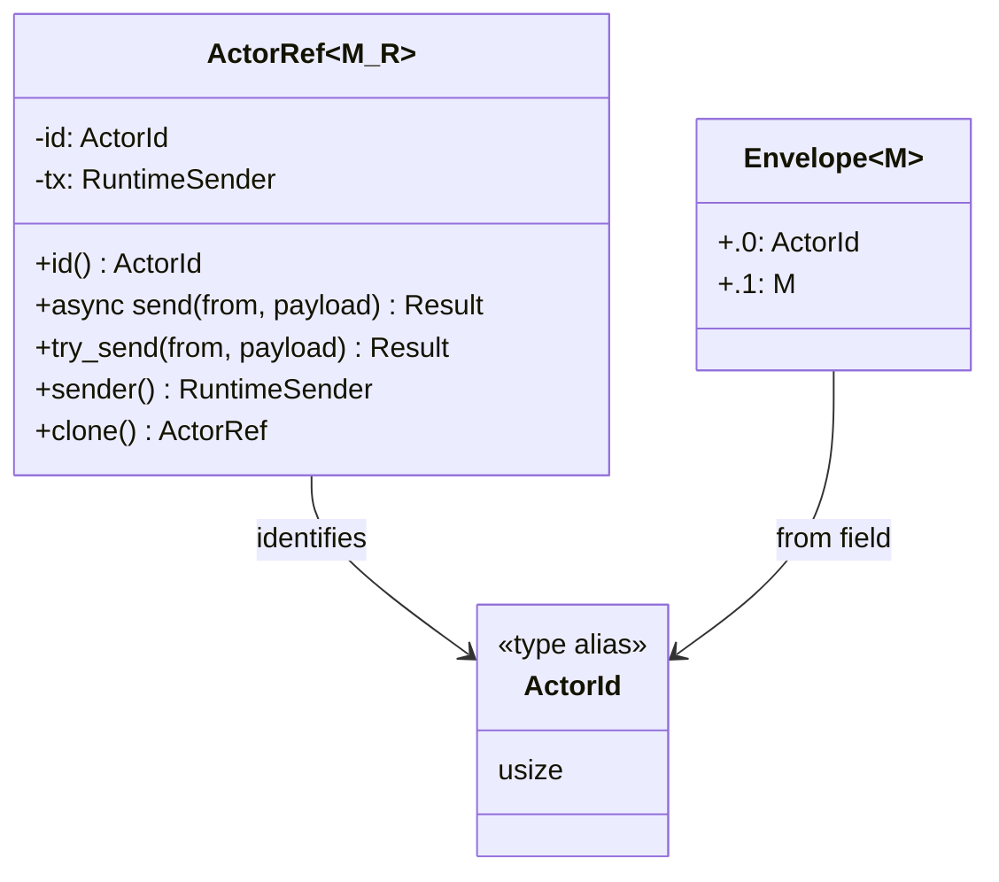
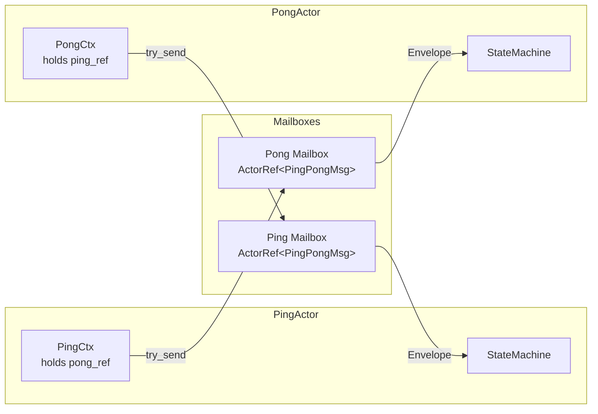
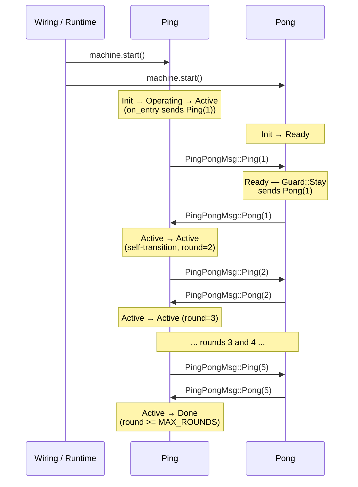

# Actor Messaging

Actors communicate exclusively through typed mailboxes. No shared mutable state; no raw channels in domain code.

## Core Types



- `ActorRef<M, R>` is `Clone + Send + Sync`. Hand it to any state that needs to send a message to that actor.
- `send` awaits mailbox capacity (async, backpressure).
- `try_send` returns an error immediately if the mailbox is full (non-blocking, preferred in `actions` / `on_entry`).
- `sender()` returns the underlying `R::Sender<M>` (a clone of the internal sender). Used by the wiring layer to hand a raw sender to a `ChildGroup` without wrapping it in an `ActorRef`.
- `Envelope` wraps every message with the sender's `ActorId` so recipients know who sent it.

## Message Flow Model



## Ping-Pong Message Sequence



## Rules

### No receivers in domain messages

Domain message enums must be plain data. Never embed runtime receiver handles, raw senders, or `ActorRef` inside a message payload. All wiring is done at construction time through `Ctx`.

```rust
// WRONG — leaks runtime internals into the message
enum MyEvent {
    Subscribe(ActorRef<Response, R>),  // ← never do this
}

// RIGHT — put the ActorRef in Ctx at construction time
pub struct MyCtx<R: BloxRuntime> {
    pub subscriber_ref: ActorRef<Response, R>,
}
```

### Message types in separate crates

Message types shared between two blox crates live in a dedicated `*-messages` crate. This prevents circular crate dependencies and makes the message contract explicit and independently versioned.

```
ping-pong-messages/   ← owned by neither ping nor pong
  src/lib.rs          ← pub enum PingPongMsg { Ping(...), Pong(...), Resume(...) }
```

### Fanout

To send the same event to multiple actors, store `Arc<Payload>` inside the event variant so cloning is O(1). Clone `ActorRef` for each recipient.

## Backpressure Policy

| Method | Behavior when mailbox is full |
|--------|-------------------------------|
| `ActorRef::send` | Awaits until space is available |
| `ActorRef::try_send` | Returns `TrySendError` immediately |

Use `try_send` from `on_entry` and `actions` functions (which run synchronously inside dispatch). Reserve `send` for async contexts outside the machine (e.g., the actor run loop or wiring).

## Channel Lifetime Invariant

Every actor **must retain a clone of its own `ActorRef`** for each mailbox it owns. This clone is stored in `Ctx` and lives as long as the actor task.

**Why this matters:** The underlying channel stays open as long as at least one sender (`ActorRef`) exists. With the self-sender invariant in place, the channel can never close during normal operation, because the actor task itself holds a sender.

**Consequence for `Mailboxes` impls:** The blanket tuple impls in `mailboxes.rs` silently treat `Poll::Ready(None)` (stream closed) as `Poll::Pending`. In debug builds a `debug_assert!` fires if a stream closes — this indicates the self-sender invariant was violated.

**Failure example:** If an actor drops its last self-held `ActorRef`, its mailbox stream may close and the debug assertion will trigger on the next poll.

**For future runtimes with dynamic actor creation (e.g., Tokio):** Runtime implementors must either:
- Uphold the self-sender invariant (store a clone of each `ActorRef` in `Ctx`), OR
- Provide a custom `Mailboxes` impl that maps `Ready(None)` to a sentinel `ChannelClosed` event variant so the `MachineSpec` can handle actor teardown explicitly.
