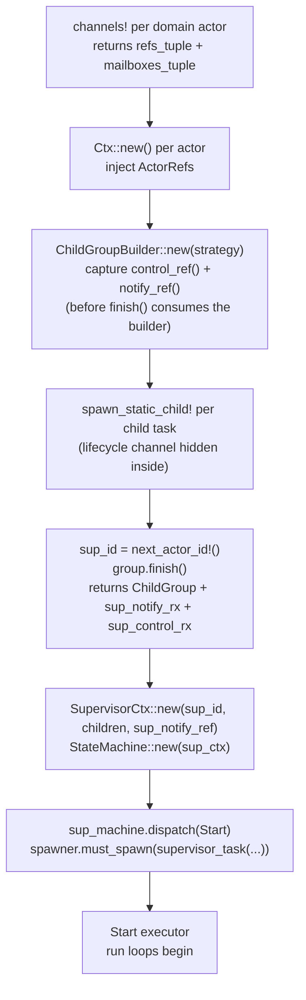
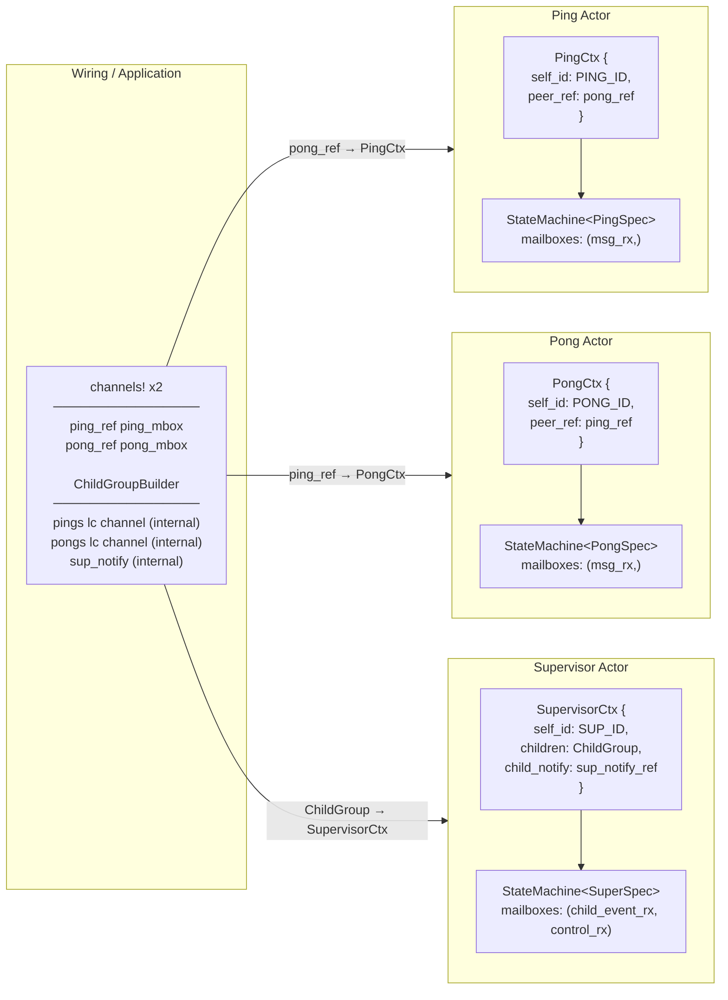

# Static Wiring

All actors are allocated at compile time. `ActorRef`s are wired together before the executor starts. There is no dynamic actor spawning for Embassy. For runtimes that support it, see [10-dynamic-actors.md](10-dynamic-actors.md).

## Initialization Order



## Per-Actor Channel Layout

Domain actors have one channel per message type they receive. Supervised actors additionally have a runtime-internal lifecycle command channel — this is created by `spawn_static_child!` and never visible in user code.

| Channel | Sender held by | Purpose |
|---------|---------------|---------|
| `ActorRef<DomainMsg, R>` | Peer actors | Domain message exchange |
| `ActorRef<LifecycleCommand, R>` (internal) | `ChildGroup` | Runtime-internal: Start/Stop/Reset/Ping |
| `EmbassySender<ChildLifecycleEvent>` (internal) | `run` with `RunConfig::supervised` run loop | Runtime-internal: notifies supervisor |
| `ActorRef<ChildCtrl<R>, R>` (internal) | Wiring/control plane | Supervisor control: dynamic registration and watchdog ticks |

The `Mailboxes` tuple for domain actors contains only domain streams. The lifecycle channel is threaded through `run` with `RunConfig::supervised` separately, invisible to the blox author.

## ActorRef Wiring Diagram



## Actor Run Loop

All actors run the unified `run()` loop from `bloxide-core` (re-exported by each
runtime), configured by `RunConfig`. Supervised children use
`RunConfig::supervised(lifecycle_rx, supervisor_notify)`; the loop polls the
lifecycle stream with priority over domain mailboxes:

```rust
// bloxide-core::runloop — single implementation for all runtimes:
pub async fn run<S, M, R>(
    machine: StateMachine<S>,
    domain_mailboxes: M,
    config: RunConfig<R>,        // root / supervised / supervised_with_abort / unsupervised / bare
    actor_id: ActorId,
)
where
    S: MachineSpec + 'static,
    M: Mailboxes<S::Event>,
    R: BloxRuntime;
```

The five `RunConfig` variants differ in which streams they poll and whether
terminal outcomes end the task:

| Variant | Extra streams | `exit_on_stop` | `exit_on_fail` | Used for |
|---------|---------------|----------------|----------------|----------|
| `root()` | — | `true` | `true` | Root supervisor / root actor |
| `supervised(lc, notify)` | lifecycle | `false` | `false` | Supervised child |
| `supervised_with_abort(lc, ab, notify)` | lifecycle + abort | `false` | `false` | Supervised child with kill capability |
| `unsupervised()` | — (auto-start) | `true` | `true` | Unsupervised actor |
| `bare()` | — | `true` | `true` | Tests / bare-style callers |

With both exit flags `false` (supervised configs), the task stays alive:
`Stopped` self-suspends the actor to Init, waiting for a `Start`/`Reset`; `Failed`
parks the actor in its absorbing error state so the supervisor's `ChildPolicy`
decides (`Reset` revives it). With both flags `true` (root/unsupervised/bare),
`Stopped` and `Failed` end the task. `Aborted` and `Done` always exit.

The lifecycle stream and supervisor notify sender inside `RunConfig` are created by
`ChildGroupBuilder`/`spawn_static_child!` and passed to the task automatically. User code
never sees them. See `crates/bloxide-core/src/runloop.rs` for the `RunConfig`
field/variant table.

## Embassy-Specific Helpers

### `channels!` macro

Unchanged. Creates typed domain channels for one actor:

```rust
let ((ping_ref,), ping_mbox) = bloxide_embassy::channels! { PingPongMsg(16) };
```

### `next_actor_id!` macro

Allocates a compile-time `ActorId` from the same proc-macro counter as
`channels!` — one shared counter starting at 1, so every allocation is unique.
Dynamic-spawn IDs come from a separate space starting at
`DYNAMIC_ACTOR_ID_BASE`, so the two spaces cannot collide. Used for
the supervisor's own ID, since the supervisor has no domain channel of its own:

```rust
let sup_id = bloxide_embassy::next_actor_id!();
```

### `actor_task!` / `actor_task_supervised!` macros

`actor_task!` generates an `#[embassy_executor::task]` wrapper for an unsupervised actor (`RunConfig::unsupervised()` — auto-starts, exits on `Stopped`/`Failed`). `actor_task_supervised!` generates the supervised variant whose signature includes `lifecycle_rx` and `supervisor_notify` (both injected by `spawn_static_child!`):

```rust
bloxide_embassy::actor_task_supervised!(ping_task, PingSpec<EmbassyRuntime>);
bloxide_embassy::actor_task_supervised!(pong_task, PongSpec<EmbassyRuntime>);
```

### `root_task!` macro

Generates the `#[embassy_executor::task]` wrapper for the root supervisor
(`RunConfig::root()` — the loop exits on `Stopped`, `Done`, `Failed`, or
`Aborted`). An optional trailing expression runs after the loop exits. The
codegen passes `bloxide_embassy::exit_process()`, which is
`std::process::exit(0)` on std-hosted (arch-std) builds — a supervised app is
done when its supervisor is done — and a no-op on `no_std` embedded builds:

```rust
bloxide_embassy::root_task!(supervisor_task, SupervisorSpec<EmbassyRuntime>, bloxide_embassy::exit_process());
```

### `timer_task!` / `spawn_timer!` macros

`timer_task!` generates the timer-service task. `spawn_timer!` creates the
`TimerCommand` channel (ID from the same compile-time counter), spawns the
task, and returns the `ActorRef<TimerCommand, R>` to inject into contexts:

```rust
bloxide_embassy::timer_task!(timer_task);
let timer_ref = bloxide_embassy::spawn_timer!(spawner, timer_task, 8);
```

### `spawn_static_child!` macro

Hides lifecycle channel creation and task spawning plumbing. Creates the lifecycle channel, registers the child in the builder with the given `ChildPolicy`, and spawns the task:

```rust
spawn_static_child!(spawner, group, ping_task(ping_machine, ping_mbox, ping_id), ChildPolicy::Stop);
```

Expands to: `let (lc_rx, sup_notify) = group.add_child(id, policy)` (which creates the lifecycle channel, capacity 4, and registers the child) → `spawner.must_spawn(ping_task(machine, mbox, lc_rx, id, sup_notify))`.

### `ChildGroupBuilder`

Two-phase builder for the supervised group. `new(strategy)` creates both
supervisor mailbox streams up front:

- child lifecycle events (`sup_notify_rx`)
- supervisor control-plane events (`sup_control_rx`)

Phase one: capture `control_ref()` / `notify_ref()` (for wiring and for the
supervisor context) and register children via `spawn_static_child!`. Phase two:
`finish()` consumes the builder and returns `ChildGroup` plus both streams. The
supervisor's own `ActorId` is allocated separately via `next_actor_id!()`:

```rust
let mut group = ChildGroupBuilder::new(GroupShutdown::WhenAnyDone);
let _sup_control_ref = group.control_ref();
let sup_notify_ref = group.notify_ref();
spawn_static_child!(spawner, group, ping_task(ping_machine, ping_mbox, ping_id), ChildPolicy::Stop);
spawn_static_child!(spawner, group, pong_task(pong_machine, pong_mbox, pong_id), ChildPolicy::Stop);
let (children, sup_notify_rx, sup_control_rx) = group.finish();
```

The strategy comes from `system.toml`: `strategy = "when_any_done"` /
`"when_all_done"` map to `GroupShutdown::WhenAnyDone` / `WhenAllDone`; unknown
values are hard codegen errors. `ChildPolicy::Kill`/`Abort` are rejected at
registration for static children (`ChildGroup::try_add` returns
`RegistrationError::PolicyRequiresHandles` — they need abort/kill handles that
only dynamic registration provides; `ChildGroupBuilder::add_child` panics at
boot time instead, since generated wiring only emits valid policies); use
`Reset` or `Stop`.

`bloxide-embassy` re-exports this shared `ChildGroupBuilder` (from
`bloxide-child-management`) at the crate root and prelude; the `GroupChannelCap`
impl in `mailbox.rs` supplies the static channels, so generated wiring is
identical across runtimes.

## Full Wiring Example

Mirrors the generated `main.rs` of `apps/embassy-demo`:

```rust
fn setup(spawner: Spawner) {
    let timer_ref = bloxide_embassy::spawn_timer!(spawner, timer_task, 8);

    // Domain channels
    let ((ping_ref,), ping_mbox) = bloxide_embassy::channels! { PingPongMsg(16) };
    let ping_id = ping_ref.id();
    let ((pong_ref,), pong_mbox) = bloxide_embassy::channels! { PingPongMsg(16) };
    let pong_id = pong_ref.id();

    // Supervised group — capture both supervisor refs before finish() consumes the builder
    let mut group = ChildGroupBuilder::new(GroupShutdown::WhenAnyDone);
    let _sup_control_ref = group.control_ref();
    let sup_notify_ref = group.notify_ref();

    // Contexts
    let ping_ctx = PingCtx::new(ping_id, pong_ref.clone(), ping_ref.clone(), timer_ref);
    let pong_ctx = PongCtx::new(pong_id, ping_ref);

    // Lifecycle is fully hidden inside spawn_static_child!
    bloxide_embassy::spawn_static_child!(spawner, group, ping_task(StateMachine::new(ping_ctx), ping_mbox, ping_id), ChildPolicy::Stop);
    bloxide_embassy::spawn_static_child!(spawner, group, pong_task(StateMachine::new(pong_ctx), pong_mbox, pong_id), ChildPolicy::Stop);

    let sup_id = bloxide_embassy::next_actor_id!();
    let (children, sup_notify_rx, sup_control_rx) = group.finish();

    let sup_ctx = SupervisorCtx::new(sup_id, children, sup_notify_ref);
    let mut sup_machine = StateMachine::new(sup_ctx);
    sup_machine.dispatch(SupervisorEvent::Lifecycle(LifecycleCommand::Start));
    spawner.must_spawn(supervisor_task(sup_machine, (sup_notify_rx, sup_control_rx)));
}
```

## Rules

- `ActorRef`s are injected into `Ctx` before `StateMachine::new` is called.
- Never pass an `ActorRef` through a message.
- Each blox crate provides a `Ctx::new()` constructor for external wiring dependencies only.
- Channel capacity is set at creation time. Lifecycle channels use capacity 4.
- Root supervisors are spawned via `root_task!` (`RunConfig::root()`); supervised children via `actor_task_supervised!` + `spawn_static_child!`.
- Lifecycle flows through `dispatch` — the root supervisor is started by dispatching `SupervisorEvent::Lifecycle(LifecycleCommand::Start)` before its task is spawned.
- `ChildPolicy::Kill`/`Abort` panic at registration for static children — use `Reset`/`Stop` (see `ChildGroupBuilder` above).
- Do not create actors after the executor starts (Embassy). For dynamic actor creation on Tokio/TestRuntime, see `spec/architecture/10-dynamic-actors.md`.
- `ChildGroupBuilder` must call `finish()` before constructing the supervisor context; `SupervisorCtx::new` takes `(sup_id, children, sup_notify_ref)`.
