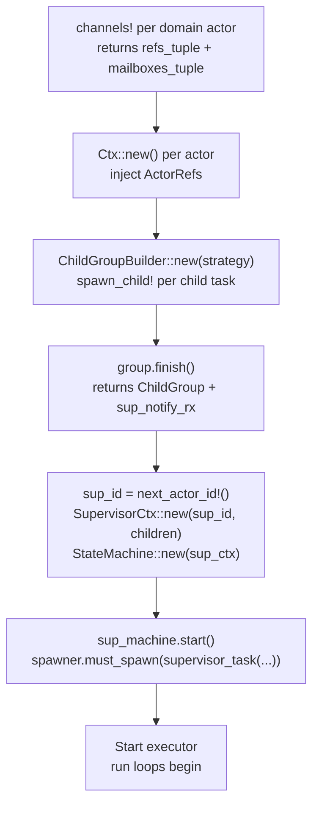
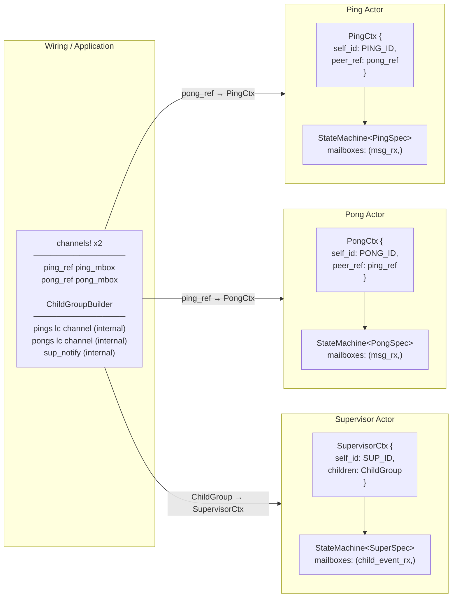

# Static Wiring

All actors are allocated at compile time. `ActorRef`s are wired together before the executor starts. There is no dynamic actor spawning for Embassy. For runtimes that support it, see [11-dynamic-actors.md](11-dynamic-actors.md).

## Initialization Order



## Per-Actor Channel Layout

Domain actors have one channel per message type they receive. Supervised actors additionally have a runtime-internal lifecycle command channel — this is created by `spawn_child!` and never visible in user code.

| Channel | Sender held by | Purpose |
|---------|---------------|---------|
| `ActorRef<DomainMsg, R>` | Peer actors | Domain message exchange |
| `ActorRef<LifecycleCommand, R>` (internal) | `ChildGroup` | Runtime-internal: Start/Terminate/Ping |
| `EmbassySender<ChildLifecycleEvent>` (internal) | `run_supervised_actor` run loop | Runtime-internal: notifies supervisor |

The `Mailboxes` tuple for domain actors contains only domain streams. The lifecycle channel is threaded through `run_supervised_actor` separately, invisible to the blox author.

## ActorRef Wiring Diagram



## Actor Run Loop

`run_supervised_actor` is used for all actors in a supervised group. It polls lifecycle commands with priority over domain events:

```rust
// SupervisedRunLoop trait method (implemented by the runtime crate):
async fn run_supervised_actor<S: MachineSpec + 'static>(
    machine: StateMachine<S>,
    domain_mailboxes: S::Mailboxes<Self>,
    lifecycle_stream: Self::Stream<LifecycleCommand>,   // runtime-internal
    actor_id: ActorId,
    supervisor_notify: Self::Sender<ChildLifecycleEvent>, // runtime-internal
);
```

The `lifecycle_stream` and `supervisor_notify` arguments are created by `ChildGroupBuilder`/`spawn_child!` and passed to the task automatically. User code never sees them.

## Embassy-Specific Helpers

### `channels!` macro

Unchanged. Creates typed domain channels for one actor:

```rust
let ((ping_ref,), ping_mbox) = bloxide_embassy::channels! { PingPongMsg(16) };
```

### `actor_task!` / `actor_task_supervised!` macros

`actor_task!` generates an `#[embassy_executor::task]` wrapper for an unsupervised (root) actor. `actor_task_supervised!` generates the supervised variant whose signature includes `lifecycle_rx` and `supervisor_notify` (both injected by `spawn_child!`):

```rust
bloxide_embassy::actor_task!(supervisor_task, SupervisorSpec<EmbassyRuntime>);
bloxide_embassy::actor_task_supervised!(ping_task, PingSpec<EmbassyRuntime>);
```

### `spawn_child!` macro

Hides lifecycle channel creation and task spawning plumbing. Creates the lifecycle channel, registers the child in the builder with the given `ChildPolicy`, and spawns the task:

```rust
spawn_child!(spawner, group, ping_task(ping_machine, ping_mbox, ping_id), ChildPolicy::Restart { max: 1 });
```

Expands to: create lifecycle channel → `group.add(id, handle, policy)` → `spawner.must_spawn(ping_task(machine, mbox, lc_rx, id, notify))`.

### `ChildGroupBuilder`

Accumulates children and creates the notification channel. Call `finish()` to get the `ChildGroup` and the supervisor's notification stream. The supervisor's own `ActorId` is allocated separately via `next_actor_id!()`:

```rust
let mut group = ChildGroupBuilder::new(GroupShutdown::WhenAnyDone);
spawn_child!(spawner, group, ping_task(ping_machine, ping_mbox, ping_id), ChildPolicy::Restart { max: 3 });
spawn_child!(spawner, group, pong_task(pong_machine, pong_mbox, pong_id), ChildPolicy::Restart { max: 3 });
let (children, sup_notify_rx) = group.finish();
```

## Full Wiring Example

```rust
fn setup(spawner: Spawner) {
    let timer_ref = bloxide_embassy::spawn_timer!(spawner, timer_task, 8);

    // Domain channels
    let ((ping_ref,), ping_mbox) = bloxide_embassy::channels! { PingPongMsg(16) };
    let ping_id = ping_ref.id();
    let ((pong_ref,), pong_mbox) = bloxide_embassy::channels! { PingPongMsg(16) };
    let pong_id = pong_ref.id();

    // Contexts
    let ping_ctx = PingCtx::new(ping_id, pong_ref.clone(), ping_ref.clone(), timer_ref, PingBehavior::default());
    let pong_ctx = PongCtx::new(pong_id, ping_ref);

    // Supervised group — lifecycle is fully hidden
    let mut group = ChildGroupBuilder::new(GroupShutdown::WhenAnyDone);
    bloxide_embassy::spawn_child!(spawner, group, ping_task(StateMachine::new(ping_ctx), ping_mbox, ping_id), ChildPolicy::Restart { max: 1 });
    bloxide_embassy::spawn_child!(spawner, group, pong_task(StateMachine::new(pong_ctx), pong_mbox, pong_id), ChildPolicy::Stop);
    let sup_id = bloxide_embassy::next_actor_id!();
    let (children, sup_notify_rx) = group.finish();

    let sup_ctx = SupervisorCtx::new(sup_id, children);
    let mut sup_machine = StateMachine::new(sup_ctx);
    sup_machine.start();
    spawner.must_spawn(supervisor_task(sup_machine, (sup_notify_rx,)));
}
```

## Rules

- `ActorRef`s are injected into `Ctx` before `StateMachine::new` is called.
- Never pass an `ActorRef` through a message.
- Each blox crate provides a `Ctx::new()` constructor for external wiring dependencies only.
- Channel capacity is set at creation time. Lifecycle channels use capacity 4.
- Do not create actors after the executor starts (Embassy). For dynamic actor creation on Tokio/TestRuntime, see `spec/architecture/11-dynamic-actors.md`.
- `ChildGroupBuilder` must call `finish()` before constructing the supervisor context.
