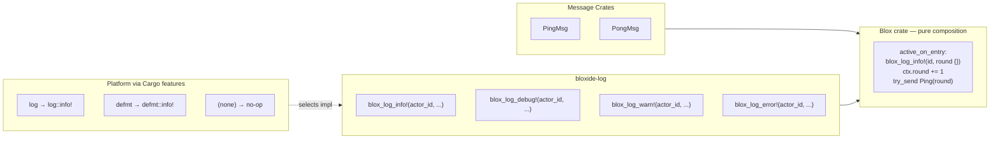

# Actions: Portable Building Blocks

> **When would I use this?** Use this document when implementing action functions,
> understanding the composition model (messages + actions + blox), or learning the
> portable building-block pattern for bloxide actors.

> ⚠️ **Syntax Update (Phase 4, July 2026):** Transition rules are
> declared declaratively in `blox.toml` via `[[topology.transitions]]`,
> and `bloxide-codegen` emits raw `StateRule { ... }` struct literals
> from those entries. The **composition model** (messages + actions +
> blox) and the `TransitionRule` struct shape described here are
> unchanged — only the *syntax* for producing rules moved to TOML.
> The code blocks below show the TOML syntax. See
> `spec/architecture/20-blox-toml-source-of-truth.md` for the current
> TOML schema and `QUICK_REFERENCE.md` → "Declarative Transitions
> (blox.toml)" for a worked example.

Bloxide uses a composition model inspired by visual block programming: a blox is assembled from three kinds of reusable building blocks — **messages**, **actions**, and **state machine logic**. This keeps each concern in its own crate and ensures the blox itself contains no platform-specific code.

## Composition Model



The **blox explicitly calls actions** — this is part of the state machine definition, not an injection. The blox does not import `tracing`, `defmt`, or any platform crate. It imports `bloxide-log`. Which backend runs is selected by enabling a Cargo feature on `bloxide-log` in the application crate. Because Cargo features are additive, enabling the feature anywhere in the build activates it everywhere.

## Guards

Guards are the `guard` function in a `TransitionRule` — a pure `fn(&Ctx, &ActionResults, &Event) -> Guard<S>`. The engine calls `guard(ctx, results, event)` after running all actions. Guards receive the collected action results and the event, plus read-only access to context (the borrow checker prevents mutation). Guards can inspect `ActionResults` to react to action failures (e.g. send errors).

**`ActionResult` vs `ActionResults`**: Each action returns `ActionResult` (Ok/Err). The engine collects all results into `ActionResults` before calling the guard. Guards receive `&ActionResults` to inspect `any_failed()`, `all_ok()`, etc.

### Explicit struct form

In practice transition rules are declared in `blox.toml` as `[[topology.transitions]]` entries and the codegen emits the struct form. The struct form is shown here for reference only — it makes the field types concrete.

`actions` is a `&'static` slice of `fn` pointers (not closures). `guard` is a `fn` pointer. `event_tag` is always the first field — the engine uses it to pre-filter rules without calling `matches`.

```rust
fn my_action(ctx: &mut MyCtx<R>, ev: &MyEvent<R>) -> ActionResult {
    if let Some(e) = ev.msg_payload() {
        blox_log_info!(ctx.self_id(), "received {}", e.payload);
        ctx.count += 1;
    }
    ActionResult::Ok
}

fn my_guard(ctx: &MyCtx<R>, _results: &ActionResults, _ev: &MyEvent<R>) -> Guard<MySpec<R>> {
    if ctx.count >= MAX {
        Guard::Transition(LeafState::new(MyState::Done))
    } else {
        Guard::Transition(LeafState::new(MyState::Active))
    }
}

TransitionRule {
    event_tag: MyEvent::<R>::MSG_TAG,   // pre-filter tag; WILDCARD_TAG matches all
    matches: |ev| matches!(ev, MyEvent::Msg(_)),
    actions: &[my_action],
    guard: my_guard,
}
```

### Declarative form (`[[topology.transitions]]` in `blox.toml`)

Transition rules are declared as `[[topology.transitions]]` entries in `blox.toml`. The codegen (`bloxide-codegen`) builds a `&'static [TransitionRule<S>]` from these entries. Actions are specified as a list of `fn` paths — `actions = ["fn1", "fn2"]`. Inline closures are not accepted; action logic lives in named functions defined on the spec `impl` block or in an actions crate.

Guards are specified as `guards = [{ condition = "...", target = "..." }, ...]`. The condition expression sees `ctx` as `&Ctx` and `results` as `&ActionResults`; the engine calls `guard(ctx, results, event)` — the event is passed implicitly by the generated code.

#### `[[topology.transitions]]` entry -> `TransitionRule` field mapping

Each `[[topology.transitions]]` entry expands into one `TransitionRule`:

- Pattern (`MyEvent::Foo(_)`, `MyMsg::Ping(_)`, `_`) -> `event_tag` + `matches`
- `actions [fn1, fn2]` -> `actions`
- `stay` / `transition MyState::X` / `reset` / `guard(ctx, results) { ... }` -> `guard`

The execution order is engine-defined: actions always run before the guard, regardless
of how the arm is visually arranged.

**Event pattern shorthand:**
- **`*Msg`** — patterns on types ending in `Msg` (e.g. `PingPongMsg::Ping(ping)`) use `msg_payload()` for matching. The macro expands to `ev.msg_payload().map_or(false, |m| matches!(m, ...))`. Bindings like `ping` are extracted via `msg_payload()` in actions/guards.
- **`*Ctrl`** — patterns on types ending in `Ctrl` (e.g. `WorkerCtrl::AddPeer(p)`) use `ctrl_payload()` for matching. Bindings are extracted via `ctrl_payload()`.

```toml
# Sink — absorb without side-effects
[[topology.transitions]]
pattern = "MyEvent::Foo(_)"
to = "stay"

# Pure transition — no side-effects
[[topology.transitions]]
pattern = "MyEvent::Bar(_)"
to = "Done"

# Actions + stay
[[topology.transitions]]
pattern = "MyEvent::Msg(_)"
actions = ["my_action"]
to = "stay"

# Actions + unconditional transition
[[topology.transitions]]
pattern = "MyEvent::Baz(_)"
actions = ["reset_count"]
to = "Active"

# Actions + conditional guard
[[topology.transitions]]
pattern = "MyEvent::Msg(_)"
actions = ["increment_count"]

  [[topology.transitions.guards]]
  condition = "ctx.count >= MAX"
  to = "Done"

  [[topology.transitions.guards]]
  to = "Active"

# Guard only (no side-effects)
[[topology.transitions]]
pattern = "MyEvent::Check(_)"

  [[topology.transitions.guards]]
  condition = "ctx.count >= MAX"
  to = "Done"

  [[topology.transitions.guards]]
  to = "Active"
```

Both state-level (`[[topology.transitions]]`) and root-level (`[[topology.transitions]]` with `scope = "root"`) rules support `reset` as a terminal outcome (in place of a state target or `stay`). When a guard returns `Reset`, the engine fires the full LCA exit chain (leaf → root) then calls `on_init_entry` — identical to the `machine.reset()` code path:

```toml
# State-level — actor self-terminates when a condition is met
[[topology.transitions]]
pattern = "MyEvent::AllDone(_)"
to = "reset"

[[topology.transitions]]
pattern = "MyEvent::PartialDone(_)"
actions = ["my_action_fn"]

  [[topology.transitions.guards]]
  condition = "ctx.is_complete()"
  to = "reset"

  [[topology.transitions.guards]]
  to = "stay"

# Root-level — same syntax with `scope = "root"`, evaluated when events bubble past all states
[[topology.transitions]]
scope = "root"
pattern = "MyEvent::SomeCondition(_)"
to = "reset"
```

For supervised actors, the runtime handles Start/Reset/Ping via `machine.start()` and `machine.reset()` — no lifecycle root rules are needed. `root_transitions()` defaults to `&[]` and is optional.

## `bloxide-log` Crate

Location: `crates/bloxide-log/`

### Features

| Feature | Backend | Use case |
|---------|---------|----------|
| `log` | `log::info!` / `log::debug!` | std / Embassy on a hosted target |
| `defmt` | `defmt::info!` | bare-metal with defmt |
| (none) | no-op | production embedded, benchmarks |

### Macros

| Macro | Level |
|-------|-------|
| `blox_log_info!(actor_id, fmt, ...)` | INFO |
| `blox_log_debug!(actor_id, fmt, ...)` | DEBUG |
| `blox_log_warn!(actor_id, fmt, ...)` | WARN |
| `blox_log_error!(actor_id, fmt, ...)` | ERROR |

All four macros expand to a call to a `#[doc(hidden)]` function defined inside `bloxide-log`. The `cfg(feature = "log")` check is evaluated in `bloxide-log`'s own context, not the caller's, so enabling the feature on `bloxide-log` in the application crate activates logging everywhere the macros are used.

### Usage in a blox

```rust
// In Cargo.toml:
// bloxide-log = { path = "..." }   ← no features here

use bloxide_log::{blox_log_info, blox_log_debug, blox_log_warn, blox_log_error};

fn active_on_entry(ctx: &mut MyCtx<R>) {
    ctx.count += 1;
    blox_log_info!(ctx.self_id(), "count now {}", ctx.count);
    let _ = ctx.peer_ref().try_send(ctx.self_id(), PeerMsg::Update(ctx.count));
}
```

### Activating in the application

```toml
# Cargo.toml (workspace root package)
[dev-dependencies]
bloxide-log = { workspace = true, features = ["log"] }
```

No changes to the blox crates are needed. Cargo's additive feature resolution enables `log` in `bloxide-log` for the entire build graph.

## Rules

- Blox crates depend on `bloxide-log` with **no features** enabled — they must compile without any logging backend.
- Logging macros live in `bloxide-log`; domain action functions live in action crates or reusable standard-library crates such as `bloxide-supervisor`.
- Application / wiring crates select the backend by enabling a feature on `bloxide-log`.
- `bloxide-log` is `no_std` — it must compile for bare-metal targets.

## Related Docs

- **Handler patterns** → `spec/architecture/05-handler-patterns.md`
- **Action crate pattern** → `spec/architecture/12-action-crate-pattern.md`
- **Logging macros** → `crates/bloxide-log/src/lib.rs`
- **Declarative transitions (blox.toml)** → `QUICK_REFERENCE.md` → "Declarative Transitions (blox.toml)" and `spec/architecture/20-blox-toml-source-of-truth.md`
