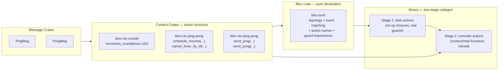

# Actions: Free Functions in Context Crates

> **When would I use this?** Use this document when implementing action functions,
> understanding the composition model (messages + context + blox), or learning how
> the two-stage codegen generates stub and concrete action closures.

> **Architecture Update (Phase 1-3, July 2026):** Action crates have been
> eliminated. Action functions now live in **context crates** as free functions
> taking concrete params. The `B` generic has been eliminated. Blox crates
> contain zero logic — they are purely declarative topology + event matching.
> Two-stage codegen generates stub actions at the blox level and concrete
> actions at the system level. See `spec/architecture/12-action-crate-pattern.md`
> (now "Context Crate Pattern") for the full layer model.

Bloxide uses a composition model where a blox is assembled from reusable building blocks — **messages**, **context crates** (which include action functions), and **state machine logic**. This keeps each concern in its own crate and ensures the blox itself contains no platform-specific code or logic.

## Composition Model


```mermaid
flowchart LR
    subgraph msg_crates [Message Crates]
        PingMsg
        PongMsg
    end

    subgraph ctx_crates [Context Crates — action functions]
        Rounds["blox-ctx-rounds
        increment_round(&mut u32)"]
        Timer["blox-ctx-ping-pong
        schedule_resume(...)
        cancel_timer_by_id(...)"]
        Msg["blox-ctx-ping-pong
        send_ping(...)
        send_pong(...)"]
    end

    subgraph blox [Blox crate — pure declaration]
        Topology["blox.toml
        topology + event matching
        + action names + guard expressions"]
    end

    subgraph binary [Binary — two-stage codegen]
        Stubs["Stage 1: stub actions
        (no-op closures, real guards)"]
        Concrete["Stage 2: concrete actions
        (context/impl functions inlined)"]
    end

    msg_crates --> ctx_crates
    ctx_crates --> blox
    blox --> Stubs
    ctx_crates --> Concrete
    Stubs --> Concrete
```

The **blox declares what actions to call** via `[[context.actions]]` entries in `blox.toml`, but does not contain the action logic. The system codegen resolves the action functions from context crates or impl crates and inlines them into the generated `Spec`.

## Action Functions

Action functions are **free functions** in context crates (or impl crates for impl-specific behavior). They take **concrete params** extracted from the context struct, not trait-bounded `&mut C` references.

### Function signatures by `kind`

Each action is declared in `blox.toml` with a `kind` field that determines the closure signature the codegen generates:

| `kind` | Closure signature | When called |
|--------|-------------------|-------------|
| `"entry"` | `fn(&mut Ctx) -> ()` | State entry (infallible) |
| `"exit"` | `fn(&mut Ctx) -> ()` | State exit (infallible) |
| `"transition"` | `fn(&mut Ctx, &Event) -> ActionResult` | Transition rule action |

### Example: context crate action function

```rust
// crates/blox-ctx-rounds/src/lib.rs
pub fn increment_round(round: &mut u32) {
    *round += 1;
}
```

```rust
// crates/blox-ctx-ping-pong/src/lib.rs
pub fn send_ping<R: BloxRuntime>(
    self_id: ActorId,
    peer_ref: &ActorRef<PingPongMsg, R>,
    round: u32,
) {
    let _ = peer_ref.try_send(self_id, PingPongMsg::Ping(Ping { round }));
}
```

### Example: impl crate action function

```rust
// crates/impl/tokio-pool-demo-impl/src/lib.rs
pub fn process_work(task_id: &mut u32, result: &mut u32, do_work: &DoWork) {
    *task_id = do_work.task_id;
    *result = do_work.task_id * 2;
}
```

### Action declaration in `blox.toml`

```toml
[[context.actions]]
name = "increment_round"
crate = "blox_ctx_rounds"
kind = "transition"
fields = ["round:mut"]
impl_required = false

[[context.actions]]
name = "send_initial_ping"
crate = "blox_ctx_ping_pong"
kind = "transition"
fields = ["self_id", "peer_ref:ref", "round"]
impl_required = false

[[context.actions]]
name = "process_work"
kind = "transition"
fields = ["task_id:mut", "result:mut"]
event_payload = "do_work"
impl_required = true
```

### Field access modes

Each field in the `fields` list has an access mode suffix:

| Suffix | Meaning | Generated code |
|--------|---------|---------------|
| `:mut` | Mutable borrow | `&mut ctx.field` |
| `:ref` | Immutable borrow | `&ctx.field` |
| (none) | Copy/move | `ctx.field` (or `ctx.self_id` for `ActorId`) |

### `event_payload` extraction

When `event_payload` is set, the codegen wraps the action call in an event destructuring:

```rust
// Generated closure for "process_work" with event_payload = "do_work"
|ctx, ev| {
    if let Some(WorkerMsg::DoWork(do_work)) = ev.msg_payload() {
        tokio_pool_demo_impl::process_work(&mut ctx.task_id, &mut ctx.result, do_work);
    }
    ActionResult::Ok
}
```

## Two-Stage Codegen

### Stage 1 — Blox-level (`cargo blox generate`)

Generates **stub action closures** (no-op) with **real guards**. The blox compiles standalone without any impl dependency.

```rust
// generated/spec_skeleton.rs — stub actions, REAL guards
impl<R: BloxRuntime> PingSpec<R> {
    const ACTIVE_FNS: StateFns<Self> = StateFns {
        on_entry: &[
            |_ctx| { /* stub: increment_round */ },
            |_ctx| { /* stub: send_initial_ping */ },
        ],
        transitions: &[StateRule {
            matches: |ev| ev.msg_payload()
                .is_some_and(|m| matches!(m, PingPongMsg::Pong(_))),
            actions: &[
                |_ctx, _ev| { /* stub: forward_ping */ ActionResult::Ok },
            ],
            // REAL guard — direct field access, no B, no trait methods
            guard: |_ctx, _results, _ev| {
                if _ctx.round >= MAX_ROUNDS as u32 { Guard::Stop }
                else if _ctx.round == PAUSE_AT_ROUND as u32 { Guard::Transition(LeafState::new(PingState::Paused)) }
                else { Guard::Transition(LeafState::new(PingState::Active)) }
            },
        }],
    };
}
```

### Stage 2 — System-level (`cargo blox build`)

Reads `system.toml`, resolves impl crates, generates **concrete action closures** with real function calls. Guards are unchanged from blox-level (already real).

```rust
// generated/spec_skeleton.rs — concrete, impl inlined
use blox_ctx_rounds::increment_round;
use blox_ctx_ping_pong::send_ping;

impl<R: BloxRuntime> PingSpec<R> {
    const ACTIVE_FNS: StateFns<Self> = StateFns {
        on_entry: &[
            |ctx| { increment_round(&mut ctx.round); },
            |ctx| { send_ping(ctx.self_id, &ctx.peer_ref, ctx.round); },
        ],
        transitions: &[StateRule {
            matches: |ev| ev.msg_payload()
                .is_some_and(|m| matches!(m, PingPongMsg::Pong(_))),
            actions: &[
                |ctx, _ev| {
                    send_ping(ctx.self_id, &ctx.peer_ref, ctx.round);
                    ActionResult::Ok
                },
            ],
            guard: |_ctx, _results, _ev| {  // same as blox-level
                if _ctx.round >= MAX_ROUNDS as u32 { Guard::Stop }
                else if _ctx.round == PAUSE_AT_ROUND as u32 { Guard::Transition(LeafState::new(PingState::Paused)) }
                else { Guard::Transition(LeafState::new(PingState::Active)) }
            },
        }],
    };
}
```

## Guards

Guards are the `guard` function in a `TransitionRule` — a pure `fn(&Ctx, &ActionResults, &Event) -> Guard<S>`. The engine calls `guard(ctx, results, event)` after running all actions. Guards receive the collected action results and the event, plus read-only access to context (the borrow checker prevents mutation). Guards can inspect `ActionResults` to react to action failures (e.g. send errors).

**`ActionResult` vs `ActionResults`**: Each action returns `ActionResult` (Ok/Err). The engine collects all results into `ActionResults` before calling the guard. Guards receive `&ActionResults` to inspect `any_failed()`, `all_ok()`, etc.

### Guard expression translation

Guards in `blox.toml` are pure expressions over ctx fields and `ActionResults`. The blox-level codegen translates them to direct field access:

| `blox.toml` expression | Generated Rust |
|---|---|
| `ctx.round >= MAX_ROUNDS as u32` | `ctx.round >= MAX_ROUNDS as u32` (direct field access) |
| `ctx.round == PAUSE_AT_ROUND as u32` | `ctx.round == PAUSE_AT_ROUND as u32` |
| `ctx.pending == 0` | `ctx.pending == 0` |
| `results.any_failed()` | `results.any_failed()` (unchanged — method on `ActionResults`) |

The codegen parser:
1. Leaves `ctx.field` direct field access unchanged (already correct)
2. Leaves `results.*()` calls unchanged (they're methods on `ActionResults`)
3. Leaves boolean operators (`&&`, `||`, `!`) unchanged

### Declarative form (`[[topology.transitions]]` in `blox.toml`)

Transition rules are declared as `[[topology.transitions]]` entries in `blox.toml`. The codegen builds `StateRule` struct literals from these entries. Actions are specified as a list of action names — `actions = ["increment_round", "send_initial_ping"]`. The action function bodies are resolved from context/impl crates by the system codegen.

```toml
# Actions + conditional guard
[[topology.transitions]]
state = "Active"
event = "PingPongMsg::Pong(_)"
target = "Active"
actions = ["Self::forward_ping"]

  [[topology.transitions.guards]]
  condition = "results.any_failed()"
  target = "Error"

  [[topology.transitions.guards]]
  condition = "ctx.round >= MAX_ROUNDS as u32"
  target = "stop"

  [[topology.transitions.guards]]
  condition = "ctx.round == PAUSE_AT_ROUND as u32"
  target = "Paused"

# Guard only (no side-effects)
[[topology.transitions]]
state = "Waiting"
event = "CounterMsg::Tick(_)"
actions = ["Self::count_tick"]

  [[topology.transitions.guards]]
  condition = "ctx.count >= MAX"
  target = "Done"

  [[topology.transitions.guards]]
  condition = "_"
  target = "stay"
```

The execution order is engine-defined: actions always run before the guard, regardless of how the arm is visually arranged.

**Event pattern shorthand:**
- **`*Msg`** — patterns on types ending in `Msg` (e.g. `PingPongMsg::Ping(ping)`) use `msg_payload()` for matching.
- **`*Ctrl`** — patterns on types ending in `Ctrl` (e.g. `PeerCtrl::AddPeer(p)`) use `ctrl_payload()` for matching.

## Logging

Logging has been **ripped out of blox crates**. All `bloxide-log` usage has been removed from blox crates. The `bloxide-log` crate stays in place for runtime/context crate usage. Domain-level logging re-design is a deferred decision.

Never add `blox_log_*!` calls to blox crates or add `bloxide-log` as a dependency of a blox crate.

## Rules

- Action functions live in **context crates** (traits + free functions) or **impl crates** (impl-specific behavior).
- Action functions take **concrete params** extracted from context fields, not trait-bounded `&mut C` references.
- Context crates must not import Embassy, Tokio, file I/O, or executor-specific code.
- Blox crates contain zero logic — no `actions.rs`, no `Self::` methods, no logging, no computation.
- The `kind` field (`"entry"`, `"exit"`, `"transition"`) determines the closure signature the codegen generates.
- Guards are pure field comparisons generated at the blox level — they don't depend on impl crates.

## Related Docs

- **Context crate pattern** → `spec/architecture/12-action-crate-pattern.md`
- **Handler patterns** → `spec/architecture/05-handler-patterns.md`
- **Declarative transitions (blox.toml)** → `QUICK_REFERENCE.md` → "Declarative Transitions (blox.toml)" and `spec/architecture/17-blox-toml-source-of-truth.md`
