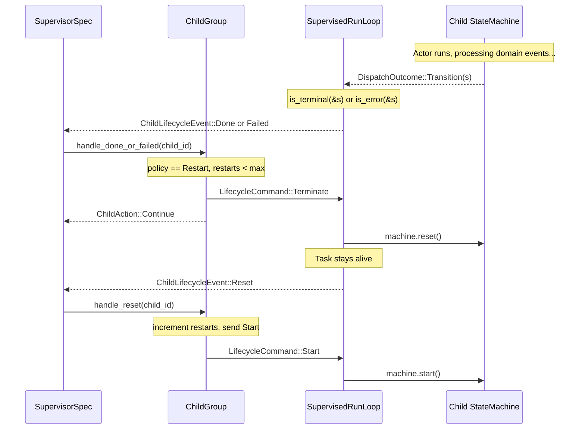
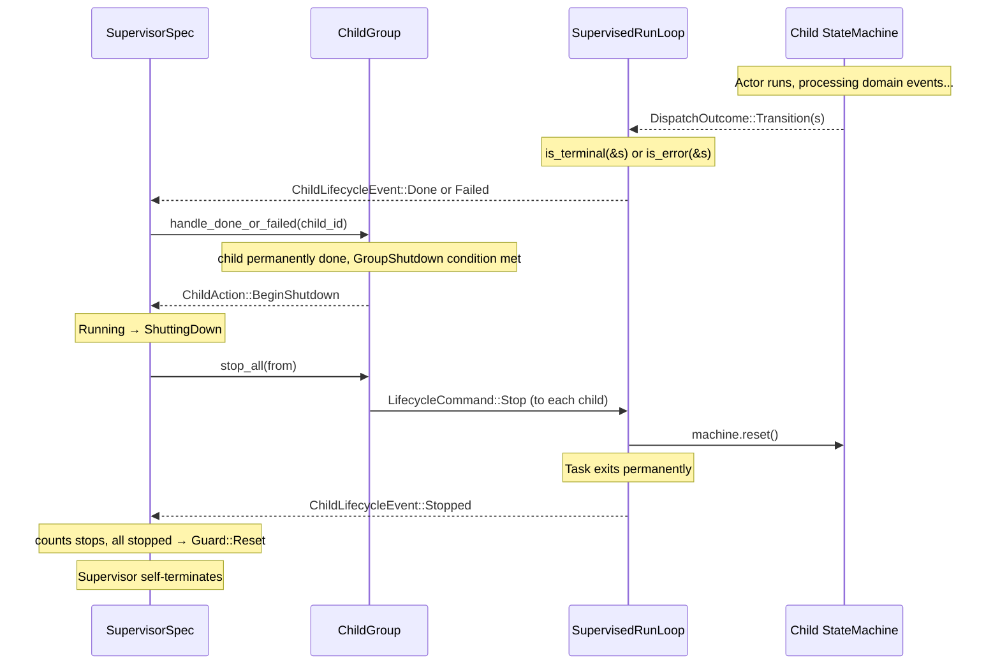

# Supervision

The supervision model is inspired by Elixir/OTP. A **supervisor** is itself a state machine actor that monitors child actors and either restarts or permanently stops them in response to lifecycle triggers. Unlike OTP, the supervisor is a **generic library component** provided by `bloxide-supervisor` — users configure children and policies in the wiring layer without writing a custom blox.

Lifecycle control is handled entirely by the **runtime** — actors never see lifecycle commands and never hold a reference to their supervisor.

`LifecycleCommand` and `ChildLifecycleEvent` are defined in `bloxide-supervisor`, not in `bloxide-core`. They are standard library messages — part of the supervision pattern, not the core engine.

## Core Principle: Actors Can Be Restarted or Stopped

Actors have two end-of-life paths:

| Command | What the runtime does | Task outcome |
|---|---|---|
| `Terminate` | `machine.reset()` → full LCA exit chain → `on_init_entry` | Task stays alive in Init — can receive `Start` again |
| `Stop` | `machine.reset()` → reports `Stopped` → breaks run loop | Task exits permanently — cannot be restarted |

`Terminate` is the restart path: the child is reset to Init and then re-started. `Stop` is the permanent death path: the child's task exits and its slot is freed.

**Actors have zero knowledge of their supervisor.** No `supervisor_ref` in context, no lifecycle messages in event enums, no root rules for Terminate/Stop/Ping.

## Generic Supervisor (`bloxide-supervisor`)

The `bloxide-supervisor` crate provides a ready-to-use supervisor as a `MachineSpec`. No custom blox is needed — the wiring layer constructs a `ChildGroup<R>`, configures per-child policies and a group-level shutdown trigger, and spawns the generic `SupervisorSpec<R>`.

### Key Types

| Type | Role |
|---|---|
| `SupervisorSpec<R>` | `MachineSpec` implementing the supervisor state machine |
| `SupervisorCtx<R>` | Context holding `ChildGroup<R>` and internal counters |
| `SupervisorState` | `Running` / `ShuttingDown` |
| `ChildGroup<R>` | Registry of children with per-child policies and lifecycle refs |
| `ChildPolicy` | Per-child restart strategy |
| `GroupShutdown` | Group-level trigger for entering `ShuttingDown` |
| `ChildAction` | Internal signal: `Continue` or `BeginShutdown` |

## Per-Child Policy (`ChildPolicy`)

Each child is registered with its own `ChildPolicy` that determines what happens when it reaches a `Done` or `Failed` state:

```rust
pub enum ChildPolicy {
    Restart { max: usize },  // Terminate → Reset → Start, up to `max` times
    Stop,                    // Mark as permanently done immediately
}
```

**`Restart { max }`**: The supervisor sends `Terminate` to the child. When the child reports `Reset`, the supervisor increments its restart counter and sends `Start`. If the restart count reaches `max`, the child is marked permanently done instead.

**`Stop`**: The child is marked permanently done immediately. No restart attempt is made.

## Group Shutdown Trigger (`GroupShutdown`)

`GroupShutdown` determines when the supervisor transitions from `Running` to `ShuttingDown`:

```rust
pub enum GroupShutdown {
    WhenAnyDone,   // Shut down as soon as any child is permanently done
    WhenAllDone,   // Shut down only after all children are permanently done
}
```

A child becomes "permanently done" when:
- Its policy is `ChildPolicy::Stop` and it reports `Done` or `Failed`, OR
- Its policy is `ChildPolicy::Restart { max }` and it has exhausted all restart attempts.

## Three Triggers

The supervisor reacts to three kinds of child lifecycle events:

| Trigger | `ChildLifecycleEvent` | Meaning |
|---|---|---|
| **Done** | `Done { child_id }` | Child entered a terminal state (`is_terminal()` returned `true`) |
| **Failed** | `Failed { child_id }` | Child entered an error state (`is_error()` returned `true`; takes precedence over `is_terminal`) |
| **Rogue** | *(Ping timeout)* | Child did not respond to `Ping` within the configured timeout *(planned — not yet implemented)* |

## `ChildGroup<R>` — Encapsulated Restart/Shutdown Logic

`ChildGroup<R>` encapsulates all restart counting, policy evaluation, and shutdown decisions. The supervisor's handler tables call methods on `ChildGroup` and inspect the returned `ChildAction` to decide state transitions.

```rust
pub struct ChildGroup<R: BloxRuntime> { /* opaque */ }

impl<R: BloxRuntime> ChildGroup<R> {
    pub fn new(shutdown: GroupShutdown) -> Self;
    pub fn add(&mut self, id: ActorId, lifecycle_ref: ActorRef<LifecycleCommand, R>, policy: ChildPolicy);

    pub fn start_all(&self, from: ActorId);
    pub fn stop_all(&self, from: ActorId);

    pub fn handle_done_or_failed(&mut self, child_id: ActorId, from: ActorId) -> ChildAction;
    pub fn handle_reset(&mut self, child_id: ActorId, from: ActorId);

    pub fn record_stopped(&mut self, child_id: ActorId);
    pub fn all_stopped(&self) -> bool;
    pub fn clear_counters(&mut self);
}
```

`handle_done_or_failed` applies the child's `ChildPolicy`:
- If `Restart { max }` and restarts remaining → sends `Terminate`, returns `Continue`
- If `Stop` or restarts exhausted → marks child permanently done, evaluates `GroupShutdown`
- Returns `BeginShutdown` when the group shutdown condition is met

`handle_reset` increments the restart counter and sends `Start` to the child.

## Supervisor State Machine

`SupervisorSpec<R>` has two states: `Running` and `ShuttingDown`.

```mermaid
stateDiagram-v2
    state "[engine-implicit Init]" as Init

    [*] --> Init
    Init --> Running : start() called by wiring

    Running --> Running : "Done/Failed [policy == Restart, restarts remaining]"
    Running --> ShuttingDown : "Done/Failed [GroupShutdown trigger met]"
    ShuttingDown --> Init : "Guard::Reset (all children Stopped)"
```

When a child reports `Done` or `Failed`:
1. `handle_done_or_failed` evaluates the child's `ChildPolicy` and the group's `GroupShutdown`.
2. If the result is `ChildAction::Continue`, the supervisor stays in `Running` (restart was sent, or other children still running under `WhenAllDone`).
3. If the result is `ChildAction::BeginShutdown`, the supervisor transitions to `ShuttingDown`.

In `ShuttingDown`, the supervisor sends `Stop` to all children, counts `Stopped` events, and self-terminates via `Guard::Reset` when all children have stopped.

### `SupervisorCtx<R>`

```rust
#[derive(BloxCtx)]
pub struct SupervisorCtx<R: BloxRuntime> {
    #[self_id]
    pub self_id: ActorId,
    #[provides(HasChildren<R>)]
    pub children: ChildGroup<R>,
    pub pending: ChildAction,
}
```

### Handler Tables

```rust
const RUNNING_FNS: StateFns<Self> = StateFns {
    on_entry: &[start_children::<R, SupervisorCtx<R>>],
    on_exit: &[],
    transitions: transitions![
        SupervisorEvent::Child(ChildLifecycleEvent::Done { .. }) => {
            actions [handle_done_or_failed_action::<R>]
            guard(ctx, _results) {
                ctx.pending == ChildAction::BeginShutdown => SupervisorState::ShuttingDown,
                _ => stay,
            }
        },
        SupervisorEvent::Child(ChildLifecycleEvent::Failed { .. }) => {
            actions [handle_done_or_failed_action::<R>]
            guard(ctx, _results) {
                ctx.pending == ChildAction::BeginShutdown => SupervisorState::ShuttingDown,
                _ => stay,
            }
        },
        SupervisorEvent::Child(ChildLifecycleEvent::Reset { .. }) => {
            actions [handle_reset_action::<R>]
            guard(_ctx, _results) {
                _ => stay,
            }
        },
        SupervisorEvent::Child(_) => { stay },
    ],
};

const SHUTTING_DOWN_FNS: StateFns<Self> = StateFns {
    on_entry: &[stop_all_children::<R, SupervisorCtx<R>>],
    on_exit: &[],
    transitions: transitions![
        SupervisorEvent::Child(ChildLifecycleEvent::Stopped { .. }) => {
            actions [record_stopped_action::<R>]
            guard(ctx, _results) {
                ctx.all_children_stopped() => reset,
                _ => stay,
            }
        },
        SupervisorEvent::Child(_) => { stay },
    ],
};
```

### `MachineSpec` Implementation

```rust
impl<R: BloxRuntime + 'static> MachineSpec for SupervisorSpec<R> {
    type State = SupervisorState;
    type Event = SupervisorEvent;
    type Ctx = SupervisorCtx<R>;
    type Mailboxes<Rt: BloxRuntime> = (Rt::Stream<ChildLifecycleEvent>,);

    fn initial_state() -> SupervisorState { SupervisorState::Running }

    fn on_init_entry(ctx: &mut SupervisorCtx<R>) {
        ctx.children.clear_counters();
        ctx.pending = ChildAction::default();
    }
}
```

## Lifecycle Flow

### Restart path (ChildPolicy::Restart)



### Shutdown path (GroupShutdown trigger met)



## Health Checks (planned — not yet implemented)

The supervision infrastructure includes the building blocks for health checks (`LifecycleCommand::Ping` and `ChildLifecycleEvent::Alive`), but the timer-driven supervisor-side protocol is not yet implemented. The planned design:

1. A periodic timer delivers `SupervisorEvent::HealthCheck(HealthCheckMsg)` to the supervisor.
2. The supervisor calls `ping_all_children()`, which sends `LifecycleCommand::Ping` to every child.
3. Each child's supervised run loop responds with `ChildLifecycleEvent::Alive { child_id }`.
4. If a child does not respond within the configured timeout, the supervisor treats it as a rogue trigger.

Currently, `SupervisorEvent` only wraps `Child(ChildLifecycleEvent)`. The `HealthCheck` variant and `HealthCheckMsg` type will be added when the feature is implemented.

**Known limitation**: In Embassy's cooperative scheduler, a truly stuck actor (infinite loop, blocking call) will never yield to process the `Ping` command. Health checks can only detect actors whose run loop has stalled while awaiting — not actors that never await.

## `ChildLifecycleEvent`

Defined in `bloxide-supervisor`. The runtime generates these automatically by observing `DispatchOutcome` — no actor code sends them.

```rust
pub enum ChildLifecycleEvent {
    Started { child_id: ActorId },  // child exited Init, entered initial state
    Done    { child_id: ActorId },  // child entered a terminal state (is_terminal)
    Failed  { child_id: ActorId },  // child entered an error state (is_error)
    Reset   { child_id: ActorId },  // child was Terminated, now in Init (restartable)
    Stopped { child_id: ActorId },  // child was Stopped, task has exited (permanent)
    Alive   { child_id: ActorId },  // child responded to Ping (healthy)
}
```

`is_error` takes precedence: if both `is_error` and `is_terminal` return `true` for the same state, only `Failed` is reported.

## `LifecycleCommand`

Defined in `bloxide-supervisor`. Sent by the supervisor (via `ChildGroup`) to each child's runtime-internal lifecycle channel.

```rust
pub enum LifecycleCommand {
    Start,
    Terminate,
    Stop,
    Ping,
}
```

| Command | Runtime behavior |
|---|---|
| `Start` | Calls `machine.start()` — exits Init, enters `initial_state()` |
| `Terminate` | Calls `machine.reset()` — full LCA exit chain, task stays alive |
| `Stop` | Calls `machine.reset()` — full LCA exit chain, task exits permanently |
| `Ping` | Child responds with `ChildLifecycleEvent::Alive` |

## `SupervisedRunLoop` Trait

Defined in `bloxide-supervisor`. Each runtime implements this trait to bridge lifecycle commands with domain mailboxes. This is a **Tier 2** trait — never used as a bound on blox crates.

```rust
pub trait SupervisedRunLoop: BloxRuntime {
    // Runtime-specific supervised actor execution.
    // Merges lifecycle commands with domain mailboxes,
    // dispatches events, and reports ChildLifecycleEvents.
}
```

The runtime implementation (`bloxide-embassy`) polls the internal lifecycle channel with priority over domain events. Domain events are only polled when no lifecycle command is pending.

## `SupervisorEvent`

The unified event type for supervisor state machines:

```rust
pub enum SupervisorEvent {
    Child(ChildLifecycleEvent),
    // HealthCheck(HealthCheckMsg),  ← planned, not yet implemented
}
```

`Child` variants arrive from the runtime's supervised run loop. A `HealthCheck` variant will be added when the timer-driven health check protocol is implemented (see "Health Checks" section above).

## Wiring a Supervised Group (Embassy)

The wiring layer uses `ChildGroupBuilder` and `bloxide_embassy::spawn_child!` — no custom blox is needed:

```rust
use bloxide_supervisor::{SupervisorSpec, SupervisorCtx, ChildPolicy, GroupShutdown};
use bloxide_embassy::prelude::*;

// Create domain channels for children
let ((ping_ref,), ping_mbox) = bloxide_embassy::channels! { PingPongMsg(16) };
let ping_id = ping_ref.id();
let ((pong_ref,), pong_mbox) = bloxide_embassy::channels! { PingPongMsg(16) };
let pong_id = pong_ref.id();

// Build contexts (omitting timer_ref / behavior for brevity)
let ping_ctx = PingCtx::new(ping_id, pong_ref.clone(), ping_ref.clone(), timer_ref, PingBehavior::default());
let pong_ctx = PongCtx::new(pong_id, ping_ref);

// Wrap contexts in state machines before spawning
let ping_machine = StateMachine::new(ping_ctx);
let pong_machine = StateMachine::new(pong_ctx);

// Supervised group — ChildGroupBuilder allocates the notification channel and
// per-child lifecycle channels; spawn_child! registers each child and spawns its task.
let mut group = ChildGroupBuilder::new(GroupShutdown::WhenAnyDone);
bloxide_embassy::spawn_child!(
    spawner, group,
    ping_task(ping_machine, ping_mbox, ping_id),
    ChildPolicy::Restart { max: 1 }
);
bloxide_embassy::spawn_child!(
    spawner, group,
    pong_task(pong_machine, pong_mbox, pong_id),
    ChildPolicy::Stop
);
let sup_id = bloxide_embassy::next_actor_id!();
let (children, sup_notify_rx) = group.finish();

// Create the generic supervisor — no custom blox needed
let sup_ctx = SupervisorCtx::new(sup_id, children);
let mut sup_machine = StateMachine::new(sup_ctx);
sup_machine.start();
spawner.must_spawn(supervisor_task(sup_machine, (sup_notify_rx,)));
```

In this example, `ping` will be restarted up to 3 times on `Done`/`Failed`, while `pong` is marked permanently done immediately. Because `GroupShutdown::WhenAnyDone` is configured, the supervisor enters `ShuttingDown` as soon as either child is permanently done.

## Supervision Tree

Supervisors can themselves be children of another supervisor:

```
Root Supervisor
├── Ping Actor (child, Restart { max: 3 })
├── Pong Actor (child, Stop)
└── Sub-Supervisor (child, Restart { max: 1 })
    └── ...
```

The root supervisor is bootstrapped with `sup_machine.start()` in the wiring binary.

## Key Invariants

- Actors never see `LifecycleCommand` — it is runtime-internal.
- Actors have no `supervisor_ref` — they don't know their supervisor exists.
- `on_init_entry` is for domain-state reset only.
- `Terminate` keeps the task alive in Init (restartable); `Stop` exits the task permanently.
- `is_error` takes precedence over `is_terminal` — a state that is both error and terminal reports only `Failed`.
- `Guard::Reset` in any transition guard triggers the same `enter_init()` code path as `machine.reset()` — the full LCA exit chain (leaf → root) is guaranteed in both cases.
- Each child runs in its own Embassy task — precise per-actor wakeup is preserved.
- `ChildGroup<R>` encapsulates all restart counting, policy evaluation, and shutdown logic.
- Per-child `ChildPolicy` gives each child its own restart strategy (vs. the old group-wide approach).
- `GroupShutdown` controls when the supervisor enters shutdown, not which children are affected.
- `LifecycleCommand` and `ChildLifecycleEvent` are defined in `bloxide-supervisor`, not `bloxide-core`.
- No custom supervisor blox is needed — `SupervisorSpec<R>` is a generic, reusable `MachineSpec`.
