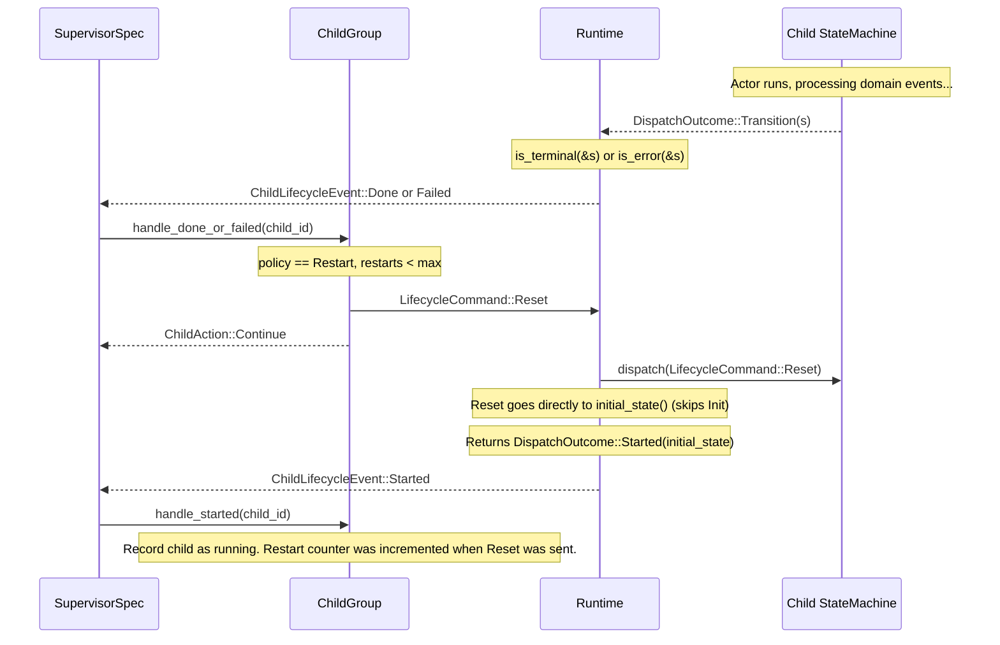
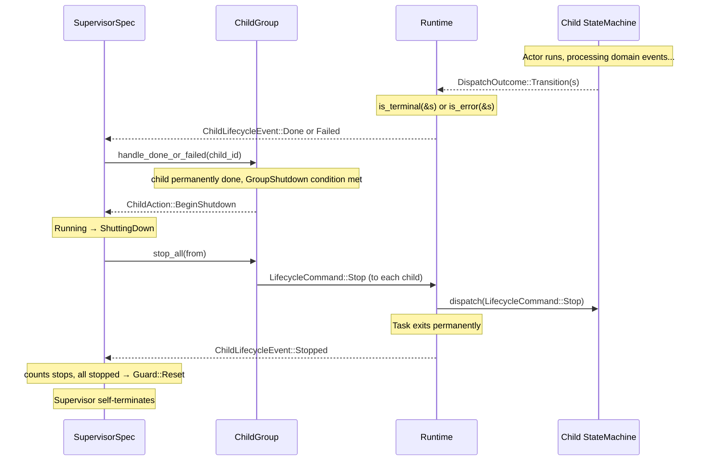

# Supervision

> **When would I use this?** Use this document when setting up supervision,
> understanding KillCapability (immediate actor termination for unresponsive actors), or learning how child lifecycle
> events flow to supervisors. For lifecycle command handling details, see `02-hsm-engine.md`.

The supervision model is inspired by Elixir/OTP. A **supervisor** is itself a state machine actor that monitors child actors and either restarts or permanently stops them in response to lifecycle triggers. Unlike OTP, the supervisor is a **generic library component** provided by `bloxide-supervisor` — users configure children and policies in the wiring layer without writing a custom blox.

Lifecycle control is handled entirely by the **runtime** — actors never see lifecycle commands and never hold a reference to their supervisor.

`LifecycleCommand` and `ChildLifecycleEvent` are defined in `bloxide-core/src/lifecycle.rs`. They are core engine types that enable the supervision pattern. The `bloxide-supervisor` crate re-exports them for convenience.

## Core Principle: Actor Lifecycle Commands

Bloxide has a **four-level lifecycle model** (`reset → stop → abort → kill`), ordered from gentlest to most forceful. Two of the four levels are `LifecycleCommand` variants handled through the normal dispatch pipeline (`Reset`, `Stop`); the cooperative level (`Abort`) is delivered on a dedicated abort mailbox, and the final forceful level (`Kill`) is a runtime capability that bypasses dispatch entirely.

| Command / Capability | Target State | Through dispatch? | Callbacks | Can Restart? |
|---------|--------------|-------------------|-----------|--------------|
| `Reset` | User-defined initial operational state (`initial_state()`) | Yes | Full exit chain + entry chain for `initial_state()` (no `on_init_entry`) | Yes (already running) |
| `Stop` | Init | Yes | Full exit chain + `on_init_entry` | Yes (send `Start` to resume) |
| `Abort` (`AbortCommand`) | Task ends cooperatively | No (run loop breaks) | None | Yes (respawn the task) |
| `Kill` (`KillCapability::kill`) | Destroyed (task aborted in place) | No (runtime ripcord) | None | No (permanently dead) |

> For the full engine-level treatment of the four-level model (including how `Guard::Reset` and the `DispatchOutcome` variants map to these levels), see `02-hsm-engine.md` → "Four-Level Lifecycle" and `14-unified-lifecycle.md`.

### Reset — Immediate Restart

`Reset` sends the actor through its exit chain (all `on_exit` callbacks fire), then enters the **user-defined initial operational state** (defined by `MachineSpec::initial_state()`). **Reset skips Init entirely** — no `on_init_entry` or `on_init_exit` fires. The `on_entry` callbacks for `initial_state()` are responsible for resetting domain state. The actor is immediately running again — no separate `Start` command is needed. The runtime reports `DispatchOutcome::Started(initial_state)`, which the supervisor sees as `ChildLifecycleEvent::Started`.

Use for: restart cycles where the actor should continue operating.

### Stop — Graceful Shutdown

`Stop` sends the actor through its exit chain (all `on_exit` callbacks fire), calls `on_init_entry` (for resource cleanup), and leaves the actor in **Init**. The task stays alive but suspended. Send `Start` to resume operation from `initial_state()`.

Use for:
- Graceful shutdown (callbacks run, clean exit)
- Pausing an actor with intent to resume later
- Dynamic actors you may want to restart

### Abort — Cooperative Self-Termination

`Abort` is sent as an `AbortCommand::Abort { child_id }` on a dedicated **abort mailbox** (separate from the lifecycle mailbox). The actor's run loop polls it alongside lifecycle and domain mailboxes; when an `AbortCommand` is received, the run loop breaks and the task ends cooperatively. No `dispatch()` is called, no exit callbacks fire, no `on_init_entry` fires.

The runtime synthesizes `DispatchOutcome::Aborted` and sends `ChildLifecycleEvent::Aborted` to the supervisor. The task is ended but was not externally destroyed — restarting requires respawning a new task. `ChildPolicy::Abort` sends `AbortCommand` on the child's `abort_ref`; the supervisor records the child as permanently done via `record_aborted()`.

Use for:
- Supervisor-initiated shutdown where you want the task to end but `Stop` does not fit (e.g. the actor is already in `Init`)
- Cases where you want the task gone but need the supervisor to observe the outcome (`Kill` produces no `DispatchOutcome`)

### Kill — Permanent Termination (Ripcord)

`KillCapability::kill(handle)` is the external ripcord. It calls `R::Kill::kill(handle)` (which invokes `SpawnCap::abort(handle)` on dynamic runtimes) and destroys the task in place — works even on stuck/deadlocked actors that aren't polling any mailbox. No callbacks, no dispatch, no mailbox. The task is permanently dead; its ID will never be valid again.

The supervisor receives no `DispatchOutcome` for a killed actor (it learns the actor is gone through the runtime's task-completion signal). `ChildPolicy::Kill` invokes the ripcord directly via the stored `abort_handle`.

**Kill has two purposes:**

1. **Unresponsive actors** — stuck in infinite loops, deadlocks, or blocking calls; cannot process `Stop`, `Reset`, or `Abort`. Kill forces termination when cooperation is not possible. (When the actor *can* still yield to its run loop, prefer `Abort`.)

2. **Cleanup** — freeing resources for an actor that has already been stopped or aborted, when you want the task handle gone immediately.

**For dynamic actors**, the cooperative shutdown ladder is:
```
Stop → actor goes to Init (suspended, callbacks ran)
  ├─ Start → actor resumes operation from initial_state()
  └─ Abort → task ends cooperatively (ChildLifecycleEvent::Aborted)
                └─ Kill → if Abort is not serviced in time, ripcord the task
```

**For static actors**, `Kill` is primarily for unresponsive actors:
- Kill → actor permanently dead
- No replacement possible (static actors are created at wiring time)

**Actors have zero knowledge of their supervisor.** No `supervisor_ref` in context, no lifecycle messages in event enums, no root rules for Reset/Stop/Ping.
## KillCapability: The Kill Ripcord

`KillCapability` is the **runtime capability** behind the `Kill` level of the four-level lifecycle model. It terminates an actor's task immediately by calling `R::Kill::kill(handle)` (which invokes `SpawnCap::abort(handle)` on dynamic runtimes), bypassing the normal dispatch lifecycle. It is used for unresponsive actors that cannot service `Stop`/`Reset`/`Abort`, or for cleanup when the task handle must be freed immediately.

In the four-level model, `KillCapability` is **only** invoked by `ChildPolicy::Kill`. The cooperative `Abort` path uses `AbortCommand` on the abort mailbox instead (see [Abort — Cooperative Self-Termination](#abort--cooperative-self-termination) above).

### KillCapability vs. Lifecycle Commands and Abort

| Command/Cap | Path | Callbacks | When Used |
|---|---|---|---|
| `Reset` | dispatch(VirtualRoot) → exit + entry chain for `initial_state()` | `on_exit` (all states), `on_entry` for `initial_state()` (no `on_init_entry`) | Restart cycle |
| `Stop` | dispatch(VirtualRoot) → exit chain → Init | `on_exit` (all states), `on_init_entry` | Clean shutdown, suspend |
| `Abort` (`AbortCommand`) | abort mailbox → run loop breaks (no dispatch) | **None** | Cooperative task termination |
| `KillCapability::kill` | Runtime abort (bypasses dispatch and mailboxes) | **None** | Unresponsive actors, resource cleanup (ripcord) |

### KillCapability Trait Definition

```rust
// In bloxide-core/src/capability.rs
pub trait KillCapability<R: BloxRuntime> {
    type Handle: Clone + Send + 'static;
    fn kill(handle: Self::Handle);
}
```

The runtime provides two implementations:
- `NoKill` — for static runtimes (Embassy). `Handle = ()` (ZST), `kill` is a no-op.
- `Kill` — for dynamic runtimes (Tokio). `Handle = R::AbortHandle`, `kill` calls `R::abort(handle)`.

The supervisor stores the cloneable `abort_handle: Option<<R::Kill as KillCapability<R>>::Handle>` per child in `ChildEntry` (populated by `add_dynamic`). When `ChildPolicy::Kill` fires, `handle_done_or_failed` takes the handle and calls `R::Kill::kill(handle)`. The handle is `R::AbortHandle` (Clone), not `R::TaskHandle` (not Clone), so it can be extracted from `&Event` in action functions.

### Key Invariants for KillCapability

- KillCapability is the ripcord of last resort — for unresponsive actors or cleanup, not a replacement for the cooperative lifecycle levels (`Reset`/`Stop`/`Abort`).
- Actors never see KillCapability; only supervisors and the wiring layer hold handles.
- KillCapability is a runtime-facing capability (Tier 2), not a blox-facing trait.
- After `kill()`, no `on_exit` callbacks fire — the task is dropped in-place.
- Killed actors are permanently dead and cannot be restarted.
- `ChildPolicy::Kill` is the only policy that invokes `KillCapability::kill`. `ChildPolicy::Abort` uses the cooperative `AbortCommand` mailbox instead.
## Generic Supervisor (`bloxide-supervisor`)

The `bloxide-supervisor` crate provides a ready-to-use supervisor as a `MachineSpec`. No custom blox is needed — the wiring layer constructs a `ChildGroup<R>`, configures per-child policies and a group-level shutdown trigger, and spawns the generic `SupervisorSpec<R>`.

### Key Types

| Type | Role |
|---|---|
| `SupervisorSpec<R>` | `MachineSpec` implementing the supervisor state machine |
| `SupervisorCtx<R>` | Context holding `ChildGroup<R>` and internal counters |
| `SupervisorState` | `Running` / `ShuttingDown` |
| `ChildGroup<R>` | Registry of children with per-child policies and lifecycle refs |
| `ChildPolicy` | Per-child restart strategy |
| `GroupShutdown` | Group-level trigger for entering `ShuttingDown` |
| `ChildAction` | Internal signal: `Continue` or `BeginShutdown` |

## Per-Child Policy (`ChildPolicy`)

Each child is registered with its own `ChildPolicy` that determines what happens when it reaches a `Done` or `Failed` state:

```rust
pub enum ChildPolicy {
    Restart { max: usize },  // Reset → immediately operational, up to `max` times
    Stop,                    // Mark as permanently done immediately
    Abort,                   // Send AbortCommand (cooperative task termination)
    Kill,                    // Call KillCapability::kill (ripcord, permanently dead)
}
```

**`Restart { max }`**: The supervisor sends `Reset` to the child. The child goes directly to `initial_state()` and returns `Started` — the supervisor records the restart and increments the counter. No separate `Start` is needed. If the restart count reaches `max`, the child is marked permanently done instead.

**`Stop`**: The child is marked permanently done immediately. No restart attempt is made.

**`Abort`**: The supervisor sends `AbortCommand::Abort` on the child's abort mailbox. The child's task ends cooperatively. The supervisor sees `ChildLifecycleEvent::Aborted`.

**`Kill`**: The supervisor calls `KillCapability::kill(handle)` — the ripcord. The task is permanently destroyed. No `DispatchOutcome` is produced; the supervisor learns the task is gone through the runtime's task-completion signal.

## Group Shutdown Trigger (`GroupShutdown`)

`GroupShutdown` determines when the supervisor transitions from `Running` to `ShuttingDown`:

```rust
pub enum GroupShutdown {
    WhenAnyDone,   // Shut down as soon as any child is permanently done
    WhenAllDone,   // Shut down only after all children are permanently done
}
```

A child becomes "permanently done" when:
- Its policy is `ChildPolicy::Stop` and it reports `Done` or `Failed`, OR
- Its policy is `ChildPolicy::Restart { max }` and it has exhausted all restart attempts, OR
- Its policy is `ChildPolicy::Abort` and it reports `Done` or `Failed` (the supervisor sends `AbortCommand` and marks it permanently done immediately), OR
- Its policy is `ChildPolicy::Kill` and it reports `Done` or `Failed` (the supervisor invokes the ripcord and marks it permanently done immediately).

In the `Abort` and `Kill` cases the child is marked permanently done at the moment `handle_done_or_failed` acts on the policy — `Abort` additionally waits for the `ChildLifecycleEvent::Aborted` confirmation (recorded by `record_aborted`), while `Kill` produces no lifecycle event at all.

## Group Restart Strategy (`RestartStrategy`)

`RestartStrategy` determines which children are restarted when a child fails and its `ChildPolicy` allows a restart. Inspired by Erlang/OTP supervisor restart strategies.

```rust
pub enum RestartStrategy {
    OneForOne,  // Restart only the failed child (default)
    OneForAll,  // Restart all children when any child fails
    RestForOne, // Restart the failed child and all children declared after it
}
```

| Strategy | Behavior |
|---|---|
| **`OneForOne`** | Only the failed child is sent `Reset`. All other children continue running undisturbed. This is the default and matches the pre-existing behavior. |
| **`OneForAll`** | The failed child AND all other active children are sent `Reset` simultaneously. Use when children are tightly coupled and cannot operate correctly without all peers being in a clean state. |
| **`RestForOne`** | The failed child AND all children declared after it (higher indices in `ChildGroup`) are sent `Reset`. Children declared before the failed child are left running. Use when children have dependencies on earlier siblings but not vice versa. |

Only children in `Init` or `Running` phase are affected by the strategy. Children that are already `ResetPending`, `PermanentlyDone`, or `Stopped` are skipped. (Aborted and killed children are both recorded under the `PermanentlyDone` phase — see `ChildPhase` in `bloxide-supervisor-context/src/registry.rs`.)

The strategy is set on `ChildGroup` via the builder pattern:

```rust
let mut group = ChildGroup::new(GroupShutdown::WhenAllDone)
    .with_restart_strategy(RestartStrategy::OneForAll);
```

The restart strategy only applies to children whose `ChildPolicy` is `Restart { max }` and have remaining restarts. If the failed child's policy is `Stop` or its restarts are exhausted, no sibling restart occurs — the child is marked permanently done and the `GroupShutdown` trigger is evaluated instead.

## Three Triggers

The supervisor reacts to three kinds of child lifecycle events:

| Trigger | `ChildLifecycleEvent` | Meaning |
|---|---|---|
| **Done** | `Done { child_id }` | Child entered a terminal state (`is_terminal()` returned `true`) |
| **Failed** | `Failed { child_id }` | Child entered an error state (`is_error()` returned `true`; takes precedence over `is_terminal`) |
| **Rogue** | *(health tick missed)* | Child failed to respond to the previous `Ping` by the next `HealthCheckTick` |

## `ChildGroup<R>` — Encapsulated Restart/Shutdown Logic

`ChildGroup<R>` encapsulates all restart counting, policy evaluation, and shutdown decisions. The supervisor's handler tables call methods on `ChildGroup` and inspect the returned `ChildAction` to decide state transitions.

```rust
pub struct ChildGroup<R: BloxRuntime> { /* opaque */ }

impl<R: BloxRuntime> ChildGroup<R> {
    pub fn new(shutdown: GroupShutdown) -> Self;
    pub fn with_restart_strategy(self, strategy: RestartStrategy) -> Self;
    pub fn add(&mut self, id: ActorId, lifecycle_ref: ActorRef<LifecycleCommand, R>, policy: ChildPolicy);
    pub fn add_dynamic(
        &mut self,
        id: ActorId,
        lifecycle_ref: ActorRef<LifecycleCommand, R>,
        abort_ref: ActorRef<AbortCommand, R>,
        abort_handle: <R::Kill as KillCapability<R>>::Handle,
        policy: ChildPolicy,
    );
    pub fn start_child(&self, child_id: ActorId, from: ActorId);

    pub fn start_all(&self, from: ActorId);
    pub fn stop_all(&self, from: ActorId);

    pub fn handle_done_or_failed(&mut self, child_id: ActorId, from: ActorId) -> ChildAction;
    pub fn handle_started(&mut self, child_id: ActorId);
    pub fn handle_alive(&mut self, child_id: ActorId);
    pub fn health_check_tick(&mut self, from: ActorId) -> ChildAction;

    pub fn record_stopped(&mut self, child_id: ActorId);
    pub fn record_aborted(&mut self, child_id: ActorId);
    pub fn all_stopped(&self) -> bool;
    pub fn clear_counters(&mut self);
}
```

> **Removed vs. old API**: `handle_reset` is gone — in the four-level model `Reset` returns `Started`, so the existing `handle_started` path covers it. `record_aborted` is new — it records a child as permanently done after an `Aborted` event (the task self-terminated cooperatively; it is not in `Init` like a `Stopped` child). `add_dynamic` is new — it stores the `abort_ref` (cooperative abort mailbox) and `abort_handle` (kill ripcord) for dynamically spawned children.

`handle_done_or_failed` evaluates the child's `ChildPolicy` (four variants):
- **`ChildPolicy::Kill`** → calls `R::Kill::kill(abort_handle)` (the ripcord). No callbacks. Marks the child `PermanentlyDone`. Evaluates `GroupShutdown`.
- **`ChildPolicy::Abort`** → sends `AbortCommand::Abort { child_id }` on the child's `abort_ref` (cooperative). The child's task will self-terminate and the supervisor later receives `ChildLifecycleEvent::Aborted`. Marks the child `PermanentlyDone` immediately. Evaluates `GroupShutdown`.
- **`ChildPolicy::Restart { max }`** → if `restarts < max`, sends `Reset` to the failed child (goes directly to `initial_state()`, no separate `Start`), increments the restart counter, sets the child's phase to `ResetPending`, then applies the group's `RestartStrategy` (sending `Reset` to affected siblings). Returns `Continue`. If restarts are exhausted, falls through to the permanently-done path.
- **`ChildPolicy::Stop`** (or exhausted `Restart`) → marks the child `PermanentlyDone` immediately. Evaluates `GroupShutdown`.

In all permanently-done cases, `handle_done_or_failed` returns `BeginShutdown` when the group shutdown condition is met, otherwise `Continue`.

Children already in `PermanentlyDone`, `Stopped`, or `ResetPending` phase are ignored (a duplicate `Done` while a Reset is in flight is coalesced).

`handle_started` records that a child has started. In the four-level model `Started` covers both initial `Start` (from `Init`) and `Reset` (which goes directly to `initial_state()`), so there is no separate `handle_reset` — `Reset` no longer produces a distinct event. The restart counter is incremented when `Reset` is sent (in `handle_done_or_failed`), not when `Started` arrives. A `Started` event transitions the child out of `ResetPending` into `Running`.

`health_check_tick` implements a deterministic health-check round:
- Children that missed the previous round's `Alive` are treated as rogue (`handle_done_or_failed`)
- Currently monitored children are pinged (`LifecycleCommand::Ping`) for the next round

## Supervisor State Machine

`SupervisorSpec<R>` has two states: `Running` and `ShuttingDown`.

```mermaid
stateDiagram-v2
    state "[engine-implicit Init]" as Init

    [*] --> Init
    Init --> Running : start() called by wiring

    Running --> Running : "Done/Failed [policy == Restart, restarts remaining]"
    Running --> ShuttingDown : "Done/Failed [GroupShutdown trigger met]"
    ShuttingDown --> Running : "Guard::Reset (all children Stopped) → initial_state()"
```

When a child reports `Done` or `Failed`:
1. `handle_done_or_failed` evaluates the child's `ChildPolicy` and the group's `GroupShutdown`.
2. If the result is `ChildAction::Continue`, the supervisor stays in `Running` (restart was sent, or other children still running under `WhenAllDone`).
3. If the result is `ChildAction::BeginShutdown`, the supervisor transitions to `ShuttingDown`.

In `ShuttingDown`, the supervisor sends `Stop` to all children, counts `Stopped` events, and self-terminates via `Guard::Reset` when all children have stopped.

### `SupervisorCtx<R>`

```rust
#[derive(BloxCtx)]
pub struct SupervisorCtx<R: BloxRuntime> {
    #[self_id]
    pub self_id: ActorId,
    #[provides(HasChildren<R>)]
    pub children: ChildGroup<R>,
    pub pending: ChildAction,
}
```

### Handler Tables

> The transition rules below are declared as `[[topology.transitions]]` entries in `blox.toml` and emitted as raw `StateRule { ... }` struct literals by `bloxide-codegen`. The rule structure (event match, actions, guard, targets) is shown in TOML form.

```toml
# RUNNING state
[[topology.transitions]]
state = "Running"
pattern = "SupervisorEvent::<R>::Child(ChildLifecycleEvent::Done { .. })"
actions = ["handle_done_or_failed_action::<R>"]

  [[topology.transitions.guards]]
  condition = "ctx.pending == ChildAction::BeginShutdown"
  to = "ShuttingDown"

  [[topology.transitions.guards]]
  to = "stay"

[[topology.transitions]]
state = "Running"
pattern = "SupervisorEvent::<R>::Child(ChildLifecycleEvent::Failed { .. })"
actions = ["handle_done_or_failed_action::<R>"]

  [[topology.transitions.guards]]
  condition = "ctx.pending == ChildAction::BeginShutdown"
  to = "ShuttingDown"

  [[topology.transitions.guards]]
  to = "stay"

[[topology.transitions]]
state = "Running"
pattern = "SupervisorEvent::<R>::Child(ChildLifecycleEvent::Started { .. })"
actions = ["record_started_action::<R>"]
to = "stay"

[[topology.transitions]]
state = "Running"
pattern = "SupervisorEvent::<R>::Child(ChildLifecycleEvent::Alive { .. })"
actions = ["record_alive_action::<R>"]
to = "stay"

[[topology.transitions]]
state = "Running"
pattern = "SupervisorEvent::<R>::Child(ChildLifecycleEvent::Aborted { .. })"
actions = ["record_aborted_action::<R>"]
to = "stay"

[[topology.transitions]]
state = "Running"
pattern = "SupervisorEvent::<R>::Control(SupervisorControl::RegisterChild(_))"
actions = ["register_child_action::<R>"]
to = "stay"

[[topology.transitions]]
state = "Running"
pattern = "SupervisorEvent::<R>::Control(SupervisorControl::HealthCheckTick)"
actions = ["handle_health_check_action::<R>"]

  [[topology.transitions.guards]]
  condition = "ctx.pending == ChildAction::BeginShutdown"
  to = "ShuttingDown"

  [[topology.transitions.guards]]
  to = "stay"

[[topology.transitions]]
state = "Running"
pattern = "SupervisorEvent::<R>::Child(_)"
to = "stay"

[[topology.transitions]]
state = "Running"
pattern = "SupervisorEvent::<R>::Control(_)"
to = "stay"

# SHUTTING_DOWN state
[[topology.transitions]]
state = "ShuttingDown"
pattern = "SupervisorEvent::<R>::Child(ChildLifecycleEvent::Stopped { .. })"
actions = ["record_stopped_action::<R>"]

  [[topology.transitions.guards]]
  condition = "ctx.all_children_stopped()"
  to = "reset"

  [[topology.transitions.guards]]
  to = "stay"

[[topology.transitions]]
state = "ShuttingDown"
pattern = "SupervisorEvent::<R>::Child(_)"
to = "stay"

[[topology.transitions]]
state = "ShuttingDown"
pattern = "SupervisorEvent::<R>::Control(_)"
to = "stay"
```

### `MachineSpec` Implementation

```rust
impl<R: BloxRuntime + 'static> MachineSpec for SupervisorSpec<R> {
    type State = SupervisorState;
    type Event = SupervisorEvent<R>;
    type Ctx = SupervisorCtx<R>;
    type Mailboxes<Rt: BloxRuntime> = (
        Rt::Stream<ChildLifecycleEvent>,
        Rt::Stream<SupervisorControl<R>>,
    );

    fn initial_state() -> SupervisorState { SupervisorState::Running }

    // on_init_entry fires only when the supervisor itself is Stopped (enters
    // Init). In the four-level model, Guard::Reset goes directly to
    // initial_state() (Running) — it does NOT fire on_init_entry. Counter
    // clearing for a normal restart cycle is therefore done by the Running
    // on_entry action `start_children`, not here.
    fn on_init_entry(ctx: &mut SupervisorCtx<R>) {
        ctx.children.clear_counters();
        ctx.pending = ChildAction::default();
    }
}
```

The **Running on_entry** action is `start_children` (in `bloxide-supervisor/src/actions.rs`). It calls `ctx.children.clear_counters()`, resets `ctx.pending` to `ChildAction::default()`, and then calls `start_all` to send `Start` to every child. Because `Guard::Reset` goes directly to `initial_state()` (Running), this on_entry fires both on the initial `Start` from wiring and on any `Guard::Reset` — replacing the old `on_init_entry` counter-clearing for the restart cycle.

## Lifecycle Flow

### Restart path (ChildPolicy::Restart)



### Shutdown path (GroupShutdown trigger met)



## Health Checks (implemented)

Health checks are delivered through the supervisor control-plane stream:

1. A health driver (for example, a runtime timer task) sends `SupervisorControl::HealthCheckTick`.
2. The supervisor calls `health_check_tick()` on `ChildGroup`.
3. `ChildGroup` marks children that missed the previous `Alive` as rogue and applies normal child policy (`handle_done_or_failed`).
4. `ChildGroup` sends `LifecycleCommand::Ping` to currently monitored children.
5. Children reply with `ChildLifecycleEvent::Alive { child_id }`, clearing the pending health bit.

This is intentionally externalized: `bloxide-supervisor` defines the protocol, while wiring/runtime code chooses how ticks are produced.

**Known limitation**: In Embassy's cooperative scheduler, a truly stuck actor (infinite loop, blocking call) will never yield to process the `Ping` command. Health checks can only detect actors whose run loop has stalled while awaiting — not actors that never await.

## `ChildLifecycleEvent`

Defined in `bloxide-supervisor`. The runtime generates these automatically by observing `DispatchOutcome` — no actor code sends them.

```rust
pub enum ChildLifecycleEvent {
    Started { child_id: ActorId },  // child exited Init or was Reset (now operational)
    Done    { child_id: ActorId },  // child entered a terminal state (is_terminal)
    Failed  { child_id: ActorId },  // child entered an error state (is_error)
    Stopped { child_id: ActorId },  // child was Stopped, now in Init (suspended)
    Aborted { child_id: ActorId },  // child was Aborted, task has ended (cooperative)
    Alive   { child_id: ActorId },  // child responded to Ping (healthy)
}
```

`is_error` takes precedence: if both `is_error` and `is_terminal` return `true` for the same state, only `Failed` is reported.

## `LifecycleCommand`

Defined in `bloxide-supervisor`. Sent by the supervisor (via `ChildGroup`) to each child's runtime-internal lifecycle channel.

```rust
pub enum LifecycleCommand {
    Start,
    Reset,
    Stop,
    Ping,
}
```

| Command | Runtime behavior |
|---|---|
| `Start` | dispatch(VirtualRoot) — exits Init, enters `initial_state()` |
| `Reset` | dispatch(VirtualRoot) — full exit chain, enters `initial_state()` directly (skips Init, returns `Started`) |
| `Stop` | Full exit chain → Init + `on_init_entry`, task stays alive suspended |
| `Ping` | Child responds with `ChildLifecycleEvent::Alive` |

## Supervised Actor Run Loop

Each runtime implements a supervised actor run loop that bridges lifecycle commands and abort commands with domain mailboxes. This is runtime-specific code — never used as a bound on blox crates.

The runtime polls three streams in priority order:
1. **Lifecycle stream** (`LifecycleCommand`: `Start`/`Reset`/`Stop`/`Ping`) — highest priority.
2. **Abort mailbox** (`AbortCommand::Abort`) — serviced before domain messages so a stuck actor can be terminated promptly when it next yields. On receipt, the run loop reports `DispatchOutcome::Aborted` to the supervisor and self-terminates (no `dispatch()`, no callbacks).
3. **Domain mailboxes** — polled only when no lifecycle or abort command is pending.

After every dispatch, the runtime inspects `DispatchOutcome` and sends the corresponding `ChildLifecycleEvent` to the supervisor automatically. The `Aborted` outcome is synthesized by the run loop itself (not by `dispatch()`), since `Abort` bypasses the dispatch pipeline.

The dynamic-runtime wrapper is `run_supervised_actor_with_abort` (in `runtimes/bloxide-tokio/src/supervision.rs`) — renamed from the old `run_supervised_actor_with_kill` to reflect that it listens on the abort mailbox rather than a kill mailbox. (The Embassy runtime uses a static equivalent.)

## `SupervisorEvent` and `SupervisorControl`

The unified event type for supervisor state machines:

```rust
pub enum SupervisorEvent<R: BloxRuntime> {
    Child(ChildLifecycleEvent),
    Control(SupervisorControl<R>),
}

pub enum SupervisorControl<R: BloxRuntime> {
    RegisterChild(RegisterChild<R>),
    RegisterDynamicChild(RegisterDynamicChild<R>),
    HealthCheckTick,
}
```

`Child` variants arrive from the runtime's supervised run loop. `Control` variants come from supervisor wiring/control-plane senders and enable:
- static registration of supervised children (`RegisterChild`)
- dynamic registration of supervised children with abort/kill capability (`RegisterDynamicChild` — carries the `abort_ref` and `abort_handle` needed by `ChildPolicy::Abort` and `ChildPolicy::Kill`)
- periodic health checks (`HealthCheckTick`)

## Wiring a Supervised Group (Embassy)

The wiring layer uses `ChildGroupBuilder` and `bloxide_embassy::spawn_child!` — no custom blox is needed:

```rust
use bloxide_supervisor::{SupervisorSpec, SupervisorCtx, ChildPolicy, GroupShutdown};
use bloxide_embassy::prelude::*;

// Create domain channels for children
let ((ping_ref,), ping_mbox) = bloxide_embassy::channels! { PingPongMsg(16) };
let ping_id = ping_ref.id();
let ((pong_ref,), pong_mbox) = bloxide_embassy::channels! { PingPongMsg(16) };
let pong_id = pong_ref.id();

// Build contexts (omitting timer_ref / behavior for brevity)
let ping_ctx = PingCtx::new(ping_id, pong_ref.clone(), ping_ref.clone(), timer_ref, PingBehavior::default());
let pong_ctx = PongCtx::new(pong_id, ping_ref);

// Wrap contexts in state machines before spawning
let ping_machine = StateMachine::new(ping_ctx);
let pong_machine = StateMachine::new(pong_ctx);

// Supervised group — ChildGroupBuilder allocates the notification channel and
// per-child lifecycle channels; spawn_child! registers each child and spawns its task.
let mut group = ChildGroupBuilder::new(GroupShutdown::WhenAnyDone);
bloxide_embassy::spawn_child!(
    spawner, group,
    ping_task(ping_machine, ping_mbox, ping_id),
    ChildPolicy::Restart { max: 1 }
);
bloxide_embassy::spawn_child!(
    spawner, group,
    pong_task(pong_machine, pong_mbox, pong_id),
    ChildPolicy::Stop
);
let _sup_control_ref = group.control_ref();
let sup_id = bloxide_embassy::next_actor_id!();
let (children, sup_notify_rx, sup_control_rx) = group.finish();

// Create the generic supervisor — no custom blox needed
    let sup_ctx = SupervisorCtx::new(sup_id, children);
    let mut sup_machine = StateMachine::new(sup_ctx);
    sup_machine.dispatch(SupervisorEvent::Lifecycle(LifecycleCommand::Start));
    spawner.must_spawn(supervisor_task(sup_machine, (sup_notify_rx, sup_control_rx)));
```

In this example, `ping` will be restarted once on `Done`/`Failed`, while `pong` is marked permanently done immediately. Because `GroupShutdown::WhenAnyDone` is configured, the supervisor enters `ShuttingDown` as soon as either child is permanently done.

## Supervision Tree

Supervisors can themselves be children of another supervisor:

```
Root Supervisor
├── Ping Actor (child, Restart { max: 1 })
├── Pong Actor (child, Stop)
└── Sub-Supervisor (child, Restart { max: 1 })
    └── ...
```

The root supervisor is bootstrapped with `sup_machine.dispatch(LifecycleCommand::Start)` in the wiring binary.

## Key Invariants

> **See `AGENTS.md` → "Key Invariants" for the canonical list.**

Supervision-specific invariants:

- Actors never see `LifecycleCommand` — it is runtime-internal.
- Actors have no `supervisor_ref` — they don't know their supervisor exists.
- `on_init_entry` is for domain-state reset only and fires only on `Stop` (entering Init). It does NOT fire on `Reset` (which skips Init and goes directly to `initial_state()`).
- **Four-level lifecycle**: `Reset` goes directly to `initial_state()` (task stays alive, immediately operational, reports `Started`); `Stop` goes to `Init` (task suspended, reports `Stopped`); `Abort` ends the task cooperatively via the abort mailbox (reports `Aborted`); `Kill` destroys the task in place via `KillCapability::kill` (no report).
- `is_error` takes precedence over `is_terminal` — a state that is both error and terminal reports only `Failed`.
- `Guard::Reset` goes directly to `initial_state()`, skipping Init entirely. It fires the full LCA exit chain (leaf → root) for the current state, then the entry chain for `initial_state()`. It does NOT call `on_init_entry` or `on_init_exit`.
- Each child runs in its own Embassy task — precise per-actor wakeup is preserved.
- `ChildGroup<R>` encapsulates all restart counting, policy evaluation, and shutdown logic.
- Per-child `ChildPolicy` (four variants: `Restart`, `Stop`, `Abort`, `Kill`) gives each child its own failure strategy (vs. the old group-wide approach).
- `GroupShutdown` controls when the supervisor enters shutdown, not which children are affected.
- `RestartStrategy` (OneForOne / OneForAll / RestForOne) controls which siblings are restarted alongside a failed child. Default is `OneForOne` (only the failed child).
- `ChildPhase` tracks each child's state: `Init`, `Running`, `ResetPending` (Reset sent, awaiting `Started`), `PermanentlyDone`, `Stopped`. Health checks (`is_health_monitored`) skip `ResetPending` and `PermanentlyDone` children.
- `LifecycleCommand` and `ChildLifecycleEvent` are defined in `bloxide-core` (and re-exported by `bloxide-supervisor`). `ChildPolicy`, `AbortCommand`, `GroupShutdown`, and `RestartStrategy` are defined in `bloxide-core/src/child_management.rs`.
- No custom supervisor implementation is needed — `SupervisorSpec<R>` is a generic, reusable `MachineSpec`.

## Related Docs

- **Lifecycle events** → This file
- **Wiring supervised actors** → `spec/architecture/04-static-wiring.md`
- **Supervisor as reusable blox** → `spec/architecture/12-action-crate-pattern.md` → "Supervisor As The Same Pattern"
- **Runtime supervision impl** → `runtimes/*/src/supervision.rs`
