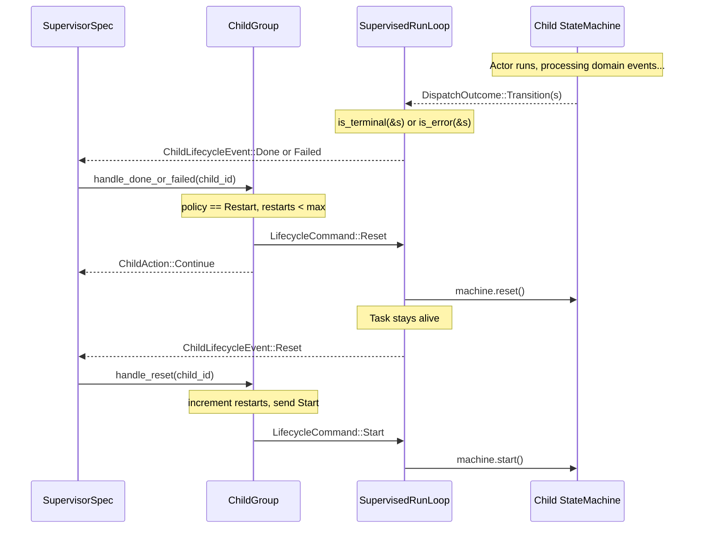
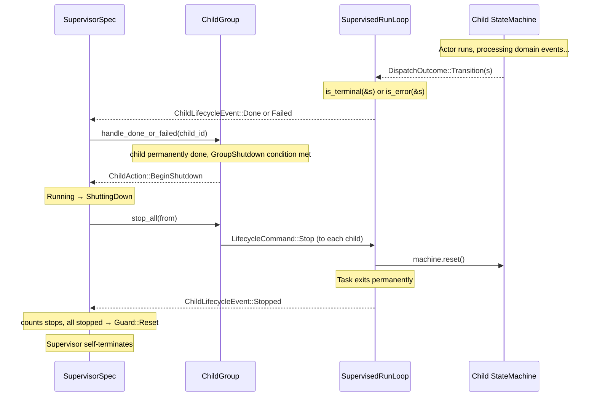

# Supervision

> **When would I use this?** Use this document when setting up supervision,
> understanding KillCap (policy-driven cleanup for dynamic actors), or learning how child lifecycle
> events flow to supervisors. For lifecycle command handling details, see `02-hsm-engine.md`.

The supervision model is inspired by Elixir/OTP. A **supervisor** is itself a state machine actor that monitors child actors and either restarts or permanently stops them in response to lifecycle triggers. Unlike OTP, the supervisor is a **generic library component** provided by `bloxide-supervisor` — users configure children and policies in the wiring layer without writing a custom blox.

Lifecycle control is handled entirely by the **runtime** — actors never see lifecycle commands and never hold a reference to their supervisor.

`LifecycleCommand` and `ChildLifecycleEvent` are defined in `bloxide-core/src/lifecycle.rs`. They are core engine types that enable the supervision pattern. The `bloxide-supervisor` crate re-exports them for convenience.

## Core Principle: Actor Lifecycle Commands

Actors have three lifecycle commands with distinct semantics:

| Command | Target State | Effect | Can Restart? |
|---------|--------------|--------|--------------|
| `Reset` | User-defined initial operational state | Actor immediately running again | Yes (already running) |
| `Stop` | Init | Actor suspended, callbacks ran | Yes (send `Start` to resume) |
| `Kill` | Destroyed (task aborted) | Permanently dead, no callbacks | No (permanently dead) |

### Reset — Immediate Restart

`Reset` sends the actor through its exit chain (all `on_exit` callbacks fire), then enters the **user-defined initial operational state** (defined by `MachineSpec::initial_state()`). The actor is immediately running again — no separate `Start` command is needed.

Use for: restart cycles where the actor should continue operating.

### Stop — Graceful Shutdown

`Stop` sends the actor through its exit chain (all `on_exit` callbacks fire) and leaves the actor in **Init**. The task stays alive but suspended. Send `Start` to resume operation from `initial_state()`.

Use for:
- Graceful shutdown (callbacks run, clean exit)
- Pausing an actor with intent to resume later
- Dynamic actors you may want to restart

### Kill — Permanent Termination

`Kill` immediately aborts the actor's task. No callbacks run. The actor is permanently dead — its ID will never be valid again.

**Kill has two purposes:**

1. **Unresponsive actors** — stuck in infinite loops, deadlocks, or blocking calls; cannot process `Stop` or `Reset` commands. Kill forces termination when cooperation is not possible.

2. **Cleanup stopped actors** — an actor was stopped (in Init), but you want to free its resources immediately rather than keep it suspended.

**For dynamic actors**, the pattern is:
```
Stop → actor goes to Init (suspended)
  ├─ Start → actor resumes operation from initial_state()
  └─ Kill → resources freed, parent removes ActorRef from Vec
```

**For static actors**, Kill is primarily for unresponsive actors:
- Kill → actor permanently dead
- No replacement possible (static actors are created at wiring time)

**Actors have zero knowledge of their supervisor.** No `supervisor_ref` in context, no lifecycle messages in event enums, no root rules for Reset/Stop/Ping.
## KillCap: Policy-Driven Actor Cleanup

`KillCap` is a **runtime capability** (Tier 2 trait) for terminating actors and freeing their allocated resources. It is primarily used by supervisors managing **dynamic actors** — actors spawned at runtime whose resources (channels, Vec slots, task slots) may need explicit cleanup based on policy.

### Static vs. Dynamic Actor Cleanup

For **static actors** (created at wiring time), lifecycle commands `Stop` and `Reset` are sufficient. The actor's channels and resources are held by the wiring layer and naturally cleaned up when the task exits.

For **dynamic actors** (spawned at runtime), the supervisor may need to:
- Free the child's allocated channel memory
- Remove the child from `Vec<ActorRef>` collections in parent actors
- Reclaim task slots for reuse

### When to Use KillCap

The `ChildPolicy` determines whether KillCap is applied when a child reaches a terminal state:

| Situation | Use | Rationale |
|---|---|---|
| Normal restart cycle | Reset | Preserves on_exit callbacks, child stays alive |
| Clean shutdown | Stop | Actor processes Stop command, callbacks run |
| Policy-driven cleanup for dynamic actors | Kill | Immediate termination, memory freed |
| Child unresponsive, health check failed | Kill | Cannot process Stop if stuck |

### KillCap vs. Lifecycle Commands

| Command/Cap | Path | Callbacks | When Used |
|---|---|---|---|
| `Reset` | dispatch(VirtualRoot) → exit chain | `on_exit` (all states), `on_init_entry` | Restart cycle |
| `Stop` | dispatch(VirtualRoot) → exit chain | `on_exit` (all states) | Clean shutdown |
| `KillCap::kill` | Runtime abort (bypasses dispatch) | **None** | Policy-driven cleanup for dynamic actors |

### KillCap Trait Definition

```rust
// In bloxide-core/src/capability.rs
pub trait KillCap: Send + Sync + 'static {
    /// Kill the actor immediately. Runtime aborts the task and drops channels.
    /// No callbacks fire on the actor - it's just gone.
    fn kill(&self, actor_id: ActorId);
}
```

### Tokio Implementation

```rust
// In bloxide-tokio/src/kill.rs
#[derive(Clone)]
pub struct TokioKillCap {
    tasks: Arc<Mutex<HashMap<ActorId, JoinHandle<()>>>>,
}

impl KillCap for TokioKillCap {
    fn kill(&self, actor_id: ActorId) {
        if let Some(handle) = self.tasks.lock().unwrap().remove(&actor_id) {
            handle.abort();  // Immediate task termination
            // channels drop, Vec entries can be removed
        }
    }
}
```

### Integration with ChildGroup

The supervisor's `ChildGroup<R>` may hold a `KillCap` reference (optional, only for runtimes that support it):

```rust
pub struct ChildGroup<R: BloxRuntime> {
    // ... existing fields ...
    kill_cap: Option<Rc<dyn KillCap>>,  // None for Embassy, Some for Tokio
}
```

When policy dictates immediate cleanup (e.g., `ChildPolicy::KillOnDone`), `ChildGroup` invokes `kill_cap.kill(child_id)` instead of sending `Stop`.

### Key Invariants for KillCap

- KillCap is a **policy tool** for dynamic actor cleanup, not a replacement for normal lifecycle.
- Actors have no access to KillCap; only supervisors (and potentially the wiring layer) hold it.
- KillCap is a Tier 2 capability (runtime-facing), not a Tier 1 trait (blox-facing).
- Embassy lacks KillCap — dynamic actors on Embassy use cooperative cleanup strategies.
- After `kill()`, no `ChildLifecycleEvent::Stopped` is emitted; the supervisor tracks cleanup separately.
## Generic Supervisor (`bloxide-supervisor`)

The `bloxide-supervisor` crate provides a ready-to-use supervisor as a `MachineSpec`. No custom blox is needed — the wiring layer constructs a `ChildGroup<R>`, configures per-child policies and a group-level shutdown trigger, and spawns the generic `SupervisorSpec<R>`.

### Key Types

| Type | Role |
|---|---|
| `SupervisorSpec<R>` | `MachineSpec` implementing the supervisor state machine |
| `SupervisorCtx<R>` | Context holding `ChildGroup<R>` and internal counters |
| `SupervisorState` | `Running` / `ShuttingDown` |
| `ChildGroup<R>` | Registry of children with per-child policies and lifecycle refs |
| `ChildPolicy` | Per-child restart strategy |
| `GroupShutdown` | Group-level trigger for entering `ShuttingDown` |
| `ChildAction` | Internal signal: `Continue` or `BeginShutdown` |

## Per-Child Policy (`ChildPolicy`)

Each child is registered with its own `ChildPolicy` that determines what happens when it reaches a `Done` or `Failed` state:

```rust
pub enum ChildPolicy {
    Restart { max: usize },  // Reset → Init → Start, up to `max` times
    Stop,                    // Mark as permanently done immediately
}
```

**`Restart { max }`**: The supervisor sends `Reset` to the child. When the child reports `Reset`, the supervisor increments its restart counter and sends `Start`. If the restart count reaches `max`, the child is marked permanently done instead.

**`Stop`**: The child is marked permanently done immediately. No restart attempt is made.

## Group Shutdown Trigger (`GroupShutdown`)

`GroupShutdown` determines when the supervisor transitions from `Running` to `ShuttingDown`:

```rust
pub enum GroupShutdown {
    WhenAnyDone,   // Shut down as soon as any child is permanently done
    WhenAllDone,   // Shut down only after all children are permanently done
}
```

A child becomes "permanently done" when:
- Its policy is `ChildPolicy::Stop` and it reports `Done` or `Failed`, OR
- Its policy is `ChildPolicy::Restart { max }` and it has exhausted all restart attempts.

## Three Triggers

The supervisor reacts to three kinds of child lifecycle events:

| Trigger | `ChildLifecycleEvent` | Meaning |
|---|---|---|
| **Done** | `Done { child_id }` | Child entered a terminal state (`is_terminal()` returned `true`) |
| **Failed** | `Failed { child_id }` | Child entered an error state (`is_error()` returned `true`; takes precedence over `is_terminal`) |
| **Rogue** | *(health tick missed)* | Child failed to respond to the previous `Ping` by the next `HealthCheckTick` |

## `ChildGroup<R>` — Encapsulated Restart/Shutdown Logic

`ChildGroup<R>` encapsulates all restart counting, policy evaluation, and shutdown decisions. The supervisor's handler tables call methods on `ChildGroup` and inspect the returned `ChildAction` to decide state transitions.

```rust
pub struct ChildGroup<R: BloxRuntime> { /* opaque */ }

impl<R: BloxRuntime> ChildGroup<R> {
    pub fn new(shutdown: GroupShutdown) -> Self;
    pub fn add(&mut self, id: ActorId, lifecycle_ref: ActorRef<LifecycleCommand, R>, policy: ChildPolicy);
    pub fn start_child(&self, child_id: ActorId, from: ActorId);

    pub fn start_all(&self, from: ActorId);
    pub fn stop_all(&self, from: ActorId);

    pub fn handle_done_or_failed(&mut self, child_id: ActorId, from: ActorId) -> ChildAction;
    pub fn handle_reset(&mut self, child_id: ActorId, from: ActorId);
    pub fn handle_started(&mut self, child_id: ActorId);
    pub fn handle_alive(&mut self, child_id: ActorId);
    pub fn health_check_tick(&mut self, from: ActorId) -> ChildAction;

    pub fn record_stopped(&mut self, child_id: ActorId);
    pub fn all_stopped(&self) -> bool;
    pub fn clear_counters(&mut self);
}
```

`handle_done_or_failed` applies the child's `ChildPolicy`:
- If `Restart { max }` and restarts remaining → sends `Reset`, returns `Continue`
- If `Stop` or restarts exhausted → marks child permanently done, evaluates `GroupShutdown`
- Returns `BeginShutdown` when the group shutdown condition is met

`handle_reset` increments the restart counter and sends `Start` to the child.

`health_check_tick` implements a deterministic health-check round:
- Children that missed the previous round's `Alive` are treated as rogue (`handle_done_or_failed`)
- Currently monitored children are pinged (`LifecycleCommand::Ping`) for the next round

## Supervisor State Machine

`SupervisorSpec<R>` has two states: `Running` and `ShuttingDown`.

```mermaid
stateDiagram-v2
    state "[engine-implicit Init]" as Init

    [*] --> Init
    Init --> Running : start() called by wiring

    Running --> Running : "Done/Failed [policy == Restart, restarts remaining]"
    Running --> ShuttingDown : "Done/Failed [GroupShutdown trigger met]"
    ShuttingDown --> Init : "Guard::Reset (all children Stopped)"
```

When a child reports `Done` or `Failed`:
1. `handle_done_or_failed` evaluates the child's `ChildPolicy` and the group's `GroupShutdown`.
2. If the result is `ChildAction::Continue`, the supervisor stays in `Running` (restart was sent, or other children still running under `WhenAllDone`).
3. If the result is `ChildAction::BeginShutdown`, the supervisor transitions to `ShuttingDown`.

In `ShuttingDown`, the supervisor sends `Stop` to all children, counts `Stopped` events, and self-terminates via `Guard::Reset` when all children have stopped.

### `SupervisorCtx<R>`

```rust
#[derive(BloxCtx)]
pub struct SupervisorCtx<R: BloxRuntime> {
    #[self_id]
    pub self_id: ActorId,
    #[provides(HasChildren<R>)]
    pub children: ChildGroup<R>,
    pub pending: ChildAction,
}
```

### Handler Tables

```rust
const RUNNING_FNS: StateFns<Self> = StateFns {
    on_entry: &[start_children::<R, SupervisorCtx<R>>],
    on_exit: &[],
    transitions: transitions![
        SupervisorEvent::<R>::Child(ChildLifecycleEvent::Done { .. }) => {
            actions [handle_done_or_failed_action::<R>]
            guard(ctx, _results) {
                ctx.pending == ChildAction::BeginShutdown => SupervisorState::ShuttingDown,
                _ => stay,
            }
        },
        SupervisorEvent::<R>::Child(ChildLifecycleEvent::Failed { .. }) => {
            actions [handle_done_or_failed_action::<R>]
            guard(ctx, _results) {
                ctx.pending == ChildAction::BeginShutdown => SupervisorState::ShuttingDown,
                _ => stay,
            }
        },
        SupervisorEvent::<R>::Child(ChildLifecycleEvent::Reset { .. }) => {
            actions [handle_reset_action::<R>]
            guard(_ctx, _results) {
                _ => stay,
            }
        },
        SupervisorEvent::<R>::Child(ChildLifecycleEvent::Started { .. }) => {
            actions [record_started_action::<R>]
            stay
        },
        SupervisorEvent::<R>::Child(ChildLifecycleEvent::Alive { .. }) => {
            actions [record_alive_action::<R>]
            stay
        },
        SupervisorEvent::<R>::Control(SupervisorControl::RegisterChild(_)) => {
            actions [register_child_action::<R>]
            stay
        },
        SupervisorEvent::<R>::Control(SupervisorControl::HealthCheckTick) => {
            actions [handle_health_check_action::<R>]
            guard(ctx, _results) {
                ctx.pending == ChildAction::BeginShutdown => SupervisorState::ShuttingDown,
                _ => stay,
            }
        },
        SupervisorEvent::<R>::Child(_) => { stay },
        SupervisorEvent::<R>::Control(_) => { stay },
    ],
};

const SHUTTING_DOWN_FNS: StateFns<Self> = StateFns {
    on_entry: &[stop_all_children::<R, SupervisorCtx<R>>],
    on_exit: &[],
    transitions: transitions![
        SupervisorEvent::<R>::Child(ChildLifecycleEvent::Stopped { .. }) => {
            actions [record_stopped_action::<R>]
            guard(ctx, _results) {
                ctx.all_children_stopped() => reset,
                _ => stay,
            }
        },
        SupervisorEvent::<R>::Child(_) => { stay },
        SupervisorEvent::<R>::Control(_) => { stay },
    ],
};
```

### `MachineSpec` Implementation

```rust
impl<R: BloxRuntime + 'static> MachineSpec for SupervisorSpec<R> {
    type State = SupervisorState;
    type Event = SupervisorEvent<R>;
    type Ctx = SupervisorCtx<R>;
    type Mailboxes<Rt: BloxRuntime> = (
        Rt::Stream<ChildLifecycleEvent>,
        Rt::Stream<SupervisorControl<R>>,
    );

    fn initial_state() -> SupervisorState { SupervisorState::Running }

    fn on_init_entry(ctx: &mut SupervisorCtx<R>) {
        ctx.children.clear_counters();
        ctx.pending = ChildAction::default();
    }
}
```

## Lifecycle Flow

### Restart path (ChildPolicy::Restart)



### Shutdown path (GroupShutdown trigger met)



## Health Checks (implemented)

Health checks are delivered through the supervisor control-plane stream:

1. A health driver (for example, a runtime timer task) sends `SupervisorControl::HealthCheckTick`.
2. The supervisor calls `health_check_tick()` on `ChildGroup`.
3. `ChildGroup` marks children that missed the previous `Alive` as rogue and applies normal child policy (`handle_done_or_failed`).
4. `ChildGroup` sends `LifecycleCommand::Ping` to currently monitored children.
5. Children reply with `ChildLifecycleEvent::Alive { child_id }`, clearing the pending health bit.

This is intentionally externalized: `bloxide-supervisor` defines the protocol, while wiring/runtime code chooses how ticks are produced.

**Known limitation**: In Embassy's cooperative scheduler, a truly stuck actor (infinite loop, blocking call) will never yield to process the `Ping` command. Health checks can only detect actors whose run loop has stalled while awaiting — not actors that never await.

## `ChildLifecycleEvent`

Defined in `bloxide-supervisor`. The runtime generates these automatically by observing `DispatchOutcome` — no actor code sends them.

```rust
pub enum ChildLifecycleEvent {
    Started { child_id: ActorId },  // child exited Init, entered initial state
    Done    { child_id: ActorId },  // child entered a terminal state (is_terminal)
    Failed  { child_id: ActorId },  // child entered an error state (is_error)
    Reset   { child_id: ActorId },  // child was Reset, now in Init (restartable)
    Stopped { child_id: ActorId },  // child was Stopped, task has exited (permanent)
    Alive   { child_id: ActorId },  // child responded to Ping (healthy)
}
```

`is_error` takes precedence: if both `is_error` and `is_terminal` return `true` for the same state, only `Failed` is reported.

## `LifecycleCommand`

Defined in `bloxide-supervisor`. Sent by the supervisor (via `ChildGroup`) to each child's runtime-internal lifecycle channel.

```rust
pub enum LifecycleCommand {
    Start,
    Reset,
    Stop,
    Ping,
}
```

| Command | Runtime behavior |
|---|---|
| `Start` | dispatch(VirtualRoot) — exits Init, enters `initial_state()` |
| `Reset` | dispatch(VirtualRoot) — full LCA exit chain, task stays alive |
| `Stop` | Calls `machine.reset()` — full LCA exit chain, task exits permanently |
| `Ping` | Child responds with `ChildLifecycleEvent::Alive` |

## `SupervisedRunLoop` Trait

Defined in `bloxide-supervisor`. Each runtime implements this trait to bridge lifecycle commands with domain mailboxes. This is a **Tier 2** trait — never used as a bound on blox crates.

```rust
pub trait SupervisedRunLoop: BloxRuntime {
    // Runtime-specific supervised actor execution.
    // Merges lifecycle commands with domain mailboxes,
    // dispatches events, and reports ChildLifecycleEvents.
}
```

The runtime implementation (`bloxide-embassy`) polls the internal lifecycle channel with priority over domain events. Domain events are only polled when no lifecycle command is pending.

## `SupervisorEvent` and `SupervisorControl`

The unified event type for supervisor state machines:

```rust
pub enum SupervisorEvent<R: BloxRuntime> {
    Child(ChildLifecycleEvent),
    Control(SupervisorControl<R>),
}

pub enum SupervisorControl<R: BloxRuntime> {
    RegisterChild(RegisterChild<R>),
    HealthCheckTick,
}
```

`Child` variants arrive from the runtime's supervised run loop. `Control` variants come from supervisor wiring/control-plane senders and enable:
- dynamic registration of supervised children at runtime (`RegisterChild`)
- periodic health checks (`HealthCheckTick`)

## Wiring a Supervised Group (Embassy)

The wiring layer uses `ChildGroupBuilder` and `bloxide_embassy::spawn_child!` — no custom blox is needed:

```rust
use bloxide_supervisor::{SupervisorSpec, SupervisorCtx, ChildPolicy, GroupShutdown};
use bloxide_embassy::prelude::*;

// Create domain channels for children
let ((ping_ref,), ping_mbox) = bloxide_embassy::channels! { PingPongMsg(16) };
let ping_id = ping_ref.id();
let ((pong_ref,), pong_mbox) = bloxide_embassy::channels! { PingPongMsg(16) };
let pong_id = pong_ref.id();

// Build contexts (omitting timer_ref / behavior for brevity)
let ping_ctx = PingCtx::new(ping_id, pong_ref.clone(), ping_ref.clone(), timer_ref, PingBehavior::default());
let pong_ctx = PongCtx::new(pong_id, ping_ref);

// Wrap contexts in state machines before spawning
let ping_machine = StateMachine::new(ping_ctx);
let pong_machine = StateMachine::new(pong_ctx);

// Supervised group — ChildGroupBuilder allocates the notification channel and
// per-child lifecycle channels; spawn_child! registers each child and spawns its task.
let mut group = ChildGroupBuilder::new(GroupShutdown::WhenAnyDone);
bloxide_embassy::spawn_child!(
    spawner, group,
    ping_task(ping_machine, ping_mbox, ping_id),
    ChildPolicy::Restart { max: 1 }
);
bloxide_embassy::spawn_child!(
    spawner, group,
    pong_task(pong_machine, pong_mbox, pong_id),
    ChildPolicy::Stop
);
let _sup_control_ref = group.control_ref();
let sup_id = bloxide_embassy::next_actor_id!();
let (children, sup_notify_rx, sup_control_rx) = group.finish();

// Create the generic supervisor — no custom blox needed
let sup_ctx = SupervisorCtx::new(sup_id, children);
let mut sup_machine = StateMachine::new(sup_ctx);
sup_machine.start();
spawner.must_spawn(supervisor_task(sup_machine, (sup_notify_rx, sup_control_rx)));
```

In this example, `ping` will be restarted once on `Done`/`Failed`, while `pong` is marked permanently done immediately. Because `GroupShutdown::WhenAnyDone` is configured, the supervisor enters `ShuttingDown` as soon as either child is permanently done.

## Supervision Tree

Supervisors can themselves be children of another supervisor:

```
Root Supervisor
├── Ping Actor (child, Restart { max: 1 })
├── Pong Actor (child, Stop)
└── Sub-Supervisor (child, Restart { max: 1 })
    └── ...
```

The root supervisor is bootstrapped with `sup_machine.start()` in the wiring binary.

## Key Invariants

> **See `AGENTS.md` → "Key Invariants" for the canonical list.**

Supervision-specific invariants:

- Actors never see `LifecycleCommand` — it is runtime-internal.
- Actors have no `supervisor_ref` — they don't know their supervisor exists.
- `on_init_entry` is for domain-state reset only.
- `Reset` keeps the task alive in Init (restartable); `Stop` exits the task permanently.
- `is_error` takes precedence over `is_terminal` — a state that is both error and terminal reports only `Failed`.
- `Guard::Reset` in any transition guard triggers the same `enter_init()` code path as `machine.reset()` — the full LCA exit chain (leaf → root) is guaranteed in both cases.
- Each child runs in its own Embassy task — precise per-actor wakeup is preserved.
- `ChildGroup<R>` encapsulates all restart counting, policy evaluation, and shutdown logic.
- Per-child `ChildPolicy` gives each child its own restart strategy (vs. the old group-wide approach).
- `GroupShutdown` controls when the supervisor enters shutdown, not which children are affected.
- `LifecycleCommand` and `ChildLifecycleEvent` are defined in `bloxide-core` (and re-exported by `bloxide-supervisor`).
- No custom supervisor implementation is needed — `SupervisorSpec<R>` is a generic, reusable `MachineSpec`.

## Related Docs

- **Lifecycle events** → This file
- **Wiring supervised actors** → `spec/architecture/04-static-wiring.md`
- **Supervisor as reusable blox** → `spec/architecture/12-action-crate-pattern.md` → "Supervisor As The Same Pattern"
- **Runtime supervision impl** → `runtimes/*/src/supervision.rs`
