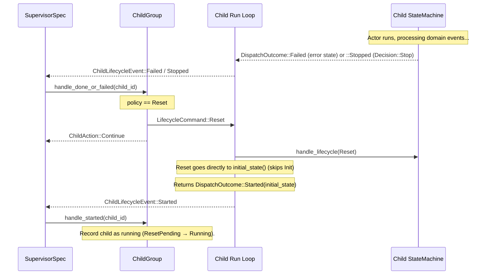
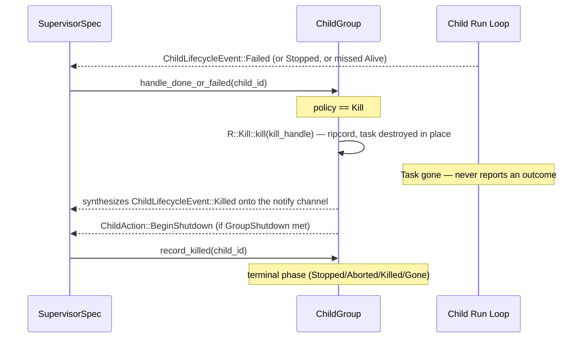

# Supervision

> **When would I use this?** Use this document when setting up supervision,
> understanding the four-level lifecycle model (`reset → stop → abort → kill`),
> KillCapability (the kill ripcord for unresponsive actors), or learning how child lifecycle
> events flow to supervisors. For lifecycle command handling details, see `02-hsm-engine.md`
> → "Four-Level Lifecycle" and "Lifecycle Command Handling at VirtualRoot".

The supervision model is inspired by Elixir/OTP. A **supervisor** is itself a state machine actor that monitors child actors and either restarts or permanently stops them in response to lifecycle triggers. Unlike OTP, the supervisor is a **generic library component** — users configure children and policies in the wiring layer without writing a custom blox.

Lifecycle control is handled entirely by the **runtime** — actors never see lifecycle commands and never hold a reference to their supervisor.

## Where the Pieces Live

Supervision is split across a core engine layer, a platform child-management layer, a spawn layer, and the supervisor topology itself:

| Type / Function | Crate |
|---|---|
| `LifecycleCommand`, `ChildLifecycleEvent`, `AbortCommand` | `bloxide-core::lifecycle` |
| `run`, `RunConfig` (the unified run loop) | `bloxide-core::runloop` |
| `report_outcome` (`DispatchOutcome` → `ChildLifecycleEvent`) | `bloxide-core::supervision` |
| `KillCapability`, `NoKill` | `bloxide-core::capability` |
| `ChildGroup`, `ChildPolicy`, `GroupShutdown`, `ChildAction`, `ChildPhase` | `bloxide-child-management` |
| Action fns (`start_children`, `stop_all_children`, `handle_done_or_failed`, `record_*`, `deregister_done`, `register_child`, `handle_register_dynamic_child`, `handle_health_check`) | `bloxide-child-management::actions` |
| `ChildCtrl`, `RegisterChild`, `RegisterDynamicChild` | `bloxide-child-management::control` |
| `ChildGroupBuilder<R, Ctrl>` (group channels via `GroupChannelCap`) | `bloxide-child-management::builder` |
| `SpawnCap`, `Kill`, `SpawnFn`, `SpawnOutput`, `ChildRegistrar`, `ChildCtrlRegistrar`, `spawn_child` | `bloxide-spawn` |
| Supervisor topology: `blox.toml`, generated code, `concrete_spec.rs` (test fixture), tests | `bloxide-supervisor` |

`bloxide-supervisor` owns **only** the supervisor state machine: its `blox.toml` topology, the generated `SupervisorSpec`/`SupervisorCtx`/`SupervisorEvent`/`SupervisorState`, an in-crate `concrete_spec.rs` used by its tests, and the tests themselves. All policy/shutdown logic lives in `bloxide-child-management` (a reusable platform primitive — any managing blox can use `ChildGroup`, not just the supervisor), and the spawn-registration bridge lives in `bloxide-spawn`.

## Core Principle: Actor Lifecycle Commands

Bloxide has a **four-level lifecycle model** (`reset → stop → abort → kill`), ordered from gentlest to most forceful. Two of the four levels are `LifecycleCommand` variants handled through the normal dispatch pipeline (`Reset`, `Stop`); the cooperative level (`Abort`) is delivered on a dedicated abort mailbox, and the final forceful level (`Kill`) is a runtime capability that bypasses dispatch entirely.

| Command / Capability | Target State | Through dispatch? | Callbacks | Can Restart? |
|---------|--------------|-------------------|-----------|--------------|
| `Reset` | User-defined initial operational state (`initial_state()`) | Yes | Full exit chain + entry chain for `initial_state()` (no `on_init_entry`) | Yes (already running) |
| `Stop` | Init | Yes | Full exit chain + `on_init_entry` | Yes (send `Start` to resume) |
| `Abort` (`AbortCommand`) | Task ends cooperatively | No (run loop breaks) | None | Yes (respawn the task) |
| `Kill` (`KillCapability::kill`) | Destroyed (task aborted in place) | No (runtime ripcord) | None | No (permanently dead) |

> For the full engine-level treatment of the four-level model (including how `Decision::Reset`/`Decision::Stop`/`Decision::Done` and the `DispatchOutcome` variants map to these levels), see `02-hsm-engine.md` → "Four-Level Lifecycle".

### Reset — Immediate Restart

`Reset` sends the actor through its exit chain (all `on_exit` callbacks fire), then enters the **user-defined initial operational state** (defined by `MachineSpec::initial_state()`). **Reset skips Init entirely** — no `on_init_entry` or `on_init_exit` fires. The `on_entry` callbacks for `initial_state()` are responsible for resetting domain state. The actor is immediately running again — no separate `Start` command is needed. The runtime reports `DispatchOutcome::Started(initial_state)`, which the supervisor sees as `ChildLifecycleEvent::Started`.

Use for: restart cycles where the actor should continue operating.

### Stop — Graceful Shutdown

`Stop` sends the actor through its exit chain (all `on_exit` callbacks fire), calls `on_init_entry` (for resource cleanup), and leaves the actor in **Init**. The task stays alive but suspended. Send `Start` to resume operation from `initial_state()`.

Use for:
- Graceful shutdown (callbacks run, clean exit)
- Pausing an actor with intent to resume later
- Dynamic actors you may want to restart

### Abort — Cooperative Self-Termination

`Abort` is sent as an `AbortCommand::Abort { child_id }` on a dedicated **abort mailbox** (separate from the lifecycle mailbox). The actor's run loop polls it alongside lifecycle and domain mailboxes; when an `AbortCommand` is received, the run loop breaks and the task ends cooperatively. No `dispatch()` is called, no exit callbacks fire, no `on_init_entry` fires.

The run loop synthesizes `DispatchOutcome::Aborted` itself (Abort bypasses the dispatch pipeline) and reports `ChildLifecycleEvent::Aborted` to the supervisor. The task is ended but was not externally destroyed — restarting requires respawning a new task. `ChildPolicy::Abort` sends `AbortCommand` on the child's `abort_ref`; the supervisor records the child as `Aborted` via `record_aborted()`.

Use for:
- Supervisor-initiated shutdown where you want the task to end but `Stop` does not fit (e.g. the actor is already in `Init`)
- Cases where you want the task gone through a cooperative, observable path (`Aborted` is reported; the task ends itself)

### Kill — Permanent Termination (Ripcord)

`KillCapability::kill(handle)` is the external ripcord. `ChildPolicy::Kill` calls `R::Kill::kill(handle)` — on dynamic runtimes the `Kill` impl (in `bloxide-spawn`) forwards to `SpawnCap::kill(handle)`, which destroys the task in place (for Tokio, `KillHandle = tokio::task::AbortHandle`). It works even on stuck/deadlocked actors that aren't polling any mailbox. No callbacks, no dispatch, no mailbox. The task is permanently dead; its ID will never be valid again.

Because the kill is synchronous and bypasses the child's run loop, the child never reports an outcome. Instead, **`ChildGroup` synthesizes `ChildLifecycleEvent::Killed { child_id }` directly onto the supervisor's notify channel** when it applies `ChildPolicy::Kill` (this is why `ChildGroup::handle_done_or_failed` takes the notify ref). The supervisor handles it like any other lifecycle event, recording the child via `record_killed` (phase → `Killed`). There is no `DispatchOutcome::Killed` — the `Killed` event never passes through the child's run loop.

**Kill has two purposes:**

1. **Unresponsive actors** — stuck in infinite loops, deadlocks, or blocking calls; cannot process `Stop`, `Reset`, or `Abort`. Kill forces termination when cooperation is not possible. (When the actor *can* still yield to its run loop, prefer `Abort`.)

2. **Cleanup** — freeing resources for an actor that has already been stopped or aborted, when you want the task handle gone immediately.

**For dynamic actors**, the cooperative shutdown ladder is:
```
Stop → actor goes to Init (suspended, callbacks ran)
  ├─ Start → actor resumes operation from initial_state()
  └─ Abort → task ends cooperatively (ChildLifecycleEvent::Aborted)
                └─ Kill → if Abort is not serviced in time, ripcord the task
```

**For static actors**, `Kill`/`Abort` policies are not available at all: `ChildGroup::try_add` rejects them with `RegistrationError::PolicyRequiresHandles`, because static children have no abort mailbox or kill handle. Static children use `Reset`/`Stop` policies only. (The one exception is the boot-time `ChildGroupBuilder::add_child`, which panics — see "One `ChildGroupBuilder` Across Runtimes".)

**Actors have zero knowledge of their supervisor.** No `supervisor_ref` in context, no lifecycle messages in event enums, no root rules for Reset/Stop/Ping.

## KillCapability: The Kill Ripcord

`KillCapability` is the **runtime capability** behind the `Kill` level of the four-level lifecycle model. It terminates an actor's task immediately, bypassing the normal dispatch lifecycle. It is used for unresponsive actors that cannot service `Stop`/`Reset`/`Abort`, or for cleanup when the task handle must be freed immediately.

In the four-level model, `KillCapability` is **only** invoked by `ChildPolicy::Kill`. The cooperative `Abort` path uses `AbortCommand` on the abort mailbox instead (see [Abort — Cooperative Self-Termination](#abort--cooperative-self-termination) above).

### KillCapability vs. Lifecycle Commands and Abort

| Command/Cap | Path | Callbacks | When Used |
|---|---|---|---|
| `Reset` | `handle_lifecycle(Reset)` → exit + entry chain for `initial_state()` | `on_exit` (all states), `on_entry` for `initial_state()` (no `on_init_entry`) | Restart cycle |
| `Stop` | `handle_lifecycle(Stop)` → exit chain → Init | `on_exit` (all states), `on_init_entry` | Clean shutdown, suspend |
| `Abort` (`AbortCommand`) | abort mailbox → run loop breaks (no dispatch) | **None** | Cooperative task termination |
| `KillCapability::kill` | Runtime task kill (bypasses dispatch and mailboxes) | **None** | Unresponsive actors, resource cleanup (ripcord) |

### KillCapability Trait Definition

```rust
// In bloxide-core/src/capability.rs
pub trait KillCapability<R: BloxRuntime> {
    type Handle: Clone + Send + 'static;
    /// Whether `kill` actually destroys the task. Registration refuses
    /// `ChildPolicy::Kill` when this is false — a no-op kill must never let
    /// the group mark a live child dead.
    const CAN_KILL: bool;
    fn kill(handle: Self::Handle);
}
```

Two implementations exist:
- `NoKill` (in `bloxide-core`) — for static runtimes (Embassy). `Handle = ()` (ZST), `kill` is a no-op, `CAN_KILL = false`.
- `Kill` (in `bloxide-spawn`) — for dynamic runtimes (Tokio). `Handle = R::KillHandle`, `kill` calls `R::kill(handle)` via `SpawnCap`, `CAN_KILL = true`.

TestRuntime uses `Kill` with `CAN_KILL = true`; its `SpawnCap::kill` does not destroy tasks (TestRuntime runs no tasks) but **records** the killed handle in a thread-local log (`drain_killed()` / `kill_count()`), so the kill path is fully exercisable in unit tests.

The supervisor stores the cloneable `kill_handle: Option<<R::Kill as KillCapability<R>>::Handle>` per child in `ChildEntry` (populated by `try_add_dynamic`, which rejects `ChildPolicy::Kill` outright when `!CAN_KILL`). When `ChildPolicy::Kill` fires, `ChildGroup::handle_done_or_failed` takes the handle out of the entry and calls `R::Kill::kill(handle)`. The handle is `R::KillHandle` (Clone), not `R::TaskHandle` (not Clone), so it can be cloned out of `&Event` in action functions and stored at registration time.

### Key Invariants for KillCapability

- KillCapability is the ripcord of last resort — for unresponsive actors or cleanup, not a replacement for the cooperative lifecycle levels (`Reset`/`Stop`/`Abort`).
- Actors never see KillCapability; only supervisors and the wiring layer hold handles.
- KillCapability is a runtime-facing capability (Tier 2), not a blox-facing trait.
- After `kill()`, no `on_exit` callbacks fire — the task is dropped in-place.
- Killed actors are permanently dead and cannot be restarted.
- `ChildPolicy::Kill` is the only policy that invokes `KillCapability::kill`. `ChildPolicy::Abort` uses the cooperative `AbortCommand` mailbox instead.
- Kill requires a dynamically spawned child: the kill handle comes from `SpawnCap::kill_handle(task_handle)` at spawn time and reaches the supervisor via `RegisterDynamicChild`.

## Generic Supervisor (`bloxide-supervisor`)

The `bloxide-supervisor` crate provides a ready-to-use supervisor as a `MachineSpec`, generated from `crates/bloxide-supervisor/blox.toml`. No custom blox is needed — the wiring layer constructs a `ChildGroup<R>`, configures per-child policies and a group-level shutdown trigger, and spawns the generic `SupervisorSpec<R>`.

### Key Types

| Type | Role | Crate |
|---|---|---|
| `SupervisorSpec<R>` | `MachineSpec` implementing the supervisor state machine | `bloxide-supervisor` (generated) |
| `SupervisorCtx<R>` | Context holding `ChildGroup<R>`, the notify ref, and the pending `ChildAction` | `bloxide-supervisor` (generated) |
| `SupervisorState` | `Running` / `ShuttingDown` | `bloxide-supervisor` (generated) |
| `SupervisorEvent<R>` | `Lifecycle` / `Child` / `Control` event enum | `bloxide-supervisor` (generated) |
| `ChildGroup<R>` | Registry of children with per-child policies and lifecycle refs | `bloxide-child-management` |
| `ChildPolicy` | Per-child lifecycle policy (what to do when a child stops or fails) | `bloxide-child-management` |
| `GroupShutdown` | Group-level trigger for entering `ShuttingDown` | `bloxide-child-management` |
| `ChildAction` | Internal signal: `Continue` or `BeginShutdown` | `bloxide-child-management` |

## Per-Child Policy (`ChildPolicy`)

Each child is registered with its own `ChildPolicy` that determines what happens when it reports `Stopped` or `Failed` (or misses two consecutive health checks):

```rust
// In bloxide-child-management
pub enum ChildPolicy {
    Reset { max: u32 },  // Send Reset, capped at `max` consecutive restarts
    Stop,                // No command sent — mark the child done for this epoch
    Abort,               // Send AbortCommand (cooperative task termination)
    Kill,                // Call KillCapability::kill (ripcord, permanently dead)
}
```

**`Reset { max }`**: The supervisor sends `Reset` to the child. The child goes directly to `initial_state()` and reports `Started` — the supervisor records the restart via `handle_started`. No separate `Start` is needed. The group returns `ChildAction::Continue` and the child enters `ResetPending` phase until the `Started` event (or an `Alive`) arrives. The restart is **capped**: the entry counts consecutive delivered Resets and gives up at `max` — the child is then marked `Stopped` (terminal, task alive) and group shutdown is evaluated. The counter resets only when the child proves sustained uptime by answering a health `Ping` with `Alive` after a `Started`; `Started` alone does not reset it (otherwise a crash loop would reset its own cap). With no health driver wired, `Alive` never arrives and `max` degrades to a **lifetime** restart cap — the fail-safe direction.

**`Stop`**: **No command is sent to the child.** The child is already stopping (suspended in Init) or failed (parked — see below); the group simply marks it `Stopped` — task alive, terminal for this epoch — and evaluates the group shutdown trigger.

**`Abort`**: The supervisor sends `AbortCommand::Abort` on the child's abort mailbox. Delivery is confirmed: on success the child enters `Aborting` (non-terminal) until its run loop reports `Aborted`, which finalizes the phase; on `Full` the command is queued in `pending_cmd` and retried by `flush_pending`; on `Closed` the child is marked `Gone` (its task is provably dead). The old fire-and-forget behavior (marking `Aborted` on an undelivered send) is gone — it could leak a live child.

**`Kill`**: The supervisor calls `R::Kill::kill(kill_handle)` — the synchronous ripcord. The task is permanently destroyed. `ChildGroup` then **synthesizes `ChildLifecycleEvent::Killed` onto the notify channel** so the supervisor (and any observers) learn the child was killed; the supervisor records it via `record_killed`.

> `Abort` and `Kill` require a dynamically spawned child (registered via `ChildGroup::try_add_dynamic` with an abort mailbox and kill handle). Registration is **fallible everywhere** — `try_add`/`try_add_dynamic` return `RegistrationError` (`PolicyRequiresHandles`, `KillUnavailable`, `Duplicate`) and the supervisor's action functions warn-and-drop bad registrations instead of panicking, so a malformed `ChildCtrl` message cannot reset an MCU. `ChildPolicy::Kill` on a `!CAN_KILL` runtime (Embassy) is refused at registration: a no-op kill must never let the group mark a live child dead.

## Failed Is Not Terminal for Supervised Children

This is the foundation of the policy layer: **a supervised child's task stays alive after `Failed`.** Supervised run configs (`RunConfig::supervised`, `RunConfig::supervised_with_abort`) set `exit_on_fail = false`, so when the run loop observes `DispatchOutcome::Failed` it reports `ChildLifecycleEvent::Failed` and keeps running. The actor parks — in its absorbing error state if it has one (error states are absorbing: domain events produce `HandledNoTransition`), or in Init if the failure came via `Decision::Fail` with no `error_state()` declared — and waits.

The supervisor's `ChildPolicy` then decides the child's fate:

- `Reset` **revives the child in place** — `LifecycleCommand::Reset` sends it directly to `initial_state()` (full exit chain + entry chain, skipping Init), immediately operational, reporting `Started`. No respawn, no new channels, no wiring changes.
- `Stop` leaves it parked/suspended and counts it done for this epoch.
- `Abort` ends the parked task cooperatively.
- `Kill` destroys the parked task externally.

Root and unsupervised actors run with `exit_on_fail = true` — for them `Failed` still ends the task.

`Failed` is also the **unreachable-child report**: when a supervised run loop's domain streams ALL close (all-streams-close, issue #134) the actor can no longer be reached by any domain sender — yet the supervisor, holding only the lifecycle channel, is still alive. An *operational* actor reports `Failed` before exiting (one suspended in Init stays silent — a properly stopped actor losing its senders is the expected teardown cascade); the child policy applies, and its command send fails `Closed` (the task is already gone), which the supervisor records as `Gone`. Lifecycle- and abort-stream closures are *not* reported: their senders live only in the supervisor's own group, so closure is always supervisor-initiated (deregistration or app teardown) — an expected exit.

## Group Shutdown Trigger (`GroupShutdown`)

`GroupShutdown` determines when the supervisor transitions from `Running` to `ShuttingDown`:

```rust
// In bloxide-child-management
pub enum GroupShutdown {
    WhenAnyDone,   // Shut down as soon as any child is terminal
    WhenAllDone,   // Shut down only after all children are terminal
}
```

A child becomes terminal when:
- Its policy is `ChildPolicy::Stop` and it reports `Stopped` or `Failed` (no command sent; marked `Stopped` immediately — task alive), OR
- Its policy is `ChildPolicy::Abort` and it reports `Stopped` or `Failed` and the `AbortCommand` is confirmed delivered — the later `Aborted` report moves it `Aborting` → `Aborted` (terminal), OR
- Its policy is `ChildPolicy::Kill` and it reports `Stopped` or `Failed` (the supervisor invokes the ripcord, synthesizes `Killed`, and marks it `Killed` immediately), OR
- Its consecutive-restart cap is exhausted (`Reset { max }` — marked `Stopped`, task alive), OR
- Any channel observation proves the task is gone: a `Closed` send error on its lifecycle/abort channel (marked `Gone`), OR
- It reports `Aborted` or `Killed` from outside the policy path (externally-originated — these **do** count toward group shutdown), OR
- It reports `Done` (clean self-termination via `Decision::Done`) and is deregistered — `deregister` re-evaluates the group shutdown condition so shutdown still progresses when the last registered child completes. A `Done` from an **unknown** child is ignored and never triggers shutdown.

> **Note**: `ChildPolicy::Reset { .. }` does not make a child terminal — it sends `Reset`, which goes directly to `initial_state()` and keeps the child operational.

`check_shutdown` implements the trigger: `WhenAnyDone` returns `BeginShutdown` as soon as any single child reaches a terminal phase; `WhenAllDone` returns `BeginShutdown` only when every child is terminal (`is_terminal()` — `Stopped`/`Aborted`/`Killed`/`Gone`). An empty group is vacuously true, which preserves Done-deregistration shutdown. Shutdown is only ever evaluated on an actual state change — never for unknown-child events.

## Child Lifecycle Triggers

The supervisor handles all seven `ChildLifecycleEvent` variants, plus the synthetic "rogue" trigger from health checks:

| Trigger | `ChildLifecycleEvent` | Meaning | Supervisor action |
|---|---|---|---|
| **Started** | `Started { child_id }` | Child exited Init or was Reset — now operational | `record_started` (clears `ResetPending`, does not reset the restart counter) |
| **Stopped** | `Stopped { child_id }` | Child returned to Init via `Decision::Stop` or `LifecycleCommand::Stop` (suspended) | `handle_done_or_failed` (Running) / `record_stopped` (ShuttingDown) |
| **Done** | `Done { child_id }` | Child self-terminated cleanly via `Decision::Done` — task ended | `deregister_done` (no restart policy; unknown child ignored) |
| **Failed** | `Failed { child_id }` | Child entered an error state (`is_error()` returned `true`), returned `Decision::Fail`, **or its run loop exited without a lifecycle decision** (stream-closed / all-streams-close) | `handle_done_or_failed` (Running) / `record_failed` (ShuttingDown) |
| **Aborted** | `Aborted { child_id }` | Child's task self-terminated via `AbortCommand` | `record_aborted` — participates in group shutdown |
| **Killed** | `Killed { child_id }` | Child was killed via the ripcord (synthesized by `ChildGroup`, not the child's run loop) | `record_killed` — participates in group shutdown |
| **Alive** | `Alive { child_id }` | Child responded to `Ping` from an operational, non-error state | `record_alive` (clears misses, heals lost `Started`, resets restart counter) |
| **Rogue** | *(two missed health ticks)* | Child left `MAX_MISSES` (2) consecutive delivered Pings unanswered | treated as `handle_done_or_failed` (child policy applies) |

## Reliability Contract: Confirm-Before-Record

The supervision control plane runs over bounded channels with `try_send`. The contract that keeps the group's bookkeeping truthful:

- **`Closed` is definitive.** A closed channel proves the child's task is gone — the entry moves to the terminal `Gone` phase immediately (no acknowledgment needed), a warning is logged (unless the entry was already terminal — an expected shutdown race), and group shutdown is evaluated.
- **`Full` is transient.** The entry keeps its current phase and the command is stashed in the per-child `pending_cmd` slot. `flush_pending` retries it on **every event pass** through the group (it is wired as the first action on nearly every supervisor transition), so a lost command is recovered as long as the supervisor keeps receiving events. No timer is required.
- **Phase transitions happen only on confirmed delivery or observed reports** — never on attempted sends. `ResetPending` is entered only when `Reset` is queued successfully (and the restart is counted then, not before); `Aborting` only when `AbortCommand` is delivered; a Ping only counts as a miss when it was actually delivered and left unanswered.

Booking rule of thumb: a child's phase never claims more than the evidence supports. The reporting direction is lossy by design (a full notify channel drops the report with a warning — supervision never blocks a run loop), so the supervisor heals lost reports through the health-check loop: `Alive` moves an `Init`/`ResetPending` child to `Running` (lost `Started`), and silence after `MAX_MISSES` delivered pings declares the child rogue (lost `Failed`, lost `Started`, or a genuinely stuck child — the policy decides).

Runtime note: Embassy's static channels never close, so `Gone` is a Tokio/TestRuntime observation; on Embassy a dead child is detected through health-check misses instead. Channel capacities are sized so `Full` is a bug, not routine backpressure — see [Supervision in `system.toml`](#supervision-in-system-toml) for `[supervision.capacities]`.

## `ChildGroup<R>` — Encapsulated Lifecycle/Shutdown Logic

`ChildGroup<R>` (in `bloxide-child-management`) encapsulates all policy evaluation and shutdown decisions. The supervisor's handler tables call methods on `ChildGroup` and inspect the returned `ChildAction` to decide state transitions.

```rust
pub struct ChildGroup<R: BloxRuntime> { /* opaque */ }

impl<R: BloxRuntime> ChildGroup<R> {
    pub fn new(shutdown: GroupShutdown) -> Self;
    /// Static child. Rejects Abort/Kill policies (no handles) and duplicates.
    pub fn try_add(
        &mut self,
        id: ActorId,
        lifecycle_ref: ActorRef<LifecycleCommand, R>,
        policy: ChildPolicy,
    ) -> Result<(), RegistrationError>;
    /// Dynamically spawned child with abort mailbox + kill handle.
    /// Additionally rejects `ChildPolicy::Kill` on `!CAN_KILL` runtimes.
    pub fn try_add_dynamic(
        &mut self,
        id: ActorId,
        lifecycle_ref: ActorRef<LifecycleCommand, R>,
        abort_ref: ActorRef<AbortCommand, R>,
        kill_handle: <R::Kill as KillCapability<R>>::Handle,
        policy: ChildPolicy,
    ) -> Result<(), RegistrationError>;

    pub fn start_child(&mut self, child_id: ActorId, from: ActorId);
    /// Sends Start to every non-terminal child (terminal children are skipped —
    /// their epoch is accounted as over).
    pub fn start_all(&mut self, from: ActorId);
    /// Sends Stop to every child whose task is still alive
    /// (skips task-gone — `Aborted`/`Killed`/`Gone` — children; their mailboxes are dead).
    pub fn stop_all(&mut self, from: ActorId);
    /// Retry every queued `pending_cmd`; called on every event pass.
    pub fn flush_pending(&mut self, from: ActorId) -> ChildAction;

    pub fn handle_done_or_failed(
        &mut self,
        child_id: ActorId,
        from: ActorId,
        notify: &ActorRef<ChildLifecycleEvent, R>,
    ) -> ChildAction;
    pub fn handle_started(&mut self, child_id: ActorId, from: ActorId);
    pub fn handle_alive(&mut self, child_id: ActorId);
    pub fn health_check_tick(
        &mut self,
        from: ActorId,
        notify: &ActorRef<ChildLifecycleEvent, R>,
    ) -> ChildAction;

    pub fn record_stopped(&mut self, child_id: ActorId, from: ActorId);
    /// ShuttingDown accounting for a Failed report (parked-error, task alive → Stopped).
    pub fn record_failed(&mut self, child_id: ActorId, from: ActorId);
    /// Task-gone terminals; both return the group shutdown decision.
    pub fn record_aborted(&mut self, child_id: ActorId, from: ActorId) -> ChildAction;
    pub fn record_killed(&mut self, child_id: ActorId, from: ActorId) -> ChildAction;
    /// Remove a cleanly completed child and re-evaluate group shutdown.
    /// Unknown children are ignored (warned) and never trigger shutdown.
    pub fn deregister(&mut self, child_id: ActorId, from: ActorId) -> ChildAction;
    pub fn all_stopped(&self) -> bool;
    /// Reset non-terminal phases for a new epoch; terminal entries keep their phase
    /// (and their restart counters — a supervisor reset must not bypass the cap).
    pub fn clear_counters(&mut self);
}
```

`handle_done_or_failed` evaluates the child's `ChildPolicy`, confirm-before-record:
- **`ChildPolicy::Kill`** → takes the stored `kill_handle` and calls `R::Kill::kill(handle)` (the synchronous ripcord; `CAN_KILL` was enforced at registration). Then **synthesizes `ChildLifecycleEvent::Killed { child_id }` onto `notify`**. Marks the child `Killed`. Evaluates `GroupShutdown`.
- **`ChildPolicy::Abort`** → sends `AbortCommand::Abort { child_id }`: delivered → `Aborting` (the `Aborted` report finalizes); `Full` → queued in `pending_cmd`; `Closed` → `Gone`.
- **`ChildPolicy::Reset { max }`** → if `restarts >= max`, gives up: marks `Stopped`, warns, evaluates `GroupShutdown`. Otherwise sends `Reset`: delivered → `ResetPending` and the restart is counted; `Full` → queued (counted when the flush delivers); `Closed` → `Gone`.
- **`ChildPolicy::Stop`** → sends **no command** — the child is already stopping or parked-failed. Marks the child `Stopped` (task alive, terminal for this epoch). Evaluates `GroupShutdown`.

Children in a terminal phase, in `ResetPending`/`Aborting`, or with a queued policy remedy (`pending_cmd` Reset/Abort) are coalesced — the policy is already in motion and a duplicate `Stopped`/`Failed` changes nothing.

`handle_started` records that a child has started. `Started` covers both initial `Start` (from `Init`) and `Reset` (which goes directly to `initial_state()`), so there is no separate `handle_reset`. A `Started` event transitions the child out of `ResetPending` into `Running` and clears health-miss state — but deliberately not the restart counter.

`handle_alive` treats `Alive` as operational evidence (the engine answers `Ping` only from a non-error operational state): it clears the miss state, resets the consecutive-restart counter (sustained-uptime proof), and heals lost `Started` reports by moving an `Init`/`ResetPending` child to `Running`. A late `Alive` for an unknown or terminal child is a normal race and is absorbed silently.

`health_check_tick` implements a deterministic health-check round:
1. **Verdict pass** — a monitored child with a Ping still outstanding from a previous tick has missed it; `MAX_MISSES` (2) consecutive misses declare it rogue and route it through `handle_done_or_failed`, so normal child policy applies. A Ping that could not be delivered is *not* a miss — the child was never asked.
2. **Ping pass** — each monitored child gets one `Ping`. Delivered → outstanding (answered by `Alive`). `Full` → not counted. `Closed` → `Gone`.

Monitored phases are `Init`, `Running`, and `ResetPending` (a lost `Started` must not wedge a resetting child — its `Alive` heals it, or its silence convicts it). `Aborting` children are expected to end and are awaited via the `Aborted` report (wait-forever by design); terminal phases are done for the epoch.

`record_stopped` / `record_failed` set `Stopped` (task-alive terminal) for shutdown accounting; `record_aborted` / `record_killed` set the task-gone terminals and return the shutdown decision. All four are idempotent via phase and never overwrite a terminal phase — a late report must not resurrect mailbox sends to a dead task — and warn-and-ignore unknown children.

## Supervisor State Machine

`SupervisorSpec<R>` has two states: `Running` (initial) and `ShuttingDown`.

```mermaid
stateDiagram-v2
    state "[engine-implicit Init]" as Init

    [*] --> Init
    Init --> Running : "dispatch(SupervisorEvent::Lifecycle(Start)) at boot"

    Running --> Running : "Stopped/Failed [policy == Reset] — child revived"
    Running --> ShuttingDown : "terminal event [trigger met, live children remain]"
    Running --> [*] : "group already fully terminal (incl. Done-of-last-child) — Decision::Stop"
    ShuttingDown --> [*] : "Decision::Stop (all children stopped) → Init; root run loop sees Stopped and returns"
```

When a child reports `Stopped` or `Failed`:
1. `handle_done_or_failed` evaluates the child's `ChildPolicy` and the group's `GroupShutdown`.
2. If the group is **already fully terminal** after the action ran — every child `Stopped`/`Aborted`/`Killed`/`Gone`, or empty after `Done`-deregistration — there is nothing left to stop: the guard short-circuits to `Decision::Stop` immediately. (This is what makes Done-of-last-child and all-task-gone cases complete; passing through an event-less `ShuttingDown` would wedge, since completion there is guard-driven by events that never come.)
3. Otherwise, if the result is `ChildAction::BeginShutdown`, the supervisor transitions to `ShuttingDown` to stop the remaining live children; if `Continue`, it stays in `Running`.

Entering `ShuttingDown` runs the entry action `stop_all_children`, which sends `Stop` to every child whose task is still alive (task-gone — `Aborted`/`Killed`/`Gone` — children are skipped; `Stopped` children still receive `Stop` because their task is alive and the engine acknowledges `Stop`-in-Init with a `Stopped` report). In `ShuttingDown`, the supervisor **records every terminal signal** — `Stopped` (`record_stopped`), late `Done` completions (`deregister_done`), `Failed` (`record_failed` — parked-error, task alive), `Aborted` (`record_aborted`), `Killed` (`record_killed`), and `Gone` (observed via a `Closed` channel while `flush_pending` retries pending `Stop`s on every event, including `HealthCheckTick`). When `all_children_stopped()` holds, the transition guard returns `Decision::Stop` and the supervisor self-stops. That produces `DispatchOutcome::Stopped`, and the root run loop (`RunConfig::root()`, `exit_on_stop = true`) sees `Stopped` and returns — the supervisor task exits cleanly.

Note the supervisor self-stops via **`Decision::Stop`**, not Reset: there is nothing to restart to. Both `Running` and `ShuttingDown` have `Done` transitions (`deregister_done`) so clean completions are handled in either state.

**Shutdown is wait-forever by design.** There is no timeout and no escalation ladder: every terminal signal is recorded, so the supervisor can only wedge on a child that is alive but permanently unresponsive to `Stop` — and on static runtimes (Embassy) such a child cannot be killed anyway, so a deadline would change nothing. A `Stop` lost to a full channel is not a wedge: it sits in `pending_cmd` and is retried by `flush_pending` on every event pass. A child that dies with a `Stop` pending is discovered via the `Closed` observation and marked `Gone`.

### `SupervisorCtx<R>`

Generated from `blox.toml` — four fields, three constructor args (`pending` is a state field):

```rust
pub struct SupervisorCtx<R: BloxRuntime> {
    pub self_id: ActorId,
    pub children: ChildGroup<R>,
    pub child_notify: ActorRef<ChildLifecycleEvent, R>,
    pub pending: ChildAction,
}

impl<R: BloxRuntime> SupervisorCtx<R> {
    pub fn new(
        self_id: ActorId,
        children: ChildGroup<R>,
        child_notify: ActorRef<ChildLifecycleEvent, R>,
    ) -> Self;
}
```

`child_notify` is the group's own notify channel ref — the action functions pass it to `ChildGroup::handle_done_or_failed` / `health_check_tick` so a synthesized `Killed` event (or a rogue-child policy outcome) lands back on the supervisor's notify mailbox.

### Handler Tables

> The transition rules below are declared as `[[topology.transitions]]` entries in `blox.toml` and emitted as raw `StateRule { ... }` struct literals by `bloxide-codegen`. The rule structure (event match, actions, guard, targets) is shown in TOML form, mirroring `crates/bloxide-supervisor/blox.toml`.

```toml
# RUNNING state — flush_pending is the first action on nearly every rule:
# commands lost to a full channel are retried on every event pass.
[[topology.transitions]]
state = "Running"
event = "SupervisorEvent::Child(Envelope(_, ChildLifecycleEvent::Stopped { .. }))"
target = "stay"
actions = ["Self::flush_pending", "Self::handle_done_or_failed"]
guards = [{ condition = "ctx.pending == ChildAction::BeginShutdown", target = "ShuttingDown" }]

[[topology.transitions]]
state = "Running"
event = "SupervisorEvent::Child(Envelope(_, ChildLifecycleEvent::Failed { .. }))"
target = "stay"
actions = ["Self::flush_pending", "Self::handle_done_or_failed"]
guards = [{ condition = "ctx.pending == ChildAction::BeginShutdown", target = "ShuttingDown" }]

[[topology.transitions]]
state = "Running"
event = "SupervisorEvent::Child(Envelope(_, ChildLifecycleEvent::Started { .. }))"
target = "stay"
actions = ["Self::flush_pending", "Self::record_started"]

[[topology.transitions]]
state = "Running"
event = "SupervisorEvent::Child(Envelope(_, ChildLifecycleEvent::Aborted { .. }))"
target = "stay"
actions = ["Self::flush_pending", "Self::record_aborted"]
guards = [{ condition = "ctx.pending == ChildAction::BeginShutdown", target = "ShuttingDown" }]

[[topology.transitions]]
state = "Running"
event = "SupervisorEvent::Child(Envelope(_, ChildLifecycleEvent::Killed { .. }))"
target = "stay"
actions = ["Self::flush_pending", "Self::record_killed"]
guards = [{ condition = "ctx.pending == ChildAction::BeginShutdown", target = "ShuttingDown" }]

[[topology.transitions]]
state = "Running"
event = "SupervisorEvent::Child(Envelope(_, ChildLifecycleEvent::Alive { .. }))"
target = "stay"
actions = ["Self::flush_pending", "Self::record_alive"]

[[topology.transitions]]
state = "Running"
event = "SupervisorEvent::Child(Envelope(_, ChildLifecycleEvent::Done { .. }))"
target = "stay"
actions = ["Self::flush_pending", "Self::deregister_done"]
guards = [{ condition = "ctx.pending == ChildAction::BeginShutdown", target = "ShuttingDown" }]

[[topology.transitions]]
state = "Running"
event = "SupervisorEvent::Control(Envelope(_, ChildCtrl::RegisterChild(_)))"
target = "stay"
actions = ["Self::flush_pending", "Self::register_child"]

[[topology.transitions]]
state = "Running"
event = "SupervisorEvent::Control(Envelope(_, ChildCtrl::RegisterDynamicChild(_)))"
target = "stay"
actions = ["Self::flush_pending", "Self::handle_register_dynamic_child"]

[[topology.transitions]]
state = "Running"
event = "SupervisorEvent::Control(Envelope(_, ChildCtrl::HealthCheckTick))"
target = "stay"
actions = ["Self::flush_pending", "Self::handle_health_check"]
guards = [{ condition = "ctx.pending == ChildAction::BeginShutdown", target = "ShuttingDown" }]

# Catch-alls: absorb any other Child / Control events
[[topology.transitions]]
state = "Running"
event = "SupervisorEvent::Child(_)"
target = "stay"

[[topology.transitions]]
state = "Running"
event = "SupervisorEvent::Control(_)"
target = "stay"

# SHUTTING_DOWN state — record ALL terminal evidence; wait-forever.
[[topology.transitions]]
state = "ShuttingDown"
event = "SupervisorEvent::Child(Envelope(_, ChildLifecycleEvent::Stopped { .. }))"
target = "stay"
actions = ["Self::flush_pending", "Self::record_stopped"]
guards = [{ condition = "ctx.all_children_stopped()", target = "stop" }]

[[topology.transitions]]
state = "ShuttingDown"
event = "SupervisorEvent::Child(Envelope(_, ChildLifecycleEvent::Done { .. }))"
target = "stay"
actions = ["Self::flush_pending", "Self::deregister_done"]
guards = [{ condition = "ctx.all_children_stopped()", target = "stop" }]

[[topology.transitions]]
state = "ShuttingDown"
event = "SupervisorEvent::Child(Envelope(_, ChildLifecycleEvent::Failed { .. }))"
target = "stay"
actions = ["Self::flush_pending", "Self::record_failed"]
guards = [{ condition = "ctx.all_children_stopped()", target = "stop" }]

[[topology.transitions]]
state = "ShuttingDown"
event = "SupervisorEvent::Child(Envelope(_, ChildLifecycleEvent::Aborted { .. }))"
target = "stay"
actions = ["Self::flush_pending", "Self::record_aborted"]
guards = [{ condition = "ctx.all_children_stopped()", target = "stop" }]

[[topology.transitions]]
state = "ShuttingDown"
event = "SupervisorEvent::Child(Envelope(_, ChildLifecycleEvent::Killed { .. }))"
target = "stay"
actions = ["Self::flush_pending", "Self::record_killed"]
guards = [{ condition = "ctx.all_children_stopped()", target = "stop" }]

# HealthCheckTick in ShuttingDown: flush pending commands only (no health
# checks) — the flush can complete the shutdown (pending Stop delivered, or
# a Closed channel marks the child Gone).
[[topology.transitions]]
state = "ShuttingDown"
event = "SupervisorEvent::Control(Envelope(_, ChildCtrl::HealthCheckTick))"
target = "stay"
actions = ["Self::flush_pending"]
guards = [{ condition = "ctx.all_children_stopped()", target = "stop" }]

[[topology.transitions]]
state = "ShuttingDown"
event = "SupervisorEvent::Child(_)"
target = "stay"

[[topology.transitions]]
state = "ShuttingDown"
event = "SupervisorEvent::Control(_)"
target = "stay"

# Entry actions
[[topology.entry]]
state = "Running"
actions = ["Self::start_children"]

[[topology.entry]]
state = "ShuttingDown"
actions = ["Self::stop_all_children"]
```

A transition guard with `target = "stop"` is the declarative form of `Decision::Stop` — the supervisor self-stops when all children have stopped.

### Action Functions

All supervisor actions are free functions in `bloxide-child-management::actions`, returning `ActionResult` and taking concrete params (extracted context fields) plus an extracted event payload — never the consumer's event enum (spec 20: Platform Feature Pattern). The generated wrapper closures extract the fields from `SupervisorCtx` and call them:

| Function | Signature (params in order) | Purpose |
|---|---|---|
| `start_children` | `(self_id, &mut ChildGroup, &mut ChildAction)` | Running on_entry: clear counters, reset pending, `start_all` |
| `stop_all_children` | `(self_id, &mut ChildGroup)` | ShuttingDown on_entry: `stop_all` (skips task-gone children; undelivered Stops are queued in `pending_cmd`) |
| `flush_pending` | `(self_id, &mut ChildGroup, &mut ChildAction)` | Retry every queued command (confirm-before-record); a `Closed` observation marks the child `Gone`; store shutdown decision in `pending` |
| `handle_done_or_failed` | `(self_id, &mut ChildGroup, &ActorRef<ChildLifecycleEvent, R>, &mut ChildAction, &ChildLifecycleEvent)` | Apply child policy on `Stopped`/`Failed`; store resulting `ChildAction` in `pending` |
| `record_started` | `(self_id, &mut ChildGroup, &ChildLifecycleEvent)` | Child operational (clears `ResetPending`, not the restart counter) |
| `record_stopped` | `(self_id, &mut ChildGroup, &ChildLifecycleEvent)` | Count stops in ShuttingDown |
| `record_failed` | `(self_id, &mut ChildGroup, &ChildLifecycleEvent)` | Count a `Failed` in ShuttingDown (parked-error, task alive → `Stopped`) |
| `record_aborted` | `(self_id, &mut ChildGroup, &mut ChildAction, &ChildLifecycleEvent)` | Mark task gone (cooperative end); store shutdown decision in `pending` |
| `record_killed` | `(self_id, &mut ChildGroup, &mut ChildAction, &ChildLifecycleEvent)` | Mark task gone (ripcord); store shutdown decision in `pending` |
| `record_alive` | `(&mut ChildGroup, &ChildLifecycleEvent)` | Clear miss state, heal lost `Started`, reset restart counter |
| `deregister_done` | `(self_id, &mut ChildGroup, &mut ChildAction, &ChildLifecycleEvent)` | Remove cleanly completed child; record shutdown decision in `pending` (unknown child ignored) |
| `register_child` | `(self_id, &mut ChildGroup, &ChildCtrl)` | `ChildGroup::try_add` (warn-and-drop on `RegistrationError`) + `start_child` |
| `handle_register_dynamic_child` | `(self_id, &mut ChildGroup, &ChildCtrl)` | `ChildGroup::try_add_dynamic` (warn-and-drop) + `start_child` |
| `handle_health_check` | `(self_id, &mut ChildGroup, &ActorRef<ChildLifecycleEvent, R>, &mut ChildAction, &ChildCtrl)` | Run one health-check round; store resulting `ChildAction` in `pending` |

### `MachineSpec` Implementation

```rust
impl<R: BloxRuntime> MachineSpec for SupervisorSpec<R> {
    type State = SupervisorState;
    type Event = SupervisorEvent<R>;
    type Ctx = SupervisorCtx<R>;
    type Mailboxes<Rt: BloxRuntime> = (
        Rt::Stream<ChildLifecycleEvent>,
        Rt::Stream<ChildCtrl<R>>,
    );

    fn initial_state() -> SupervisorState { SupervisorState::Running }

    // on_init_entry fires only when the supervisor itself is Stopped (enters
    // Init). In the four-level model, Decision::Reset goes directly to
    // initial_state() (Running) — it does NOT fire on_init_entry. Counter
    // clearing for a normal restart cycle is therefore done by the Running
    // on_entry action `start_children`, not here.
    fn on_init_entry(ctx: &mut SupervisorCtx<R>) {
        ctx.children.clear_counters();
        ctx.pending = ChildAction::default();
    }
}
```

The **Running on_entry** action is `start_children` (in `bloxide-child-management::actions`). It calls `ctx.children.clear_counters()`, resets `ctx.pending` to `ChildAction::default()`, and then calls `start_all` to send `Start` to every child. `clear_counters` resets non-terminal entries to `Init` for the new epoch but skips terminal entries — as a design note, resetting a killed/aborted child to `Init` would make it health-monitored again, sending a `Ping` to a dead mailbox and firing a spurious second `Kill` when the `Ping` goes unanswered. Because `Decision::Reset` goes directly to `initial_state()` (Running), this on_entry fires both on the initial `Start` from wiring and on any `Decision::Reset` — replacing the old `on_init_entry` counter-clearing for the restart cycle.

## Lifecycle Flow

### Reset path (ChildPolicy::Reset)


```mermaid
sequenceDiagram
    participant Sup as SupervisorSpec
    participant CG as ChildGroup
    participant RT as Child Run Loop
    participant M as Child StateMachine

    Note over M: Actor runs, processing domain events...

    M-->>RT: DispatchOutcome::Failed (error state) or ::Stopped (Decision::Stop)
    RT-->>Sup: ChildLifecycleEvent::Failed / Stopped
    Sup->>CG: handle_done_or_failed(child_id)
    Note over CG: policy == Reset
    CG->>RT: LifecycleCommand::Reset
    CG-->>Sup: ChildAction::Continue
    RT->>M: handle_lifecycle(Reset)
    Note over RT: Reset goes directly to initial_state() (skips Init)
    Note over RT: Returns DispatchOutcome::Started(initial_state)
    RT-->>Sup: ChildLifecycleEvent::Started
    Sup->>CG: handle_started(child_id)
    Note over CG: Record child as running (ResetPending → Running).
```

### Kill path (ChildPolicy::Kill)


```mermaid
sequenceDiagram
    participant Sup as SupervisorSpec
    participant CG as ChildGroup
    participant RT as Child Run Loop

    RT-->>Sup: ChildLifecycleEvent::Failed (or Stopped, or missed Alive)
    Sup->>CG: handle_done_or_failed(child_id)
    Note over CG: policy == Kill
    CG->>CG: R::Kill::kill(kill_handle) — ripcord, task destroyed in place
    Note over RT: Task gone — never reports an outcome
    CG-->>Sup: synthesizes ChildLifecycleEvent::Killed onto the notify channel
    CG-->>Sup: ChildAction::BeginShutdown (if GroupShutdown met)
    Sup->>CG: record_killed(child_id)
    Note over CG: terminal phase (Stopped/Aborted/Killed/Gone)
```

### Shutdown path (GroupShutdown trigger met)

```mermaid
sequenceDiagram
    participant Sup as SupervisorSpec
    participant CG as ChildGroup
    participant RT as Child Run Loop
    participant M as Child StateMachine

    Note over M: Actor runs, processing domain events...

    M-->>RT: DispatchOutcome::Failed / Stopped / Done
    RT-->>Sup: ChildLifecycleEvent::Failed / Stopped / Done
    Sup->>CG: handle_done_or_failed(child_id) / deregister(child_id)
    Note over CG: child terminal, GroupShutdown condition met
    CG-->>Sup: ChildAction::BeginShutdown
    Note over Sup: Running → ShuttingDown; on_entry: stop_all_children
    Sup->>CG: stop_all(from)
    CG->>RT: LifecycleCommand::Stop (to each live child; task-gone (Aborted/Killed/Gone) skipped)
    RT->>M: handle_lifecycle(Stop)
    Note over RT: Child suspends to Init; task stays alive
    RT-->>Sup: ChildLifecycleEvent::Stopped
    Sup->>CG: record_stopped(child_id)
    Note over Sup: all_children_stopped() → Decision::Stop
    Note over Sup: Supervisor self-stops; root run loop sees Stopped and exits
```

## Health Checks (implemented)

Health checks are delivered through the supervisor control-plane stream:

1. A health driver (for example, a runtime timer task) sends `ChildCtrl::HealthCheckTick`.
2. The supervisor calls `health_check_tick(from, notify)` on `ChildGroup` via the `handle_health_check` action.
3. **Verdict pass**: a monitored child with a `Ping` still outstanding from a previous tick has missed it; `MAX_MISSES` (2) consecutive misses declare it rogue and apply the normal child policy (`handle_done_or_failed`). A `Ping` that could not be delivered (channel full) is never counted as a miss — a transient full channel cannot convict a healthy child.
4. **Ping pass**: each monitored child (`Init`, `Running`, `ResetPending`) gets one `LifecycleCommand::Ping`. A `Closed` channel marks the child `Gone`.
5. Children reply with `ChildLifecycleEvent::Alive { child_id }` **only from an operational, non-error state** — the engine is silent in Init and in parked error states, so a never-started child (lost registration-time `Start`) or a failed child whose report was lost go rogue and are healed by their policy (`Reset` works from Init). `Alive` clears the miss state, resets the consecutive-restart counter, and heals a lost `Started` report (`Init`/`ResetPending` → `Running`).

This is intentionally externalized: `bloxide-child-management` defines the protocol, while wiring/runtime code chooses how ticks are produced. Without a health driver, no `Alive` ever arrives and the `Reset { max }` restart cap degrades to a lifetime cap (fail-safe).

**Known limitation**: In Embassy's cooperative scheduler, a truly stuck actor (infinite loop, blocking call) will never yield to process the `Ping` command. Health checks can only detect actors whose run loop has stalled while awaiting — not actors that never await.

## `ChildLifecycleEvent`

Defined in `bloxide-core::lifecycle`. The runtime generates these automatically by observing `DispatchOutcome` (via `report_outcome` in `bloxide-core::supervision`) — no actor code sends them. The single exception is `Killed`, which `ChildGroup` synthesizes directly onto the notify channel because a killed task never runs again to report anything.

```rust
pub enum ChildLifecycleEvent {
    Started { child_id: ActorId },  // child exited Init or was Reset (now operational)
    Failed  { child_id: ActorId },  // child entered an error state / Decision::Fail, OR its run loop exited without a lifecycle decision (stream-closed)
    Stopped { child_id: ActorId },  // child was Stopped (Decision::Stop or LifecycleCommand::Stop), now in Init (suspended)
    Done    { child_id: ActorId },  // child self-terminated cleanly via Decision::Done (task ended — deregister, no restart)
    Aborted { child_id: ActorId },  // child was Aborted, task has ended (cooperative)
    Killed  { child_id: ActorId },  // child was killed via KillCapability (external destruction; synthesized by ChildGroup)
    Alive   { child_id: ActorId },  // child responded to Ping from an operational, non-error state (healthy)
}
```

> **Note**: `Done` is clean self-termination — not a return to terminal states
> (there is still no `is_terminal`). `Decision::Done` runs the same Init
> cleanup ritual as `Decision::Stop` (exit chain + `on_init_entry`), then the
> run loop ends the task (`DispatchOutcome::Done` always exits). The
> supervisor deregisters the child via `deregister_done`; no `ChildPolicy`
> restart fires. Use `Decision::Stop` for suspend/resume, `Decision::Done`
> for normal completion.

## `LifecycleCommand`

Defined in `bloxide-core::lifecycle`. Sent by the supervisor (via `ChildGroup`) to each child's runtime-internal lifecycle channel.

```rust
pub enum LifecycleCommand {
    Start,
    Reset,
    Stop,
    Ping,
}
```

| Command | Runtime behavior |
|---|---|
| `Start` | Init → `initial_state()` (already operational → acknowledged with `Started`, no callbacks — mirrors `Stop`-in-Init) |
| `Reset` | Full exit chain → `initial_state()` directly (skips Init, reports `Started`; from Init this is equivalent to `Start`) |
| `Stop` | Full exit chain → Init + `on_init_entry`, task stays alive suspended (already in Init → acknowledges with `Stopped` so shutdown counting works) |
| `Ping` | Child responds with `ChildLifecycleEvent::Alive` — but only from an operational, non-error state; silent in Init and in parked error states |

`Started` outcomes carrying an error state are normalized to `Failed` at the source (`Started(error)` is never emitted), so run-loop exit logic and `report_outcome` behave uniformly on every path — including a degenerate spec whose `initial_state()` is its error state.

## Supervised Actor Run Loop

All runtimes share the unified actor run loop — `run()` in `bloxide-core`
(`crates/bloxide-core/src/runloop.rs`), re-exported by each runtime. A
supervised child runs with `RunConfig::supervised(lifecycle_rx, notify)` or, when
the runtime supports kill, `RunConfig::supervised_with_abort(lifecycle_rx,
abort_rx, notify)`, which adds an abort mailbox for cooperative self-termination.
This is wiring-layer code — never used as a bound on blox crates.

`RunConfig` fields control the loop:

| Field | Supervised child | Root / unsupervised |
|---|---|---|
| `lifecycle` | `Some` (commands from supervisor) | `None` |
| `abort` | `Some` only with `supervised_with_abort` | `None` |
| `supervisor_notify` | `Some` | `None` |
| `auto_start` | `false` (waits for `Start`) | `false` for root (wired dispatch), `true` for unsupervised |
| `exit_on_stop` | **`false` — stays alive suspended in Init** | `true` |
| `exit_on_fail` | **`false` — parks in its error state, supervisor's policy decides** | `true` |

The run loop polls streams in priority order:
1. **Lifecycle stream** (`LifecycleCommand`: `Start`/`Reset`/`Stop`/`Ping`) — highest priority.
2. **Abort mailbox** (`AbortCommand::Abort`, only with `supervised_with_abort`) — serviced before domain messages so a stuck actor can be terminated promptly when it next yields. On receipt, the run loop reports `DispatchOutcome::Aborted` to the supervisor and self-terminates (no `dispatch()`, no callbacks).
3. **Domain mailboxes** — polled only when no lifecycle or abort command is pending.

After every dispatch, the run loop calls `report_outcome`, which translates the `DispatchOutcome` into the corresponding `ChildLifecycleEvent` and sends it to the supervisor automatically (a full/closed supervisor channel logs a warning and drops the event — supervision never blocks the run loop). The `Aborted` outcome is synthesized by the run loop itself (not by `dispatch()`), since `Abort` bypasses the dispatch pipeline.

The loop also exits when a stream closes. The all-domain-streams-close case (all-streams-close, issue #134) is **not silent** for an operational actor: it became unreachable while the supervisor is still alive, so the loop reports `Failed` before ending the task and the child policy applies (its command send fails `Closed` — the task is already gone — and the supervisor records `Gone`). An actor suspended in Init exits silently — that is the expected teardown cascade. Lifecycle- and abort-stream closures are expected and unreported: their senders live only in the supervisor's group, so closure means deregistration or app teardown.

`DispatchOutcome` has **no `Killed` variant** — a killed task never runs again, so there is nothing to observe. The loop always exits on `Aborted` and `Done`, regardless of config.

## `SupervisorEvent` and `ChildCtrl`

The generated event enum for the supervisor (`crates/bloxide-supervisor/src/generated/events.rs`) has three variants; `Child` and `Control` carry `Envelope` wrappers (sender id + payload), while `Lifecycle` carries the raw command:

```rust
pub enum SupervisorEvent<R: BloxRuntime> {
    /// Lifecycle command (Start/Reset/Stop/Ping) — handled at VirtualRoot.
    Lifecycle(LifecycleCommand),
    Child(Envelope<ChildLifecycleEvent>),
    Control(Envelope<ChildCtrl<R>>),
}
```

The `Lifecycle` variant is how the wiring layer boots the supervisor (`dispatch(SupervisorEvent::Lifecycle(LifecycleCommand::Start))`) — like every actor, the supervisor receives its own lifecycle commands through dispatch.

`ChildCtrl` (in `bloxide-child-management::control`) is the control-plane protocol:

```rust
pub enum ChildCtrl<R: BloxRuntime> {
    RegisterChild(RegisterChild<R>),                  // static child: id + lifecycle_ref + policy
    RegisterDynamicChild(RegisterDynamicChild<R>),    // dynamic child: + abort_ref + kill_handle
    HealthCheckTick,
}
```

`Child` variants arrive from the runtime's supervised run loop. `Control` variants come from supervisor wiring/control-plane senders and enable:
- static registration of supervised children (`RegisterChild`)
- dynamic registration of supervised children with abort/kill capability (`RegisterDynamicChild` — carries the `abort_ref` and `kill_handle` needed by `ChildPolicy::Abort` and `ChildPolicy::Kill`; sent by the `spawn_child` helper after a dynamic spawn)
- periodic health checks (`HealthCheckTick`)

## Dynamic Spawning and Registration

Dynamic children are created by the **requesting** blox (e.g. a pool), not by the supervisor. The `spawn_child` helper in `bloxide-spawn` ties the pieces together:

```rust
// In bloxide-spawn
pub type SpawnFn<R, Req> = fn(req: Req, notify: ActorRef<ChildLifecycleEvent, R>) -> SpawnOutput<R>;

pub struct SpawnOutput<R: BloxRuntime> {
    pub child_id: ActorId,
    pub lifecycle_ref: ActorRef<LifecycleCommand, R>,
    pub abort_ref: ActorRef<AbortCommand, R>,
    pub kill_handle: <R::Kill as KillCapability<R>>::Handle,
    pub policy: ChildPolicy,
}

pub fn spawn_child<R, Req, C>(
    spawn_fn: SpawnFn<R, Req>,
    req: Req,
    control_ref: &ActorRef<C::RegisterMsg, R>,
    notify_ref: &ActorRef<ChildLifecycleEvent, R>,
    from: ActorId,
) -> Result<(), R::TrySendError>;
```

`spawn_child` calls the application-provided spawn function (which allocates channels, builds the child, spawns the task with `RunConfig::supervised_with_abort`, and converts the `TaskHandle` into a cloneable `KillHandle` via `SpawnCap::kill_handle`), then wraps the returned `SpawnOutput` into the managing blox's registration message via a `ChildRegistrar` and sends it on the control mailbox. `ChildCtrlRegistrar` is the registrar for the standard control plane — it wraps `SpawnOutput` into `ChildCtrl::RegisterDynamicChild`. **If the registration send fails, `spawn_child` kills the freshly spawned task via its kill handle before returning the error** — a live task no supervisor knows about would be an unmanaged orphan. The supervisor's `handle_register_dynamic_child` action then calls `ChildGroup::try_add_dynamic` (warn-and-drop on `RegistrationError`) and starts the child.

See `13-factory-injection-and-supervision.md` for the full factory-injection walkthrough.

## Wiring a Supervised Group

The wiring layer uses `ChildGroupBuilder` and the runtime's `spawn_child!` macro — no custom blox is needed. This example mirrors the generated `apps/tokio-demo/src/main.rs`:

```rust
use bloxide_tokio::prelude::*;  // ChildGroupBuilder, GroupShutdown, ChildPolicy, ...

// Domain channels for children
let ((ping_ref,), ping_mbox) = ::bloxide_tokio::channels! { PingPongMsg(16) };
let ping_id = ping_ref.id();
let ((pong_ref,), pong_mbox) = ::bloxide_tokio::channels! { PingPongMsg(16) };
let pong_id = pong_ref.id();

// ChildGroupBuilder allocates the notify + control channels.
// Const-generic capacities are emitted by the codegen from
// [supervision.capacities] (defaults shown: notify 32, control 16, lifecycle 4).
// Grab the control/notify refs before finish() consumes the builder.
let mut group = ChildGroupBuilder::<_, _, 32, 16, 4>::new(GroupShutdown::WhenAnyDone);
let sup_control_ref = group.control_ref();
let sup_notify_ref = group.notify_ref();

// Build contexts and wrap them in state machines (timer_ref omitted for brevity)
let ping_ctx = PingCtx::new(ping_id, pong_ref.clone(), ping_ref.clone(), timer_ref.clone());
let pong_ctx = PongCtx::new(pong_id, ping_ref.clone());
let ping_machine = ::bloxide_core::StateMachine::new(ping_ctx);
let pong_machine = ::bloxide_core::StateMachine::new(pong_ctx);

// spawn_child! registers each child with the group and spawns its task
::bloxide_tokio::spawn_child!(
    group,
    ping_task(ping_machine, ping_mbox, ping_id),
    ChildPolicy::Stop
);
::bloxide_tokio::spawn_child!(
    group,
    pong_task(pong_machine, pong_mbox, pong_id),
    ChildPolicy::Stop
);

let sup_id = ::bloxide_tokio::next_actor_id!();
let (children, sup_notify_rx, sup_control_rx) = group.finish();

// The generic supervisor — 3-arg context constructor
let sup_ctx = ::bloxide_supervisor::SupervisorCtx::new(sup_id, children, sup_notify_ref);
let mut sup_machine = ::bloxide_core::StateMachine::<
    crate::generated::bloxide_supervisor_spec_skeleton::SupervisorSpec<TokioRuntime>,
>::new(sup_ctx);

// Boot: dispatch Start through the Lifecycle variant of the generated event enum
sup_machine.dispatch(
    SupervisorEvent::<TokioRuntime>::Lifecycle(LifecycleCommand::Start),
);

// The supervisor runs as the root task (RunConfig::root) — when it
// self-stops (Decision::Stop), the run loop returns and main() completes
supervisor_task(sup_machine, (sup_notify_rx, sup_control_rx)).await;
```

Important details:

- The spec type is the **system-generated concrete spec** (`crate::generated::bloxide_supervisor_spec_skeleton::SupervisorSpec`) — the system-level codegen emits it with real action closures wired to `bloxide-child-management::actions`. Apps never use the blox-crate-level stub spec.
- `SupervisorCtx::new` takes three args: `(sup_id, children, sup_notify_ref)`.
- Embassy wiring is identical in shape (`apps/embassy-demo/src/main.rs`): the same `ChildGroupBuilder::new(...)` call resolves to the shared `bloxide_child_management::ChildGroupBuilder` (re-exported by `bloxide-embassy`), which reaches Embassy channels via `GroupChannelCap`; `spawn_child!` additionally takes the Embassy `spawner`.

### One `ChildGroupBuilder` Across Runtimes

A single `ChildGroupBuilder<R: GroupChannelCap, Ctrl, const NOTIFY: usize, const CONTROL: usize, const LIFECYCLE: usize>` in `bloxide-child-management::builder` serves every runtime, with one API shape (`new` / `add_child` / `control_ref` / `notify_ref` / `notify_sender` / `finish`). The runtime supplies the group channels through the `GroupChannelCap` capability trait (`alloc_group_id()` + `group_channel::<M, N>(id)`): Tokio and TestRuntime forward to `DynamicChannelCap`, while Embassy forwards to `StaticChannelCap`. On Embassy, `alloc_group_id()` expands the compile-time counter once, so the notify and control channels share one baked ID — they are both mailboxes of the one logical group actor.

The channel capacities are const generics so static runtimes can bake them; the codegen always emits them explicitly (expression position does not apply const-parameter defaults). `add_child` is the one intentionally-panicking registration path: it is boot-time wiring, and generated code only ever emits valid policies, so a failure there is a hand-written wiring bug caught at startup — never a message-driven event.

Generated wiring is identical across runtimes because it is literally the same type — `bloxide-tokio` and `bloxide-embassy` both re-export it at the crate root and in their preludes. The builder is generic over the control message type `Ctrl` — the runtime never names `ChildCtrl`; the app chooses it.

### Supervision in `system.toml`

System-level wiring declares the supervisor and its children declaratively:

```toml
[[supervision]]
supervisor = "bloxide-supervisor"
strategy = "when_any_done"        # or "when_all_done"
children = ["ping", "pong"]

  [supervision.policies]
  ping = { stop = true }           # ChildPolicy::Stop
  pong = { restart = { max = 3 } } # ChildPolicy::Reset { max: 3 }

  [supervision.capacities]        # optional — control-plane channel sizes
  notify = 64                     # default: max(32, 2 × child count)
  control = 16                    # default: 16
  lifecycle = 4                   # default: 4 (per-child)
```

The only valid strategies are `when_any_done` and `when_all_done` (mapping to `GroupShutdown::WhenAnyDone` / `GroupShutdown::WhenAllDone`) — any other value is a hard codegen error. In `[supervision.policies]`, `restart = { max = N }` maps to `ChildPolicy::Reset { max: N }` (N consecutive restarts before the supervisor gives up; `max = 0` is a hard codegen error), `stop = true` maps to `ChildPolicy::Stop`, and a child with no entry defaults to `ChildPolicy::Stop`.

`[supervision.capacities]` sizes the supervision control-plane channels, emitted as the builder's const generics. The defaults are sized so a full channel is a bug, not routine backpressure (the confirm-before-record protocol still recovers gracefully — commands queue in `pending_cmd` and retry on every event). Any capacity of `0` is a hard codegen error.

## Supervision Tree

Supervisors can themselves be children of another supervisor:

```
Root Supervisor
├── Ping Actor (child, Reset)
├── Pong Actor (child, Stop)
└── Sub-Supervisor (child, Reset)
    └── ...
```

The root supervisor is bootstrapped with `sup_machine.dispatch(SupervisorEvent::Lifecycle(LifecycleCommand::Start))` in the wiring binary.

## Key Invariants

> **See `AGENTS.md` → "Key Invariants" for the canonical list.**

Supervision-specific invariants:

- Actors never see `LifecycleCommand` — it is runtime-internal.
- Actors have no `supervisor_ref` — they don't know their supervisor exists.
- `on_init_entry` is for domain-state reset only and fires only on `Stop` (entering Init). It does NOT fire on `Reset` (which skips Init and goes directly to `initial_state()`). It also fires when `Decision::Stop` or `Decision::Done` triggers (cleanup before the machine returns to Init / the task ends).
- **Four-level lifecycle**: `Reset` goes directly to `initial_state()` (task stays alive, immediately operational, reports `Started`); `Stop` goes to `Init` (task suspended, reports `Stopped`); `Abort` ends the task cooperatively via the abort mailbox (reports `Aborted`); `Kill` destroys the task in place via `KillCapability::kill` — and `ChildGroup` synthesizes `ChildLifecycleEvent::Killed` onto the notify channel so the supervisor records it via `record_killed`. Self-initiated clean exit: `Decision::Done` (exit chain + `on_init_entry`, then the task ends, reports `Done`; supervisor deregisters, no restart).
- **Supervised children survive `Stopped` and `Failed`**: their run configs set `exit_on_stop = false` / `exit_on_fail = false` — the task stays alive (suspended in Init, or parked in its absorbing error state) so the supervisor's `ChildPolicy` can revive it (`Reset`), leave it (`Stop`), or end it (`Abort`/`Kill`). Root/unsupervised actors exit on both.
- **`Decision::Stop` replaces terminal states**: When a decision returns `Stop`, the transition's actions run first, then the machine goes to `Init` and produces `DispatchOutcome::Stopped`. `on_init_entry` fires to clear state. Supervised actor run loops do NOT exit on `Stopped` — the actor stays alive in `Init`, waiting for `Start` or `Reset` from the supervisor.
- **`Decision::Done` is clean self-termination**: same cleanup ritual as `Stop` (exit chain + `on_init_entry`), but produces `DispatchOutcome::Done` and the run loop ALWAYS exits — the task ends. The supervisor deregisters the child via `deregister_done` (no `ChildPolicy` restart). Use `Stop` for suspend/resume, `Done` for normal completion.
- `Decision::Reset` goes directly to `initial_state()`, skipping Init entirely. It fires the full exit chain for the current state, then the entry chain for `initial_state()`. It does NOT call `on_init_entry` or `on_init_exit`.
- The supervisor self-stops via `Decision::Stop` when all children have stopped — never via Reset.
- Each child runs in its own task — precise per-actor wakeup is preserved.
- `ChildGroup<R>` encapsulates all policy evaluation and shutdown logic.
- **Confirm-before-record**: phase transitions happen only on confirmed delivery or observed reports, never on attempted sends. `Closed` = the child's task is provably gone (terminal `Gone` phase, shutdown evaluated); `Full` = transient (command queued in `pending_cmd`, retried by `flush_pending` on every event pass). Embassy channels never close — dead children are detected via health-check misses there.
- **Shutdown is record-all, wait-forever**: `ShuttingDown` records every terminal signal (`Stopped`, `Done`, `Failed`, `Aborted`, `Killed`, `Gone`); there is no timeout or escalation ladder — a permanently unresponsive child cannot be killed on static runtimes anyway. When the group is already fully terminal after an action (including empty after `Done`-deregistration), the guard short-circuits to `Decision::Stop` immediately — there is nothing left to stop, and passing through an event-less `ShuttingDown` would wedge. Registration is fallible everywhere (`try_add`/`try_add_dynamic` → `RegistrationError`); malformed control messages warn-and-drop, never panic.
- Per-child `ChildPolicy` (four variants: `Reset { max }`, `Stop`, `Abort`, `Kill`) gives each child its own lifecycle policy. `Reset { max }` caps **consecutive** restarts (counter resets only on an `Alive` after `Started`; without health ticks it degrades to a lifetime cap). `Abort`/`Kill` require dynamically spawned children with abort/kill handles; `Kill` additionally requires `KillCapability::CAN_KILL`.
- `GroupShutdown` controls when the supervisor enters shutdown, not which children are affected. Every terminal signal counts toward it — including externally-originated `Aborted`/`Killed` — and it is only evaluated on real state changes (unknown-child events never trigger it).
- `ChildPhase` tracks each child's state: `Init`, `Running`, `ResetPending` (Reset delivered, awaiting `Started`), `Aborting` (AbortCommand delivered, awaiting `Aborted`), `Stopped` (task alive — self-stopped, failed-parked, restart-capped, or Stop-policy; terminal for the epoch), `Aborted`/`Killed`/`Gone` (task gone — mailboxes are dead, so lifecycle commands must not be sent). `is_terminal()` (`Stopped`/`Aborted`/`Killed`/`Gone`) drives group-shutdown evaluation; `is_task_gone()` (`Aborted`/`Killed`/`Gone`) excludes children from `stop_all`. Health checks monitor `Init`/`Running`/`ResetPending` children.
- `Ping` is answered with `Alive` only from an operational, non-error state (silent in Init and parked error states) — a lost `Start` or lost `Failed` report goes rogue and is healed by the child policy. Redundant `Start` is acknowledged with `Started` (mirroring `Stop`-in-Init). `Started(error)` is normalized to `Failed` at the source. A run loop that exits without a lifecycle decision reports `Failed` (never exits silently).
- `LifecycleCommand`, `ChildLifecycleEvent`, and `AbortCommand` are defined in `bloxide-core::lifecycle`. `ChildPolicy`, `ChildAction`, `GroupShutdown`, `ChildGroup`, and the supervision action functions are defined in `bloxide-child-management`. `ChildCtrl`, `RegisterChild`, and `RegisterDynamicChild` are defined in `bloxide-child-management::control`; `SpawnCap`, `SpawnFn`, `SpawnOutput`, `ChildCtrlRegistrar`, and `spawn_child` are defined in `bloxide-spawn` (spec 20: Platform Feature Pattern). `spawn_child` kills the orphaned task when the registration send fails.
- No custom supervisor implementation is needed — `SupervisorSpec<R>` is a generic, reusable `MachineSpec`.

## Related Docs

- **Lifecycle engine details** → `spec/architecture/02-hsm-engine.md`
- **Wiring supervised actors** → `spec/architecture/04-static-wiring.md`
- **Supervisor as reusable blox** → `spec/architecture/12-action-crate-pattern.md` → "Supervisor As The Same Pattern"
- **Factory injection + dynamic spawning** → `spec/architecture/13-factory-injection-and-supervision.md`
- **Runtime supervision impl** → `runtimes/*/src/supervision.rs`
