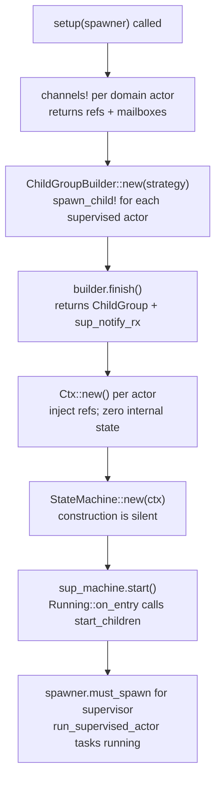

# Application Wiring

An application wires all bloxes together: it creates channels, builds contexts,
constructs state machines, and spawns actor tasks before the executor starts.
All of this happens in a synchronous `setup()` function — no `await`, no runtime
knowledge needed beyond the Embassy executor entry point.

## Lifecycle in the New Model

**Actors no longer handle lifecycle events as domain events.** The runtime manages
lifecycle through a separate internal channel and direct engine calls:

- `machine.start()` — called by the runtime when a child's supervisor sends Start
- `machine.reset()` — called by the runtime when Terminate is received

The runtime observes `DispatchOutcome` after every dispatch and automatically sends
`ChildLifecycleEvent` to the supervisor's domain mailbox. Supervisors receive these
events through their normal `Mailboxes` stream and react in their transition rules.

## Wiring Helpers (bloxide-embassy)

### `channels!` macro
Creates all typed **domain** channels for one actor. Returns `(refs_tuple, mailboxes_tuple)`.
Refs are injected into peer contexts; the mailboxes tuple is passed to the actor task.

### `actor_task!` / `actor_task_supervised!` macros
`actor_task!` declares an `#[embassy_executor::task]` for an unsupervised (root) actor.
`actor_task_supervised!` declares the supervised variant whose task signature includes
the lifecycle command receiver and supervisor notification sender, which are injected
by `spawn_child!`.

### `spawn_child!` macro
Creates the per-child lifecycle channel, registers the child in a `ChildGroupBuilder`,
and spawns the task with lifecycle plumbing injected automatically.

### `ChildGroupBuilder`
Builds a `ChildGroup` and the supervisor's notification channel. After all children
are registered, `finish()` returns the `ChildGroup` (to inject into `SupervisorCtx`)
and the notification stream (to pass as the supervisor's mailbox). The supervisor's
own `ActorId` is allocated separately via `next_actor_id!()`.

### `Ctx::new()` constructors
Each blox crate provides a `Ctx::new()` that accepts only external wiring deps and
defaults internal state. The wiring site never initializes counters or round numbers.

## Boot Sequence



## Example (embassy-demo wiring)

See `examples/embassy-demo/src/main.rs` for the canonical implementation. Summary:

```rust
fn setup(spawner: Spawner) {
    let timer_ref = bloxide_embassy::spawn_timer!(spawner, timer_task, 8);

    // Domain channels — no lifecycle channels needed here
    let ((ping_ref,), ping_mbox) = bloxide_embassy::channels! { PingPongMsg(16), };
    let ping_id = ping_ref.id();
    let ((pong_ref,), pong_mbox) = bloxide_embassy::channels! { PingPongMsg(16), };
    let pong_id = pong_ref.id();

    // Build contexts
    let ping_ctx = PingCtx::new(ping_id, pong_ref.clone(), ping_ref.clone(), timer_ref, PingBehavior::default());
    let pong_ctx = PongCtx::new(pong_id, ping_ref);

    // Supervised group — lifecycle plumbing is hidden
    let mut group = ChildGroupBuilder::new(GroupShutdown::WhenAnyDone);
    bloxide_embassy::spawn_child!(spawner, group, ping_task(StateMachine::new(ping_ctx), ping_mbox, ping_id), ChildPolicy::Restart { max: 1 });
    bloxide_embassy::spawn_child!(spawner, group, pong_task(StateMachine::new(pong_ctx), pong_mbox, pong_id), ChildPolicy::Stop);
    let sup_id = bloxide_embassy::next_actor_id!();
    let (children, sup_notify_rx) = group.finish();

    // Supervisor — started directly, no supervised wrapper needed
    let sup_ctx = SupervisorCtx::new(sup_id, children);
    let mut sup_machine = StateMachine::new(sup_ctx);
    sup_machine.start();  // Running::on_entry calls start_children → sends Start to ping and pong
    spawner.must_spawn(supervisor_task(sup_machine, (sup_notify_rx,)));
}
```

## Rules

- All wiring happens before the executor starts for Embassy. Dynamic actor creation at runtime is now implemented for Tokio and TestRuntime — see [11-dynamic-actors.md](11-dynamic-actors.md).
- Never pass an `ActorRef` through a message; all refs are injected at wiring time.
- Domain `Mailboxes` tuples contain **no lifecycle stream** — lifecycle is runtime-internal.
- Internal state fields (counters, round numbers) belong in `Ctx::new()`, not in the wiring site.
- `machine.start()` is called **directly** on the supervisor at boot (not via lifecycle event).
