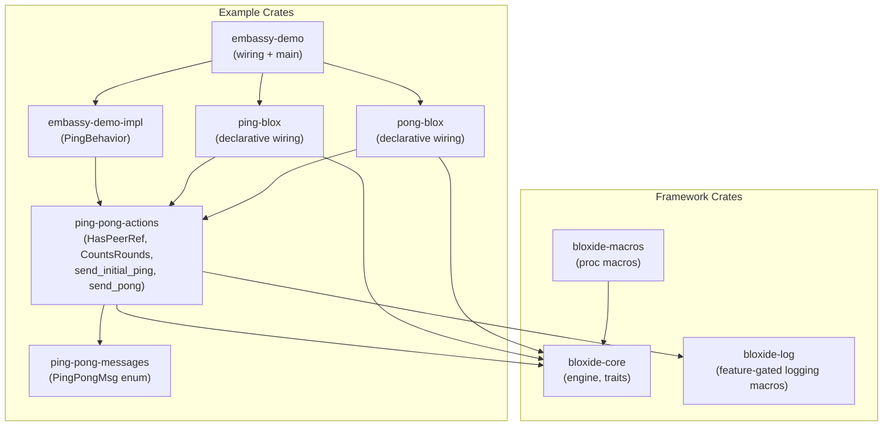

# 10 — Action-Crate Pattern

## Overview

Bloxes are primarily **declarative wiring diagrams** — most computation lives in action crates. This document describes the five-layer architecture that separates concerns across messages, actions, impl crates, blox declarations, and binary wiring.

---

## The Five Layers



### Layer 1 — Messages crate
`ping-pong-messages` contains pure data structs with no logic. Uses named structs for message variants (e.g., `Ping { round: u32 }`) for clean payload access without positional indexing. Two or more bloxes that communicate share one message crate.

### Layer 2 — Actions crates
Action crates (e.g., `ping-pong-actions`, `bloxide-log`) are **pure interface crates** — they define:
- **Accessor traits** (`HasPeerRef<R>`, `HasSelfRef<R>`, `HasSelfId`) — expose context fields generically
- **Behavior traits** (`CountsRounds`, `TracksActiveExits`, `TracksOperatingExits`) — define domain capabilities
- **Generic action functions** — composable, trait-bounded functions with no concrete types

Zero concrete implementations here. This is the "standard library" of the blox domain.

### Layer 3 — Impl crates
Impl crates (e.g., `embassy-demo-impl`) are owned by the binary/wiring author and provide concrete types that implement the behavior traits defined in action crates. The wiring binary injects these into blox contexts at construction time.

A different binary targeting real hardware could supply its own impl crate with hardware-backed implementations of the same traits, while reusing the same blox and action crates unchanged.

Example: `PingBehavior` — a single composite type implementing `CountsRounds`, `TracksActiveExits`, `TracksOperatingExits`, and `HasCurrentTimer`. It is injected into `PingCtx<R, PingBehavior>` by the binary at construction time.

**When to use this pattern:** Bloxes with mutable behavior state (e.g., Ping) use a generic `B` type parameter so the impl crate can supply concrete storage. Bloxes with no mutable behavior state beyond their accessor fields (e.g., Pong, Supervisor) omit the behavior generic entirely — their context structs have only `#[provides]` fields.

### Layer 4 — Blox crates
Blox crates are primarily declarative. They define:
- State topology (`#[derive(StateTopology)]`)
- Context struct (`#[derive(BloxCtx)]` with field annotations and a generic `#[delegates]` field bounded by behavior traits)
- Behavior trait impls (delegations to the generic behavior field `self.behavior`)
- `MachineSpec` with `StateFns` tables — `on_entry`/`on_exit` slices referencing action functions, guards-only transition rules

Blox `impl` blocks may also contain thin local helper methods that adapt action-crate functions to blox-local constants or event payloads (e.g., `Self::schedule_pause_timer` calling `schedule_resume(ctx, PAUSE_DURATION_MS)`). These local helpers are acceptable when they avoid repetition of the same constant or event-extraction logic across multiple rules. All domain logic and generic functions remain in the action crate.

### Layer 5 — Binary
The binary crate (`embassy-demo`) contains only wiring:
- Create channels
- Construct context structs
- Spawn tasks

---

## Accessor Traits

`bloxide-core` provides a universal accessor trait:

```rust
pub trait HasSelfId {
    fn self_id(&self) -> ActorId;
}
```

Domain-specific accessor traits (e.g., `HasPeerRef<R>`, `HasTimerRef<R>`) live in their respective actions/standard library crates. All these traits are implemented automatically by `#[derive(BloxCtx)]`.

---

## Behavior Traits

Behavior traits define domain capabilities — what computations the context can perform:

```rust
pub trait CountsRounds {
    type Round: Copy + PartialEq + PartialOrd + core::ops::Add + From<u8> + core::fmt::Display;
    fn round(&self) -> Self::Round;
    fn set_round(&mut self, round: Self::Round);
}
```

Action functions declare what they need via trait bounds:

```rust
pub fn increment_round<C: CountsRounds>(ctx: &mut C) {
    ctx.set_round(ctx.round() + 1);
}

pub fn send_initial_ping<R, C>(ctx: &mut C)
where
    R: BloxRuntime,
    C: HasSelfId + HasPeerRef<R> + CountsRounds,
{ ... }
```

---

## `#[derive(BloxCtx)]`

The `BloxCtx` derive macro generates accessor trait impls and a `fn new(...)` constructor from field annotations:

| Annotation | Generated |
|---|---|
| `#[self_id]` | `impl HasSelfId for Struct` |
| `#[provides(Trait<R>)]` | `impl Trait<R> for Struct { fn field_name() -> &FieldType }` |
| `#[delegates(Trait)]` | Auto-generates forwarding impl via `__delegate_TraitName!()`; trait must be `#[delegatable]` |
| (no annotation) | Field initialized via `Default::default()` in constructor |

Example:

```rust
#[derive(BloxCtx)]
pub struct PingCtx<
    R: BloxRuntime,
    B: HasCurrentTimer + CountsRounds + TracksActiveExits + TracksOperatingExits,
> {
    #[self_id]
    pub self_id: ActorId,
    #[provides(HasPeerRef<R>)]
    pub peer_ref: ActorRef<PingPongMsg, R>,
    #[provides(HasSelfRef<R>)]
    pub self_ref: ActorRef<PingPongMsg, R>,
    #[provides(HasTimerRef<R>)]
    pub timer_ref: ActorRef<TimerCommand, R>,
    #[delegates(HasCurrentTimer, CountsRounds, TracksActiveExits, TracksOperatingExits)]
    pub behavior: B,   // concrete type injected by the binary (e.g. PingBehavior)
}
```

The `#[delegates]` annotation marks a field as the delegation target. For each listed trait, `BloxCtx` invokes `__delegate_TraitName!()` — the companion macro generated by `#[delegatable]` on the trait definition — which emits the forwarding `impl` automatically. Implementors do **not** write delegation impls by hand.

> **Note:** Bloxes with no mutable behavior state (e.g., Pong) omit the behavior generic entirely: `PongCtx<R>` has only `#[self_id]` and `#[provides]` fields.

Convention: field name = trait method name for `#[provides]` fields (e.g., field `peer_ref` → `fn peer_ref()` in `HasPeerRef`).

---

## `on_entry`/`on_exit` Action Slices

`StateFns` now uses `&'static [fn(&mut Ctx)]` slices instead of single function pointers, enabling composition:

```rust
const ACTIVE_FNS: StateFns<Self> = StateFns {
    on_entry: &[increment_round, send_initial_ping],
    on_exit:  &[inc_active_exits],
    transitions: ...,
};
```

Each action function in the slice must be compatible with the context type. The compiler verifies trait bounds at compile time.

---

## Message Shorthand in `transitions!`

The `transitions!` macro supports a new shorthand for domain message patterns. Instead of the full event pattern:

```rust
// Old (still supported):
PingEvent::Msg(Envelope(_, PingPongMsg::Pong(_))) => { ... }
```

Use the message type directly (convention: type name ends with `Msg`):

```rust
// New shorthand:
PingPongMsg::Pong(pong) => {
    guard(ctx, _results) {
        ctx.round >= MAX_ROUNDS => PingState::Done,
        _                       => PingState::Active,
    }
}
```

The macro detects the shorthand by checking if the first identifier ends with `"Msg"` and generates the `matches` predicate via `event.msg_payload()`.

---

## `bloxide-log` Pattern

The logging pattern uses feature-gated macros rather than traits:

1. **Macro crate** (`bloxide-log`): provides `blox_log_info!`, `blox_log_debug!`, etc. macros. Feature-gated: `log` or `defmt` backend selected at compile time.
2. **No impl crate needed**: the Cargo feature flag on `bloxide-log` selects the backend. No `Logs` trait, no logger generic parameter.
3. **Blox context**: does not hold a logger field. Blox code calls `bloxide-log` macros directly.

The binary chooses the concrete logger; the blox crate is unchanged.

---

## Unified Message Enum

Two bloxes sharing a protocol use **one message enum**:

```rust
// Both Ping and Pong use `ActorRef<PingPongMsg, R>`
pub enum PingPongMsg {
    Ping(Ping),
    Pong(Pong),
    Resume(Resume),
}
```

This simplifies wiring (single channel type) and makes `HasPeerRef<R>` the same trait for both actors. Each blox only handles the variants it cares about; unmatched variants bubble up and are eventually dropped.

---

## Supervision as an Action-Crate Example

The supervision capability follows the same five-layer pattern as domain messaging. This demonstrates that the pattern is universal — any runtime capability can be exposed through accessor traits and generic action functions.

### Comparison: Peer Messaging vs. Supervision

```rust
// Peer messaging (ping-pong-actions)
pub trait HasPeerRef<R: BloxRuntime> {
    fn peer_ref(&self) -> &ActorRef<PingPongMsg, R>;
}

pub fn send_initial_ping<R, C>(ctx: &mut C)
where R: BloxRuntime, C: HasSelfId + HasPeerRef<R> + CountsRounds;

// Supervision (bloxide-supervisor)
pub trait HasChildren<R: BloxRuntime> {
    fn children(&self) -> &ChildGroup<R>;
}

pub fn start_children<R, C>(ctx: &mut C)
where R: BloxRuntime, C: HasSelfId + HasChildren<R>;
```

### Context Field — `#[provides(HasChildren<R>)]`

```rust
#[derive(BloxCtx)]
pub struct SupervisorCtx<R: BloxRuntime> {
    #[self_id]
    pub self_id: ActorId,
    #[provides(HasChildren<R>)]
    pub children: ChildGroup<R>,  // injected by ChildGroupBuilder at wiring time
}
```

### Handler Table — action functions as entries

```rust
const RUNNING_FNS: StateFns<Self> = StateFns {
    on_entry: &[start_children::<R, SupervisorCtx<R>>],   // like send_initial_ping
    on_exit: &[],
    transitions: transitions![
        SupervisorEvent::Child(ChildLifecycleEvent::Done { .. }) => {
            actions [handle_done_or_failed_action::<R>]               // like send_pong
            // Only transition to ShuttingDown when the group signals BeginShutdown;
            // otherwise the child is being restarted and we stay in Running.
            guard(ctx, _results) {
                ctx.pending == ChildAction::BeginShutdown => SupervisorState::ShuttingDown,
                _                                         => stay,
            }
        },
    ],
};
```

### `ChildGroup<R>` injected at wiring time

```rust
// In the wiring binary — ChildGroup is built by the runtime helper
let mut group = ChildGroupBuilder::new(GroupShutdown::WhenAnyDone);
spawn_child!(spawner, group, ping_task(ping_machine, ping_mbox, ping_id), ChildPolicy::Restart { max: 3 });
let (children, sup_notify_rx) = group.finish();
let sup_ctx = SupervisorCtx::new(sup_id, children);
```

Just as `ActorRef<PingPongMsg, R>` is created at wiring time and injected into `PingCtx`, `ChildGroup<R>` is created by `ChildGroupBuilder` and injected into `SupervisorCtx`. The supervisor crate never imports any runtime type.
