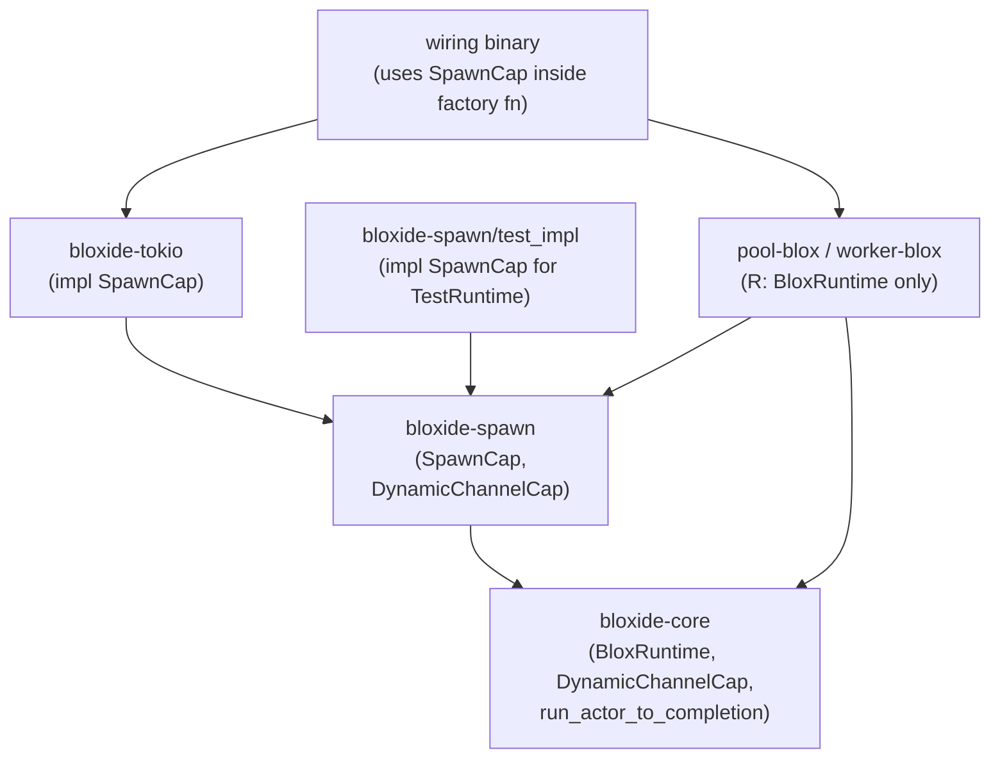
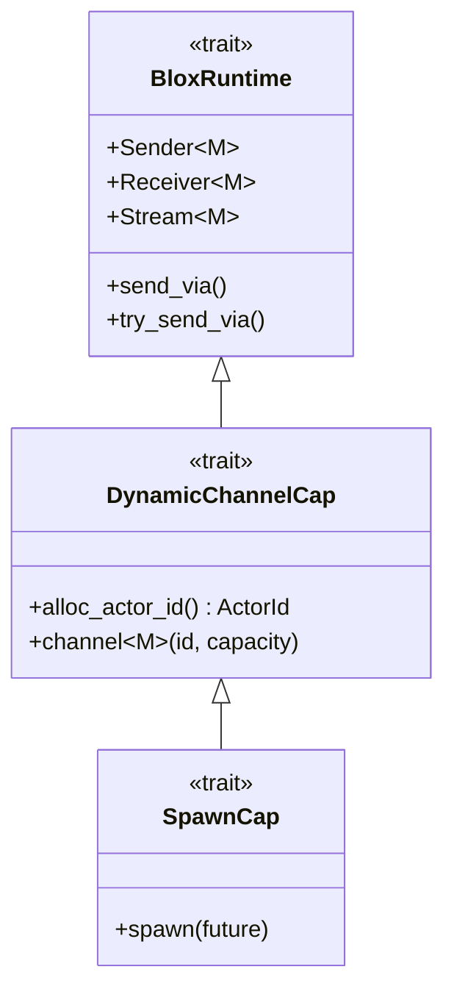
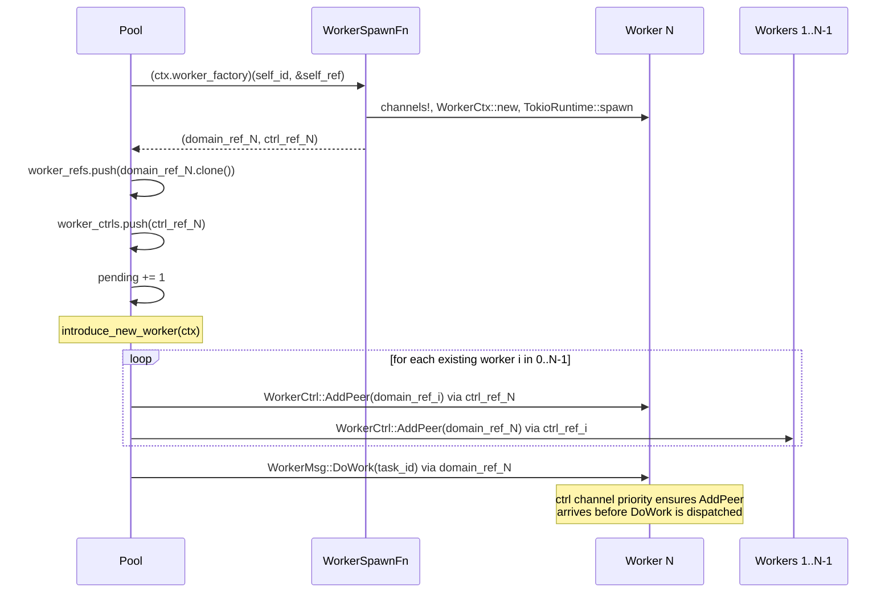

# Dynamic Actors

> **When would I use this?** Use this document when implementing dynamic actor
> spawning, understanding factory injection, or working with `SpawnCap` and
> peer introduction patterns.

Dynamic actor creation allows a running actor to spawn new actors at runtime — after
the executor has started. This is the v3 goal referenced in earlier specs, now
implemented for runtimes that support it (Tokio, TestRuntime).

## Purpose

### When to Use Dynamic Actor Creation

Static wiring (the Embassy model) is sufficient when the full actor topology is known
at compile time. Dynamic actor creation is necessary when:

- The number of workers is data-driven (e.g., one worker per incoming task)
- Actors are short-lived (e.g., a request handler that exits when done)
- Peers are discovered at runtime (e.g., a pool that introduces workers to each other
  after spawning)

Use static wiring wherever possible. Prefer dynamic actors only when the topology
genuinely cannot be determined before the executor starts.

### Runtime Support Matrix

| Runtime | Dynamic actors | Notes |
|---------|---------------|-------|
| `EmbassyRuntime` | No | Embassy tasks require compile-time static declarations |
| `TokioRuntime` | Yes | `tokio::task::spawn` — implements `SpawnCap` |
| `TestRuntime` | Yes | Collects futures in a thread-local; implements `SpawnCap` |

Embassy has no dynamic spawning by design: `#[embassy_executor::task]` functions must
be declared at compile time and cannot be called from within a running task in the
general case. All Embassy actors use the static wiring pattern described in
[04-static-wiring.md](04-static-wiring.md).

---

## `bloxide-spawn` Crate

`bloxide-spawn` is the standard library crate for dynamic actor creation and peer
introduction. It parallels `bloxide-supervisor` (supervision) and `bloxide-timer`
(timers) in its role: it defines the Tier 2 capability trait, the accessor traits,
and the framework action functions — keeping all dynamic-spawning concerns out of
`bloxide-core` and out of blox crates.

### Contents

| Module | Contents |
|--------|---------|
| `capability` | `SpawnCap` trait — Tier 2, extends `DynamicChannelCap` |
| `peer` | `SpawnCap`, `DynamicChannelCap` — runtime capabilities for dynamic actors |
| `test_impl` | `SpawnCap` impl for `TestRuntime`; `drain_spawned()`, `spawned_count()` |
| `prelude` | Re-exports for convenient glob imports |

`bloxide-spawn` is `no_std` (uses `extern crate alloc` for `Vec`).

### Domain-Specific Peer Control (Recommended)

For peer introduction, use domain-specific control types defined in your message and action crates. This enables the `#[delegates]` annotation and provides better type safety.

**Why domain-specific?**
1. **Enables `#[delegates]`** — When your context has a `peers` field implementing `HasWorkerPeers<R>`, you can annotate it with `#[delegates(HasWorkerPeers)]` and the macro generates forwarding impls. 
2. **Type safety** — `WorkerCtrl<R>` is specific to worker actors; you can't accidentally send it to a pool actor's ctrl channel.
3. **Clearer names** — `HasWorkerPeers<R>` is domain-specific and self-documenting.

**Where to define types:**
- **Control message types** (`WorkerCtrl<R>`) — in the **message crate** alongside domain messages
- **Peer accessor traits** (`HasWorkerPeers<R>`) — in the **action crate** with `#[delegatable]` annotation

### Dependency Graph



Blox crates depend on `bloxide-spawn` (for `SpawnCap`, `DynamicChannelCap`)
and `bloxide-core` but never on `bloxide-tokio`. Blox crates declare `R: BloxRuntime`

## Domain-Specific Peer Control Types

The recommended pattern for peer control is defining domain-specific types in your
message and action crates. This section shows the full pattern with concrete examples.

### Defining a Control Message Type

Control messages are defined in the **message crate** alongside domain messages:

```rust
// In pool-messages/src/lib.rs
use bloxide_core::actor::{ActorId, ActorRef};
use bloxide_core::capability::BloxRuntime;

/// Domain-specific control message for worker actors.
/// Domain-specific control type for workers
/// and provides better type safety.
pub enum WorkerCtrl<R: BloxRuntime> {
    AddPeer(AddWorkerPeer<R>),
    RemovePeer(RemoveWorkerPeer),
}

pub struct AddWorkerPeer<R: BloxRuntime> {
    pub peer_id: ActorId,
    pub peer_ref: ActorRef<WorkerMsg, R>,
}

pub struct RemoveWorkerPeer {
    pub peer_id: ActorId,
}
```

**Key characteristics:**
- Only `R` is generic — the message type (`WorkerMsg`) is fixed
- Named for the specific actor type (e.g., WorkerCtrl)
- Lives in the domain's message crate, not `bloxide-spawn`

### Defining a Peer Accessor Trait

Peer accessor traits are defined in the **action crate** with `#[delegatable]`:

```rust
// In pool-actions/src/traits.rs
use bloxide_core::actor::{ActorId, ActorRef};
use bloxide_core::capability::BloxRuntime;
use bloxide_macros::delegatable;
use pool_messages::WorkerMsg;

/// Accessor trait for worker peer management.
/// Marked #[delegatable] so #[derive(BloxCtx)] can generate forwarding impls.
#[delegatable]
pub trait HasWorkerPeers<R: BloxRuntime> {
    /// Immutable access to peer refs.
    fn peer_refs(&self) -> &Vec<ActorRef<WorkerMsg, R>>;
    
    /// Mutable access to peer refs (for AddPeer/RemovePeer handlers).
    fn peer_refs_mut(&mut self) -> &mut Vec<ActorRef<WorkerMsg, R>>;
    
    /// Ctrl refs for sending peer control messages.
    fn peer_ctrls(&self) -> &Vec<ActorRef<WorkerCtrl<R>, R>>;
}
```

**Why this enables `#[delegates]`:**
- `HasWorkerPeers<R>` has only one generic parameter (`R`)
- The macro can generate `impl HasWorkerPeers<R> for WorkerCtx<R>` via delegation

With the domain-specific trait defined, context structs can delegate:

```rust
// In worker-blox/src/ctx.rs
use bloxide_macros::BloxCtx;
use pool_actions::HasWorkerPeers;

#[derive(BloxCtx)]
pub struct WorkerCtx<R: BloxRuntime> {
    pub self_id: ActorId,
    pub pool_ref: ActorRef<PoolMsg, R>,
    
    #[delegates(HasWorkerPeers)]
    pub peers: WorkerPeers<R>,
}

// The macro generates:
// impl<R: BloxRuntime> HasWorkerPeers<R> for WorkerCtx<R> {
//     fn peer_refs(&self) -> &Vec<ActorRef<WorkerMsg, R>> { self.peers.peer_refs() }
//     fn peer_refs_mut(&mut self) -> &mut Vec<ActorRef<WorkerMsg, R>> { self.peers.peer_refs_mut() }
//     fn peer_ctrls(&self) -> &Vec<ActorRef<WorkerCtrl<R>, R>> { self.peers.peer_ctrls() }
// }
```

### Applying Peer Control Messages

Handlers for domain-specific control messages are defined in the blox:

```rust
// In worker-blox/src/spec.rs
use pool_messages::WorkerCtrl;
use pool_actions::HasWorkerPeers;

fn handle_worker_ctrl(ctx: &mut WorkerCtx<R>, ctrl: &WorkerCtrl<R>) -> ActionResult {
    match ctrl {
        WorkerCtrl::AddPeer(add) => {
            ctx.peer_refs_mut().push(add.peer_ref.clone());
            blox_log_info!("worker {:?}: added peer {:?}", ctx.self_id, add.peer_id);
        }
        WorkerCtrl::RemovePeer(remove) => {
            ctx.peer_refs_mut().retain(|r| r.id() != remove.peer_id);
            blox_log_info!("worker {:?}: removed peer {:?}", ctx.self_id, remove.peer_id);
        }
    }
    ActionResult::Ok
}

// In the transitions! table:
transitions![
    WorkerCtrl(add) => {
        actions [|ctx, ev| {
            if let Some(ctrl) = ev.ctrl_payload() {
                handle_worker_ctrl(ctx, ctrl);
            }
            ActionResult::Ok
        }]
        stay
    },
]
```

### Factory Type with Domain-Specific Ctrl

The spawn factory returns the domain-specific control type:

```rust
// In pool-actions/src/traits.rs
pub type WorkerSpawnFn<R> = fn(
    ActorId,
    &ActorRef<PoolMsg, R>,
) -> (ActorRef<WorkerMsg, R>, ActorRef<WorkerCtrl<R>, R>);
```


---
— not `R: SpawnCap`. The runtime dependency flows only through the wiring binary,
and `SpawnCap` is used only inside factory functions defined there.

---

## `SpawnCap` Trait

`SpawnCap` is a **Tier 2** capability trait for runtimes that can spawn futures
at runtime. It extends `DynamicChannelCap` (which itself extends `BloxRuntime`),
gaining both dynamic channel creation and task spawning.

```rust
/// Tier 2 capability for runtimes that support spawning actor tasks at runtime.
///
/// Extends `DynamicChannelCap` (which provides `alloc_actor_id` and `channel`).
/// Blox crates do not declare `R: SpawnCap`. SpawnCap is used inside factory
/// functions at the wiring layer.
/// Embassy does NOT implement this trait — use static wiring for Embassy.
pub trait SpawnCap: DynamicChannelCap {
    /// Spawn a future as an independent task.
    fn spawn(future: impl Future<Output = ()> + Send + 'static);
}
```

The full inheritance chain:



### Runtime Support

| Trait | `EmbassyRuntime` | `TokioRuntime` | `TestRuntime` |
|-------|:---:|:---:|:---:|
| `BloxRuntime` | yes | yes | yes |
| `StaticChannelCap` | yes | — | — |
| `DynamicChannelCap` | — | yes | yes |
| `TimerService` | yes | yes | — |
| `SupervisedRunLoop` | yes | yes | — |
| `SpawnCap` | — | yes | yes |

---

## `run_actor_to_completion`

Defined in `bloxide-core::actor`:

```rust
/// Start an actor and run until it reaches a terminal/error state or resets.
///
/// Calls `machine.start()` to transition out of Init, then dispatches events
/// until `DispatchOutcome::Started` or `DispatchOutcome::Transition` enters a
/// terminal or error state, or `DispatchOutcome::Reset` is observed. Suitable
/// for dynamically spawned actors that should exit their task when their work
/// is done.
pub async fn run_actor_to_completion<S, M>(mut machine: StateMachine<S>, mut mailboxes: M)
where
    S: MachineSpec + 'static,
    M: Mailboxes<S::Event>,
{
    match machine.start() {
        DispatchOutcome::Started(state) if S::is_terminal(&state) || S::is_error(&state) => {
            return;
        }
        _ => {}
    }
    loop {
        let event = poll_fn(|cx| mailboxes.poll_next(cx)).await;
        match machine.dispatch(event) {
            DispatchOutcome::Transition(state)
                if S::is_terminal(&state) || S::is_error(&state) =>
            {
                return;
            }
            DispatchOutcome::Reset => return,
            _ => {}
        }
    }
}
```

### `run_actor_to_completion` vs `run_actor`

| | `run_actor` | `run_actor_to_completion` |
|---|---|---|
| Calls `machine.start()` | No — caller is responsible | Yes — called internally |
| Exit condition | Never (permanent) | Terminal state, error state, or Reset |
| Use case | Permanent actors (Embassy, supervised actors) | Dynamically spawned finite-lifetime actors |
| Supervision | Used by `run_supervised_actor` | Unsupervised by default; use `run_supervised_actor` + `SupervisorControl::RegisterChild` for supervised dynamic actors |

`run_actor_to_completion` calls `machine.start()` internally so the wiring binary
only needs to construct the `StateMachine` and pass it to `SpawnCap::spawn`.
When you need supervision for dynamic children, use `run_supervised_actor` and
register each child through the supervisor control-plane channel.

---

## Factory Injection Pattern

The primary dynamic actor pattern in bloxide is **factory injection**: a parent blox
stores an opaque factory function provided at wiring time. When the parent needs to
spawn a child, it calls the factory — which allocates channels, constructs and spawns
the child task, and returns the child's `ActorRef`s. The parent never references the
concrete child type.

This keeps the parent blox **decoupled from the child's concrete type** (upholding
invariant 9: "blox crates never import impl crates") and means the parent does not
need any `SpawnCap` bound — it only needs `R: BloxRuntime`.

### Generalized Factory Type

The factory function signature follows a general pattern: the parent provides its own
identity and `ActorRef` (so the child can reply), and the factory returns both a
domain ref and a ctrl ref for the spawned child.

```rust
/// Generic factory type for spawning a child actor.
///
/// - `ParentMsg`: the message type the child sends back to the parent (replies)
/// - `ChildMsg`: the domain message type for the child actor
/// - `R`: the runtime
///
/// The factory allocates channels, constructs the child's context and state machine,
/// spawns the task, and returns both ActorRefs to the caller. The caller (parent)
/// then stores the refs, introduces peers, and sends the initial work message.
pub type ChildSpawnFn<ParentMsg, ChildMsg, R> = fn(
    ActorId,                                     // parent's own ActorId
    &ActorRef<ParentMsg, R>,                     // parent's ActorRef (child stores for replies)
) -> (ActorRef<ChildMsg, R>, ActorRef<WorkerCtrl<R>, R>);
```

The concrete pool example specializes this:

```rust
// In pool-actions/src/traits.rs
pub type WorkerSpawnFn<R> = fn(
    ActorId,
    &ActorRef<PoolMsg, R>,
) -> (ActorRef<WorkerMsg, R>, ActorRef<WorkerCtrl<R>, R>);
```

### Factory Implementation (Wiring Layer)

The factory lives in a Layer 3 impl crate consumed by the wiring binary — the
**only** place that knows the concrete child type (`WorkerCtx`, `WorkerSpec`):

```rust
// In crates/impl/tokio-pool-demo-impl/src/lib.rs
fn spawn_worker_tokio(
    _pool_id: ActorId,
    pool_ref: &ActorRef<PoolMsg, TokioRuntime>,
) -> (
    ActorRef<WorkerMsg, TokioRuntime>,
    ActorRef<WorkerCtrl<TokioRuntime>, TokioRuntime>,
) {
    // Ctrl channel at index 0 (higher priority) so AddPeer messages are
    // processed before DoWork arrives on the domain channel.
    let ((ctrl_ref, domain_ref), worker_mbox) =
        channels! { WorkerCtrl<TokioRuntime>(16), WorkerMsg(16) };
    let worker_id = ctrl_ref.id();

    let worker_ctx = WorkerCtx::new(worker_id, pool_ref.clone());
    let machine = StateMachine::<WorkerSpec<TokioRuntime>>::new(worker_ctx);

    TokioRuntime::spawn(async move {
        run_actor_to_completion(machine, worker_mbox).await;
    });

    (domain_ref, ctrl_ref)
}
```

The factory is injected into `PoolCtx` at wiring time:

```rust
let pool_ctx = PoolCtx::new(pool_id, pool_ref, spawn_worker_tokio);
```

### Factory Storage and Accessor

The parent stores the factory as a `#[ctor]` field and exposes it via an accessor trait:

```rust
// HasWorkerFactory accessor (in pool-actions/src/traits.rs)
pub trait HasWorkerFactory<R: BloxRuntime> {
    fn worker_factory(&self) -> WorkerSpawnFn<R>;
}
```

The parent blox calls the factory through the accessor — keeping pool action functions
generic over any context that implements `HasWorkerFactory`:

```rust
// In pool-blox/src/spec.rs — no reference to WorkerCtx or WorkerSpec
fn spawn_worker(ctx: &mut PoolCtx<R>, task_id: u32) {
    let self_id = ctx.self_id();
    let (domain_ref, ctrl_ref) = (ctx.worker_factory)(self_id, &ctx.self_ref);

    ctx.worker_refs.push(domain_ref.clone());
    ctx.worker_ctrls.push(ctrl_ref);
    ctx.pending += 1;

    introduce_new_worker(ctx);  // wire new worker to all existing workers

    // Send DoWork after peer introduction — ctrl priority ensures AddPeer
    // commands arrive before DoWork is dispatched by the worker.
    let _ = domain_ref.try_send(self_id, WorkerMsg::DoWork(DoWork { task_id }));
}
```

---

## Split Domain/Ctrl Ref Pattern

Each dynamically spawned child actor that participates in peer-to-peer messaging has
**two distinct `ActorRef`s** with different message types:

| Ref | Type | Purpose |
|-----|------|---------|
| Domain ref | `ActorRef<WorkerMsg, R>` | Application messages (DoWork, etc.) |
| Ctrl ref | `ActorRef<WorkerCtrl<R>, R>` | Peer control (AddPeer, RemovePeer) |

The parent stores both in its context and uses them for different purposes:
- Domain ref: send work messages and keep the channel alive (self-sender invariant)
- Ctrl ref: introduce the child to other children via `introduce_peers`

### Mailbox Priority

The child actor's `Mailboxes` tuple places ctrl at index 0 (highest priority) and the
domain channel at index 1. This guarantees that `AddPeer` commands sent by the parent
are processed before any `DoWork` message — even if both are enqueued before the child
has processed anything. See [07-typed-mailboxes.md](07-typed-mailboxes.md) for the
polling priority semantics.

```rust
// worker-blox/src/spec.rs
impl<R: BloxRuntime> MachineSpec for WorkerSpec<R> {
    type Event = WorkerEvent<R>;

    /// Ctrl stream at index 0 (higher priority) ensures AddPeer commands are
    /// processed before DoWork arrives on the domain stream at index 1.
    type Mailboxes<Rt: BloxRuntime> = (
        R::Stream<WorkerCtrl<R>>,   // index 0 — ctrl (higher priority)
        R::Stream<WorkerMsg>,                 // index 1 — domain
    );
    // ...
}
```

---

## P2P via Control Channel

When actors need to discover each other after they are running (e.g., a pool that
introduces two workers), use a **domain-specific control message type** defined in your
message crate. This is the recommended pattern that enables `#[delegates]` and provides
better type safety.

### Domain-Specific Control Message (Recommended)

The control message type is defined in the **message crate** with only `R` as a generic
parameter:

```rust
// In pool-messages/src/lib.rs
pub enum WorkerCtrl<R: BloxRuntime> {
    AddPeer(AddWorkerPeer<R>),
    RemovePeer(RemoveWorkerPeer),
}

pub struct AddWorkerPeer<R: BloxRuntime> {
    pub peer_id: ActorId,
    pub peer_ref: ActorRef<WorkerMsg, R>,
}

pub struct RemoveWorkerPeer {
    pub peer_id: ActorId,
}
```

`WorkerCtrl<R>` is a second mailbox entry in the actor's `Mailboxes` tuple. There is
no new recv loop: the same single `poll_next` / dispatch cycle handles both domain
messages and control messages.

**Actor event enum** — `#[blox_event]` handles generic event enums:

```rust
#[blox_event]
#[derive(Debug)]
pub enum WorkerEvent<R: BloxRuntime> {
    Msg(Envelope<WorkerMsg>),
    Ctrl(Envelope<WorkerCtrl<R>>),
}
```

**Handling `WorkerCtrl` in a transition rule:**

```rust
// In worker-blox/src/spec.rs
fn handle_worker_ctrl(ctx: &mut WorkerCtx<R>, ctrl: &WorkerCtrl<R>) -> ActionResult {
    match ctrl {
        WorkerCtrl::AddPeer(add) => {
            ctx.peer_refs_mut().push(add.peer_ref.clone());
        }
        WorkerCtrl::RemovePeer(remove) => {
            ctx.peer_refs_mut().retain(|r| r.id() != remove.peer_id);
        }
    }
    ActionResult::Ok
}

// In the transitions! table:
transitions![
    WorkerCtrl(_) => {
        actions [|ctx, ev| {
            if let Some(ctrl) = ev.ctrl_payload() {
                handle_worker_ctrl(ctx, ctrl);
            }
            ActionResult::Ok
        }]
        stay
    },
]
```

introduces the newcomer to all existing workers via bidirectional `AddPeer` messages.
The sequence for adding worker N (with N-1 workers already running):



`introduce_new_worker` is defined in `pool-actions`:

```rust
pub fn introduce_new_worker<R, C>(ctx: &C)
where
    R: BloxRuntime,
    C: HasSelfId + HasWorkers<R>,
{
    let n = ctx.worker_refs().len();
    if n < 2 { return; }
    let new_idx = n - 1;
    let new_ref = ctx.worker_refs()[new_idx].clone();
    let new_ctrl = ctx.worker_ctrls()[new_idx].clone();
    for i in 0..new_idx {
        let old_ref = ctx.worker_refs()[i].clone();
        let old_ctrl = ctx.worker_ctrls()[i].clone();
        introduce_peers(ctx, &new_ctrl, &new_ref, &old_ctrl, &old_ref);
    }
}
```

`introduce_peers` (from `bloxide-spawn`) sends `WorkerCtrl::AddPeer` to both actors,
each receiving the other's domain `ActorRef`. The control channel is separate from
the domain channel so existing message ordering is unaffected.

### Batch Spawn (Known Topology)

When a parent spawns a fixed set of actors whose cross-references are all known at
spawn time, wire them directly at construction without a control channel:

```rust
// Both actors are constructed before either is spawned.
// Cross-refs are injected directly into each Ctx.
let ((ctrl_a, domain_a), mbox_a) = channels! { WorkerCtrl<R>(16), WorkerMsg(16) };
let ((ctrl_b, domain_b), mbox_b) = channels! { WorkerCtrl<R>(16), WorkerMsg(16) };

let ctx_a = WorkerCtx::new(ctrl_a.id(), pool_ref.clone());
let ctx_b = WorkerCtx::new(ctrl_b.id(), pool_ref.clone());

R::spawn(run_actor_to_completion(StateMachine::new(ctx_a), mbox_a));
R::spawn(run_actor_to_completion(StateMachine::new(ctx_b), mbox_b));
// Then introduce them to each other:
introduce_peers(&pool_ctx, &ctrl_a, &domain_a, &ctrl_b, &domain_b);
```

Use Batch Spawn when all peers are known before any task starts. Use domain control types when
peers are discovered incrementally at runtime.

### Parent-Mediated Routing

A parent that routes messages to children by forwarding from its own mailbox requires
no control channel. The parent holds `Vec<ActorRef<ChildMsg, R>>` and calls
`try_send` in its action functions. No control channel is needed because workers never
need direct peer references.

---

## Dynamic Collections

When the number of spawned actors is not fixed at compile time, use a `Vec`. The pool
blox context uses split collections: one for domain refs, one for ctrl refs.

```rust
// pool-blox/src/ctx.rs
#[derive(BloxCtx)]
pub struct PoolCtx<R: BloxRuntime> {
    #[self_id]
    pub self_id: ActorId,
    /// Pool's own ActorRef — cloned into each worker at spawn time so the
    /// worker can notify the pool when done. Also keeps the pool channel open.
    #[ctor]
    pub self_ref: ActorRef<PoolMsg, R>,
    /// Factory function injected at construction time; called to create and
    /// spawn a worker without pool-blox knowing the concrete worker type.
    #[ctor]
    pub worker_factory: WorkerSpawnFn<R>,
    /// Domain ActorRefs for all spawned workers (keeps their channels alive).
    pub worker_refs: Vec<ActorRef<WorkerMsg, R>>,
    /// Ctrl ActorRefs for all spawned workers (used for peer introduction).
    pub worker_ctrls: Vec<ActorRef<WorkerCtrl<R>, R>>,
    /// Number of workers whose `WorkDone` we are still waiting for.
    pub pending: u32,
}
```

`HasWorkers<R>` (from `pool-actions`) provides typed accessor methods for
`worker_refs`, `worker_ctrls`, and `pending` so generic pool action functions never
touch fields directly.

**`alloc` requirement**: `Vec<ActorRef<M, R>>` requires the `alloc` crate. Blox
crates that use dynamic collections must declare `extern crate alloc` and configure
their `no_std` crate accordingly.

**Self-sender invariant**: The collection owner keeps all channels alive. As long as
the `PoolCtx` lives (i.e., as long as the pool actor task runs), every worker channel
remains open. When the pool's task exits or the `Vec` drops a ref, that worker's
channel may close.

---

## Actor Lifecycle

### `run_actor_to_completion` Exit Conditions

An actor run with `run_actor_to_completion` exits when any of the following occur:

```mermaid
stateDiagram-v2
    [*] --> Init
    Init --> Running : "machine.start() (inside run_actor_to_completion)"
    Init --> Done : "start() enters terminal state"
    Init --> Error : "start() enters error state"
    Running --> Running : "domain events (stay / self-transition)"
    Running --> Done : "transition to terminal state (is_terminal)"
    Running --> Error : "transition to error state (is_error)"
    Running --> Init : "DispatchOutcome::Reset (Guard::Reset)"
    Done --> [*] : "task exits"
    Error --> [*] : "task exits"
    Init --> [*] : "task exits on Reset"
```

| Exit condition | `DispatchOutcome` | Notes |
|---|---|---|
| Terminal state | `Started(s)` or `Transition(s)` where `is_terminal(&s)` | Normal completion — task exits cleanly |
| Error state | `Started(s)` or `Transition(s)` where `is_error(&s)` | Fault — task exits; parent may notice dropped channel |
| Reset | `Reset` | Explicit reset via `Guard::Reset`; task exits |
| Domain shutdown | `Started(s)` or `Transition(s)` where `is_terminal(&s)` | Actor defines a `Shutdown` state marked `is_terminal` |

### Shutdown via Domain Messages

An actor can define a graceful shutdown path through its own HSM state topology. For
example, a worker that accepts a `Shutdown` variant in its message enum transitions to
a terminal `Done` state:

```rust
pub enum WorkerMsg {
    Process(ProcessMsg),
    Shutdown,
}
```

When the worker reaches its `Done` state (marked `is_terminal`),
`run_actor_to_completion` sees the terminal `DispatchOutcome` and returns, ending
the task. The parent detects the worker is gone because the channel eventually closes
when all non-self senders drop.

---

## Testing with Factory Injection

Since pool-blox stores the spawn factory as a field, tests inject a test factory
rather than trying to mock `SpawnCap` directly. The test factory uses `TestRuntime`
(which implements `SpawnCap`) to create channels and spawn the worker, exercising the
same factory interface the production wiring binary uses.

### Pool Blox Tests

```rust
use bloxide_core::{capability::DynamicChannelCap, StateMachine};
use bloxide_core::test_utils::TestRuntime;
use bloxide_spawn::SpawnCap;
use pool_messages::WorkerCtrl;

fn test_spawn_worker(
    _pool_id: ActorId,
    pool_ref: &ActorRef<PoolMsg, TestRuntime>,
) -> (
    ActorRef<WorkerMsg, TestRuntime>,
    ActorRef<WorkerCtrl<TestRuntime>, TestRuntime>,
) {
    let worker_id = TestRuntime::alloc_actor_id();
    let (ctrl_ref, ctrl_rx) = TestRuntime::channel::<WorkerCtrl<TestRuntime>>(worker_id, 8);
    let (domain_ref, domain_rx) = TestRuntime::channel::<WorkerMsg>(worker_id, 8);

    let worker_ctx = WorkerCtx::new(worker_id, pool_ref.clone());
    let machine = StateMachine::<WorkerSpec<TestRuntime>>::new(worker_ctx);

    TestRuntime::spawn(async move {
        run_actor_to_completion(machine, (ctrl_rx, domain_rx)).await;
    });

    (domain_ref, ctrl_ref)
}

#[test]
fn pool_spawns_worker_on_request() {
    let pool_id = TestRuntime::alloc_actor_id();
    let (pool_ref, _pool_rx) = TestRuntime::channel::<PoolMsg>(pool_id, 16);

    let ctx = PoolCtx::new(pool_id, pool_ref.clone(), test_spawn_worker);
    let mut machine = StateMachine::new(ctx);
    machine.start();

    machine.dispatch(PoolEvent::from(Envelope::new(
        pool_id,
        PoolMsg::SpawnWorker(SpawnWorker { task_id: 0 }),
    )));

    assert_eq!(machine.ctx().worker_refs.len(), 1);
    assert_eq!(machine.ctx().pending, 1);
}
```

### Worker Blox Tests

Worker blox tests do not need a factory at all — workers are spawned by pools, not by
themselves. Use `DynamicChannelCap` to create channels and drive the machine directly:

```rust
#[test]
fn worker_processes_task() {
    let pool_id = TestRuntime::alloc_actor_id();
    let (pool_ref, _pool_rx) = TestRuntime::channel::<PoolMsg>(pool_id, 8);

    let worker_id = TestRuntime::alloc_actor_id();
    let ctx = WorkerCtx::new(worker_id, pool_ref);
    let mut machine = StateMachine::<WorkerSpec<TestRuntime>>::new(ctx);
    machine.start();

    machine.dispatch(WorkerEvent::from(Envelope::new(
        pool_id,
        WorkerMsg::DoWork(DoWork { task_id: 42 }),
    )));

    assert!(WorkerSpec::<TestRuntime>::is_terminal(
        &machine.current_state().unwrap()
    ));
    assert_eq!(machine.ctx().task_id, 42);
    assert_eq!(machine.ctx().result, 84);
}
```

The spawned future from `run_actor_to_completion` is never driven in unit tests —
only the state machine behavior is tested via direct dispatch.

### `test_impl` Functions

| Function | Description |
|----------|-------------|
| `spawned_count() -> usize` | Number of futures submitted since the last `drain_spawned` |
| `drain_spawned() -> Vec<Pin<Box<dyn Future<Output = ()> + Send>>>` | Drains all submitted futures; resets the count to 0 |

Both operate on a `thread_local!` so each test thread is isolated.

---

## When to Use Factory Injection vs Direct SpawnCap

| Scenario | Pattern | Why |
|----------|---------|-----|
| Parent spawns children of a **different** type | Factory injection | Parent blox never imports child's concrete type; upholds invariant 9 |
| Worker pool that doesn't know worker count at compile time | Factory injection | Factory is called N times, returning new refs each time |
| Self-replicating actors (actor spawns another of its own type) | Direct `SpawnCap` | Spawner and spawned are the same type — no decoupling needed |
| Test scenarios for bloxes that hold factories | Inject a test factory | Same factory interface, uses `TestRuntime` internally |

**Rule**: Blox crates should not declare `R: SpawnCap`. If a blox needs to spawn actors,
it should receive a factory function via `#[ctor]` injection rather than calling
`SpawnCap::spawn` directly. This keeps blox crates compilable with any `R: BloxRuntime`.

---

## Rules

The following rules extend the [core invariants in AGENTS.md](../../AGENTS.md):

1. **Domain messages remain plain data** — message enums must never be generic over
   `R`, and must never contain `ActorRef`. A worker that needs to reply to its parent
   stores the parent's `ActorRef<ReplyMsg, R>` in its `Ctx`, not in the message.

2. **Control messages can carry ActorRef** — domain-specific control message types
   (e.g., `WorkerCtrl<R>`) may contain `ActorRef` fields. These are defined in message
   actor's lifetime.

4. **One recv loop per actor** — control channels are merged into the
   actor's `Mailboxes` tuple. There is one `poll_next` → `dispatch` cycle regardless
   of how many channel types the actor monitors.

5. **Ctrl before domain in mailboxes** — when a child actor has both a domain channel
   and a control channel, place ctrl at index 0. This ensures `AddPeer` commands
   from the parent are processed before any domain work messages.

6. **Factory injection over direct SpawnCap** — blox crates receive a spawn factory
   via `#[ctor]` injection rather than declaring `R: SpawnCap`. Only the wiring binary
   and test helpers use `SpawnCap` directly.

7. **Prefer domain-specific peer types** — define `WorkerCtrl<R>` in your message crate (with `AddPeer`/`RemovePeer` variants)
   and `HasWorkerPeers<R>` in your action crate with `#[delegatable]`.

8. **Peer accessor traits in action crates** — traits like `HasWorkerPeers<R>` must be
   defined in action crates (not message or blox crates) with the `#[delegatable]`
   annotation so context structs can use `#[delegates(HasWorkerPeers)]`.

---

## Constraints

- **Embassy has no `SpawnCap`** — Embassy tasks are declared at compile time with
  `#[embassy_executor::task]` and cannot be created dynamically. All Embassy bloxes
  use the static wiring pattern in [04-static-wiring.md](04-static-wiring.md).

- **`alloc` required for `Vec<ActorRef<M, R>>`** — dynamic collections require heap
  allocation. Blox crates using `HasWorkerPeers` or `HasWorkers` must declare
  `extern crate alloc` and configure their `no_std` crate accordingly.

- **Supervised dynamic actors — implemented via explicit registration** — dynamic
  children can be supervised by using the supervisor control-plane protocol:
  1. Spawn the child with `run_supervised_actor(...)` and a per-child lifecycle channel.
  2. Send `SupervisorControl::RegisterChild(RegisterChild { ... })` to the supervisor.
  3. Supervisor adds the child to `ChildGroup` and sends `Start`.
  On Tokio, prefer `spawn_dynamic_supervised_child(...)` or the
  `spawn_child_dynamic!` macro from `bloxide-tokio` to avoid wiring boilerplate.
  This keeps the model deterministic and explicit without requiring mutable access to
  the supervisor's `ChildGroup` from inside domain action functions.

## Related Docs

- **Priority mailboxes** → `spec/architecture/07-typed-mailboxes.md`
- **Peer introduction API** → `crates/bloxide-spawn/src/peer.rs`
- **Pool/Worker blox specs** → `spec/bloxes/pool.md`, `spec/bloxes/worker.md`
- **Runtime SpawnCap impl** → `runtimes/tokio/src/spawn.rs`, `crates/bloxide-spawn/src/test_impl.rs`
