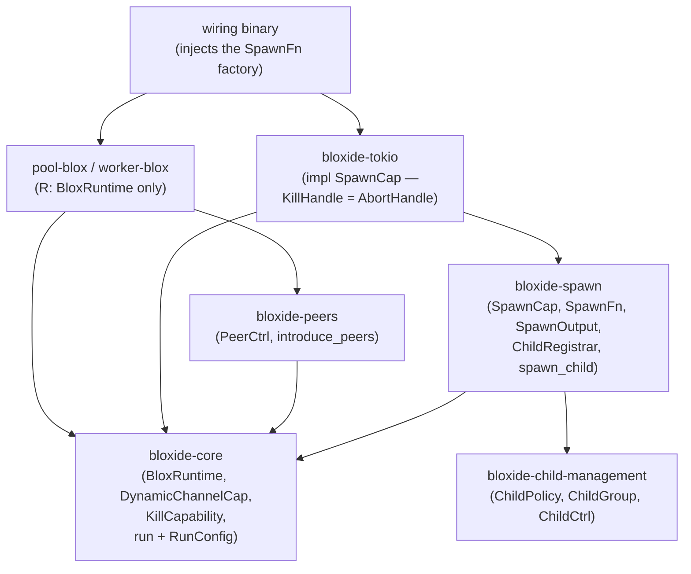
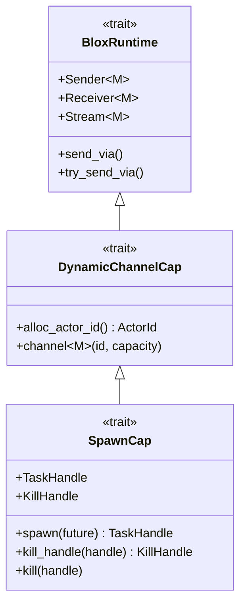
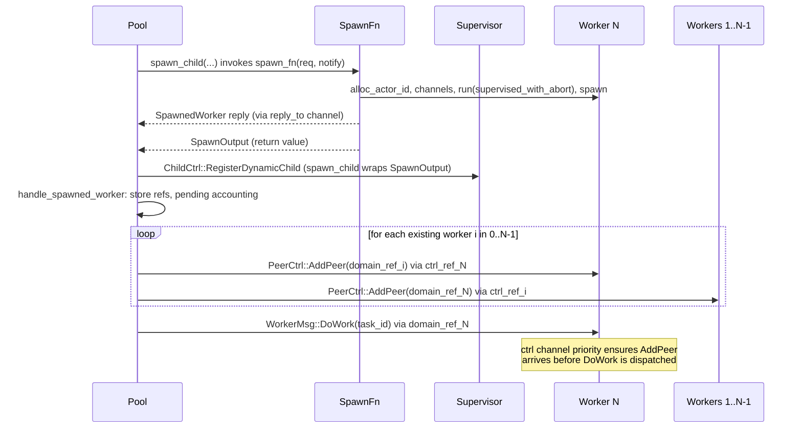

# Dynamic Actors

> **When would I use this?** Use this document when implementing dynamic actor
> spawning, understanding factory injection, or working with `SpawnCap` and
> peer introduction patterns.

Dynamic actor creation allows a running actor to spawn new actors at runtime — after
the executor has started. This is the v3 goal referenced in earlier specs, now
implemented for runtimes that support it (Tokio, TestRuntime).

## Purpose

### When to Use Dynamic Actor Creation

Static wiring (the Embassy model) is sufficient when the full actor topology is known
at compile time. Dynamic actor creation is necessary when:

- The number of workers is data-driven (e.g., one worker per incoming task)
- Actors are short-lived (e.g., a request handler that exits when done)
- Peers are discovered at runtime (e.g., a pool that introduces workers to each other
  after spawning)

Use static wiring wherever possible. Prefer dynamic actors only when the topology
genuinely cannot be determined before the executor starts.

### Runtime Support Matrix

| Runtime | Dynamic actors | Notes |
|---------|---------------|-------|
| `EmbassyRuntime` | No | Embassy tasks require compile-time static declarations |
| `TokioRuntime` | Yes | `tokio::task::spawn` — implements `SpawnCap` (`KillHandle = tokio::task::AbortHandle`) |
| `TestRuntime` | Yes | Collects futures in a thread-local; implements `SpawnCap` (kill is a no-op) |

Embassy has no dynamic spawning by design: `#[embassy_executor::task]` functions must
be declared at compile time and cannot be called from within a running task in the
general case. All Embassy actors use the static wiring pattern described in
[04-static-wiring.md](04-static-wiring.md).

---

## Dynamic Spawning Crates

Dynamic actor spawning and peer introduction are handled by three standard library
crates that parallel `bloxide-supervisor` (supervision) and `bloxide-timer`
(timers):

- **`bloxide-spawn`** — defines the `SpawnCap` Tier 2 trait, `SpawnFn`, `SpawnOutput`,
  `ChildRegistrar`, `ChildCtrlRegistrar`, and the `spawn_child` helper; provides `Kill`
  and re-exports `KillCapability` / `NoKill`
- **`bloxide-core`** — defines the `KillCapability` Tier 2 trait (used by the engine)
- **`bloxide-peers`** — defines peer introduction (`PeerCtrl`, `introduce_peers`,
  `apply_peer_control`, `broadcast_to_peers`)

This keeps all dynamic-spawning concerns out of blox crates while remaining
runtime-agnostic.

### Contents

| Crate | Module | Contents |
|-------|--------|----------|
| `bloxide-spawn` | `lib` | `SpawnCap` trait — Tier 2, extends `DynamicChannelCap`; `SpawnFn`, `SpawnOutput`, `ChildRegistrar`, `ChildCtrlRegistrar`, `spawn_child`, `Kill` |
| `bloxide-core` | `capability` | `KillCapability` trait, `NoKill` |
| `bloxide-peers` | `lib` | `PeerCtrl`, `AddPeer`, `RemovePeer`, `introduce_peers`, `apply_peer_control`, `broadcast_to_peers` |

All three crates are `no_std`.

### Generic Peer Control via `bloxide-peers`

For peer introduction, use the generic `PeerCtrl<M, R>` from `bloxide-peers` directly.
Generic peer handlers (`apply_peer_control`) live next to it; context crates provide
action functions only for domain-specific peer logic (e.g. `broadcast_result`).

**Why generic `PeerCtrl`?**
1. **No duplication** — `PeerCtrl<WorkerMsg, R>` is defined once in `bloxide-peers`, reused by any actor that needs peer introduction.
2. **Clearer names** — domain-specific action functions are self-documenting, while the control message type is generic.

**Where to define types:**
- **Control message types** (`PeerCtrl<M, R>`) — in **`bloxide-peers`**, imported by blox crates
- **Generic peer handlers** (`apply_peer_control`, `introduce_peers`, `broadcast_to_peers`) — in **`bloxide-peers`**
- **Domain-specific peer action functions** — in **context crates**

### Dependency Graph


```mermaid
flowchart TD
    BloxideCore["bloxide-core\n(BloxRuntime, DynamicChannelCap,\nKillCapability,\nrun + RunConfig)"]
    BloxideChildMgmt["bloxide-child-management\n(ChildPolicy, ChildGroup, ChildCtrl)"]
    BloxideSpawn["bloxide-spawn\n(SpawnCap, SpawnFn, SpawnOutput,\nChildRegistrar, spawn_child)"]
    BloxidePeers["bloxide-peers\n(PeerCtrl, introduce_peers)"]
    TokioRuntime["bloxide-tokio\n(impl SpawnCap —\nKillHandle = AbortHandle)"]
    PoolBlox["pool-blox / worker-blox\n(R: BloxRuntime only)"]
    WiringBinary["wiring binary\n(injects the SpawnFn factory)"]

    BloxideSpawn --> BloxideCore
    BloxideSpawn --> BloxideChildMgmt
    BloxidePeers --> BloxideCore
    TokioRuntime --> BloxideCore
    TokioRuntime --> BloxideSpawn
    PoolBlox --> BloxideCore
    PoolBlox --> BloxidePeers
    WiringBinary --> TokioRuntime
    WiringBinary --> PoolBlox
```

Blox crates depend on `bloxide-core` (for `BloxRuntime`) and `bloxide-peers`
(for peer introduction) but never on `bloxide-tokio`. Blox crates declare `R: BloxRuntime`
— not `R: SpawnCap`. The runtime dependency flows only through the wiring binary,
and `SpawnCap` is used only inside factory functions defined there.

---

## Peer Control Types via `bloxide-peers`

The recommended pattern for peer control is using the generic `PeerCtrl<M, R>` from
`bloxide-peers`, with domain-specific action functions in your context crate only
where the generic handlers don't suffice. This section shows the full pattern with
concrete examples.

### Control Message Type

Control messages are defined in `bloxide-peers` and imported by blox crates:

```rust
// In bloxide-peers/src/lib.rs
use bloxide_core::capability::BloxRuntime;
use bloxide_core::messaging::{ActorId, ActorRef};

/// Generic peer control message, parameterized by domain message type.
pub enum PeerCtrl<M: Send + 'static, R: BloxRuntime> {
    AddPeer(AddPeer<M, R>),
    RemovePeer(RemovePeer),
}

pub struct AddPeer<M: Send + 'static, R: BloxRuntime> {
    pub peer_id: ActorId,
    pub peer_ref: ActorRef<M, R>,
}

pub struct RemovePeer {
    pub peer_id: ActorId,
}
```

**Key characteristics:**
- Generic over both message type (`M`) and runtime (`R`) — `PeerCtrl<WorkerMsg, R>` for workers
- Defined once in `bloxide-peers`, reused by any actor that needs peer introduction
- No domain-specific control enum needed — the generic `PeerCtrl` from `bloxide-peers` provides type-safe peer management

### Peer Action Functions

The generic add/remove handler is a platform function in `bloxide-peers` —
`apply_peer_control(peers, ctrl)` applies a `PeerCtrl` command to a peer collection
(`AddPeer` is idempotent). Domain-specific peer logic lives in the **context crate**:

```rust
// In crates/blox-ctx-pool-ref/src/lib.rs
use bloxide_core::{BloxRuntime, messaging::ActorRef, transition::ActionResult, ActorId};
use pool_messages::{PeerResult, WorkerMsg};

/// Broadcast this worker's result to all registered peers.
pub fn broadcast_result<R: BloxRuntime>(
    self_id: ActorId,
    peers: &[ActorRef<WorkerMsg, R>],
    result: u32,
) -> ActionResult {
    bloxide_peers::broadcast_to_peers(
        self_id,
        peers,
        WorkerMsg::PeerResult(PeerResult { from_id: self_id, result }),
    )
}
```

With the action functions defined, context structs use plain fields:

```rust
// In worker-blox/src/generated/ctx.rs (generated by codegen)
pub struct WorkerCtx<R: BloxRuntime> {
    pub self_id: ActorId,
    pub pool_ref: ActorRef<PoolMsg, R>,
    pub task_id: u32,
    pub result: u32,
    pub peers: Vec<ActorRef<WorkerMsg, R>>,
}
```

### Applying Peer Control Messages

Handlers for control messages are wired declaratively in the blox — the worker
maps the generic `apply_peer_control` platform function onto its `peers` field:

```toml
# In worker-blox/blox.toml:
[[context.actions]]
name = "handle_ctrl"
crate = "bloxide_peers"
fn_name = "apply_peer_control"
kind = "transition"
fields = ["peers:mut"]
event_payload = "ctrl"
impl_required = false

[[topology.transitions]]
state = "Waiting"
event = "PeerCtrl::AddPeer(_) | PeerCtrl::RemovePeer(_)"
target = "stay"
actions = ["Self::handle_ctrl"]
```

### Factory Type with Domain-Specific Ctrl

The spawn factory type is `SpawnFn` from `bloxide-spawn`, generic over the
application's spawn request type. The spawn protocol types carry `ActorRef`s, so
they live in the domain context crate (`blox-ctx-pool-ref`), not in the plain-data
message crate:

```rust
// In bloxide-spawn/src/lib.rs
pub type SpawnFn<R, Req> = fn(req: Req, notify: ActorRef<ChildLifecycleEvent, R>) -> SpawnOutput<R>;

// In blox-ctx-pool-ref/src/lib.rs
pub enum SpawnRequest<Ctrl: Send + 'static, R: BloxRuntime> {
    Worker {
        task_id: u32,
        /// Reply channel: the factory sends `SpawnedWorker` here.
        reply_to: ActorRef<SpawnedWorker<Ctrl, R>, R>,
        /// Pool ref the worker needs to send results back.
        pool_ref: ActorRef<PoolMsg, R>,
    },
}

pub struct SpawnedWorker<Ctrl: Send + 'static, R: BloxRuntime> {
    pub child_id: ActorId,
    pub domain_ref: ActorRef<WorkerMsg, R>,
    pub ctrl_ref: ActorRef<Ctrl, R>,
}
```

The spawn is **two-phase**: the factory creates the child task, sends the
app-specific handles (`SpawnedWorker`) back to the requester on the request's
`reply_to` channel, and returns `SpawnOutput` (lifecycle/abort/kill handles) to
the `spawn_child` helper, which registers the child with the managing blox's
control mailbox.

---

## `SpawnCap` Trait

`SpawnCap` is a **Tier 2** capability trait for runtimes that can spawn futures
at runtime. It extends `DynamicChannelCap` (which itself extends `BloxRuntime`),
gaining both dynamic channel creation and task spawning.

```rust
// In bloxide-spawn/src/lib.rs
pub trait SpawnCap: DynamicChannelCap {
    /// Handle to a spawned task. Used to derive a `KillHandle`.
    type TaskHandle: Send + 'static;

    /// Cloneable handle for external task kill. `()` for runtimes without
    /// external kill.
    type KillHandle: Clone + Send + 'static;

    /// Spawn a future as an independent task and return a handle.
    fn spawn(future: impl Future<Output = ()> + Send + 'static) -> Self::TaskHandle;

    /// Derive a cloneable kill handle from a task handle.
    /// The task handle is consumed; the task continues running (drop does not kill).
    fn kill_handle(handle: Self::TaskHandle) -> Self::KillHandle;

    /// Kill a spawned task immediately via its kill handle. No callbacks fire —
    /// the task is dropped in-place.
    fn kill(handle: Self::KillHandle);
}
```

For Tokio, `TaskHandle = tokio::task::JoinHandle<()>` and
`KillHandle = tokio::task::AbortHandle` (`kill` calls `abort()`); the `JoinHandle`
is not `Clone`, so the factory converts it to an `AbortHandle` right after
spawning. For TestRuntime both handles are `()` and `kill` is a no-op. The `Kill`
struct in `bloxide-spawn` adapts `SpawnCap::kill` to the engine's
`KillCapability` trait; static runtimes (Embassy) use `NoKill` from
`bloxide-core` instead.

The full inheritance chain:


```mermaid
classDiagram
    class BloxRuntime {
        <<trait>>
        +Sender~M~
        +Receiver~M~
        +Stream~M~
        +send_via()
        +try_send_via()
    }
    class DynamicChannelCap {
        <<trait>>
        +alloc_actor_id() ActorId
        +channel~M~(id, capacity)
    }
    class SpawnCap {
        <<trait>>
        +TaskHandle
        +KillHandle
        +spawn(future) TaskHandle
        +kill_handle(handle) KillHandle
        +kill(handle)
    }

    BloxRuntime <|-- DynamicChannelCap
    DynamicChannelCap <|-- SpawnCap
```

**Actor ID spaces cannot collide**: compile-time wiring (`channels!`,
`next_actor_id!`, `spawn_timer!`) hands out small sequential IDs starting at 1
from a proc-macro counter; `DynamicChannelCap::alloc_actor_id` (dynamic spawn)
starts its counter at `DYNAMIC_ACTOR_ID_BASE` (1_000_000, defined in
`bloxide-core::capability`).

### Runtime Support

| Trait | `EmbassyRuntime` | `TokioRuntime` | `TestRuntime` |
|-------|:---:|:---:|:---:|
| `BloxRuntime` | yes | yes | yes |
| `StaticChannelCap` | yes | — | — |
| `DynamicChannelCap` | — | yes | yes |
| `TimerService` | yes | yes | — |
| `SpawnCap` | — | yes | yes |

(The actor run loop is not a per-runtime trait: all runtimes share the unified
`run()` + `RunConfig` from `bloxide-core`.)

---

## Unified `run()` with `RunConfig`

All actors run on a single generic `run()` function in `bloxide-core`
(re-exported by the runtime crates):

```rust
// In bloxide-core/src/runloop.rs
pub async fn run<S, M, R>(
    machine: StateMachine<S>,
    domain_mailboxes: M,
    config: RunConfig<R>,
    actor_id: ActorId,
)
where
    S: MachineSpec + 'static,
    M: Mailboxes<S::Event>,
    R: BloxRuntime;
```

The behavior is selected by passing a `RunConfig`:

| `RunConfig` method | `lifecycle` | `abort` | `supervisor_notify` | `auto_start` | `exit_on_stop` | `exit_on_fail` | Use case |
|---|---|---|---|---|---|---|---|
| `root()` | None | None | None | No | Yes | Yes | Top-level supervisor / root actor |
| `supervised(..)` | Some | None | Some | No | No | No | Supervised child (no kill capability) |
| `supervised_with_abort(..)` | Some | Some | Some | No | No | No | Supervised child with abort/kill capability |
| `unsupervised()` | None | None | None | Yes | Yes | Yes | Fire-and-forget dynamic actor |
| `bare()` | None | None | None | No | Yes | Yes | Test runtime / bare callers |

**Supervised actors stay alive on `Stopped` and `Failed`** — on `Stopped` the
actor self-suspends to Init and waits for a future `Start` or `Reset` from the
supervisor; on `Failed` the actor parks in its (absorbing) error state and the
supervisor's `ChildPolicy` applies (`Reset` revives it). Only `Done`, `Aborted`,
or stream-closed (`None`) exit the loop.

**Root/unsupervised/bare actors exit on `Stopped` and `Failed`** — the loop
returns, allowing the caller to terminate.

`DispatchOutcome::Done` (from `Decision::Done`) and `DispatchOutcome::Aborted`
always end the task, regardless of the config — `Done` is clean
self-termination (the supervisor deregisters the child), `Aborted` is
cooperative termination via the abort mailbox.

---

## Factory Injection Pattern

The primary dynamic actor pattern in bloxide is **factory injection**: a parent blox
stores an opaque factory function provided at wiring time. When the parent needs to
spawn a child, it calls the factory — which allocates channels, constructs and spawns
the child task, replies with the child's domain `ActorRef`s, and returns the
lifecycle handles for registration. The parent never references the concrete child
type.

This keeps the parent blox **decoupled from the child's concrete type** (upholding
invariant 9: "blox crates never import impl crates") and means the parent does not
need any `SpawnCap` bound — it only needs `R: BloxRuntime`.

### Generalized Factory Type

The factory function signature follows a general pattern: the request carries
everything the factory needs (including the parent's `ActorRef`, so the child can
reply, and a `reply_to` channel for the app-specific handles), and the factory
returns a `SpawnOutput` with the lifecycle/abort/kill handles the managing blox
needs for registration.

```rust
/// Generic factory type for spawning a child actor (bloxide-spawn).
///
/// - `R`: the runtime
/// - `Req`: the application's spawn request type (carries reply_to + parent refs)
///
/// The factory allocates channels, constructs the child's context and state machine,
/// spawns the task, sends the app-specific refs back on `req`'s reply channel, and
/// returns the SpawnOutput. `spawn_child` then wraps the SpawnOutput into the
/// managing blox's registration message.
pub type SpawnFn<R, Req> = fn(req: Req, notify: ActorRef<ChildLifecycleEvent, R>) -> SpawnOutput<R>;
```

The concrete pool example instantiates `Req` with `SpawnRequest<PeerCtrl<WorkerMsg, R>, R>`
from `blox-ctx-pool-ref`.

### Factory Implementation (Wiring Layer)

The factory lives in a Layer 3 impl crate consumed by the wiring binary — the
**only** place that knows the concrete child type (`WorkerCtx`, `WorkerSpec`):

```rust
// In crates/impl/tokio-pool-demo-impl/src/lib.rs (abridged)
pub fn spawn_worker<S>(
    req: SpawnRequest<PeerCtrl<WorkerMsg, TokioRuntime>, TokioRuntime>,
    notify: ActorRef<ChildLifecycleEvent, TokioRuntime>,
) -> SpawnOutput<TokioRuntime>
where
    S: MachineSpec<Ctx = WorkerCtx<TokioRuntime>>,
{
    match req {
        SpawnRequest::Worker { reply_to, pool_ref, .. } => {
            let worker_id = <TokioRuntime as DynamicChannelCap>::alloc_actor_id();
            // Ctrl channel is polled at index 0 (higher priority) so AddPeer
            // messages are processed before DoWork arrives on the domain channel.
            let (ctrl_ref, ctrl_rx) =
                <TokioRuntime as DynamicChannelCap>::channel::<PeerCtrl<WorkerMsg, TokioRuntime>>(worker_id, 16);
            let (domain_ref, domain_rx) =
                <TokioRuntime as DynamicChannelCap>::channel::<WorkerMsg>(worker_id, 16);
            let (lifecycle_ref, lifecycle_rx) =
                <TokioRuntime as DynamicChannelCap>::channel::<LifecycleCommand>(worker_id, 4);
            let (abort_ref, abort_rx) =
                <TokioRuntime as DynamicChannelCap>::channel::<AbortCommand>(worker_id, 4);

            let worker_ctx = WorkerCtx::new(worker_id, pool_ref);
            let machine = StateMachine::<S>::new(worker_ctx);

            let task_handle = <TokioRuntime as SpawnCap>::spawn(async move {
                run(
                    machine,
                    (ctrl_rx, domain_rx),
                    RunConfig::<TokioRuntime>::supervised_with_abort(
                        lifecycle_rx, abort_rx, notify.sender(),
                    ),
                    worker_id,
                )
                .await
            });

            // Convert the JoinHandle (not Clone) into a kill handle (Clone)
            // so the supervisor can store and clone it from &Event.
            let kill_handle = <TokioRuntime as SpawnCap>::kill_handle(task_handle);

            // Phase 1: reply to the requester with the app-specific refs.
            let _ = reply_to.try_send(worker_id, SpawnedWorker {
                child_id: worker_id,
                domain_ref: domain_ref.clone(),
                ctrl_ref: ctrl_ref.clone(),
            });

            // Phase 2: return the lifecycle handles for registration.
            SpawnOutput {
                child_id: worker_id,
                lifecycle_ref,
                abort_ref,
                kill_handle,
                policy: ChildPolicy::Stop,
            }
        }
    }
}
```

The factory is generic over the worker spec type `S` so the system-level codegen
can inject the concrete `WorkerSpec` (with real action closures) instead of the
blox-level stub spec — the generated `main.rs` monomorphizes it via a wrapper.

The factory is injected into `PoolCtx` at wiring time, together with the
registration refs (`spawn_ref`, `notify_ref`) and the reply channel
(`spawn_reply_ref`):

```rust
// From apps/tokio-pool-demo/src/main.rs (generated)
let pool_ctx = PoolCtx::new(
    pool_id,
    pool_ref.clone(),
    (|req, notify| {
        ::tokio_pool_demo_impl::spawn_worker::<
            crate::generated::worker_spec_skeleton::WorkerSpec<TokioRuntime>,
        >(req, notify)
    }) as _,
    sup_control_ref_0.clone(),
    sup_notify_ref_0.clone(),
    spawn_reply_ref.clone(),
);
```

In `system.toml` this injection is declared as:

```toml
[actors.inject]
spawn_fn = { source = "factory", crate = "tokio_pool_demo_impl", function = "spawn_worker" }
spawn_ref = { source = "actor", actor = "supervisor", field = "control" }
notify_ref = { source = "actor", actor = "supervisor", field = "notify" }
spawn_reply_ref = { source = "self_secondary", index = 1 }
```

### Factory Storage

The parent stores the factory as a plain constructor field (`spawn_fn`), declared
via `[[context.uses]]` with `role = "ctor"` — no accessor trait needed:

```rust
// pool-blox/src/generated/ctx.rs (dynamic variant, abridged)
pub struct PoolCtx<R: BloxRuntime> {
    pub self_id: ActorId,
    pub self_ref: ActorRef<PoolMsg, R>,
    pub spawn_fn: SpawnFn<R, SpawnRequest<PeerCtrl<WorkerMsg, R>, R>>,
    pub spawn_ref: ActorRef<ChildCtrl<R>, R>,
    pub notify_ref: ActorRef<ChildLifecycleEvent, R>,
    pub spawn_reply_ref: ActorRef<SpawnedWorker<PeerCtrl<WorkerMsg, R>, R>, R>,
    // ... state fields ...
}
```

### Two-Phase Spawn in the Pool Blox

The pool is a three-state machine (`Idle` / `Spawning` / `Active`) with a
second mailbox (`SpawnReply`) for `SpawnedWorker` replies. Spawning is
asynchronous: the request goes out in one transition, the reply arrives in a
later event.

- `Idle`/`Active` + `PoolMsg::SpawnWorker(_)` → `Spawning`, running
  `handle_spawn_worker`: record the task, set `spawn_in_flight`, and call
  `bloxide_spawn::spawn_child::<_, _, ChildCtrlRegistrar>(*spawn_fn, req, spawn_ref, notify_ref, self_id)`
- `Spawning` + `PoolMsg::SpawnWorker(_)` → stay, running
  `handle_spawn_worker_queued` (buffers the task ID in `spawn_queue`)
- `Spawning` + `PoolEvent::SpawnReply(_)` → `Active`, running
  `handle_spawned_worker` — with real guards: `spawn_in_flight || !spawn_queue.is_empty()`
  stays in `Spawning` (the action kicks off the next queued spawn);
  `pending == 0 && !worker_refs.is_empty()` stops

The spawn-request action in the impl crate (abridged):

```rust
// In crates/impl/tokio-pool-demo-impl/src/lib.rs
pub fn handle_spawn_worker<R: BloxRuntime>(
    self_id: ActorId,
    self_ref: &ActorRef<PoolMsg, R>,
    spawn_fn: &SpawnFn<R, SpawnRequest<PeerCtrl<WorkerMsg, R>, R>>,
    spawn_ref: &ActorRef<ChildCtrl<R>, R>,
    notify_ref: &ActorRef<ChildLifecycleEvent, R>,
    spawn_reply_ref: &ActorRef<SpawnedWorker<PeerCtrl<WorkerMsg, R>, R>, R>,
    pending_task_id: &mut u32,
    spawn_in_flight: &mut bool,
    pending: &mut u32,
    spawn_worker: &SpawnWorker,
) -> ActionResult {
    *pending_task_id = spawn_worker.task_id;
    *spawn_in_flight = true;
    *pending += 1;

    let req = SpawnRequest::Worker {
        task_id: spawn_worker.task_id,
        reply_to: spawn_reply_ref.clone(),
        pool_ref: self_ref.clone(),
    };
    ActionResult::from(bloxide_spawn::spawn_child::<_, _, ChildCtrlRegistrar>(
        *spawn_fn, req, spawn_ref, notify_ref, self_id,
    ))
}
```

`spawn_child` calls the factory (creating the child) and sends
`ChildCtrl::RegisterDynamicChild` — the `SpawnOutput` wrapped by
`ChildCtrlRegistrar` — to the managing blox's control mailbox. The supervisor
then registers the child via `ChildGroup::add_dynamic` and sends `Start`.

---

## Split Domain/Ctrl Ref Pattern

Each dynamically spawned child actor that participates in peer-to-peer messaging has
**two distinct `ActorRef`s** with different message types:

| Ref | Type | Purpose |
|-----|------|---------|
| Domain ref | `ActorRef<WorkerMsg, R>` | Application messages (DoWork, etc.) |
| Ctrl ref | `ActorRef<PeerCtrl<WorkerMsg, R>, R>` | Peer control (AddPeer, RemovePeer) |

The parent stores both in its context and uses them for different purposes:
- Domain ref: send work messages and keep the channel alive (self-sender invariant)
- Ctrl ref: introduce the child to other children via `introduce_peers`

### Mailbox Priority

The child actor's `Mailboxes` tuple places ctrl at index 0 (highest priority) and the
domain channel at index 1. This guarantees that `AddPeer` commands sent by the parent
are processed before any `DoWork` message — even if both are enqueued before the child
has processed anything. See [07-typed-mailboxes.md](07-typed-mailboxes.md) for the
polling priority semantics.

```rust
// worker-blox/src/generated/spec_skeleton.rs
impl<R: BloxRuntime> MachineSpec for WorkerSpec<R> {
    type Event = WorkerEvent<R>;

    /// Ctrl stream at index 0 (higher priority) ensures AddPeer commands are
    /// processed before DoWork arrives on the domain stream at index 1.
    type Mailboxes<Rt: BloxRuntime> = (
        R::Stream<PeerCtrl<WorkerMsg, R>>,   // index 0 — ctrl (higher priority)
        R::Stream<WorkerMsg>,                 // index 1 — domain
    );
    // ...
}
```

---

## P2P via Control Channel

When actors need to discover each other after they are running (e.g., a pool that
introduces two workers), use the generic `PeerCtrl<M, R>` control type from
`bloxide-peers` on a dedicated ctrl mailbox. This is the recommended pattern:
one generic control type, better type safety, and no domain-specific control enum.

`PeerCtrl<WorkerMsg, R>` is a second mailbox entry in the actor's `Mailboxes` tuple. There is
no new recv loop: the same single `poll_next` / dispatch cycle handles both domain
messages and control messages.

**Actor event enum** — generated by `bloxide-codegen` from `blox.toml`:

```toml
# In worker-blox/blox.toml:
[event]
name = "WorkerEvent"
generics = "<R: BloxRuntime>"

[[event.mailboxes]]
variant = "Ctrl"
message = "PeerCtrl<WorkerMsg>"
message_path = "bloxide_peers::PeerCtrl<pool_messages::WorkerMsg, R>"

[[event.mailboxes]]
variant = "Msg"
message = "WorkerMsg"
message_path = "pool_messages::WorkerMsg"
```

`PeerCtrl` handling is wired to `bloxide_peers::apply_peer_control` as shown in
[Applying Peer Control Messages](#applying-peer-control-messages) above.

When a `SpawnedWorker` reply arrives, the pool's `handle_spawned_worker` action
introduces the newcomer to all existing workers via bidirectional `AddPeer` messages.
The sequence for adding worker N (with N-1 workers already running):


```mermaid
sequenceDiagram
    participant Pool
    participant Factory as SpawnFn
    participant Sup as Supervisor
    participant NewWorker as Worker N
    participant OldWorker as Workers 1..N-1

    Pool->>Factory: spawn_child(...) invokes spawn_fn(req, notify)
    Factory->>NewWorker: alloc_actor_id, channels, run(supervised_with_abort), spawn
    Factory-->>Pool: SpawnedWorker reply (via reply_to channel)
    Factory-->>Pool: SpawnOutput (return value)
    Pool->>Sup: ChildCtrl::RegisterDynamicChild (spawn_child wraps SpawnOutput)

    Pool->>Pool: handle_spawned_worker: store refs, pending accounting
    loop for each existing worker i in 0..N-1
        Pool->>NewWorker: PeerCtrl::AddPeer(domain_ref_i) via ctrl_ref_N
        Pool->>OldWorker: PeerCtrl::AddPeer(domain_ref_N) via ctrl_ref_i
    end

    Pool->>NewWorker: WorkerMsg::DoWork(task_id) via domain_ref_N
    Note over NewWorker: ctrl channel priority ensures AddPeer<br/>arrives before DoWork is dispatched
```

The peer-introduction logic lives in the impl crate's `handle_spawned_worker`,
calling `introduce_peers` (from `bloxide-peers`) once per existing worker —
note that `introduce_peers` takes the refs **by value**:

```rust
// In crates/impl/tokio-pool-demo-impl/src/lib.rs (abridged)
for i in 0..worker_refs.len() {
    bloxide_peers::introduce_peers(
        self_id,
        worker_refs[i].id(),
        worker_refs[i].clone(),
        worker_ctrls[i].clone(),
        new_worker_id,
        new_domain_ref.clone(),
        new_ctrl_ref.clone(),
    );
}
```

`introduce_peers` sends `PeerCtrl::AddPeer` to both actors,
each receiving the other's domain `ActorRef`. The control channel is separate from
the domain channel so existing message ordering is unaffected.

### Batch Spawn (Known Topology)

When a parent spawns a fixed set of actors whose cross-references are all known at
spawn time, wire them directly at construction without a control channel:

```rust
// Both actors are constructed before either is spawned.
// Cross-refs are injected directly into each Ctx.
let a_id = R::alloc_actor_id();
let (ctrl_a, ctrl_rx_a) = R::channel::<PeerCtrl<WorkerMsg, R>>(a_id, 16);
let (domain_a, domain_rx_a) = R::channel::<WorkerMsg>(a_id, 16);
let b_id = R::alloc_actor_id();
let (ctrl_b, ctrl_rx_b) = R::channel::<PeerCtrl<WorkerMsg, R>>(b_id, 16);
let (domain_b, domain_rx_b) = R::channel::<WorkerMsg>(b_id, 16);

let ctx_a = WorkerCtx::new(a_id, pool_ref.clone());
let ctx_b = WorkerCtx::new(b_id, pool_ref.clone());

R::spawn(run(StateMachine::new(ctx_a), (ctrl_rx_a, domain_rx_a), RunConfig::<R>::unsupervised(), a_id));
R::spawn(run(StateMachine::new(ctx_b), (ctrl_rx_b, domain_rx_b), RunConfig::<R>::unsupervised(), b_id));
// Then introduce them to each other (refs by value):
introduce_peers(pool_id, a_id, domain_a, ctrl_a, b_id, domain_b, ctrl_b);
```

Use Batch Spawn when all peers are known before any task starts. Use the control
channel when peers are discovered incrementally at runtime.

### Parent-Mediated Routing

A parent that routes messages to children by forwarding from its own mailbox requires
no control channel. The parent holds `Vec<ActorRef<ChildMsg, R>>` and calls
`try_send` in its action functions. No control channel is needed because workers never
need direct peer references.

---

## Dynamic Collections

When the number of spawned actors is not fixed at compile time, use a `Vec`. The pool
blox context uses split collections: one for domain refs, one for ctrl refs.
```rust
// pool-blox/src/generated/ctx.rs (non-dynamic variant)
pub struct PoolCtx<R: BloxRuntime> {
    pub self_id: ActorId,
    /// Pool's own ActorRef — cloned into each worker at spawn time so the
    /// worker can notify the pool when done. Also keeps the pool channel open.
    pub self_ref: ActorRef<PoolMsg, R>,
    /// Domain ActorRefs for all spawned workers (keeps their channels alive).
    pub worker_refs: Vec<ActorRef<WorkerMsg, R>>,
    /// Ctrl ActorRefs for all spawned workers (used for peer introduction).
    pub worker_ctrls: Vec<ActorRef<PeerCtrl<WorkerMsg, R>, R>>,
    /// Number of workers whose `WorkDone` we are still waiting for.
    pub pending: u32,
}
```

With the `dynamic` feature enabled, the constructor additionally takes
`spawn_fn`, `spawn_ref`, `notify_ref`, and `spawn_reply_ref` (see
[Factory Storage](#factory-storage)), and the context gains the spawn state
fields `pending_task_id`, `spawn_in_flight`, and `spawn_queue` — state fields
are zero-initialized via `Default::default()` in `Ctx::new`.

Action functions access `spawn_fn`, `worker_refs`, `worker_ctrls`, and `pending`
directly as plain fields.
**`alloc` requirement**: `Vec<ActorRef<M, R>>` requires the `alloc` crate. Blox
crates that use dynamic collections must declare `extern crate alloc` and configure
their `no_std` crate accordingly.

**Self-sender invariant**: The collection owner keeps all channels alive. As long as
the `PoolCtx` lives (i.e., as long as the pool actor task runs), every worker channel
remains open. When the pool's task exits or the `Vec` drops a ref, that worker's
channel may close.

---

## Actor Lifecycle

### `run()` Exit Conditions

An actor run with `run()` exits when any of the following occur:

```mermaid
stateDiagram-v2
    [*] --> Init
    Init --> Running : "Start command received via lifecycle mailbox"
    Running --> Running : "domain events (stay / self-transition)"
    Running --> Running : "Decision::Reset → initial_state()"
    Running --> Init : "Decision::Stop → self-suspend (Stopped)"
    Running --> Error : "Decision::Fail → error_state() (Failed)"
    Running --> [*] : "Decision::Done → task ends (Done)"
    Init --> [*] : "Aborted (abort mailbox)"
    Error --> [*] : "task exits only if exit_on_fail"
```

| Exit condition | `DispatchOutcome` | Notes |
|---|---|---|
| Self-stop | `Stopped` | Actor returned `Decision::Stop` — suspends in Init; task exits only when `exit_on_stop` (root/unsupervised/bare), supervised tasks stay alive |
| Self-done | `Done` | Actor returned `Decision::Done` — task always ends; supervisor deregisters the child (no restart policy) |
| Error state | `Failed` | Actor returned `Decision::Fail` — parks in `error_state()` (or Init when none); task exits only when `exit_on_fail`, supervised tasks stay alive and `ChildPolicy` applies (`Reset` revives) |
| Aborted | `Aborted` | `AbortCommand` received on abort mailbox — task always exits cooperatively |
| Killed | — | `ChildPolicy::Kill` ripcord — `KillCapability::kill(handle)` destroys the task externally; no outcome is reported by the task (the supervisor synthesizes `ChildLifecycleEvent::Killed`) |

### Shutdown via Domain Messages

An actor can define a graceful shutdown path through its own HSM state topology. For
example, a worker that accepts a `Shutdown` variant in its message enum can return
`Decision::Stop` from its guard to self-suspend:

```rust
pub enum WorkerMsg {
    Process(ProcessMsg),
    Shutdown,
}
```

When the worker receives `Shutdown` and its guard returns `Decision::Stop`, the
run loop sees `DispatchOutcome::Stopped`. A supervised worker stays alive
(suspended in Init, revivable by `Reset`); an unsupervised worker
(`exit_on_stop = true`) returns from `run()`, ending the task. The parent
detects the worker is gone because the channel eventually closes when all
non-self senders drop.

---

## Testing with Factory Injection

Since pool-blox stores the spawn factory as a field, tests inject a test factory
rather than trying to mock `SpawnCap` directly. The test factory uses `TestRuntime`
(which implements `SpawnCap`) to create channels and spawn the worker, exercising the
same factory interface the production wiring binary uses.

### Pool Blox Tests

Blox-level tests run against the blox-level `PoolSpec`, whose action closures are
**stubs** (a `let _stub = "name";` marker returning `ActionResult::Ok`) while the
guards are real. They cover topology and guard-driven transitions only; behavior
that lives in the concrete actions (spawn accounting, `DoWork` dispatch) is
covered at the app level by `apps/tokio-pool-demo/tests/`, which drives the
system-generated concrete specs with the real `tokio_pool_demo_impl` factory.

```rust
use bloxide_child_management::{ChildCtrl, ChildPolicy};
use bloxide_core::capability::DynamicChannelCap;
use bloxide_core::lifecycle::{ChildLifecycleEvent, LifecycleCommand};
use bloxide_core::{Envelope, StateMachine};
use bloxide_peers::PeerCtrl;
use bloxide_spawn::{SpawnFn, SpawnOutput};
use bloxide_test_runtime::TestRuntime;
use blox_ctx_pool_ref::{SpawnRequest, SpawnedWorker};

/// Dummy spawn function for tests: creates channels, sends the SpawnedWorker
/// reply, and returns a SpawnOutput. The worker task is not actually spawned.
fn test_spawn_worker(
    req: SpawnRequest<PeerCtrl<WorkerMsg, TestRuntime>, TestRuntime>,
    _notify: ActorRef<ChildLifecycleEvent, TestRuntime>,
) -> SpawnOutput<TestRuntime> {
    match req {
        SpawnRequest::Worker { reply_to, .. } => {
            let worker_id = TestRuntime::alloc_actor_id();
            let (domain_ref, _domain_rx) =
                <TestRuntime as DynamicChannelCap>::channel::<WorkerMsg>(worker_id, 16);
            let (ctrl_ref, _ctrl_rx) =
                <TestRuntime as DynamicChannelCap>::channel::<PeerCtrl<WorkerMsg, TestRuntime>>(worker_id, 16);
            let (lifecycle_ref, _lifecycle_rx) =
                <TestRuntime as DynamicChannelCap>::channel::<LifecycleCommand>(worker_id, 4);
            let (abort_ref, _abort_rx) =
                <TestRuntime as DynamicChannelCap>::channel::<AbortCommand>(worker_id, 4);

            let _ = reply_to.try_send(worker_id, SpawnedWorker {
                child_id: worker_id,
                domain_ref: domain_ref.clone(),
                ctrl_ref: ctrl_ref.clone(),
            });

            SpawnOutput {
                child_id: worker_id,
                lifecycle_ref,
                abort_ref,
                kill_handle: (),       // TestRuntime has no external kill
                policy: ChildPolicy::Stop,
            }
        }
    }
}

#[test]
fn spawn_worker_transitions_idle_to_spawning() {
    let pool_id = TestRuntime::alloc_actor_id();
    let (pool_ref, _pool_rx) = TestRuntime::channel::<PoolMsg>(pool_id, 32);
    // ... control / notify / spawn_reply channels ...
    let ctx = PoolCtx::new(
        pool_id,
        pool_ref,
        test_spawn_worker as SpawnFn<_, _>,
        control_ref,
        notify_ref,
        spawn_reply_ref,
    );
    let mut machine = StateMachine::<PoolSpec<TestRuntime>>::new(ctx);
    machine.dispatch(PoolEvent::Lifecycle(LifecycleCommand::Start));

    machine.dispatch(PoolEvent::Msg(Envelope(
        0,
        PoolMsg::SpawnWorker(SpawnWorker { task_id: 1 }),
    )));

    assert_eq!(machine.current_state(), MachineState::State(PoolState::Spawning));
    // Stub actions are no-ops: no spawn accounting happens at blox level.
    assert_eq!(machine.ctx().pending, 0);
}
```

### Worker Blox Tests

Worker blox tests do not need a factory at all — workers are spawned by pools, not by
themselves. Use `DynamicChannelCap` to create channels and drive the machine directly:

```rust
#[test]
fn do_work_transitions_to_stop() {
    let pool_id = TestRuntime::alloc_actor_id();
    let (pool_ref, _pool_rx) = TestRuntime::channel::<PoolMsg>(pool_id, 16);

    let worker_id = TestRuntime::alloc_actor_id();
    let ctx = WorkerCtx::new(worker_id, pool_ref);
    let mut machine = StateMachine::<WorkerSpec<TestRuntime>>::new(ctx);
    machine.dispatch(WorkerEvent::Lifecycle(LifecycleCommand::Start));

    machine.dispatch(Envelope(0, WorkerMsg::DoWork(DoWork { task_id: 42 })).into());

    assert!(machine.current_state().is_init());  // Decision::Stop → Init
    // Stub actions are no-ops: task_id/result stay zero at blox level.
    assert_eq!(machine.ctx().task_id, 0);
}
```

The spawned future from `SpawnCap::spawn` is never driven in unit tests —
only the state machine behavior is tested via direct dispatch.

### Spawn Inspection Functions

`bloxide-test-runtime` exposes free functions for inspecting submitted futures:

| Function | Description |
|----------|-------------|
| `spawned_count() -> usize` | Number of futures submitted since the last `drain_spawned` |
| `drain_spawned() -> Vec<Pin<Box<dyn Future<Output = ()> + Send>>>` | Drains all submitted futures; resets the count to 0 |

Both operate on a `thread_local!` so each test thread is isolated.

---

## When to Use Factory Injection vs Direct SpawnCap

| Scenario | Pattern | Why |
|----------|---------|-----|
| Parent spawns children of a **different** type | Factory injection | Parent blox never imports child's concrete type; upholds invariant 9 |
| Worker pool that doesn't know worker count at compile time | Factory injection | Factory is called N times, returning new refs each time |
| Self-replicating actors (actor spawns another of its own type) | Direct `SpawnCap` | Spawner and spawned are the same type — no decoupling needed |
| Test scenarios for bloxes that hold factories | Inject a test factory | Same factory interface, uses `TestRuntime` internally |

**Rule**: Blox crates should not declare `R: SpawnCap`. If a blox needs to spawn actors,
    it should receive a factory function as a plain constructor field (e.g. `spawn_fn`,
    injected via `[actors.inject]` with `source = "factory"`) rather than calling
    `SpawnCap::spawn` directly. This keeps blox crates
    compilable with any `R: BloxRuntime`.

---

## Rules

The following rules extend the [core invariants in AGENTS.md](../../AGENTS.md):

1. **Domain messages remain plain data** — message enums must never be generic over
   `R`, and must never contain `ActorRef`. A worker that needs to reply to its parent
   stores the parent's `ActorRef<ReplyMsg, R>` in its `Ctx`, not in the message.

2. **Control messages can carry ActorRef** — peer control message types
   (e.g., `PeerCtrl<WorkerMsg, R>`) may contain `ActorRef` fields. These are defined in `bloxide-peers`
   and are safe because `ActorRef` is a clonable handle, not a borrow.

3. **Spawn protocol types live in domain context crates** — `SpawnRequest` /
   `SpawnedWorker` carry `ActorRef`s, so they live in `blox-ctx-pool-ref`, not in
   the plain-data `pool-messages` crate.

4. **One recv loop per actor** — control channels are merged into the
   actor's `Mailboxes` tuple. There is one `poll_next` → `dispatch` cycle regardless
   of how many channel types the actor monitors.

5. **Ctrl before domain in mailboxes** — when a child actor has both a domain channel
   and a control channel, place ctrl at index 0. This ensures `AddPeer` commands
   from the parent are processed before any domain work messages.

6. **Factory injection over direct SpawnCap** — blox crates receive a spawn factory
    as a plain constructor field (e.g. `spawn_fn`) rather than declaring `R: SpawnCap`.
    Only the wiring binary
   and test helpers use `SpawnCap` directly.

7. **Use `bloxide-peers` for peer control** — import `PeerCtrl<M, R>` from `bloxide-peers` (with `AddPeer`/`RemovePeer` variants) and wire the generic `apply_peer_control` handler in `blox.toml`; define action functions in your context crate only for domain-specific peer logic (e.g. `broadcast_result`).

8. **Domain peer action functions in context crates** — domain-specific peer action functions (result broadcasts, domain notifications) must be defined in context crates (not message or blox crates).

---

## Constraints

- **Embassy has no `SpawnCap`** — Embassy tasks are declared at compile time with
  `#[embassy_executor::task]` and cannot be created dynamically. All Embassy bloxes
  use the static wiring pattern in [04-static-wiring.md](04-static-wiring.md).

- **`alloc` required for `Vec<ActorRef<M, R>>`** — dynamic collections require heap
  allocation. Blox crates using peer lists must declare
  `extern crate alloc` and configure their `no_std` crate accordingly.

- **Supervised dynamic actors — implemented via explicit registration** — dynamic
  children can be supervised by using the supervisor control-plane protocol:
  1. Spawn the child with `run()` + `RunConfig::supervised(...)` (or
     `supervised_with_abort(...)` when abort/kill capability is needed) and a
     per-child lifecycle channel.
  2. The `spawn_child()` helper sends `ChildCtrl::RegisterDynamicChild` (the
     `SpawnOutput` wrapped by `ChildCtrlRegistrar`) to the managing blox's
     control mailbox.
  3. The supervisor adds the child via `ChildGroup::add_dynamic` (storing the
     abort/kill handles) and sends `Start`.
  On Tokio, prefer the `spawn_child()` helper from `bloxide-spawn` (with factory
  injection) to avoid wiring boilerplate — see the pool demo.
  This keeps the model deterministic and explicit without requiring mutable access to
  the supervisor's `ChildGroup` from inside domain action functions.

- **`ChildPolicy::Kill` / `ChildPolicy::Abort` require dynamic children** — they
  need the abort/kill handles that only dynamic spawn provides. `ChildGroup::add`
  panics if either policy is requested for a static child; use
  `ChildPolicy::Reset`/`Stop` for static children. `ChildPolicy::Stop` sends no
  command — the child is simply marked done for the epoch.

## Related Docs

- **Priority mailboxes** → `spec/architecture/07-typed-mailboxes.md`
- **Peer introduction API** → `crates/bloxide-peers/src/lib.rs`
- **Pool/Worker blox specs** → `spec/bloxes/pool.md`, `spec/bloxes/worker.md`
- **Tokio SpawnCap impl** → `runtimes/bloxide-tokio/src/spawn.rs`
- **TestRuntime SpawnCap impl** (`spawned_count` / `drain_spawned`) → `runtimes/bloxide-test-runtime/src/lib.rs`
- **Spawn traits and helpers** → `crates/bloxide-spawn/src/lib.rs`
