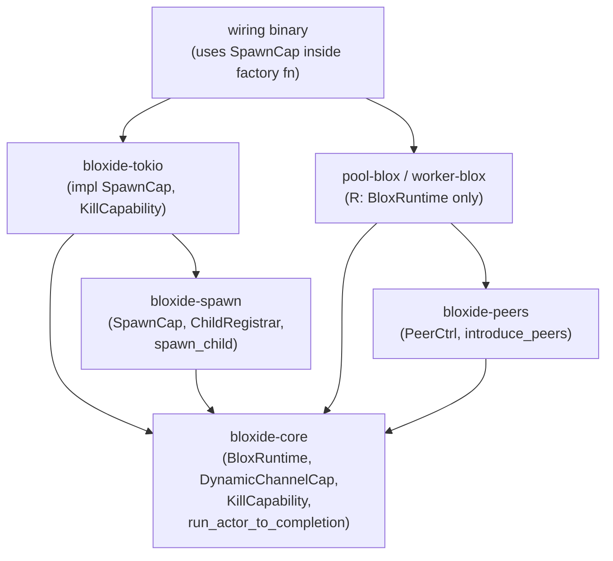
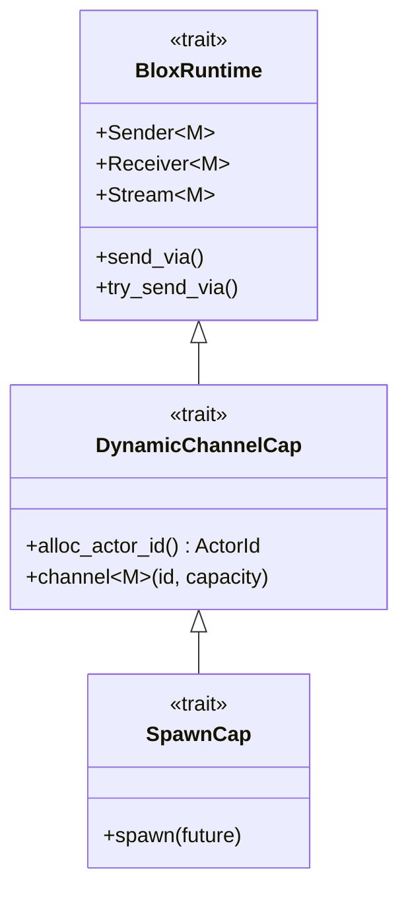
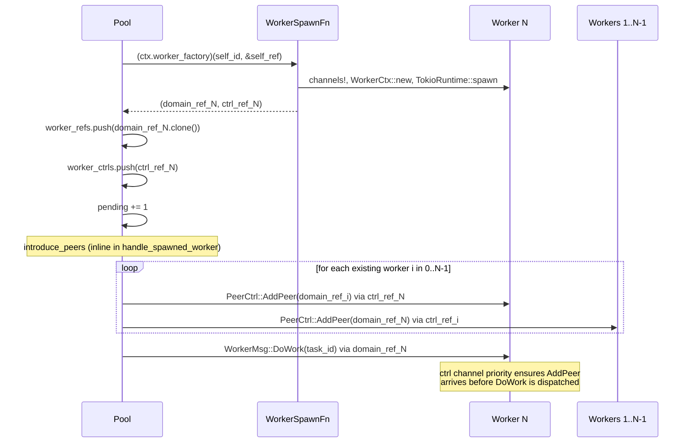

# Dynamic Actors

> **When would I use this?** Use this document when implementing dynamic actor
> spawning, understanding factory injection, or working with `SpawnCap` and
> peer introduction patterns.

Dynamic actor creation allows a running actor to spawn new actors at runtime — after
the executor has started. This is the v3 goal referenced in earlier specs, now
implemented for runtimes that support it (Tokio, TestRuntime).

## Purpose

### When to Use Dynamic Actor Creation

Static wiring (the Embassy model) is sufficient when the full actor topology is known
at compile time. Dynamic actor creation is necessary when:

- The number of workers is data-driven (e.g., one worker per incoming task)
- Actors are short-lived (e.g., a request handler that exits when done)
- Peers are discovered at runtime (e.g., a pool that introduces workers to each other
  after spawning)

Use static wiring wherever possible. Prefer dynamic actors only when the topology
genuinely cannot be determined before the executor starts.

### Runtime Support Matrix

| Runtime | Dynamic actors | Notes |
|---------|---------------|-------|
| `EmbassyRuntime` | No | Embassy tasks require compile-time static declarations |
| `TokioRuntime` | Yes | `tokio::task::spawn` — implements `SpawnCap` |
| `TestRuntime` | Yes | Collects futures in a thread-local; implements `SpawnCap` |

Embassy has no dynamic spawning by design: `#[embassy_executor::task]` functions must
be declared at compile time and cannot be called from within a running task in the
general case. All Embassy actors use the static wiring pattern described in
[04-static-wiring.md](04-static-wiring.md).

---

## Dynamic Spawning Crates

Dynamic actor spawning and peer introduction are handled by three standard library
crates that parallel `bloxide-supervisor` (supervision) and `bloxide-timer`
(timers):

- **`bloxide-spawn`** — defines the `SpawnCap` Tier 2 trait, `ChildRegistrar`, `SpawnFn`, `spawn_child`
- **`bloxide-core`** — defines `KillCapability` Tier 2 trait (used by the engine)
- **`bloxide-peers`** — defines peer introduction (`PeerCtrl`, `introduce_peers`)

This keeps all dynamic-spawning concerns out of blox crates while remaining
runtime-agnostic.

### Contents

| Crate | Module | Contents |
|-------|--------|----------|
| `bloxide-spawn` | `lib` | `SpawnCap` trait — Tier 2, extends `DynamicChannelCap`; `ChildRegistrar`, `SpawnFn`, `spawn_child` |
| `bloxide-core` | `capability` | `KillCapability` trait |
| `bloxide-peers` | `lib` | `PeerCtrl`, `AddPeer`, `RemovePeer`, `HasPeers`, `introduce_peers` |

All three crates are `no_std`.

### Generic Peer Control via `bloxide-peers`

For peer introduction, use the generic `PeerCtrl<M, R>` from `bloxide-peers` directly. Context crates provide action functions for domain-specific peer management.

**Why generic `PeerCtrl`?**
1. **No duplication** — `PeerCtrl<WorkerMsg, R>` is defined once in `bloxide-peers`, reused by any actor that needs peer introduction.
2. **Clearer names** — domain-specific action functions are self-documenting, while the control message type is generic.

**Where to define types:**
- **Control message types** (`PeerCtrl<M, R>`) — in **`bloxide-peers`**, imported by blox crates
- **Peer action functions** — in **context crates**

### Dependency Graph


```mermaid
flowchart TD
    BloxideCore["bloxide-core\n(BloxRuntime, DynamicChannelCap,\nKillCapability,\nrun_actor_to_completion)"]
    BloxideSpawn["bloxide-spawn\n(SpawnCap, ChildRegistrar,\nspawn_child)"]
    BloxidePeers["bloxide-peers\n(PeerCtrl, introduce_peers)"]
    TokioRuntime["bloxide-tokio\n(impl SpawnCap, KillCapability)"]
    PoolBlox["pool-blox / worker-blox\n(R: BloxRuntime only)"]
    WiringBinary["wiring binary\n(uses SpawnCap inside factory fn)"]

    BloxideSpawn --> BloxideCore
    BloxidePeers --> BloxideCore
    TokioRuntime --> BloxideCore
    TokioRuntime --> BloxideSpawn
    PoolBlox --> BloxideCore
    PoolBlox --> BloxidePeers
    WiringBinary --> TokioRuntime
    WiringBinary --> PoolBlox
```

Blox crates depend on `bloxide-core` (for `BloxRuntime`) and `bloxide-peers`
(for peer introduction) but never on `bloxide-tokio`. Blox crates declare `R: BloxRuntime`

## Peer Control Types via `bloxide-peers`

The recommended pattern for peer control is using the generic `PeerCtrl<M, R>` from
`bloxide-peers` with domain-specific action functions in your context crate. This section
shows the full pattern with concrete examples.

### Control Message Type

Control messages are defined in `bloxide-peers` and imported by blox crates:

```rust
// In bloxide-peers/src/lib.rs
use bloxide_core::actor::{ActorId, ActorRef};
use bloxide_core::capability::BloxRuntime;

/// Generic peer control message, parameterized by domain message type.
pub enum PeerCtrl<M, R: BloxRuntime> {
    AddPeer(AddPeer<M, R>),
    RemovePeer(RemovePeer),
}

pub struct AddPeer<M, R: BloxRuntime> {
    pub peer_id: ActorId,
    pub peer_ref: ActorRef<M, R>,
}

pub struct RemovePeer {
    pub peer_id: ActorId,
}
```

**Key characteristics:**
- Generic over both message type (`M`) and runtime (`R`) — `PeerCtrl<WorkerMsg, R>` for workers
- Defined once in `bloxide-peers`, reused by any actor that needs peer introduction
- No domain-specific control enum needed — the generic `PeerCtrl` from `bloxide-peers` provides type-safe peer management

### Defining Peer Action Functions

Peer action functions are defined in the **context crate**:

```rust
// In blox-ctx-workers/src/lib.rs
use bloxide_core::actor::{ActorId, ActorRef};
use bloxide_core::capability::BloxRuntime;
use pool_messages::WorkerMsg;

/// Add a peer ref to the peer list.
pub fn add_peer<R: BloxRuntime>(
    peers: &mut Vec<ActorRef<WorkerMsg, R>>,
    peer_ref: ActorRef<WorkerMsg, R>,
) {
    peers.push(peer_ref);
}

/// Remove a peer ref by ActorId.
pub fn remove_peer<R: BloxRuntime>(
    peers: &mut Vec<ActorRef<WorkerMsg, R>>,
    peer_id: ActorId,
) {
    peers.retain(|r| r.id() != peer_id);
}
```

With the action functions defined, context structs use plain fields:

```rust
// In worker-blox/src/ctx.rs (generated by codegen)
pub struct WorkerCtx<R: BloxRuntime> {
    pub self_id: ActorId,
    pub pool_ref: ActorRef<PoolMsg, R>,
    pub peers: Vec<ActorRef<WorkerMsg, R>>,
}
```

### Applying Peer Control Messages

Handlers for domain-specific control messages are defined in the blox:

```rust
// In worker-blox/src/spec.rs
use bloxide_peers::PeerCtrl;

fn handle_worker_ctrl<R: BloxRuntime>(ctx: &mut WorkerCtx<R>, ctrl: &PeerCtrl<WorkerMsg, R>) -> ActionResult {
    match ctrl {
        PeerCtrl::AddPeer(add) => {
            ctx.peers.push(add.peer_ref.clone());
            blox_log_info!("worker {:?}: added peer {:?}", ctx.self_id, add.peer_id);
        }
        PeerCtrl::RemovePeer(remove) => {
            ctx.peers.retain(|r| r.id() != remove.peer_id);
            blox_log_info!("worker {:?}: removed peer {:?}", ctx.self_id, remove.peer_id);
        }
    }
    ActionResult::Ok
}
```

```toml
# In the [[topology.transitions]] table in blox.toml:
[[topology.transitions]]
pattern = "PeerCtrl(add)"
actions = ["handle_worker_ctrl_inline"]
to = "stay"
```

### Factory Type with Domain-Specific Ctrl

The spawn factory returns the domain-specific control type:

```rust
// In pool-messages/src/lib.rs (or blox-ctx-workers)
pub type WorkerSpawnFn<R> = fn(
    ActorId,
    &ActorRef<PoolMsg, R>,
) -> (ActorRef<WorkerMsg, R>, ActorRef<PeerCtrl<WorkerMsg, R>, R>);
```


---
— not `R: SpawnCap`. The runtime dependency flows only through the wiring binary,
and `SpawnCap` is used only inside factory functions defined there.

---

## `SpawnCap` Trait

`SpawnCap` is a **Tier 2** capability trait for runtimes that can spawn futures
at runtime. It extends `DynamicChannelCap` (which itself extends `BloxRuntime`),
gaining both dynamic channel creation and task spawning.

```rust
/// Tier 2 capability for runtimes that support spawning actor tasks at runtime.
///
/// Extends `DynamicChannelCap` (which provides `alloc_actor_id` and `channel`).
/// Blox crates do not declare `R: SpawnCap`. SpawnCap is used inside factory
/// functions at the wiring layer.
/// Embassy does NOT implement this trait — use static wiring for Embassy.
pub trait SpawnCap: DynamicChannelCap {
    /// Spawn a future as an independent task.
    fn spawn(future: impl Future<Output = ()> + Send + 'static);
}
```

The full inheritance chain:


```mermaid
classDiagram
    class BloxRuntime {
        <<trait>>
        +Sender~M~
        +Receiver~M~
        +Stream~M~
        +send_via()
        +try_send_via()
    }
    class DynamicChannelCap {
        <<trait>>
        +alloc_actor_id() ActorId
        +channel~M~(id, capacity)
    }
    class SpawnCap {
        <<trait>>
        +spawn(future)
    }

    BloxRuntime <|-- DynamicChannelCap
    DynamicChannelCap <|-- SpawnCap
```

### Runtime Support

| Trait | `EmbassyRuntime` | `TokioRuntime` | `TestRuntime` |
|-------|:---:|:---:|:---:|
| `BloxRuntime` | yes | yes | yes |
| `StaticChannelCap` | yes | — | — |
| `DynamicChannelCap` | — | yes | yes |
| `TimerService` | yes | yes | — |
| `SupervisedRunLoop` | yes | yes | — |
| `SpawnCap` | — | yes | yes |

---

## `run_actor_to_completion`

Defined in `bloxide-core::actor`:

```rust
/// Run an actor until it stops, fails, or is aborted.
///
/// Dispatches events until `DispatchOutcome::Stopped`, `DispatchOutcome::Failed`,
/// or `DispatchOutcome::Aborted` is observed. Suitable for dynamically spawned
/// actors that should exit their task when their work is done.
///
/// Note: This function does NOT call `machine.start()`. The actor expects lifecycle
/// commands (including Start) to arrive via the event stream.
///
///
/// This is the **unsupervised** runner used by the test runtime. The Tokio and
/// Embassy runtimes each provide a unified `run()` function that handles both
/// supervised and unsupervised execution with optional lifecycle/abort streams.
pub async fn run_actor_to_completion<S, M>(mut machine: StateMachine<S>, mut mailboxes: M)
where
    S: MachineSpec + 'static,
    M: Mailboxes<S::Event>,
{
    loop {
        let event = match poll_fn(|cx| mailboxes.poll_next(cx)).await {
            Some(event) => event,
            None => return,
        };
        match machine.dispatch(event) {
            DispatchOutcome::Failed => return,
            DispatchOutcome::Stopped => return,
            DispatchOutcome::Aborted => return,
            _ => {}
        }
    }
}
```

### Unified `run()` with `RunConfig`

Each runtime (Tokio, Embassy) provides a single `run()` function that replaces the
former `run_actor`, `run_actor_auto_start`, `run_supervised_actor`,
`run` with `RunConfig::supervised_with_abort`, and `run` with `RunConfig::root` entry points. The behavior is
selected by passing a `RunConfig`:

| `RunConfig` method | `lifecycle` | `abort` | `supervisor_notify` | `auto_start` | `exit_on_stop` | Use case |
|---|---|---|---|---|---|---|
| `root()` | None | None | None | No | Yes | Top-level supervisor / root actor |
| `supervised(..)` | Some | None | Some | No | No | Supervised child (no kill capability) |
| `supervised_with_abort(..)` | Some | Some | Some | No | No | Supervised child with kill capability |
| `unsupervised()` | None | None | None | Yes | Yes | Fire-and-forget dynamic actor |

**Supervised actors stay alive on `Stopped`** — the actor self-suspends to Init
and the task stays alive, waiting for a future `Start` or `Reset` from the
supervisor. Only `Aborted`, `Failed`, or stream-closed (`None`) exit the loop.

**Root/unsupervised actors exit on `Stopped`** — the loop returns, allowing the
caller to terminate.

`run_actor_to_completion` (in `bloxide-core`) remains as a minimal unsupervised
runner for the test runtime — it does NOT call `machine.start()` and exits on
`Stopped`, `Failed`, or `Aborted`. For production use, prefer the runtime's
`run()` with `RunConfig::unsupervised()` which handles auto-start.

---

## Factory Injection Pattern

The primary dynamic actor pattern in bloxide is **factory injection**: a parent blox
stores an opaque factory function provided at wiring time. When the parent needs to
spawn a child, it calls the factory — which allocates channels, constructs and spawns
the child task, and returns the child's `ActorRef`s. The parent never references the
concrete child type.

This keeps the parent blox **decoupled from the child's concrete type** (upholding
invariant 9: "blox crates never import impl crates") and means the parent does not
need any `SpawnCap` bound — it only needs `R: BloxRuntime`.

### Generalized Factory Type

The factory function signature follows a general pattern: the parent provides its own
identity and `ActorRef` (so the child can reply), and the factory returns both a
domain ref and a ctrl ref for the spawned child.

```rust
/// Generic factory type for spawning a child actor.
///
/// - `ParentMsg`: the message type the child sends back to the parent (replies)
/// - `ChildMsg`: the domain message type for the child actor
/// - `R`: the runtime
///
/// The factory allocates channels, constructs the child's context and state machine,
/// spawns the task, and returns both ActorRefs to the caller. The caller (parent)
/// then stores the refs, introduces peers, and sends the initial work message.
pub type ChildSpawnFn<ParentMsg, ChildMsg, R> = fn(
    ActorId,                                     // parent's own ActorId
    &ActorRef<ParentMsg, R>,                     // parent's ActorRef (child stores for replies)
) -> (ActorRef<ChildMsg, R>, ActorRef<PeerCtrl<WorkerMsg, R>, R>);
```

The concrete pool example specializes this:

```rust
// In pool-messages/src/lib.rs (or blox-ctx-workers)
pub type WorkerSpawnFn<R> = fn(
    ActorId,
    &ActorRef<PoolMsg, R>,
) -> (ActorRef<WorkerMsg, R>, ActorRef<PeerCtrl<WorkerMsg, R>, R>);
```

### Factory Implementation (Wiring Layer)

The factory lives in a Layer 3 impl crate consumed by the wiring binary — the
**only** place that knows the concrete child type (`WorkerCtx`, `WorkerSpec`):

```rust
// In crates/impl/tokio-pool-demo-impl/src/lib.rs
fn spawn_worker_tokio(
    _pool_id: ActorId,
    pool_ref: &ActorRef<PoolMsg, TokioRuntime>,
) -> (
    ActorRef<WorkerMsg, TokioRuntime>,
    ActorRef<PeerCtrl<WorkerMsg, TokioRuntime>, TokioRuntime>,
) {
    // Ctrl channel at index 0 (higher priority) so AddPeer messages are
    // processed before DoWork arrives on the domain channel.
    let ((ctrl_ref, domain_ref), worker_mbox) =
        channels! { PeerCtrl<WorkerMsg, TokioRuntime>(16), WorkerMsg(16) };
    let worker_id = ctrl_ref.id();

    let worker_ctx = WorkerCtx::new(worker_id, pool_ref.clone());
    let machine = StateMachine::<WorkerSpec<TokioRuntime>>::new(worker_ctx);

    TokioRuntime::spawn(async move {
        run_actor_to_completion(machine, worker_mbox).await;
    });

    (domain_ref, ctrl_ref)
}
```

The factory is injected into `PoolCtx` at wiring time:

```rust
let pool_ctx = PoolCtx::new(pool_id, pool_ref, spawn_worker_tokio);
```

### Factory Storage and Accessor

The parent stores the factory as a `_factory` field (a constructor parameter) and invokes it directly:

```rust
// The factory is a plain field on PoolCtx — no accessor trait needed
// pub worker_factory: WorkerSpawnFn<R>,
```

The parent blox calls the factory directly as a plain field:

```rust
// In pool-blox/src/spec.rs — no reference to WorkerCtx or WorkerSpec
fn spawn_worker<R: BloxRuntime>(ctx: &mut PoolCtx<R>, task_id: u32) {
    let self_id = ctx.self_id;
    let (domain_ref, ctrl_ref) = (ctx.worker_factory)(self_id, &ctx.self_ref);

    ctx.worker_refs.push(domain_ref.clone());
    ctx.worker_ctrls.push(ctrl_ref);
    ctx.pending += 1;

    // Introduce the new worker to all existing workers (inline).
    let n = ctx.worker_refs.len();
    if n >= 2 {
        let new_idx = n - 1;
        let from = ctx.self_id;
        let new_id = ctx.worker_refs[new_idx].id();
        let new_ref = ctx.worker_refs[new_idx].clone();
        let new_ctrl = ctx.worker_ctrls[new_idx].clone();
        for i in 0..new_idx {
            let old_id = ctx.worker_refs[i].id();
            let old_ref = ctx.worker_refs[i].clone();
            let old_ctrl = ctx.worker_ctrls[i].clone();
            introduce_peers(
                from,
                new_id, &new_ref, &new_ctrl,
                old_id, &old_ref, &old_ctrl,
            );
        }
    }

    // Send DoWork after peer introduction — ctrl priority ensures AddPeer
    // commands arrive before DoWork is dispatched by the worker.
    let _ = domain_ref.try_send(self_id, WorkerMsg::DoWork(DoWork { task_id }));
}
```

---

## Split Domain/Ctrl Ref Pattern

Each dynamically spawned child actor that participates in peer-to-peer messaging has
**two distinct `ActorRef`s** with different message types:

| Ref | Type | Purpose |
|-----|------|---------|
| Domain ref | `ActorRef<WorkerMsg, R>` | Application messages (DoWork, etc.) |
| Ctrl ref | `ActorRef<PeerCtrl<WorkerMsg, R>, R>` | Peer control (AddPeer, RemovePeer) |

The parent stores both in its context and uses them for different purposes:
- Domain ref: send work messages and keep the channel alive (self-sender invariant)
- Ctrl ref: introduce the child to other children via `introduce_peers`

### Mailbox Priority

The child actor's `Mailboxes` tuple places ctrl at index 0 (highest priority) and the
domain channel at index 1. This guarantees that `AddPeer` commands sent by the parent
are processed before any `DoWork` message — even if both are enqueued before the child
has processed anything. See [07-typed-mailboxes.md](07-typed-mailboxes.md) for the
polling priority semantics.

```rust
// worker-blox/src/spec.rs
impl<R: BloxRuntime> MachineSpec for WorkerSpec<R> {
    type Event = WorkerEvent<R>;

    /// Ctrl stream at index 0 (higher priority) ensures AddPeer commands are
    /// processed before DoWork arrives on the domain stream at index 1.
    type Mailboxes<Rt: BloxRuntime> = (
        R::Stream<PeerCtrl<WorkerMsg, R>>,   // index 0 — ctrl (higher priority)
        R::Stream<WorkerMsg>,                 // index 1 — domain
    );
    // ...
}
```

---

## P2P via Control Channel

When actors need to discover each other after they are running (e.g., a pool that
introduces two workers), use a **domain-specific control message type** defined in your
message crate. This is the recommended pattern that provides
domain-specific action functions for peer management.
better type safety.

### Domain-Specific Control Message (Recommended)

The control message type is defined in the **message crate** with only `R` as a generic
parameter:

```rust
// In bloxide-peers/src/lib.rs
pub enum PeerCtrl<M, R: BloxRuntime> {
    AddPeer(AddPeer<M, R>),
    RemovePeer(RemovePeer),
}

pub struct AddPeer<M, R: BloxRuntime> {
    pub peer_id: ActorId,
    pub peer_ref: ActorRef<M, R>,
}

pub struct RemovePeer {
    pub peer_id: ActorId,
}
```

`PeerCtrl<WorkerMsg, R>` is a second mailbox entry in the actor's `Mailboxes` tuple. There is
no new recv loop: the same single `poll_next` / dispatch cycle handles both domain
messages and control messages.

**Actor event enum** — generated by `bloxide-codegen` from `blox.toml`:

```toml
[event]
name = "WorkerEvent"
generics = "<R: BloxRuntime>"

[[event.mailboxes]]
variant = "Msg"
message = "WorkerMsg"
message_path = "pool_messages::WorkerMsg"

[[event.mailboxes]]
variant = "Ctrl"
message = "PeerCtrl"
message_path = "bloxide_peers::PeerCtrl"
```

**Handling `PeerCtrl` in a transition rule:**

```rust
// In worker-blox/src/spec.rs
fn handle_worker_ctrl<R: BloxRuntime>(ctx: &mut WorkerCtx<R>, ctrl: &PeerCtrl<WorkerMsg, R>) -> ActionResult {
    match ctrl {
        PeerCtrl::AddPeer(add) => {
            ctx.peers.push(add.peer_ref.clone());
        }
        PeerCtrl::RemovePeer(remove) => {
            ctx.peers.retain(|r| r.id() != remove.peer_id);
        }
    }
    ActionResult::Ok
}
```

```toml
# In the [[topology.transitions]] table in blox.toml:
[[topology.transitions]]
pattern = "PeerCtrl(_)"
actions = ["handle_worker_ctrl_inline"]
to = "stay"
```

introduces the newcomer to all existing workers via bidirectional `AddPeer` messages.
The sequence for adding worker N (with N-1 workers already running):


```mermaid
sequenceDiagram
    participant Pool
    participant Factory as WorkerSpawnFn
    participant NewWorker as Worker N
    participant OldWorker as Workers 1..N-1

    Pool->>Factory: (ctx.worker_factory)(self_id, &self_ref)
    Factory->>NewWorker: channels!, WorkerCtx::new, TokioRuntime::spawn
    Factory-->>Pool: (domain_ref_N, ctrl_ref_N)

    Pool->>Pool: worker_refs.push(domain_ref_N.clone())
    Pool->>Pool: worker_ctrls.push(ctrl_ref_N)
    Pool->>Pool: pending += 1

    Note over Pool: introduce_peers (inline in handle_spawned_worker)
    loop for each existing worker i in 0..N-1
        Pool->>NewWorker: PeerCtrl::AddPeer(domain_ref_i) via ctrl_ref_N
        Pool->>OldWorker: PeerCtrl::AddPeer(domain_ref_N) via ctrl_ref_i
    end

    Pool->>NewWorker: WorkerMsg::DoWork(task_id) via domain_ref_N
    Note over NewWorker: ctrl channel priority ensures AddPeer<br/>arrives before DoWork is dispatched
```

The peer-introduction logic is inlined in pool-blox's `handle_spawned_worker`,
calling `introduce_peers` (from `bloxide-peers`) for each existing worker:

```rust
// In pool-blox — inline peer introduction
let n = ctx.worker_refs().len();
if n >= 2 {
    let new_idx = n - 1;
    let from = ctx.self_id();
    let new_id = ctx.worker_refs()[new_idx].id();
    let new_ref = ctx.worker_refs()[new_idx].clone();
    let new_ctrl = ctx.worker_ctrls()[new_idx].clone();
    for i in 0..new_idx {
        let old_id = ctx.worker_refs()[i].id();
        let old_ref = ctx.worker_refs()[i].clone();
        let old_ctrl = ctx.worker_ctrls()[i].clone();
        introduce_peers(
            from,
            new_id, &new_ref, &new_ctrl,
            old_id, &old_ref, &old_ctrl,
        );
    }
}
```

`introduce_peers` (from `bloxide-peers`) sends `PeerCtrl::AddPeer` to both actors,
each receiving the other's domain `ActorRef`. The control channel is separate from
the domain channel so existing message ordering is unaffected.

### Batch Spawn (Known Topology)

When a parent spawns a fixed set of actors whose cross-references are all known at
spawn time, wire them directly at construction without a control channel:

```rust
// Both actors are constructed before either is spawned.
// Cross-refs are injected directly into each Ctx.
let ((ctrl_a, domain_a), mbox_a) = channels! { PeerCtrl<WorkerMsg, R>(16), WorkerMsg(16) };
let ((ctrl_b, domain_b), mbox_b) = channels! { PeerCtrl<WorkerMsg, R>(16), WorkerMsg(16) };

let ctx_a = WorkerCtx::new(ctrl_a.id(), pool_ref.clone());
let ctx_b = WorkerCtx::new(ctrl_b.id(), pool_ref.clone());

R::spawn(run_actor_to_completion(StateMachine::new(ctx_a), mbox_a));
R::spawn(run_actor_to_completion(StateMachine::new(ctx_b), mbox_b));
// Then introduce them to each other:
introduce_peers(&pool_ctx, &ctrl_a, &domain_a, &ctrl_b, &domain_b);
```

Use Batch Spawn when all peers are known before any task starts. Use domain control types when
peers are discovered incrementally at runtime.

### Parent-Mediated Routing

A parent that routes messages to children by forwarding from its own mailbox requires
no control channel. The parent holds `Vec<ActorRef<ChildMsg, R>>` and calls
`try_send` in its action functions. No control channel is needed because workers never
need direct peer references.

---

## Dynamic Collections

When the number of spawned actors is not fixed at compile time, use a `Vec`. The pool
blox context uses split collections: one for domain refs, one for ctrl refs.
```rust
// pool-blox/src/ctx.rs (generated by codegen)
pub struct PoolCtx<R: BloxRuntime> {
    pub self_id: ActorId,
    /// Pool's own ActorRef — cloned into each worker at spawn time so the
    /// worker can notify the pool when done. Also keeps the pool channel open.
    pub self_ref: ActorRef<PoolMsg, R>,
    /// Factory function injected at construction time; called to create and
    /// spawn a worker without pool-blox knowing the concrete worker type.
    pub worker_factory: WorkerSpawnFn<R>,
    /// Domain ActorRefs for all spawned workers (keeps their channels alive).
    pub worker_refs: Vec<ActorRef<WorkerMsg, R>>,
    /// Ctrl ActorRefs for all spawned workers (used for peer introduction).
    pub worker_ctrls: Vec<ActorRef<PeerCtrl<WorkerMsg, R>, R>>,
    /// Number of workers whose `WorkDone` we are still waiting for.
    pub pending: u32,
}
```

Action functions access `worker_factory`, `worker_refs`, `worker_ctrls`, and `pending`
directly as plain fields.
**`alloc` requirement**: `Vec<ActorRef<M, R>>` requires the `alloc` crate. Blox
crates that use dynamic collections must declare `extern crate alloc` and configure
their `no_std` crate accordingly.

**Self-sender invariant**: The collection owner keeps all channels alive. As long as
the `PoolCtx` lives (i.e., as long as the pool actor task runs), every worker channel
remains open. When the pool's task exits or the `Vec` drops a ref, that worker's
channel may close.

---

## Actor Lifecycle

### `run_actor_to_completion` Exit Conditions

An actor run with `run_actor_to_completion` exits when any of the following occur:

```mermaid
stateDiagram-v2
    [*] --> Init
    Init --> Running : "Start command received via lifecycle mailbox"
    Running --> Running : "domain events (stay / self-transition)"
    Running --> Running : "Guard::Reset → initial_state() (Started)"
    Running --> Init : "Guard::Stop → self-suspend (Stopped)"
    Running --> Error : "Guard::Fail → error_state() (Failed)"
    Init --> [*] : "Aborted (abort mailbox)"
    Error --> [*] : "task exits"
```

| Exit condition | `DispatchOutcome` | Notes |
|---|---|---|
| Self-stop | `Stopped` | Actor returned `Guard::Stop` — goes to `Init`, task exits |
| Error state | `Failed` | Actor returned `Guard::Fail` — fault, task exits |
| Aborted | `Aborted` | `AbortCommand` received on abort mailbox — task exits cooperatively |

### Shutdown via Domain Messages

An actor can define a graceful shutdown path through its own HSM state topology. For
example, a worker that accepts a `Shutdown` variant in its message enum can return
`Guard::Stop` from its guard to self-suspend:

```rust
pub enum WorkerMsg {
    Process(ProcessMsg),
    Shutdown,
}
```

When the worker receives `Shutdown` and its guard returns `Guard::Stop`,
`run_actor_to_completion` sees `DispatchOutcome::Stopped` and returns, ending
the task. The parent detects the worker is gone because the channel eventually closes
when all non-self senders drop.

---

## Testing with Factory Injection

Since pool-blox stores the spawn factory as a field, tests inject a test factory
rather than trying to mock `SpawnCap` directly. The test factory uses `TestRuntime`
(which implements `SpawnCap`) to create channels and spawn the worker, exercising the
same factory interface the production wiring binary uses.

### Pool Blox Tests

```rust
use bloxide_core::{capability::DynamicChannelCap, StateMachine};
use bloxide_core::test_utils::TestRuntime;
use bloxide_core::SpawnCap;
use bloxide_peers::PeerCtrl;

fn test_spawn_worker(
    _pool_id: ActorId,
    pool_ref: &ActorRef<PoolMsg, TestRuntime>,
) -> (
    ActorRef<WorkerMsg, TestRuntime>,
    ActorRef<PeerCtrl<WorkerMsg, TestRuntime>, TestRuntime>,
) {
    let worker_id = TestRuntime::alloc_actor_id();
    let (ctrl_ref, ctrl_rx) = TestRuntime::channel::<PeerCtrl<WorkerMsg, TestRuntime>>(worker_id, 8);
    let (domain_ref, domain_rx) = TestRuntime::channel::<WorkerMsg>(worker_id, 8);

    let worker_ctx = WorkerCtx::new(worker_id, pool_ref.clone());
    let machine = StateMachine::<WorkerSpec<TestRuntime>>::new(worker_ctx);

    TestRuntime::spawn(async move {
        run_actor_to_completion(machine, (ctrl_rx, domain_rx)).await;
    });

    (domain_ref, ctrl_ref)
}

#[test]
fn pool_spawns_worker_on_request() {
    let pool_id = TestRuntime::alloc_actor_id();
    let (pool_ref, _pool_rx) = TestRuntime::channel::<PoolMsg>(pool_id, 16);

    let ctx = PoolCtx::new(pool_id, pool_ref.clone(), test_spawn_worker);
    let mut machine = StateMachine::new(ctx);
    machine.dispatch(PoolEvent::Lifecycle(LifecycleCommand::Start));

    machine.dispatch(PoolEvent::from(Envelope::new(
        pool_id,
        PoolMsg::SpawnWorker(SpawnWorker { task_id: 0 }),
    )));

    assert_eq!(machine.ctx().worker_refs.len(), 1);
    assert_eq!(machine.ctx().pending, 1);
}
```

### Worker Blox Tests

Worker blox tests do not need a factory at all — workers are spawned by pools, not by
themselves. Use `DynamicChannelCap` to create channels and drive the machine directly:

```rust
#[test]
fn worker_processes_task() {
    let pool_id = TestRuntime::alloc_actor_id();
    let (pool_ref, _pool_rx) = TestRuntime::channel::<PoolMsg>(pool_id, 8);

    let worker_id = TestRuntime::alloc_actor_id();
    let ctx = WorkerCtx::new(worker_id, pool_ref);
    let mut machine = StateMachine::<WorkerSpec<TestRuntime>>::new(ctx);
    machine.dispatch(WorkerEvent::Lifecycle(LifecycleCommand::Start));

    machine.dispatch(WorkerEvent::from(Envelope::new(
        pool_id,
        WorkerMsg::DoWork(DoWork { task_id: 42 }),
    )));

    assert!(machine.current_state().is_init());  // Guard::Stop → Init
    assert_eq!(machine.ctx().task_id, 42);
    assert_eq!(machine.ctx().result, 84);
}
```

The spawned future from `run_actor_to_completion` is never driven in unit tests —
only the state machine behavior is tested via direct dispatch.

### `test_impl` Functions

| Function | Description |
|----------|-------------|
| `spawned_count() -> usize` | Number of futures submitted since the last `drain_spawned` |
| `drain_spawned() -> Vec<Pin<Box<dyn Future<Output = ()> + Send>>>` | Drains all submitted futures; resets the count to 0 |

Both operate on a `thread_local!` so each test thread is isolated.

---

## When to Use Factory Injection vs Direct SpawnCap

| Scenario | Pattern | Why |
|----------|---------|-----|
| Parent spawns children of a **different** type | Factory injection | Parent blox never imports child's concrete type; upholds invariant 9 |
| Worker pool that doesn't know worker count at compile time | Factory injection | Factory is called N times, returning new refs each time |
| Self-replicating actors (actor spawns another of its own type) | Direct `SpawnCap` | Spawner and spawned are the same type — no decoupling needed |
| Test scenarios for bloxes that hold factories | Inject a test factory | Same factory interface, uses `TestRuntime` internally |

**Rule**: Blox crates should not declare `R: SpawnCap`. If a blox needs to spawn actors,
    it should receive a factory function via naming convention (`_factory` field)
    injection rather than calling `SpawnCap::spawn` directly. This keeps blox crates
    compilable with any `R: BloxRuntime`.

---

## Rules

The following rules extend the [core invariants in AGENTS.md](../../AGENTS.md):

1. **Domain messages remain plain data** — message enums must never be generic over
   `R`, and must never contain `ActorRef`. A worker that needs to reply to its parent
   stores the parent's `ActorRef<ReplyMsg, R>` in its `Ctx`, not in the message.

2. **Control messages can carry ActorRef** — peer control message types
   (e.g., `PeerCtrl<WorkerMsg, R>`) may contain `ActorRef` fields. These are defined in `bloxide-peers`
   and are safe because `ActorRef` is a clonable handle, not a borrow.

4. **One recv loop per actor** — control channels are merged into the
   actor's `Mailboxes` tuple. There is one `poll_next` → `dispatch` cycle regardless
   of how many channel types the actor monitors.

5. **Ctrl before domain in mailboxes** — when a child actor has both a domain channel
   and a control channel, place ctrl at index 0. This ensures `AddPeer` commands
   from the parent are processed before any domain work messages.

6. **Factory injection over direct SpawnCap** — blox crates receive a spawn factory
    via `_factory` naming convention injection rather than declaring `R: SpawnCap`.
    Only the wiring binary
   and test helpers use `SpawnCap` directly.

7. **Use `bloxide-peers` for peer control** — import `PeerCtrl<M, R>` from `bloxide-peers` (with `AddPeer`/`RemovePeer` variants), define action functions in your context crate for domain-specific peer management.

8. **Peer action functions in context crates** — action functions for peer management must be defined in context crates (not message or blox crates).

---

## Constraints

- **Embassy has no `SpawnCap`** — Embassy tasks are declared at compile time with
  `#[embassy_executor::task]` and cannot be created dynamically. All Embassy bloxes
  use the static wiring pattern in [04-static-wiring.md](04-static-wiring.md).

- **`alloc` required for `Vec<ActorRef<M, R>>`** — dynamic collections require heap
  allocation. Blox crates using peer lists must declare
  `extern crate alloc` and configure their `no_std` crate accordingly.

- **Supervised dynamic actors — implemented via explicit registration** — dynamic
  children can be supervised by using the supervisor control-plane protocol:
  1. Spawn the child with `run (with RunConfig::supervised)(...)` and a per-child lifecycle channel.
  2. Send `SupervisorControl::RegisterChild(RegisterChild { ... })` to the supervisor.
  3. Supervisor adds the child to `ChildGroup` and sends `Start`.
  On Tokio, prefer `spawn_dynamic_supervised_child(...)` or the
  `spawn_child_dynamic!` macro from `bloxide-tokio` to avoid wiring boilerplate.
  This keeps the model deterministic and explicit without requiring mutable access to
  the supervisor's `ChildGroup` from inside domain action functions.

## Related Docs

- **Priority mailboxes** → `spec/architecture/07-typed-mailboxes.md`
- **Peer introduction API** → `crates/bloxide-peers/src/lib.rs`
- **Pool/Worker blox specs** → `spec/bloxes/pool.md`, `spec/bloxes/worker.md`
- **Runtime SpawnCap impl** → `runtimes/bloxide-tokio/src/spawn.rs`, `crates/bloxide-spawn/src/lib.rs` (TestRuntime impl, `std` feature)
