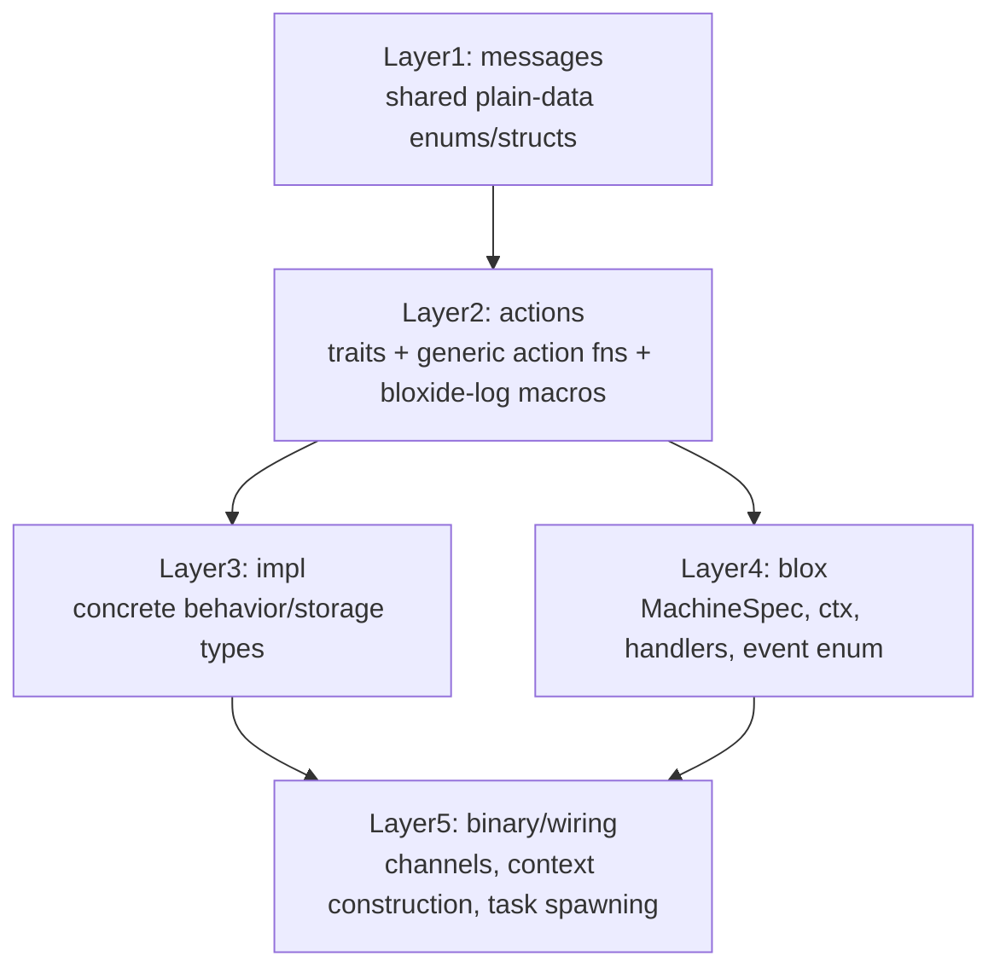

# 12 — Action-Crate Pattern

> **When would I use this?** Use this document when organizing domain code,
> understanding the five-layer application structure (messages, actions, impl, blox, binary),
> or learning how action crates and impl crates keep bloxes portable.

## Overview

Bloxide applications follow a five-layer structure that keeps runtime details out of
domain actors:

1. Messages
2. Actions
3. Impl
4. Blox
5. Binary / wiring

The goal is simple: blox crates stay declarative and runtime-agnostic, while reusable
traits and generic action functions carry the operational logic they need.

## The Five Layers



### Layer 1 — Messages

Message crates contain plain data only. When two or more bloxes share a protocol,
the shared enum lives in a dedicated `*-messages` crate.

```rust
pub enum PingPongMsg {
    Ping(Ping),
    Pong(Pong),
    Resume(Resume),
}
```

Rules:

- No runtime types in messages.
- Prefer named struct variants such as `Ping(Ping { round })`.
- Keep shared protocols in dedicated message crates to avoid circular deps.

### Layer 2 — Actions

Action crates are portable interface layers. They define the traits and generic
functions that bloxes compose into `on_entry`, `on_exit`, and transition rules.

Typical contents:

- Accessor traits such as `HasPeerRef<R>` or `HasSelfRef<R>`
- Behavior traits such as `CountsRounds`
- Generic action functions such as `send_ping`, `send_pong`, `schedule_resume`
- Support crates such as `bloxide-log`, which provide feature-gated logging macros

```rust
pub trait HasPeerRef<R: BloxRuntime> {
    fn peer_ref(&self) -> &ActorRef<PingPongMsg, R>;
}

pub trait CountsRounds {
    type Round: Copy + From<u8>;
    fn round(&self) -> Self::Round;
    fn set_round(&mut self, round: Self::Round);
}

pub fn increment_round<C: CountsRounds>(ctx: &mut C) {
    let one = C::Round::from(1);
    ctx.set_round(ctx.round() + one);
}
```

Rules:

- Action crates may contain portable generic logic.
- They must not import Embassy, Tokio, file I/O, or executor-specific code.
- Logging is selected via `bloxide-log` feature flags, not via injected logger types.

### Layer 3 — Impl

Impl crates provide concrete behavior/storage types that satisfy the behavior traits
defined by the actions layer.

Example:

- `embassy-demo-impl` defines `PingBehavior`
- `PingBehavior` implements traits such as `CountsRounds` and `HasCurrentTimer`
- the wiring binary injects `PingBehavior` into `PingCtx<R, B>`
- `counter-demo-impl` defines `CounterBehavior` for the layered minimal demo
- `tokio-pool-demo-impl` provides the concrete `spawn_worker` factory for pool wiring

Use an impl crate when a blox needs behavior state that should remain outside the
blox crate itself. Common cases:

- runtime- or platform-specific behavior state (for example host simulation vs embedded hardware behavior),
- alternative strategy implementations (for example production behavior vs deterministic test doubles),
- deployment-specific policy/config wiring that should be chosen by the binary, not hard-coded in the blox crate.

Bloxes with no extra behavior state can omit this layer in downstream apps. In this
repository's demos, we keep an explicit impl layer for consistency of teaching
boundaries across examples.

Dependency direction stays one-way: the wiring binary depends on both the blox crate and the impl crate; the blox crate never depends on the impl crate.

The repository demos follow this structure consistently, including `tokio-minimal-demo`.

### Layer 4 — Blox

Blox crates are mostly declarative. They define:

- state topology
- context shape
- event enum
- handler tables and transition rules

They depend on `bloxide-core`, message crates, and action crates, but never on a
runtime crate or an impl crate.

```rust
#[derive(BloxCtx)]
pub struct PingCtx<R: BloxRuntime, B: CountsRounds + HasCurrentTimer> {
    #[self_id]
    pub self_id: ActorId,
    #[provides(HasPeerRef<R>)]
    pub peer_ref: ActorRef<PingPongMsg, R>,
    #[provides(HasSelfRef<R>)]
    pub self_ref: ActorRef<PingPongMsg, R>,
    #[provides(HasTimerRef<R>)]
    pub timer_ref: ActorRef<TimerCommand, R>,
    #[delegates(HasCurrentTimer, CountsRounds)]
    pub behavior: B,
}
```

Small local helper methods are fine when they only adapt generic action functions to
blox-local constants or event payloads. The reusable logic still belongs in the
action or standard-library layer.

### Layer 5 — Binary / Wiring

The wiring binary is the only layer that knows:

- which runtime is being used
- which impl types are concrete
- which channels and capacities should be created
- how actors are spawned and connected

It creates channels, constructs contexts, injects impl types, and starts tasks.

## `#[derive(BloxCtx)]` In Practice

`BloxCtx` exists to generate accessor impls and a constructor from annotated fields.

Common annotations:

- `#[self_id]` for `HasSelfId`
- `#[provides(Trait<R>)]` for accessor traits backed by fields
- `#[ctor]` for constructor-only fields
- `#[delegates(TraitA, TraitB)]` for forwarding behavior traits to a contained field

This lets bloxes stay explicit about what data they need without hand-writing a large
amount of repetitive accessor code.

## Accessor Trait Naming Convention

| Name Pattern | Use Case | Example |
|---------------|----------|---------|
| `HasXRef` | Single reference access (singular) | `HasTimerRef`, `HasPeerRef` |
| `HasX` | Collection access (plural) | `HasChildren`, `HasWorkerPeers`, `HasWorkers` |

**Rule of thumb**: 
- If the accessor returns a single `ActorRef<M>`, name it `HasXRef`.
- If the accessor returns a collection (Vec, map, etc.), name it `HasX`.

## Logging Pattern

`bloxide-log` is part of the same portability story:

- blox and action crates call `blox_log_info!`, `blox_log_debug!`, and friends
- the application chooses the backend by enabling `log` or `defmt` on `bloxide-log`
- no logger trait or logger field is injected into blox contexts

## Supervisor As The Same Pattern

The supervisor follows the same layering model:

- `bloxide-supervisor` provides accessor traits and generic action functions
- `SupervisorSpec<R>` is the reusable `MachineSpec`
- the wiring layer builds a `ChildGroup<R>` and injects it into `SupervisorCtx<R>`

That is why supervision is reusable without requiring a custom per-project
supervisor actor implementation.

## Related Docs

- [06-actions.md](06-actions.md) for action and logging mechanics
- [08-supervision.md](08-supervision.md) for the reusable supervisor model
- [09-application.md](09-application.md) for end-to-end wiring
- [11-dynamic-actors.md](11-dynamic-actors.md) for runtime spawning patterns
