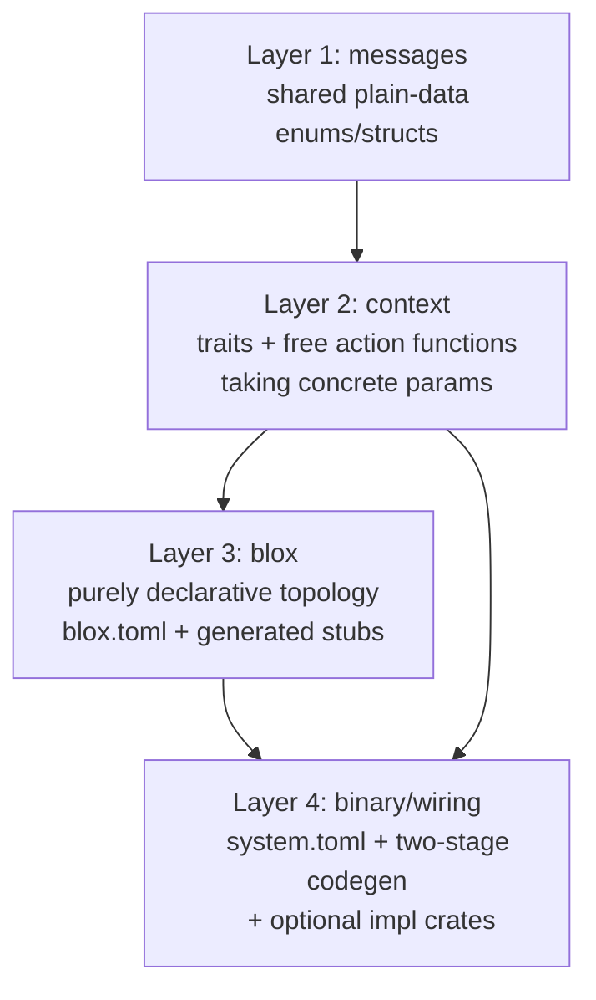

# 12 — Context Crate Pattern

> **When would I use this?** Use this document when organizing domain code,
> understanding the four-layer application structure (messages, context, blox, binary),
> or learning how context crates and impl crates keep bloxes portable.

> **Renamed (Phase 1-3, July 2026):** This document was formerly "Action-Crate
> Pattern." Action crates have been eliminated; action functions now live in
> context crates. The five-layer structure is now four layers.

## Overview

Bloxide applications follow a four-layer structure that keeps runtime details out of
domain actors:

1. Messages
2. Context (includes actions)
3. Blox
4. Binary / wiring

The goal is simple: blox crates stay declarative and runtime-agnostic with zero logic,
while context crates carry the traits and action functions they reference.

```
Before:  messages → actions → context → impl → blox → (codegen) → binary
After:   messages → context (includes actions) → blox → binary
         impl = optional reusable behavior libraries
```

## The Four Layers


```mermaid
flowchart TD
    Messages["Layer 1: messages
    shared plain-data enums/structs"]
    Context["Layer 2: context
    traits + free action functions
    taking concrete params"]
    Blox["Layer 3: blox
    purely declarative topology
    blox.toml + generated stubs"]
    Binary["Layer 4: binary/wiring
    system.toml + two-stage codegen
    + optional impl crates"]

    Messages --> Context
    Context --> Blox
    Blox --> Binary
    Context --> Binary
```

### Layer 1 — Messages

Message crates contain plain data only. When two or more bloxes share a protocol,
the shared enum lives in a dedicated `*-messages` crate.

```rust
pub enum PingPongMsg {
    Ping(Ping),
    Pong(Pong),
    Resume(Resume),
}
```

Rules:

- No runtime types in messages.
- Prefer named struct variants such as `Ping(Ping { round })`.
- Keep shared protocols in dedicated message crates to avoid circular deps.

### Layer 2 — Context

Context crates are the portable interface layer. They define:

- **Accessor traits** such as `HasPeerRef<R>`, `HasPoolRef<R>`, `HasTimerRef<R>`
- **State traits** such as `CountsRounds`, `HasCurrentTimer`, `CountsTicks`
- **Free action functions** taking concrete params (e.g., `increment_round(&mut u32)`,
  `send_ping::<R>(ActorId, &ActorRef<M, R>, u32)`)

There is no `B` generic, no `#[delegatable]`, no `#[delegates]`. Context traits are
implemented directly on the context struct by the codegen.

```rust
// crates/blox-ctx-rounds/src/lib.rs
pub trait CountsRounds {
    fn round(&self) -> u32;
    fn set_round(&mut self, round: u32);
}

pub fn increment_round(round: &mut u32) {
    *round += 1;
}
```

```rust
// crates/bloxide-messaging/src/lib.rs
pub fn send_ping<R: BloxRuntime>(
    self_id: ActorId,
    peer_ref: &ActorRef<PingPongMsg, R>,
    round: u32,
) {
    let _ = peer_ref.try_send(self_id, PingPongMsg::Ping(Ping { round }));
}
```

Rules:

- Context crates may contain portable generic logic.
- They must not import Embassy, Tokio, file I/O, or executor-specific code.
- No `bloxide-log` dependency (logging ripped out of blox crates; context crates may use it if needed).

### Layer 3 — Blox

Blox crates are purely declarative. They contain:

- `blox.toml` — declares topology, event matching, action names, field mappings, guard expressions
- Generated `ctx.rs` — plain struct with fields, no `B`, no `#[delegates]`
- Generated `topology.rs` — state enum, event enum
- Generated `spec_skeleton.rs` — **stub actions** (no-op closures) + **real guards** (direct field comparisons) + real event matching + real state topology
- `lib.rs` — re-exports, constants (like `MAX_ROUNDS`), no logic
- No `actions.rs`
- No `bloxide-log` dependency
- Compiles standalone without any impl crate

They depend on `bloxide-core`, message crates, and context crates, but never on a
runtime crate or an impl crate.

```rust
// Generated ctx.rs — plain fields, no B generic
#[derive(BloxCtx)]
pub struct PingCtx<R: BloxRuntime> {
    pub self_id: ActorId,
    pub peer_ref: ActorRef<PingPongMsg, R>,
    pub self_ref: ActorRef<PingPongMsg, R>,
    pub timer_ref: ActorRef<TimerCommand, R>,
    pub current_timer: Option<TimerId>,
    pub round: u32,
}
```

### Layer 4 — Binary / Wiring

The wiring binary is the only layer that knows:

- which runtime is being used
- which impl crates provide impl-specific functions (if any)
- which channels and capacities should be created
- how actors are spawned and connected

It creates channels, constructs contexts, and starts tasks. The system codegen
reads `system.toml` and generates concrete `spec_skeleton.rs` with real action
closures inlined from context/impl crates.

## Two-Stage Codegen

### Stage 1 — Blox-level (`cargo blox generate`)

Generates stub action closures (no-op) with real guards. The blox compiles standalone
without any impl dependency. Guard/transition logic is functional with stubs; only
side-effecting actions are no-ops.

```rust
// generated/spec_skeleton.rs — stub actions
|_ctx, _ev| { /* stub: forward_ping */ ActionResult::Ok }
```

### Stage 2 — System-level (`cargo blox build`)

Reads `system.toml`, resolves impl crates, generates concrete action closures with
real function calls. Guards are unchanged from blox-level (already real).

```rust
// generated/spec_skeleton.rs — concrete, impl inlined
|ctx, _ev| {
    bloxide_messaging::send_ping(ctx.self_id, &ctx.peer_ref, ctx.round);
    ActionResult::Ok
}
```

### `system.toml` example

```toml
[[actors]]
name = "ping"
blox = "ping-blox"
# No impl crate needed — all actions come from context crates

[[actors]]
name = "pool"
blox = "pool-blox"
impl_crate = "tokio_pool_demo_impl"  # Provides process_work and spawn functions
```

### Action import resolution

The system codegen resolves action functions by convention:
- Actions with `impl_required = true` → `<impl_crate>::<fn_name>`
- Actions with `impl_required = false` → `<context_crate>::<fn_name>`
  (resolved from the `[[context.actions]]` `crate` field)

## Impl Crates (Optional)

Impl crates are optional libraries of impl-specific functions. No `B` struct,
no trait impls — just free functions taking concrete params.

Use an impl crate when a blox needs behavior that is:
- runtime- or platform-specific (e.g., spawning workers on Tokio)
- deployment-specific (e.g., different work processing logic)

Bloxes with no impl-specific behavior (like Ping, Pong, Counter, BHSM) need no
impl crate. The system codegen generates concrete code using only context crate
functions.

```rust
// crates/impl/tokio-pool-demo-impl/src/lib.rs
pub fn process_work(task_id: &mut u32, result: &mut u32, do_work: &DoWork) {
    *task_id = do_work.task_id;
    *result = do_work.task_id * 2;
}
```

Dependency direction stays one-way: the wiring binary depends on both the blox crate
and the impl crate; the blox crate never depends on the impl crate.

## Accessor Trait Naming Convention

| Name Pattern | Use Case | Example |
|---------------|----------|---------|
| `HasXRef` | Single reference access (singular) | `HasTimerRef`, `HasPeerRef` |
| `HasX` | Collection access (plural) | `HasChildren`, `HasWorkers` |

**Rule of thumb**:
- If the accessor returns a single `ActorRef<M>`, name it `HasXRef`.
- If the accessor returns a collection (Vec, map, etc.), name it `HasX`.

## Supervisor As The Same Pattern

The supervisor follows the same layering model:

- `bloxide-supervisor` provides accessor traits and action functions
- `SupervisorSpec<R>` is the reusable `MachineSpec`
- the wiring layer builds a `ChildGroup<R>` and injects it into `SupervisorCtx<R>`

That is why supervision is reusable without requiring a custom per-project
supervisor actor implementation.

## Related Docs

- [06-actions.md](06-actions.md) for action function mechanics and two-stage codegen
- [08-supervision.md](08-supervision.md) for the reusable supervisor model
- [09-application.md](09-application.md) for end-to-end wiring
- [11-dynamic-actors.md](11-dynamic-actors.md) for runtime spawning patterns
- [15-composable-context-crates.md](15-composable-context-crates.md) for context crate composition
