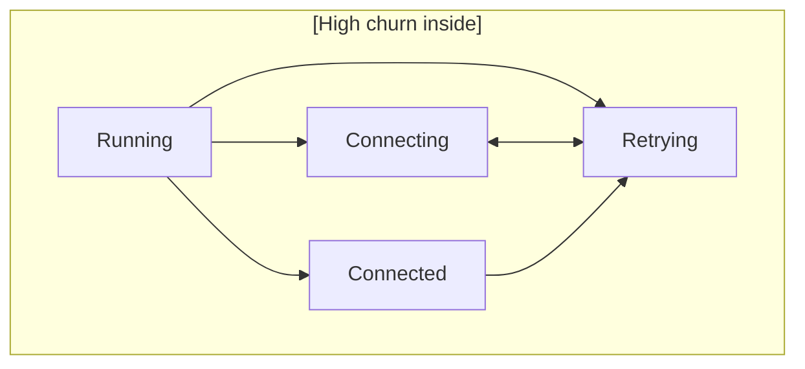

# Factory Injection and Supervision: Worked Examples

> **When would I use this?** Use this document when implementing dynamic
> actor spawning via factory injection, understanding why supervised actors
> return `&[]` from `root_transitions()`, or learning LCA transition patterns.
> For the canonical lifecycle handling reference, see `01-hsm-engine.md`.

This document clarifies two common confusion points: (1) how factory injection works
through constructor-injected context fields and `system.toml` inject sources, and (2) why
supervised actors don't handle lifecycle events in their `root_transitions()`.

## Part 1: Factory Injection

### The Problem

Dynamic actor spawning requires the Pool blox to create Worker actors at runtime. But:

- The Pool blox must be runtime-agnostic (generic over `R: BloxRuntime`)
- Embassy lacks `SpawnCap` (no dynamic task spawning in embedded environments)
- Creating a Worker requires knowing concrete channel types and calling runtime-specific spawn functions

How does the Pool invoke spawning logic without knowing the runtime?

### The Solution: Factory Injection

The blox stores a **plain function pointer** of type `SpawnFn<R, Req>` as a context field and invokes it without knowing its implementation. The application provides the concrete function at wiring time.

```rust
// In bloxide-spawn
pub type SpawnFn<R, Req> = fn(req: Req, notify: ActorRef<ChildLifecycleEvent, R>) -> SpawnOutput<R>;
```

This is a `fn` pointer — not a closure, not a trait object. The blox can invoke it without any bounds beyond `R: BloxRuntime`.

Two declarative hooks make the injection work — **neither keys off field names**:

1. **In `blox.toml`**: the field is declared as a `[[context.uses]]` entry with `role = "ctor"`. The codegen emits it as a plain struct field and a `PoolCtx::new(...)` constructor parameter. (`role = "state"` fields are also plain fields but are `Default`-initialized, not constructor params.)
2. **In `system.toml`**: the wiring binds the constructor param with an `[actors.inject]` entry whose `source = "factory"` names the impl crate and function. The codegen keys off `source` values (`"self"`, `"actor"`, `"factory"`, `"self_secondary"`) — there is no `_factory`-suffix auto-detection.

### Layer-by-Layer Walkthrough

**Layer 1 (messages)**: `pool-messages/` defines `PoolMsg`, `WorkerMsg`, `SpawnWorker`, `DoWork`, `WorkDone`. Pure data — no runtime types, no `ActorRef`s (AGENTS.md invariant #3: message enums carry plain data only).

**Layer 2 (domain context crate)**: `blox-ctx-pool-ref/` defines the spawn request and reply types:

```rust
/// Spawn request sent by the Pool to the spawn factory.
pub enum SpawnRequest<Ctrl: Send + 'static, R: BloxRuntime> {
    Worker {
        task_id: u32,
        /// Reply channel: the factory sends `SpawnedWorker` here.
        reply_to: ActorRef<SpawnedWorker<Ctrl, R>, R>,
        /// Pool ref the worker needs to send results back.
        pool_ref: ActorRef<PoolMsg, R>,
    },
}

/// Reply from the spawn factory containing the newly spawned worker's refs.
pub struct SpawnedWorker<Ctrl: Send + 'static, R: BloxRuntime> {
    pub child_id: ActorId,
    pub domain_ref: ActorRef<WorkerMsg, R>,
    pub ctrl_ref: ActorRef<Ctrl, R>,
}
```

These types carry `ActorRef`s, so they live in a domain context crate (`blox-ctx-pool-ref`), **not** in `pool-messages` — messages crates are plain data. Note the shape of the protocol: the domain refs (`domain_ref`, `ctrl_ref`) come back to the Pool through the **typed reply channel** (`reply_to`) carried inside the request — not through the factory's return value.

**Layer 3 (spawn platform)**: `bloxide-spawn/` defines the runtime-facing spawn machinery:

```rust
pub type SpawnFn<R, Req> = fn(req: Req, notify: ActorRef<ChildLifecycleEvent, R>) -> SpawnOutput<R>;

pub struct SpawnOutput<R: BloxRuntime> {
    pub child_id: ActorId,
    pub lifecycle_ref: ActorRef<LifecycleCommand, R>,
    pub abort_ref: ActorRef<AbortCommand, R>,
    pub kill_handle: <R::Kill as KillCapability<R>>::Handle,
    pub policy: ChildPolicy,
}
```

`SpawnOutput` is deliberately **not** app-specific: it carries only the lifecycle and capability refs the managing blox (supervisor) needs. The app-specific handles go back via the request's reply channel (Layer 2). `bloxide-spawn` also provides `spawn_dynamic_child()` (calls the factory, then sends the registration message on the managing blox's control mailbox) and `ChildCtrlRegistrar` (wraps `SpawnOutput` into `ChildCtrl::RegisterDynamicChild`).

`bloxide-spawn` also owns the **two-layer spawn composition**: impl-crate factories do pure construction and return `ActorParts<S, R>` (child id, machine, mailboxes, lifecycle/abort refs + streams, policy), while the platform helper `spawn_actor_task(parts, notify)` consumes the parts — it assembles `RunConfig::supervised_with_abort`, spawns the run loop via `SpawnCap`, derives the kill handle, and packs the `SpawnOutput` above. The system codegen composes the two at the wiring site (Layer 6); `SpawnFn`/`SpawnOutput` themselves are unchanged, so a hand-assembled factory that builds a `SpawnOutput` directly is still legal.

**Layer 4 (blox)**: `bloxes/pool/blox.toml` declares the injected fields as `[[context.uses]]` entries with `role = "ctor"` (gated by the Pool's `dynamic` feature):

```toml
[[context.uses]]
feature = "dynamic"
fields = [
    { name = "spawn_fn",        ty = "SpawnFn<R, SpawnRequest<PeerCtrl<WorkerMsg, R>, R>>", role = "ctor" },
    { name = "spawn_ref",       ty = "ActorRef<ChildCtrl<R>, R>", role = "ctor" },
    { name = "notify_ref",      ty = "ActorRef<ChildLifecycleEvent, R>", role = "ctor" },
    { name = "spawn_reply_ref", ty = "ActorRef<SpawnedWorker<PeerCtrl<WorkerMsg, R>, R>, R>", role = "ctor" },
    { name = "pending_task_id", ty = "u32", role = "state" },
    { name = "spawn_in_flight", ty = "bool", role = "state" },
    { name = "spawn_queue",     ty = "Vec<u32>", role = "state" },
]
```

The codegen emits these as **plain struct fields** on `PoolCtx<R>` — the four `role = "ctor"` fields become `PoolCtx::new(...)` params; the `role = "state"` fields are `Default`-initialized. There are no accessor traits and no name-suffix conventions: the codegen keys off `role`.

The Pool's action function (in the impl crate) invokes the factory through the `spawn_dynamic_child` helper — the Pool never calls `spawn_fn` directly and never touches registration itself:

```rust
// crates/impl/tokio-pool-demo-impl/src/lib.rs
pub fn handle_spawn_worker<R: BloxRuntime>(
    self_id: ActorId,
    self_ref: &ActorRef<PoolMsg, R>,
    spawn_fn: &SpawnFn<R, SpawnRequest<PeerCtrl<WorkerMsg, R>, R>>,
    spawn_ref: &ActorRef<ChildCtrl<R>, R>,
    notify_ref: &ActorRef<ChildLifecycleEvent, R>,
    spawn_reply_ref: &ActorRef<SpawnedWorker<PeerCtrl<WorkerMsg, R>, R>, R>,
    // ... state fields ...
    spawn_worker: &SpawnWorker,
) -> ActionResult {
    let req = SpawnRequest::Worker {
        task_id: spawn_worker.task_id,
        reply_to: spawn_reply_ref.clone(),
        pool_ref: self_ref.clone(),
    };
    ActionResult::from(bloxide_spawn::spawn_dynamic_child::<_, _, ChildCtrlRegistrar>(
        *spawn_fn, req, spawn_ref, notify_ref, self_id,
    ))
}
```

`spawn_dynamic_child` calls `spawn_fn(req, notify_ref.clone())`, wraps the returned `SpawnOutput` into `ChildCtrl::RegisterDynamicChild` via `ChildCtrlRegistrar`, and sends it on `spawn_ref` — the supervisor's control mailbox. The supervisor registers the child (`ChildGroup::try_add_dynamic`) and starts it.

**Layer 5 (impl crate)**: `crates/impl/tokio-pool-demo-impl/src/lib.rs` provides the concrete factory function. It does **pure construction** — actor id, channels, worker context, state machine — and returns `ActorParts`; it never calls `run()`, never names `RunConfig`, and never touches `SpawnCap`:

```rust
pub fn build_worker<S>(
    req: SpawnRequest<PeerCtrl<WorkerMsg, TokioRuntime>, TokioRuntime>,
) -> ActorParts<S, TokioRuntime>
where
    S: MachineSpec<Ctx = WorkerCtx<TokioRuntime>>,
    S::Event: From<Envelope<PeerCtrl<WorkerMsg, TokioRuntime>>>
        + From<Envelope<WorkerMsg>>,
{
    match req {
        SpawnRequest::Worker { reply_to, pool_ref, .. } => {
            // Allocate id + channels (domain, ctrl, lifecycle, abort)
            let worker_id = TokioRuntime::alloc_actor_id();
            // ... channels::<PeerCtrl<...>>, channels::<WorkerMsg>,
            //     channels::<LifecycleCommand>, channels::<AbortCommand> ...

            let worker_ctx = WorkerCtx::new(worker_id, pool_ref);
            let machine = StateMachine::<S>::new(worker_ctx);

            // Reply to the Pool with the domain refs (typed reply channel) —
            // sent BEFORE the task exists: the platform spawn runs only after
            // this function returns, and the Pool processes the reply in a
            // later dispatch (run-to-completion).
            let _ = reply_to.try_send(worker_id, SpawnedWorker {
                child_id: worker_id,
                domain_ref: domain_ref.clone(),
                ctrl_ref: ctrl_ref.clone(),
            });

            // Hand everything to the platform spawn: the send-side refs come
            // back out in the SpawnOutput; the receive-side streams move into
            // the run loop.
            ActorParts {
                child_id: worker_id,
                machine,
                mailboxes: (ctrl_rx, domain_rx),
                lifecycle_ref,
                lifecycle_rx,
                abort_ref,
                abort_rx,
                policy: ChildPolicy::Stop,
            }
        }
    }
}
```

The function is **generic over the spec type `S`** so the system-level codegen can inject the concrete `WorkerSpec` (with real action closures) instead of the blox-crate-level stub spec — the generated `main.rs` monomorphizes it (below). All per-request state arrives through the request — the factory is stateless.

This crate is the **only place** that:
- Imports `worker_blox` (knows the concrete worker context type)
- Imports `TokioRuntime` (binds to a specific runtime)
- Knows the concrete channel types the worker task will run with

The executor mechanics the factory would otherwise perform — `RunConfig` assembly, `SpawnCap::spawn`, kill-handle derivation — live in one platform function, `bloxide_spawn::spawn_actor_task(parts, notify) -> SpawnOutput<R>` (Layer 3), shared by every factory composition.

**Layer 6 (system wiring)**: `examples/tokio-pool-demo/system.toml` binds the constructor params:

```toml
[actors.inject]
self_ref        = { source = "self" }
spawn_fn        = { source = "factory", crate = "tokio_pool_demo_impl", function = "build_worker" }
spawn_ref       = { source = "actor", actor = "supervisor", field = "control" }
notify_ref      = { source = "actor", actor = "supervisor", field = "notify" }
spawn_reply_ref = { source = "self_secondary", index = 1 }

# The worker is a dynamic actor: concrete spec generated at the system
# level, but no channels/task/bootstrap in main.rs.
[[actors]]
name = "worker"
blox = "worker-blox"
impl_crate = "tokio_pool_demo_impl"
kind = "dynamic"
```

The generated `main.rs` injects the factory as a closure that monomorphizes `build_worker` with the system-generated concrete worker spec and composes it with the platform spawn (the codegen also adds a `bloxide-spawn` dependency to the materialized example crate's `Cargo.toml` for this):

```rust
let pool_ctx = PoolCtx::new(
    pool_id,
    pool_ref.clone(),
    (|req, notify| {
        ::bloxide_spawn::spawn_actor_task(
            ::tokio_pool_demo_impl::build_worker::<
                crate::generated::worker_spec_skeleton::WorkerSpec<TokioRuntime>,
            >(req),
            notify,
        )
    }) as _,
    sup_control_ref_0.clone(),
    sup_notify_ref_0.clone(),
    spawn_reply_ref.clone(),
);
```

### Why This Works for Embassy (which lacks SpawnCap)

Embassy uses `#[embassy_executor::task]` macros at compile time. It cannot spawn tasks dynamically at runtime.

The factory injection pattern **does not require the blox to have `R: SpawnCap`**. Instead:

1. An Embassy impl crate would define its own factory (e.g. `build_worker` — there is no `spawn_actor_task` on Embassy, so it assembles the `SpawnOutput` directly) that:
   - Returns pre-allocated static channels
   - Uses `embassy_executor::Spawner` obtained from the binary's executor
   - The binary passes the spawner to a setup function that registers tasks statically

2. The Pool blox remains `R: BloxRuntime` only — it passes the factory to `spawn_dynamic_child` unaware of whether the runtime is Tokio (spawn cap) or Embassy (static task registration). The `spawn_fn`/`spawn_ref`/`notify_ref` fields are feature-gated (`feature = "dynamic"`), so the non-dynamic Pool variant compiles without them entirely.

### Summary: Constructor Injection and `system.toml` Sources

| `[[context.uses]]` role | Constructor param? | Initialized from |
|---|---|---|
| `role = "ctor"` | ✅ Yes | Wiring layer (`[actors.inject]`) |
| `role = "state"` | ❌ No | `Default::default()` |

| `[actors.inject]` source | Binds the param to |
|---|---|
| `source = "self"` | The actor's own primary domain ref |
| `source = "self_secondary", index = N` | The actor's Nth secondary mailbox ref |
| `source = "actor", actor = "...", field = "..."` | Another actor's ref (optionally a specific field, e.g. the supervisor's `control`/`notify`) |
| `source = "factory", crate = "...", function = "..."` | A concrete spawn function from an impl crate, monomorphized with the system-generated spec |

---

## Part 2: Why Supervised Actors Return `&[]` for `root_transitions()`

> **Canonical source**: For the full lifecycle command handling reference, see
> `spec/architecture/01-hsm-engine.md` → "Lifecycle Command Handling at VirtualRoot".

### The Confusion

The invariant says:
> `root_transitions()` returns `&[]` for supervised actors.

Does this mean supervised actors can't have global fallback handlers? Where do lifecycle events (Start, Reset, Stop) get handled?

### The Answer: Unified Dispatch Through `VirtualRoot`

Lifecycle commands flow through `dispatch()` at the `VirtualRoot` level, just like domain events. The runtime wraps lifecycle commands into the actor's `Event` enum (the generated `Lifecycle` variant) and dispatches them:

```
┌─────────────────────────────────────────────────────────────────┐
│                     Supervised Run Loop                          │
│                                                                   │
│   lifecycle_stream          abort mailbox¹      domain_mailboxes  │
│   (LifecycleCommand)        (AbortCommand)      (domain events)   │
│         │                       │                     │           │
│         ▼                       ▼                     ▼           │
│   ┌─────────────────────────────────────────┐                     │
│   │    runtime's poll_next priority logic   │                     │
│   │    (lifecycle → abort → domain)         │                     │
│   └─────────────────────────────────────────┘                     │
│         │                                                         │
│         ▼                                                         │
│   ┌─────────────────────────────────────────┐                     │
│   │  Wrap into Event enum → dispatch(event) │                     │
│   │    VirtualRoot intercepts lifecycle:    │                     │
│   │      Start → exit Init, enter initial   │                     │
│   │      Reset → full exit chain, enter     │                     │
│   │                initial_state() directly │                     │
│   │                (skips Init entirely)    │                     │
│   │      Stop  → full exit chain, enter Init│                     │
│   │      Ping  → emit Alive notification    │                     │
│   │    User states handle domain events:    │                     │
│   │      → StateFns::transitions            │                     │
│   │      → bubbling → root_transitions()    │                     │
│   └─────────────────────────────────────────┘                     │
│                                                                    │
│   ¹ only with RunConfig::supervised_with_abort — breaks the       │
│     run loop on receipt (no dispatch, no callbacks)               │
└─────────────────────────────────────────────────────────────────┘
```

### Key Insights

1. **Lifecycle commands flow through `dispatch()`** — The runtime wraps them into the actor's `Event` enum and dispatches them. VirtualRoot intercepts `LifecycleCommand` variants before any user-declared state sees them.

2. **Reset skips Init** — `Reset` fires the full exit chain for the current state, then enters `initial_state()` directly. It does NOT pass through Init, does NOT fire `on_init_entry`/`on_init_exit`, and the actor is immediately operational (reports `Started`).

3. **`root_transitions()` is for domain events only** — If no handler matches a domain event anywhere in the hierarchy, it bubbles to `root_transitions()`. If that's empty, the event is silently dropped.

4. **Supervised actors don't need lifecycle handlers** — Lifecycle is handled by VirtualRoot defaults. The actor's `MachineSpec` only defines domain behavior.

5. **A supervised actor CAN have root transitions** — The invariant says "returns `&[]` for supervised actors" as a convention, not a technical requirement. If you have domain events that need global fallback handling, you can return non-empty `root_transitions()`. The lifecycle handling is orthogonal.

### When Would a Supervised Actor Have Root Transitions?

Example: A supervised Worker that handles multiple message types, and has a "poison pill" message that should trigger Reset from any state. Declared in `blox.toml` as an ordinary `[[topology.transitions]]` entry with the reserved keyword `state = "root"`:

```toml
[[topology.transitions]]
state = "root"
event = "WorkerMsg::PoisonPill(_)"
target = "reset"
```

The codegen emits a `ROOT_RULES` associated constant plus the `root_transitions()` override in the generated `MachineSpec` impl, equivalent to the hand-written form:

```rust
impl MachineSpec for WorkerSpec<R> {
    fn root_transitions() -> &'static [StateRule<Self>] {
        &[
            StateRule {
                event_tag: ::bloxide_core::event_tag::WILDCARD_TAG, // msg-shorthand pattern
                matches: |ev| ev.msg_payload().is_some_and(|m| matches!(m, WorkerMsg::PoisonPill(_))),
                actions: &[],
                guard: |_, _, _| Decision::Reset,
            },
        ]
    }
}
```

This is perfectly valid. Lifecycle commands still bypass the worker's handlers.

---

## Quick Reference

### Constructor Field Decision Tree

```
Should the wiring layer provide this value at construction time?
├── Yes: declare it via [[context.uses]] with role = "ctor"
│        and bind it in system.toml via [actors.inject]
│        (source = "self" / "actor" / "factory" / "self_secondary")
└── No:  declare it with role = "state" or as a [[context.fields]] entry
         (Default::default() in the constructor)
```

### Factory Injection Pattern

```
┌─────────────┐         ┌─────────────┐         ┌──────────────────┐
│   blox      │         │    impl     │         │  system wiring   │
│  blox.toml  │         │   crate     │         │  (system.toml →  │
│             │         │             │         │  generated main) │
│ [[context.  │         │ fn          │         │                  │
│  uses]]     │         │ build_worker│         │ [actors.inject]  │
│ spawn_fn:   │◄────────│ <S>(req) -> │◄────────│ spawn_fn =       │
│ SpawnFn     │         │  ActorParts │         │  { source =      │
│ role="ctor" │         │             │         │   "factory" }    │
└─────────────┘         └─────────────┘         └──────────────────┘
       │                                                 │
       ▼                                                 ▼
┌─────────────┐                                 ┌──────────────────┐
│  PoolCtx    │                                 │ PoolCtx::new(.., │
│ plain field │◄────────────────────────────────│  spawn_actor_task│
│ (no traits) │   monomorphized with the        │  (build_worker::<│
│             │   system-generated spec         │  ConcreteSpec>)) │
└─────────────┘                                 └──────────────────┘
       │
       ▼  action calls spawn_dynamic_child(*spawn_fn, req, spawn_ref, notify_ref, ...)
┌─────────────┐         ┌─────────────┐
│ bloxide-    │         │ supervisor  │
│ spawn       │────────►│ control     │
│ spawn_dynamic_child │ RegisterDynamicChild  │
└─────────────┘         └─────────────┘
```

### Lifecycle vs Domain Event Handling

| Event Source | Processed By | Path Through |
|--------------|--------------|--------------|
| `lifecycle_stream` (Start, Reset, Stop, Ping) | Runtime's supervised run loop | `dispatch(event)` → VirtualRoot intercepts lifecycle |
| `abort` mailbox (`AbortCommand`, `supervised_with_abort` only) | Runtime's supervised run loop | Run loop breaks — no dispatch, no callbacks |
| `domain_mailboxes` (domain messages) | Actor's `MachineSpec` | `dispatch()` → handlers → bubbling → `root_transitions()` |

---

## Part 3: LCA Transitions and State Design Patterns

### The LCA Algorithm

When transitioning from state A to state B, the engine:

1. **Builds root-first paths** for both states via `StateTopology::path()`
2. **Finds the Lowest Common Ancestor (LCA)** — the deepest state that is an ancestor of both A and B
3. **Exits leaf-first** from A, stopping before the LCA (i.e., exiting A and any states between A and the LCA, but not exiting the LCA itself)
4. **Enters root-first** from the LCA's first child on the path to B, entering B last

### Example: Crossing Subtrees

```
State hierarchy:

    VirtualRoot (implicit)
         │
    ┌────┴────┐
    │         │
 Active    Disabled
    │         │
  ┌─┴─┐     Idle
  │   │
Idle Running
     │
  ┌──┴──┐
Conn Disconn
```

**Transition: `Conn` → `Idle` (under `Disabled`)**

1. Paths:
   - `Conn`: `[VirtualRoot, Active, Running, Conn]`
   - `Idle` (under `Disabled`): `[VirtualRoot, Disabled, Idle]`

2. LCA: `VirtualRoot` at index 0

3. Exit order (leaf-first, not including LCA):
   - `Conn.on_exit()`
   - `Running.on_exit()`
   - `Active.on_exit()`

4. Entry order (root-first from LCA+1):
   - `Disabled.on_entry()`
   - `Idle.on_entry()`

**Total callbacks: 5** (3 exits + 2 entries)

### Example: Same-Parent Transition

**Transition: `Conn` → `Disconn`** (both under `Running`)

1. Paths:
   - `Conn`: `[VirtualRoot, Active, Running, Conn]`
   - `Disconn`: `[VirtualRoot, Active, Running, Disconn]`

2. LCA: `Running` at index 2

3. Exit order (leaf-first, not including LCA):
   - `Conn.on_exit()`

4. Entry order (root-first from LCA+1):
   - `Disconn.on_entry()`

**Total callbacks: 2** (1 exit + 1 entry)

### Self-Transition

**Transition: `Running` → `Running`**

The engine treats self-transitions specially:

1. LCA is forced to the parent of the current state (if one exists)
2. The state exits and re-enters, firing both `on_exit` and `on_entry`

If the state is top-level (no user-declared parent), LCA = `None`, causing full exit and re-entry of the entire chain.

### Design Patterns to Minimize Churn

#### Pattern 1: Group Related States Under Common Ancestors

States that frequently transition between each other should share a common ancestor.



Transitions between `Connecting`/`Connected`/`Retrying` stay within `Running` — LCA is `Running`, so only 1 exit + 1 entry.

#### Pattern 2: Prefer Shallow Hierarchies for High-Frequency Transitions

If your actor has a "hot loop" with 100+ transitions per second, keep those states shallow:

```
# Good: Hot states are top-level
VirtualRoot → [Processing, Waiting]

# Avoid: Deep nesting for frequently-changed states
VirtualRoot → Active → Hot → [Processing, Waiting]
```

#### Pattern 3: Use Composite States for Shared Behavior, Not Shared Lifecycle

Composite states (`on_entry`, `on_exit`, shared transition rules) are valuable for:

- Shared initialization/cleanup
- Catch-all bubbling handlers (e.g., `Reset on any error`)

But they add overhead if you frequently cross composite boundaries.

#### Pattern 4: Snapshot Expensive State in Parent `on_exit`

If child states accumulate expensive state (e.g., buffers, metrics), have the parent's `on_exit` snapshot and save it:

```rust
fn on_exit_active(ctx: &mut MyCtx) {
    // All children under Active have exited by now
    // Snapshot their accumulated data
    ctx.snapshot_metrics();
}
```

### Callback Count Formula

For a transition from state S to state T:

```
exit_callbacks  = depth(S) - depth(LCA)
entry_callbacks = depth(T) - depth(LCA)
total           = exit_callbacks + entry_callbacks
```

Where `depth(N)` is the number of states in the path from VirtualRoot to N.

**Minimize total by maximizing LCA depth** — i.e., keep transition targets in the same subtree.

---
