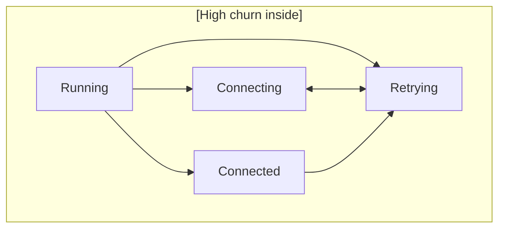

# Factory Injection and Supervision: Worked Examples

> **When would I use this?** Use this document when implementing dynamic
> actor spawning via factory injection, understanding why supervised actors
> return `&[]` from `root_transitions()`, or learning LCA transition patterns.
> For the canonical lifecycle handling reference, see `02-hsm-engine.md`.

This document clarifies two common confusion points: (1) how factory injection works
through naming-convention fields, and (2) why supervised actors don't handle lifecycle
events in their `root_transitions()`.

## Part 1: Factory Injection

### The Problem

Dynamic actor spawning requires the Pool blox to create Worker actors at runtime. But:

- The Pool blox must be runtime-agnostic (generic over `R: BloxRuntime`)
- Embassy lacks `SpawnCap` (no dynamic task spawning in embedded environments)
- Creating a Worker requires knowing concrete channel types and calling runtime-specific spawn functions

How does the Pool invoke spawning logic without knowing the runtime?

### The Solution: Factory Injection

Fields matching the `_factory` naming convention are **constructor parameters** auto-detected by `#[derive(BloxCtx)]`. The blox stores a function pointer and invokes it without knowing its implementation.

### Layer-by-Layer Walkthrough

**Layer 1 (messages)**: `pool-messages/` defines `PoolMsg`, `WorkerMsg`, `SpawnWorker`, `DoWork`, `WorkDone`. Pure data — no runtime types.

**Layer 2 (actions)**: `pool-actions/src/traits.rs` defines the factory type:

```rust
/// Function pointer type for spawning a single worker actor.
///
/// The factory allocates channels, constructs and spawns the worker task,
/// and returns the worker's domain and ctrl `ActorRef`s to the caller.
pub type WorkerSpawnFn<R> = fn(
    ActorId,
    &ActorRef<PoolMsg, R>,
) -> (
    ActorRef<WorkerMsg, R>,
    ActorRef<WorkerCtrl<R>, R>,
);

/// Accessor for contexts that hold a worker spawn factory.
pub trait HasWorkerFactory<R: BloxRuntime> {
    fn worker_factory(&self) -> WorkerSpawnFn<R>;
}
```

This is a **plain function pointer** — not a closure, not a trait object. The blox can invoke it without any bounds beyond `R: BloxRuntime`.

**Layer 3 (impl)**: `tokio-pool-demo-impl/src/lib.rs` provides the concrete implementation:

```rust
use worker_blox::{WorkerCtx, WorkerSpec};

pub fn spawn_worker_tokio(
    _pool_id: ActorId,
    pool_ref: &ActorRef<PoolMsg, TokioRuntime>,
) -> (
    ActorRef<WorkerMsg, TokioRuntime>,
    ActorRef<WorkerCtrl<TokioRuntime>, TokioRuntime>,
) {
    // Create channels with Tokio-native types
    let ((ctrl_ref, domain_ref), worker_mbox) =
        channels! { WorkerCtrl<TokioRuntime>(16), WorkerMsg(16) };
    let worker_id = ctrl_ref.id();

    // Construct worker with Tokio-specific types
    let worker_ctx = WorkerCtx::new(worker_id, pool_ref.clone());
    let machine = StateMachine::<WorkerSpec<TokioRuntime>>::new(worker_ctx);

    // Spawn on Tokio runtime
    TokioRuntime::spawn(async move {
        run_actor_to_completion(machine, worker_mbox).await;
    });

    (domain_ref, ctrl_ref)
}
```

This crate is the **only place** that:
- Imports `worker_blox` (knows the concrete worker type)
- Imports `TokioRuntime` (binds to a specific runtime)
- Calls `TokioRuntime::spawn` (uses runtime-specific spawning)

**Layer 4 (blox)**: `pool/src/ctx.rs` declares the factory field, auto-detected by naming convention:

```rust
#[derive(BloxCtx)]
pub struct PoolCtx<R: BloxRuntime> {
    pub self_id: ActorId,                        // auto-detected → impl HasSelfId
    
    /// Pool's own ActorRef — keeps the pool channel open.
    pub self_ref: ActorRef<PoolMsg, R>,           // auto-detected → impl HasSelfRef<R>
    
    /// Factory function injected at construction time.
    pub worker_factory: WorkerSpawnFn<R>,         // auto-detected → constructor parameter only
    
    // Fields without matching conventions use Default::default() in constructor
    pub worker_refs: Vec<ActorRef<WorkerMsg, R>>,
    pub worker_ctrls: Vec<ActorRef<WorkerCtrl<R>, R>>,
    pub pending: u32,
}

impl<R: BloxRuntime> HasWorkerFactory<R> for PoolCtx<R> {
    fn worker_factory(&self) -> WorkerSpawnFn<R> {
        self.worker_factory
    }
}
```

**What `#[derive(BloxCtx)]` generates:**

```rust
impl<R: BloxRuntime> PoolCtx<R> {
    pub fn new(
        self_id: ActorId,                    // from self_id field
        self_ref: ActorRef<PoolMsg, R>,      // from _ref field
        worker_factory: WorkerSpawnFn<R>,    // from _factory field
    ) -> Self {
        Self {
            self_id,
            self_ref,
            worker_factory,
            worker_refs: Default::default(),
            worker_ctrls: Default::default(),
            pending: Default::default(),
        }
    }
}
```

**Layer 5 (binary)**: `examples/tokio-pool-demo.rs` injects the factory:

```rust
use tokio_pool_demo_impl::spawn_worker_tokio;

// Create pool context, injecting the Tokio-specific factory
let pool_ctx = PoolCtx::new(pool_id, pool_ref, spawn_worker_tokio);
let pool_machine = StateMachine::<PoolSpec<TokioRuntime>>::new(pool_ctx);
```

### Why This Works for Embassy (which lacks SpawnCap)

Embassy uses `#[embassy_executor::task]` macros at compile time. It cannot spawn tasks dynamically at runtime.

The factory injection pattern **does not require the blox to have `R: SpawnCap`**. Instead:

1. The Embassy impl crate would define `spawn_worker_embassy` that:
   - Returns pre-allocated static channels
   - Uses `embassy_executor::Spawner` obtained from the binary's executor
   - The binary passes the spawner to a setup function that registers tasks statically

2. The Pool blox remains `R: BloxRuntime` only — it invokes `worker_factory(id, pool_ref)` unaware of whether the runtime is Tokio (spawn cap) or Embassy (static task registration).

### Summary: Field Naming Convention Effects

| Field Pattern | Constructor Param | Trait Impl Generated |
|------------|------------------|---------------------|
| `self_id: ActorId` | ✅ Yes | `impl HasSelfId` |
| `foo_ref: ActorRef<M, R>` | ✅ Yes | `impl HasFooRef<R>` |
| `foo_factory: fn(...)` | ✅ Yes | ❌ None |
| `#[delegates(Trait1, Trait2)] behavior: B` | ✅ Yes | Via companion macro |
| (no matching convention) | ❌ No (Default::default()) | ❌ None |

---

## Part 2: Why Supervised Actors Return `&[]` for `root_transitions()`

> **Canonical source**: For the full lifecycle command handling reference, see
> `spec/architecture/02-hsm-engine.md` → "Lifecycle Command Handling at VirtualRoot".

### The Confusion

The invariant says:
> `root_transitions()` returns `&[]` for supervised actors.

Does this mean supervised actors can't have global fallback handlers? Where do lifecycle events (Start, Reset, Stop) get handled?

### The Answer: Unified Dispatch Through `VirtualRoot`

Lifecycle commands now flow through `dispatch()` at the `VirtualRoot` level, just like domain events. The runtime wraps lifecycle commands into the actor's `Event` enum and dispatches them:

```
┌─────────────────────────────────────────────────────────────────┐
│                     Supervised Run Loop                          │
│                                                                   │
│   lifecycle_stream          domain_mailboxes                      │
│   (LifecycleCommand)        (domain events)                       │
│         │                         │                               │
│         ▼                         ▼                               │
│   ┌─────────────────────────────────────────┐                     │
│   │    runtime's select/poll_next logic     │                     │
│   └─────────────────────────────────────────┘                     │
│         │                                                         │
│         ▼                                                         │
│   ┌─────────────────────────────────────────┐                     │
│   │  Wrap into Event enum → dispatch(event) │                     │
│   │    VirtualRoot intercepts lifecycle:    │                     │
│   │      Start → exit Init, enter initial   │                     │
│   │      Reset → full LCA exit, enter Init  │                     │
│   │      Stop  → full LCA exit, enter Init   │                     │
│   │      Ping  → emit Alive notification    │                     │
│   │    User states handle domain events:      │                     │
│   │      → StateFns::transitions             │                     │
│   │      → bubbling → root_transitions()      │                     │
│   └─────────────────────────────────────────┘                     │
└─────────────────────────────────────────────────────────────────┘
```

### Key Insights

1. **Lifecycle commands flow through `dispatch()`** — The runtime wraps them into the actor's `Event` enum and dispatches them. VirtualRoot intercepts `LifecycleCommand` variants before any user-declared state sees them.

2. **`root_transitions()` is for domain events only** — If no handler matches a domain event anywhere in the hierarchy, it bubbles to `root_transitions()`. If that's empty, the event is silently dropped.

3. **Supervised actors don't need lifecycle handlers** — Lifecycle is handled by VirtualRoot defaults. The actor's `MachineSpec` only defines domain behavior.

4. **A supervised actor CAN have root transitions** — The invariant says "returns `&[]` for supervised actors" as a convention, not a technical requirement. If you have domain events that need global fallback handling, you can return non-empty `root_transitions()`. The lifecycle handling is orthogonal.

### When Would a Supervised Actor Have Root Transitions?

Example: A supervised Worker that handles multiple message types, and has a "poison pill" message that should trigger Reset from any state:

```rust
impl MachineSpec for WorkerSpec<R> {
    fn root_transitions() -> &'static [StateRule<Self>] {
        transitions![
            WorkerMsg::PoisonPill => reset,
        ]
    }
}
```

This is perfectly valid. Lifecycle commands still bypass the worker's handlers.

---

## Quick Reference

### Field Naming Convention Decision Tree

```
Does the field need a trait impl generated?
├── Yes: Use naming convention (self_id, foo_ref) or #[delegates(...)]
└── No: Is it provided at construction time?
    ├── Yes: Use _factory naming convention
    └── No: Leave unannotated (Default::default() in constructor)
```

### Factory Injection Pattern

```
┌─────────────┐         ┌─────────────┐         ┌─────────────┐
│   actions   │         │    impl     │         │   binary    │
│   crate     │         │   crate     │         │   (wiring)  │
├─────────────┤         ├─────────────┤         ├─────────────┤
│ type        │◄────────│ fn          │◄────────│ PoolCtx::   │
│ Factory<R>  │         │ concrete()  │         │ new(...,    │
│ = fn(...)   │         │             │         │   concrete) │
└─────────────┘         └─────────────┘         └─────────────┘
     │                                                  │
     ▼                                                  ▼
┌─────────────┐                                 ┌─────────────┐
│    blox     │                                 │  invokes    │
│   crate     │                                 │  factory()  │
│             │◄────────────────────────────────│             │
│ R: Blox     │  (generic, no SpawnCap bound)   │             │
└─────────────┘                                 └─────────────┘
```

### Lifecycle vs Domain Event Handling

| Event Source | Processed By | Path Through |
|--------------|--------------|--------------|
| `lifecycle_stream` (Start, Reset, Stop, Ping) | Runtime's supervised run loop | `dispatch(event)` → VirtualRoot intercepts lifecycle |
| `domain_mailboxes` (domain messages) | Actor's `MachineSpec` | `dispatch()` → handlers → bubbling → `root_transitions()` |

---

## Part 3: LCA Transitions and State Design Patterns

### The LCA Algorithm

When transitioning from state A to state B, the engine:

1. **Builds root-first paths** for both states via `StateTopology::path()`
2. **Finds the Lowest Common Ancestor (LCA)** — the deepest state that is an ancestor of both A and B
3. **Exits leaf-first** from A, stopping before the LCA (i.e., exiting A and any states between A and the LCA, but not exiting the LCA itself)
4. **Enters root-first** from the LCA's first child on the path to B, entering B last

### Example: Crossing Subtrees

```
State hierarchy:

    VirtualRoot (implicit)
         │
    ┌────┴────┐
    │         │
 Active    Disabled
    │         │
  ┌─┴─┐     Idle
  │   │
Idle Running
     │
  ┌──┴──┐
Conn Disconn
```

**Transition: `Conn` → `Idle` (under `Disabled`)**

1. Paths:
   - `Conn`: `[VirtualRoot, Active, Running, Conn]`
   - `Idle` (under `Disabled`): `[VirtualRoot, Disabled, Idle]`

2. LCA: `VirtualRoot` at index 0

3. Exit order (leaf-first, not including LCA):
   - `Conn.on_exit()`
   - `Running.on_exit()`
   - `Active.on_exit()`

4. Entry order (root-first from LCA+1):
   - `Disabled.on_entry()`
   - `Idle.on_entry()`

**Total callbacks: 5** (3 exits + 2 entries)

### Example: Same-Parent Transition

**Transition: `Conn` → `Disconn`** (both under `Running`)

1. Paths:
   - `Conn`: `[VirtualRoot, Active, Running, Conn]`
   - `Disconn`: `[VirtualRoot, Active, Running, Disconn]`

2. LCA: `Running` at index 2

3. Exit order (leaf-first, not including LCA):
   - `Conn.on_exit()`

4. Entry order (root-first from LCA+1):
   - `Disconn.on_entry()`

**Total callbacks: 2** (1 exit + 1 entry)

### Self-Transition

**Transition: `Running` → `Running`**

The engine treats self-transitions specially:

1. LCA is forced to the parent of the current state (if one exists)
2. The state exits and re-enters, firing both `on_exit` and `on_entry`

If the state is top-level (no user-declared parent), LCA = `None`, causing full exit and re-entry of the entire chain.

### Design Patterns to Minimize Churn

#### Pattern 1: Group Related States Under Common Ancestors

States that frequently transition between each other should share a common ancestor.



Transitions between `Connecting`/`Connected`/`Retrying` stay within `Running` — LCA is `Running`, so only 1 exit + 1 entry.

#### Pattern 2: Prefer Shallow Hierarchies for High-Frequency Transitions

If your actor has a "hot loop" with 100+ transitions per second, keep those states shallow:

```
# Good: Hot states are top-level
VirtualRoot → [Processing, Waiting, Done]

# Avoid: Deep nesting for frequently-changed states
VirtualRoot → Active → Hot → [Processing, Waiting]
```

#### Pattern 3: Use Composite States for Shared Behavior, Not Shared Lifecycle

Composite states (`on_entry`, `on_exit`, shared transition rules) are valuable for:

- Shared initialization/cleanup
- Catch-all bubbling handlers (e.g., `Reset on any error`)

But they add overhead if you frequently cross composite boundaries.

#### Pattern 4: Snapshot Expensive State in Parent `on_exit`

If child states accumulate expensive state (e.g., buffers, metrics), have the parent's `on_exit` snapshot and save it:

```rust
fn on_exit_active(ctx: &mut MyCtx) {
    // All children under Active have exited by now
    // Snapshot their accumulated data
    ctx.snapshot_metrics();
}
```

### Callback Count Formula

For a transition from state S to state T:

```
exit_callbacks  = depth(S) - depth(LCA)
entry_callbacks = depth(T) - depth(LCA)
total           = exit_callbacks + entry_callbacks
```

Where `depth(N)` is the number of states in the path from VirtualRoot to N.

**Minimize total by maximizing LCA depth** — i.e., keep transition targets in the same subtree.

---
