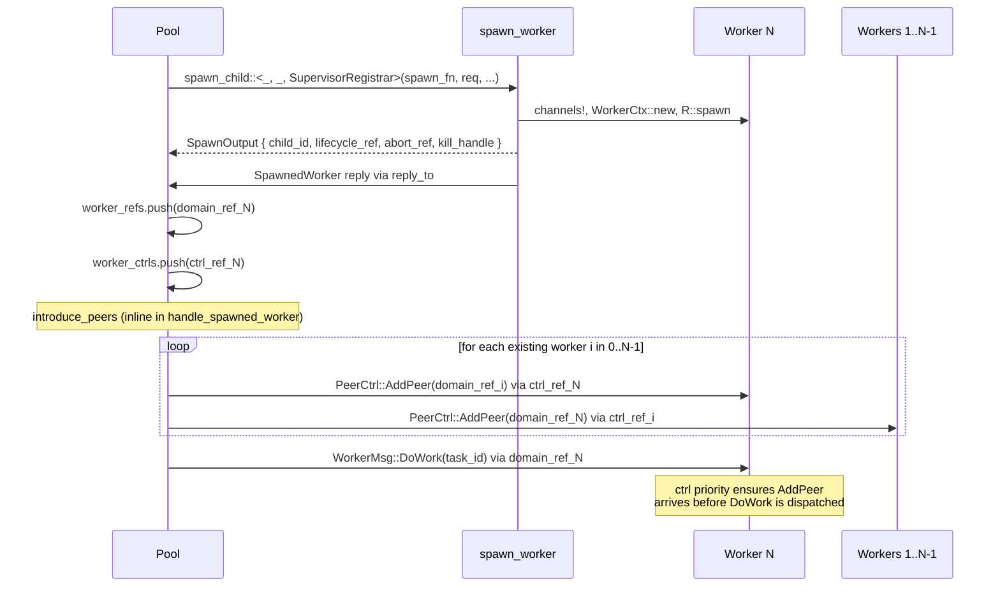

# Spawn Architecture

> Related: 08 (supervision), 11 (dynamic-actors), 14 (unified-lifecycle), 15 (composable-context-crates), 16 (declarative-wiring)

## 1. Overview

Spawning is the process by which a running actor creates a new child actor at runtime —
after the executor has started. In Bloxide, spawning is **decoupled from the supervisor**.
The supervisor's job is lifecycle management (monitoring, restart, shutdown); it does not
spawn children. A requesting blox (e.g., the Pool) owns the concrete spawn types, calls a
runtime spawn helper to create the child, and the spawn helper notifies the supervisor by
sending a registration message on the supervisor's control mailbox.

This decoupling keeps the supervisor generic. The supervisor's event enum carries only
lifecycle types — `ActorId`, `ActorRef<LifecycleCommand, R>`, `ChildPolicy`. No
app-specific types, no spawn-request generics, no factory trait bounds. The supervisor
never sees the application's concrete spawn request type.

### Core ideas

1. **Spawn functions are `fn` pointers.** The application provides a stateless `fn`
   pointer at wiring time. No trait object, no captured state, no `Box<dyn>`. All
   per-request state flows through a concrete `SpawnRequest` enum. The function is
   monomorphized at the wiring site.

2. **Factory injection via constructor fields.** The `fn` pointer is injected into the
   requesting blox's context as a constructor field (`foo_factory: fn(...) -> ...`),
   provided by the wiring layer from a Layer 3 impl crate.

3. **Peer introduction for connecting actors.** After spawning, the requesting blox
   introduces the new child to existing peers using `introduce_peers` from the
   `bloxide-peers` crate, which sends bidirectional `AddPeer` messages on each actor's
   control channel.

4. **KillCapability as the ripcord mechanism.** Kill is a type-level property of the runtime,
   encoded via the `KillCapability<R>` trait. Tokio uses `Kill` (external abort via
   `AbortHandle::abort()`); Embassy uses `NoKill` (no-op, `Handle = ()`). No trait
   objects, no dynamic dispatch, no heap allocation in the kill path. Kill is the
   ripcord — used only for unresponsive actors that can't cooperate. For cooperative
   self-termination, use `ChildPolicy::Abort` (sends `AbortCommand` on the abort mailbox).

5. **Per-child abort mailboxes.** Each dynamically spawned child has a dedicated abort
   mailbox (`ActorRef<AbortCommand, R>`). The supervisor sends `AbortCommand::Abort` on this
   mailbox (cooperative self-termination — the child exits cleanly via its select loop).
   For unresponsive actors, `ChildPolicy::Abort` calls `R::Kill::kill(abort_handle)` (ripcord —
   external abort that bypasses the task entirely).

6. **Spawn lifecycle: create → wire peers → start.** The spawn helper creates the child,
   sends a registration message to the managing blox, and the managing blox sends
   `LifecycleCommand::Start`. The child reports `Started` → `Alive` → `Done`/`Failed`
   through the existing lifecycle event channel.

---

## 2. Design Principles

1. **No unsupervised children.** Every child — static or dynamic — is registered with the
   supervisor via `RegisterChild` or `RegisterDynamicChild`. The supervisor is the sole
   gateway for lifecycle management. No child exists without the supervisor knowing.

2. **Spawning is owned by the requester, not the supervisor.** The blox that wants a child
   (e.g., the Pool) owns the concrete spawn types (`SpawnRequest`, `SpawnedWorker`, the
   spawn function). It calls a runtime spawn helper that creates the child, spawns the
   task, and sends `RegisterDynamicChild` to the supervisor. The supervisor never sees
   the spawn request type.

3. **No `Box`, no `dyn`, no dynamic dispatch.** The spawn function is a `fn` pointer
   (concrete, monomorphized). All messages are fully typed. Dispatch is monomorphized at
   compile time. Required for Embassy/microcontroller (no heap).

4. **The supervisor is just another blox.** Standard codegen from `blox.toml`. No
   `event_name`, no `mailboxes_type`, no `extra_impls` escape hatches, no
   `feature_generics`. The supervisor's `blox.toml` is identical for static and dynamic
   apps — the `dynamic` feature is on the *requesting* blox and the *runtime*, not the
   supervisor.

5. **Spawning is integrated into the lifecycle system.** The spawn helper creates the
   child, sends `RegisterDynamicChild` to the supervisor, and the supervisor sends
   `LifecycleCommand::Start`. The child's lifecycle flows through the existing
   `ChildLifecycleEvent` channel (`Started` → `Alive` → `Done`/`Failed` → `Stopped`/
   `Aborted`). No new lifecycle event types are needed.

6. **Spawning is async by design.** The requesting blox sends a spawn request (on its own
   channel), the spawn helper creates the child and sends `RegisterDynamicChild` to the
   supervisor, and the spawn helper sends the app-specific handles back to the requester
   via a reply channel. The child's own initialization (which may be slow) happens in the
   child's task and flows back as `Started` through the lifecycle channel.

7. **Everything is codegen-ed.** The `blox.toml` is the source of truth. No hand-written
   event enum, no hand-written mailboxes, no hand-written `MachineSpec` impls. The
   supervisor's `blox.toml` uses only standard codegen features.

8. **The supervisor is a reference implementation, not a hardcoded singleton.** The
   supervision traits (`ChildGroup`, `ChildPolicy`, `SupervisorControl`) and the runtime
   capabilities (`SpawnCap`, `run_supervised_actor`) are the reusable layer. Any blox can
   include `ChildGroup<R>` in its context and implement supervision. The
   `bloxide-supervisor` blox is the standard reference; other bloxes can compose the same
   traits differently via `ChildRegistrar<R>`.

9. **Capabilities are mailboxes, not trait objects.** Each platform capability is a
   command enum sent on a separate per-child mailbox. The supervisor sends messages on
   typed channels; the concrete handles stay on the receiving side. No `Arc<dyn>`, no
   `Option<Capability>` trait object, no dynamic dispatch. Kill is the first capability;
   the pattern extends to suspend, resume, inspect, etc.

---

## 3. Architecture

### 3.1 Crate Layout

```
bloxide-core              ← engine + runtime capabilities
  BloxRuntime, MachineSpec, lifecycle types
  DynamicChannelCap, StaticChannelCap
  KillCapability<R> trait + NoKill / Kill type-level enum
  AbortCommand, ChildPolicy, GroupShutdown, RestartStrategy (child_management module)

bloxide-spawn/            ← spawn capability (separate crate)
  SpawnCap (TaskHandle, AbortHandle, spawn, abort_handle, abort)
  SpawnOutput<R>, SpawnFn<R, Req>, ChildRegistrar<R>, spawn_child<R, Req, C>

bloxide-child-management/ ← reusable child tracking (separate crate)
  ChildGroup<R>             ← per-child tracking, restart strategy, phase management
  ChildEntry<R>, ChildPhase
  HasChildGroup<R>, HasChildGroupMut<R>, HasPending accessor traits

bloxide-supervisor/       ← the supervisor blox (codegen-ed from blox.toml)
  blox.toml                ← source of truth: states, context, transitions, events
  Cargo.toml               ← NO dynamic feature. Supervisor is feature-free.
  src/generated/           ← codegen output (ctx.rs, topology.rs, spec_skeleton.rs, events.rs)
  src/lib.rs               ← re-exports
  src/control.rs           ← SupervisorControl, RegisterChild, RegisterDynamicChild, SupervisorRegistrar
  src/spawn.rs             ← HasChildNotify trait (accessor for child-event mailbox)

bloxide-supervisor/src/actions.rs  ← in-crate action functions (concrete &SupervisorEvent<R>)
  start_children, stop_all_children
  handle_done_or_failed, record_stopped, record_started, record_alive, record_aborted
  register_child, handle_register_dynamic_child, handle_health_check
  (NO handle_spawn — spawning is not a supervisor action)
  (abort_child sends an AbortCommand message; kill_child calls R::Kill::kill, not a trait method call)

bloxide-tokio/            ← Tokio runtime
  run_supervised_actor (existing — static children)
  run_supervised_actor_with_abort (abort mailbox wrapper for dynamic children)
  ChildGroupBuilder (control_ref + notify_ref extraction)
  SpawnCap impl: TaskHandle = JoinHandle<()>, AbortHandle = AbortHandle
  KillCapability impl: type Kill = Kill

bloxide-embassy/          ← Embassy runtime (no dynamic spawning)
  run_supervised_actor (existing — static children only)
  ChildGroupBuilder (existing)
  KillCapability impl: type Kill = NoKill

bloxide-peers/            ← peer introduction (PeerCtrl, AddPeer, RemovePeer, introduce_peers)

pool-messages/            ← Pool's message types (owns concrete spawn types)
  PoolMsg, WorkerMsg, SpawnedWorker
  SpawnRequest<R>          ← concrete request enum

tokio-pool-demo-impl/     ← Pool's impl crate (owns the spawn function)
  spawn_worker (fn pointer)
```

### 3.2 The Spawn Function

The spawn function lives in the **application's impl crate**, not the supervisor's context
crate. It is a `fn` pointer — concrete, monomorphized, no captured state.

```rust
// In the application's impl crate (e.g., tokio-pool-demo-impl)

use bloxide_core::{
    capability::{BloxRuntime, DynamicChannelCap},
    lifecycle::{ChildLifecycleEvent, LifecycleCommand},
    messaging::{ActorId, ActorRef},
    child_management::{AbortCommand, ChildPolicy},
};
use bloxide_spawn::{SpawnCap, SpawnOutput};
use bloxide_peers::PeerCtrl;
use pool_messages::{SpawnRequest, SpawnedWorker, WorkerMsg};

/// The concrete spawn function. A stateless `fn` pointer — no captured state.
/// All per-request state comes through SpawnRequest.
///
/// The function:
///   1. Creates channels (R::channel) for the child — lifecycle, domain, control,
///      and an abort mailbox
///   2. Constructs the child's context (app-specific)
///   3. Spawns the child task (R::spawn) with abort mailbox support,
///      wrapped in run_supervised_actor_with_abort
///   4. Sends the app-specific reply via the request's reply_to field
///   5. Returns SpawnOutput for supervisor registration (includes abort_ref
///      and abort_handle)
///
/// The function is fast (run-to-completion): channel creation and R::spawn()
/// are non-blocking. The child's own initialization (which may be slow) runs
/// in the child's task and reports back via lifecycle events.
pub fn spawn_worker<R>(req: SpawnRequest<R>, notify: ActorRef<ChildLifecycleEvent, R>) -> SpawnOutput<R>
where
    R: BloxRuntime + SpawnCap + DynamicChannelCap,
{
    match req {
        SpawnRequest::Worker { task_id: _, pool_ref, reply_to } => {
            let worker_id = R::alloc_actor_id();

            // Create channels for the child
            let (ctrl_ref, ctrl_rx) = R::channel::<PeerCtrl<WorkerMsg, R>>(worker_id, 16);
            let (domain_ref, domain_rx) = R::channel::<WorkerMsg>(worker_id, 16);
            let (lifecycle_ref, lifecycle_rx) = R::channel::<LifecycleCommand>(worker_id, 4);
            let (abort_ref, abort_rx) = R::channel::<AbortCommand>(worker_id, 4);

            // Construct the child's context (app-specific)
            let behavior = WorkerBehavior::<R>::default();
            let worker_ctx = WorkerCtx::new(pool_ref, worker_id, behavior);
            let machine = StateMachine::<WorkerSpec<R, WorkerBehavior<R>>>::new(worker_ctx);

            // Spawn the child task with abort mailbox support (non-blocking).
            let notify_sender = notify.sender();
            let task_handle = R::spawn(async move {
                run_supervised_actor_with_abort(
                    machine,
                    (ctrl_rx, domain_rx),
                    lifecycle_rx,
                    abort_rx,
                    worker_id,
                    notify_sender,
                ).await;
            });

            // Convert the TaskHandle to a cloneable AbortHandle for the ripcord.
            let abort_handle = R::abort_handle(task_handle);

            // Send app-specific handles back to the requester
            let _ = reply_to.try_send(worker_id, SpawnedWorker {
                child_id: worker_id,
                domain_ref: domain_ref.clone(),
                ctrl_ref: ctrl_ref.clone(),
            });

            // Return what the supervisor needs for lifecycle management + kill.
            // The abort_handle flows to the managing blox via
            // SpawnOutput::abort_handle → RegisterDynamicChild::abort_handle →
            // ChildEntry::abort_handle. The managing blox uses it as the
            // ripcord for unresponsive children (§3.13).
            SpawnOutput {
                child_id: worker_id,
                lifecycle_ref,
                abort_ref,       // kill capability mailbox (send side)
                abort_handle,   // cloneable ripcord for external abort
                policy: ChildPolicy::Stop,
            }
        }
    }
}
```

The function is a `fn` pointer — `spawn_worker as SpawnFn<R, SpawnRequest<R>>` is
monomorphized at the wiring site. The wiring layer provides this to the runtime spawn
helper (§3.12).

The `SpawnFn` type alias is defined in `bloxide-core` so any blox can name the type
without depending on a specific runtime:

```rust
// In bloxide-spawn (alongside SpawnCap)

/// A spawn function creates a child actor and returns the handles the
/// supervisor needs for lifecycle management and capability control.
///
/// This is a `fn` pointer, not a trait. The application provides the
/// concrete function at wiring time. The function is stateless — all
/// per-request state comes through the request parameter.
pub type SpawnFn<R, Req> = fn(
    req: Req,
    notify: ActorRef<ChildLifecycleEvent, R>,
) -> SpawnOutput<R>;
```

### 3.3 The Spawn Request

The spawn request lives in the **application's messages crate** (e.g.,
`pool-messages`). It is a concrete enum — no associated types, no generics beyond `R`.
The application defines this enum with variants for each kind of actor it wants to spawn.

```rust
// In the application's messages crate (e.g., pool-messages)

use bloxide_core::{capability::BloxRuntime, messaging::ActorRef};

/// A spawn request. Concrete enum — no associated types, no generics beyond R.
/// All state needed to construct the child is carried in the request,
/// not captured in a factory struct. This makes the spawn function stateless.
#[derive(Debug, Clone)]
pub enum SpawnRequest<R: BloxRuntime> {
    Worker {
        task_id: u32,
        pool_ref: ActorRef<PoolMsg, R>,       // so the worker can talk to the pool
        reply_to: ActorRef<SpawnedWorker<R>, R>, // where to send the handles back
    },
    // Future variants: JobRunner { ... }, Scheduler { ... }, etc.
}

/// The reply sent back to the requester with the child's handles.
#[derive(Debug, Clone)]
pub struct SpawnedWorker<R: BloxRuntime> {
    pub child_id: ActorId,
    pub domain_ref: ActorRef<WorkerMsg, R>,
    pub ctrl_ref: ActorRef<PeerCtrl<WorkerMsg, R>, R>,
}
```

`SpawnRequest<R>` lives in `pool-messages`, not in `bloxide-supervisor`. The
supervisor never imports it, never names it, never matches on it. The Pool calls the
runtime spawn helper directly, passing the request by value (§3.12). The supervisor's
control channel only carries `RegisterDynamicChild`, which the spawn helper sends after
the child is created.

### 3.4 SpawnOutput

`SpawnOutput<R>` lives in `bloxide-spawn` because it is not supervisor-specific. Any blox
that manages children — the standard supervisor, a user's custom job dispatcher, a load
balancer — needs the same lifecycle refs, kill ref, abort handle, and policy from a spawn
operation.

```rust
// In bloxide-spawn

use bloxide_core::capability::{BloxRuntime, KillCapability};
use bloxide_core::lifecycle::LifecycleCommand;
use bloxide_core::messaging::{ActorId, ActorRef};
use bloxide_core::child_management::{AbortCommand, ChildPolicy};

/// What a spawn function returns — the lifecycle and capability refs needed
/// to register the child with whatever blox manages it.
///
/// This type carries only lifecycle types and capability mailbox refs. The
/// app-specific handles (domain_ref, ctrl_ref, etc.) go back to the requester
/// via the spawn request's reply-to channel, not through here.
///
/// The `abort_handle` is the cloneable ripcord: the spawn function gets a
/// `TaskHandle` from `R::spawn()`, converts it to an `AbortHandle` via
/// `R::abort_handle()`, and passes it here so the managing blox can call
/// `R::Kill::kill(handle)` for unresponsive children. For `NoKill` runtimes
/// this is `()`.
pub struct SpawnOutput<R: BloxRuntime> {
    /// The allocated actor ID for the new child.
    pub child_id: ActorId,
    /// Channel for sending lifecycle commands (Start, Stop, Reset).
    pub lifecycle_ref: ActorRef<LifecycleCommand, R>,
    /// Abort mailbox (send side). The managing blox sends AbortCommand
    /// here; the child's task receives it and self-terminates (cooperative).
    pub abort_ref: ActorRef<AbortCommand, R>,
    /// Cloneable abort handle for external task abort (the ripcord). The
    /// managing blox calls `R::Kill::kill(handle)` when the child is
    /// unresponsive. `()` for `NoKill` runtimes, `R::AbortHandle` for `Kill`
    /// runtimes. Must be `Clone` so action functions can extract it from
    /// `&Event` (the HSM engine passes `&Event`, not `&mut Event`).
    pub abort_handle: <R::Kill as KillCapability<R>>::Handle,
    /// Supervision policy for this child.
    pub policy: ChildPolicy,
}
```

### 3.5 ChildRegistrar — Decoupling Spawn from the Supervisor

The spawn helper (§3.12) works with **any** blox that manages children, not just the
standard supervisor. A user might write a custom job dispatcher, a load balancer, or
their own supervisor variant — each with its own control protocol and registration
message type.

The `ChildRegistrar` trait bridges the generic spawn helper to a blox-specific
registration protocol:

```rust
// In bloxide-spawn

/// A blox that manages spawned children implements this to define how
/// `SpawnOutput` is wrapped into its own control-plane message type.
///
/// The associated `RegisterMsg` is the message type the spawn helper sends
/// on the managing blox's control mailbox after a child is spawned.
///
/// The standard supervisor implements this with `RegisterMsg = SupervisorControl<R>`.
/// A user's custom blox implements it with their own message type.
pub trait ChildRegistrar<R: BloxRuntime> {
    type RegisterMsg: Send + 'static;

    /// Wrap a `SpawnOutput` into the managing blox's registration message.
    fn register(output: SpawnOutput<R>) -> Self::RegisterMsg;
}
```

The standard supervisor's implementation (in `bloxide-supervisor`):

```rust
// In bloxide-supervisor

impl<R: BloxRuntime> ChildRegistrar<R> for SupervisorRegistrar {
    type RegisterMsg = SupervisorControl<R>;

    fn register(output: SpawnOutput<R>) -> SupervisorControl<R> {
        SupervisorControl::RegisterDynamicChild(RegisterDynamicChild {
            id: output.child_id,
            lifecycle_ref: output.lifecycle_ref,
            abort_ref: output.abort_ref,
            abort_handle: output.abort_handle,
            policy: output.policy,
        })
    }
}

/// Marker type for the standard supervisor's registrar implementation.
pub struct SupervisorRegistrar;
```

The spawn helper is generic over `C: ChildRegistrar<R>`. The wiring codegen injects the
appropriate `ChildRegistrar` type based on which blox manages the children in the
`system.toml`.

### 3.6 The Abort Mailbox

Abort is a **message**, not a function call on a trait object. The managing blox sends an
`AbortCommand` on a per-child abort mailbox. The child's task (wrapped in
`run_supervised_actor_with_abort`) receives it and self-terminates cooperatively.

```rust
// In bloxide-core (child_management module)

/// Command enum for the abort mailbox.
///
/// Sent by the managing blox (supervisor or custom) when `ChildPolicy::Abort` fires.
/// The child's task receives this on its abort mailbox and self-terminates
/// cooperatively (no callbacks fire, but the task exits cleanly via its select loop).
///
/// This is the first instance of the capability-as-mailbox pattern.
/// Future capabilities (suspend, resume, inspect) follow the same
/// pattern: a command enum sent on a per-child mailbox.
#[derive(Debug, Clone)]
pub enum AbortCommand {
    /// Abort the child cooperatively. No `on_exit` callbacks, but the task
    /// exits cleanly by breaking out of its select loop. Returns `Aborted`.
    Abort { child_id: ActorId },
}
```

The abort mailbox is created by the spawn function (§3.2) alongside the lifecycle and
domain channels. The send side (`abort_ref`) goes into `SpawnOutput` → the managing blox's
registration message → the managing blox's child list. The receive side (`abort_rx`) goes
to `run_supervised_actor_with_abort` which listens on it in the child's task.

### 3.7 SupervisorControl Enum

The supervisor's control-plane enum. No `Spawn` variant — spawning is decoupled from the
supervisor. This enum is specific to the standard supervisor; a user's custom
child-managing blox defines its own control enum (see §3.5 `ChildRegistrar`).

```rust
// In bloxide-supervisor

/// Supervisor control-plane events delivered through the control mailbox.
///
/// There is no `Spawn` variant — spawning is decoupled from the supervisor.
/// The spawn helper calls `spawn_child()` (in `bloxide-core`) which sends
/// `RegisterDynamicChild` on the control mailbox after the child is created.
pub enum SupervisorControl<R: BloxRuntime> {
    /// Register a static child (wired at startup, no kill capability).
    /// The child's channels already exist (created by the wiring layer).
    /// The supervisor just tracks it for lifecycle management.
    RegisterChild(RegisterChild<R>),

    /// Register a dynamically spawned child (has kill capability).
    /// Sent by the spawn helper after creating the child. Carries the
    /// abort_ref and abort_handle for external abort (see §3.8).
    RegisterDynamicChild(RegisterDynamicChild<R>),

    /// Trigger one health-check round.
    HealthCheckTick,
}
```

The supervisor's control enum is the same for static and dynamic apps. Dynamic spawning
doesn't add a variant — it just means `RegisterChild` arrives at runtime (from the spawn
helper) instead of at startup (from the wiring layer), plus `RegisterDynamicChild` carries
the kill capability fields.

### 3.8 RegisterChild and RegisterDynamicChild

`RegisterChild` is for static children (wired at startup, no kill capability).
`RegisterDynamicChild` is for dynamically spawned children (has `abort_ref` +
`abort_handle`). Both are variants of `SupervisorControl<R>`.

Two separate structs avoid `Option` on the kill fields — the type system encodes the
capability (static children don't have `abort_ref`):

```rust
// In bloxide-supervisor

/// Register a static child (wired at startup). No kill capability.
/// Used by the wiring layer for Embassy and static Tokio children.
pub struct RegisterChild<R: BloxRuntime> {
    pub id: ActorId,
    pub lifecycle_ref: ActorRef<LifecycleCommand, R>,
    pub policy: ChildPolicy,
}

/// Register a dynamically spawned child. Has a kill capability mailbox.
/// Used by the spawn helper when SpawnCap is available.
///
/// The `abort_handle` is `Clone` (it's `R::AbortHandle`, which requires
/// `Clone` on the `SpawnCap` trait). This allows the supervisor's action
/// function to clone the `abort_handle` from `&Event` (the HSM engine passes
/// `&Event`, not `&mut Event`).
pub struct RegisterDynamicChild<R: BloxRuntime> {
    pub id: ActorId,
    pub lifecycle_ref: ActorRef<LifecycleCommand, R>,
    /// Kill capability mailbox (send side).
    pub abort_ref: ActorRef<AbortCommand, R>,
    /// Cloneable abort handle for external task abort (the ripcord).
    /// `()` for NoKill runtimes, `R::AbortHandle` for Kill runtimes.
    pub abort_handle: <R::Kill as KillCapability<R>>::Handle,
    pub policy: ChildPolicy,
}
```

Both variants are available regardless of runtime — `RegisterDynamicChild` is just a struct
with a `abort_ref` field; it doesn't require `R: SpawnCap` to name the type (the
`ActorRef<AbortCommand, R>` only needs `R: BloxRuntime`). The supervisor's `register_child`
action handles both variants: adds the child to the list, stores the `abort_ref` and
`abort_handle` if present, sends `Start`.

### 3.9 The Supervisor Event Enum

```rust
// GENERATED by codegen — NOT hand-written

/// The event type for supervisor state machines.
/// One enum, no spawn-request generic, no Spawn variant.
#[derive(Debug, Clone)]
pub enum SupervisorEvent<R: BloxRuntime> {
    Child(Envelope<ChildLifecycleEvent>),
    Control(Envelope<SupervisorControl<R>>),
    Lifecycle(LifecycleCommand),
}

// From impls — standard, no coherence problem
impl<R: BloxRuntime> From<Envelope<ChildLifecycleEvent>> for SupervisorEvent<R> { ... }
impl<R: BloxRuntime> From<Envelope<SupervisorControl<R>>> for SupervisorEvent<R> { ... }
impl<R: BloxRuntime> From<LifecycleCommand> for SupervisorEvent<R> { ... }
```

`SupervisorEvent<R>` has no spawn-request parameter and no `Spawn` variant. The event enum
is identical for static and dynamic apps — there is no `dynamic` feature on the supervisor
crate. The codegen auto-generates the `Lifecycle` variant (with `From<LifecycleCommand>`,
`LIFECYCLE_TAG`, `LifecycleEvent` impl, and helper methods) as the first variant in every
event enum — the supervisor gets it for free, same as every other blox.

Action functions take `&SupervisorEvent<R>` concretely and pattern-match through
`Envelope<ChildLifecycleEvent>` / `Envelope<SupervisorControl<R>>` directly. This is the
same pattern every other blox uses.

### 3.10 The Supervisor Context

```rust
// GENERATED by codegen — NOT hand-written

pub struct SupervisorCtx<R: BloxRuntime> {
    pub children: ChildGroup<R>,
    pub self_id: ActorId,
    pub child_notify: ActorRef<ChildLifecycleEvent, R>,
    pub pending: ChildAction,
}
```

No `spawn_fn` field. No factory field. No spawn-request generic. No
`#[cfg(feature = "dynamic")]` on any field. The supervisor context is the same for static
and dynamic apps. The supervisor doesn't spawn — it only registers and manages lifecycle.

### 3.11 ChildGroup and ChildEntry

`ChildGroup<R>` is the supervisor's child list. Each `ChildEntry` carries an `abort_ref`
(an `ActorRef<AbortCommand, R>`) for the cooperative abort message, and an `abort_handle`
(`<R::Kill as KillCapability<R>>::Handle`) for the external-abort ripcord. Both are
`Option` — `None` for static children registered via `RegisterChild`, `Some` for dynamic
children registered via `RegisterDynamicChild`.

```rust
// In bloxide-child-management

struct ChildEntry<R: BloxRuntime> {
    id: ActorId,
    lifecycle_ref: ActorRef<LifecycleCommand, R>,
    policy: ChildPolicy,
    restarts: usize,
    permanently_done: bool,
    stopped: bool,
    phase: ChildPhase,
    awaiting_alive: bool,
    /// Abort mailbox (send side). None for static children
    /// registered via RegisterChild (no abort capability).
    abort_ref: Option<ActorRef<AbortCommand, R>>,
    /// Cloneable abort handle for external task abort (ripcord). None for static
    /// children. Consumed by R::Kill::kill(handle) when ChildPolicy::Kill fires.
    /// This is R::AbortHandle (Clone), not R::TaskHandle (not Clone).
    abort_handle: Option<<R::Kill as KillCapability<R>>::Handle>,
}

pub struct ChildGroup<R: BloxRuntime> {
    children: Vec<ChildEntry<R>>,
    shutdown: GroupShutdown,
    restart_strategy: RestartStrategy,
    stopped_count: usize,
}
```

The `Option` on `abort_ref` is an `Option` on a *mailbox ref* (cheap, cloneable, no `dyn`).
The `Option` on `abort_handle` is an `Option` on a *concrete type* selected at the type
level (`()` for Embassy, `R::AbortHandle` for Tokio). Neither is a trait object. The
`Option` exists because `ChildGroup` is a single type that handles both static and dynamic
children — the `Option` encodes "this child has an abort mailbox" vs "this child doesn't."

`handle_done_or_failed` evaluates the child's `ChildPolicy` — four variants:

- **`ChildPolicy::Kill`** (ripcord): Takes the `abort_handle`, calls `R::Kill::kill(handle)`.
  External abort — works even if the child is stuck. No callbacks fire. Marks permanently done.
- **`ChildPolicy::Abort`** (cooperative): Sends `AbortCommand::Abort` on the child's
  `abort_ref`. The child self-terminates via its select loop and reports `Aborted`.
  Marks permanently done.
- **`ChildPolicy::Restart { max }`**: Sends `Reset` (if restarts < max). Reset goes directly
  to `initial_state()` — the child reports `Started`, no separate `Start` needed. Sets
  phase to `ResetPending`.
- **`ChildPolicy::Stop`**: Marks permanently done immediately.

```rust
// In ChildGroup::handle_done_or_failed (simplified)

match policy {
    ChildPolicy::Kill => {
        // Ripcord: external abort. Works even if the child is stuck and
        // never polls the abort mailbox. For NoKill runtimes this is a no-op
        // (kill(()) does nothing). For Kill runtimes this calls AbortHandle::abort().
        let abort_handle = self.children[idx].abort_handle.take();
        if let Some(handle) = abort_handle {
            R::Kill::kill(handle);
        }
        self.children[idx].permanently_done = true;
        self.children[idx].phase = ChildPhase::PermanentlyDone;
        self.children[idx].awaiting_alive = false;
        return self.check_shutdown();
    }
    ChildPolicy::Abort => {
        // Cooperative: send abort message. The child self-terminates
        // via the select loop in run_supervised_actor_with_abort.
        if let Some(abort_ref) = &self.children[idx].abort_ref {
            let _ = abort_ref.try_send(from, AbortCommand::Abort { child_id });
        }
        // Child will report Aborted; record_aborted marks permanently done.
    }
    ChildPolicy::Restart { max } => {
        if self.children[idx].restarts < max {
            self.children[idx].restarts += 1;
            // Reset goes directly to initial_state() — no separate Start needed.
            let _ = lifecycle_ref.try_send(from, LifecycleCommand::Reset);
            self.children[idx].phase = ChildPhase::ResetPending;
        } else {
            self.children[idx].permanently_done = true;
            self.children[idx].phase = ChildPhase::PermanentlyDone;
            return self.check_shutdown();
        }
    }
    ChildPolicy::Stop => {
        self.children[idx].permanently_done = true;
        self.children[idx].phase = ChildPhase::PermanentlyDone;
        return self.check_shutdown();
    }
}
```

All other `ChildGroup` methods (restart strategy, shutdown logic, phase tracking, health
check) are standard lifecycle management. The `ChildGroup` sends a message instead of
calling a trait method for abort — the capability-as-mailbox pattern.

### 3.12 The Runtime Spawn Helper

The spawn helper lives in `bloxide-spawn`. It is the bridge between
the requesting blox and whatever blox manages children. It calls the app's spawn function
and sends the registration message (typed by `C: ChildRegistrar<R>`) to the managing
blox's control mailbox.

```rust
// In bloxide-spawn

/// Spawn a supervised child actor.
///
/// Called by the requesting blox (e.g., the Pool) — NOT by the supervisor.
/// The requesting blox provides the spawn function and the request.
///
/// This helper:
///   1. Calls the spawn function to create the child (channels, context, task)
///   2. Sends the registration message (typed by C::RegisterMsg) to the
///      managing blox's control mailbox
///
/// The supervisor receives the registration message and starts managing the
/// child's lifecycle. The supervisor never sees the request type.
///
/// # Type Parameters
///
/// - `R` — the runtime
/// - `Req` — the application's concrete spawn request type
/// - `C` — the `ChildRegistrar` implementation. Determines how `SpawnOutput`
///   is wrapped into the managing blox's control-plane message.
///   For the standard supervisor, `C = SupervisorRegistrar`.
pub fn spawn_child<R, Req, C>(
    spawn_fn: SpawnFn<R, Req>,
    req: Req,
    control_ref: &ActorRef<C::RegisterMsg, R>,
    notify_ref: &ActorRef<ChildLifecycleEvent, R>,
    from: ActorId,
) -> Result<(), R::TrySendError>
where
    R: BloxRuntime,
    Req: Send + Clone + 'static,
    C: ChildRegistrar<R>,
{
    // 1. Call the spawn function — creates channels, constructs child, spawns task
    let output: SpawnOutput<R> = spawn_fn(req, notify_ref.clone());

    // 2. Wrap output into the managing blox's registration message and send it
    let msg = C::register(output);
    control_ref.try_send(from, msg)?;

    Ok(())
}
```

The requesting blox (e.g., the Pool) calls `spawn_child` directly, specifying
`C = SupervisorRegistrar` as the type parameter to wire the `SpawnOutput` into
the supervisor's `SupervisorControl::RegisterDynamicChild` message:

```rust
// In pool-blox — the Pool calls spawn_child directly

use bloxide_spawn::{spawn_child, ChildRegistrar};
use bloxide_supervisor::SupervisorRegistrar;

let result = spawn_child::<_, _, SupervisorRegistrar>(
    ctx.spawn_fn,
    req,
    &ctx.spawn_ref,   // supervisor control mailbox
    &ctx.notify_ref,  // child lifecycle event mailbox
    ctx.self_id(),
);
```

`SpawnFn` and `ChildRegistrar` are both defined in `bloxide-spawn` so any blox can name
them without a runtime or supervisor dependency. The `SupervisorRegistrar` is the only
type the pool needs from `bloxide-supervisor` — it implements `ChildRegistrar` to wrap
`SpawnOutput` into `SupervisorControl::RegisterDynamicChild`.

### 3.13 run_supervised_actor_with_abort

The abort mailbox's receiving end lives in a wrapper around `run_supervised_actor`. This
wrapper listens on the abort mailbox alongside the lifecycle and domain mailboxes. The
abort path is **cooperative** — the child's task polls the abort mailbox in its select loop
and self-terminates when it receives `AbortCommand::Abort`:

1. **Cooperative self-termination (abort):** The abort mailbox is polled in the main event
   `select` loop. When `AbortCommand::Abort` is received, the task breaks out of the run
   loop, reports `DispatchOutcome::Aborted`, and returns. This is the cooperative path —
   the child exits cleanly but no `on_exit` callbacks fire.

2. **External abort (ripcord — `ChildPolicy::Kill`):** If the task is stuck (e.g., blocked
   on a long `await` that doesn't yield to the select loop), the `AbortHandle` stored in
   `ChildEntry` is used to call `R::Kill::kill(handle)` for an immediate external abort.
   This bypasses the task entirely — no cooperation, no callbacks. It is the safety net for
   unresponsive tasks.

```rust
// In bloxide-tokio

/// Run a supervised actor with abort mailbox support.
///
/// This wraps run_supervised_actor with an additional abort mailbox.
/// When `AbortCommand::Abort` is received, the actor self-terminates
/// cooperatively (breaks out of the select loop, reports Aborted, drops the future).
///
/// Two termination paths:
///   1. Cooperative (AbortCommand): the task breaks out of the select
///      loop and returns. Works when the abort mailbox is actively polled.
///   2. External abort (ripcord): the AbortHandle from
///      SpawnCap::abort_handle() is stored in ChildEntry in the
///      supervisor. When the child is unresponsive (not polling the abort
///      mailbox), the supervisor calls R::Kill::kill(handle) — which
///      calls SpawnCap::abort(handle), i.e. AbortHandle::abort() on Tokio.
///
/// This function handles only the cooperative path. The external
/// abort is handled by ChildGroup::handle_done_or_failed in the
/// supervisor (see §3.11).
pub async fn run_supervised_actor_with_abort<S: MachineSpec + 'static>(
    machine: StateMachine<S>,
    domain_mailboxes: S::Mailboxes<TokioRuntime>,
    lifecycle_stream: TokioStream<LifecycleCommand>,
    abort_stream: TokioStream<AbortCommand>,
    actor_id: ActorId,
    supervisor_notify: TokioSender<ChildLifecycleEvent>,
) {
    loop {
        // Poll lifecycle (highest priority) → abort mailbox → domain mailboxes.
        // On AbortCommand::Abort, break out of the loop and return.
        // This drops the future and ends the task.
        // ...
    }
}
```

The poll priority is: lifecycle stream (highest) → abort mailbox → domain mailboxes. This
ensures abort is serviced before domain messages so a cooperative abort can be processed
promptly when the task next yields to the select loop.

The `TaskHandle` from `R::spawn()` is converted to a cloneable `AbortHandle` via
`R::abort_handle()` in the spawn function, then flows to the supervisor via
`SpawnOutput::abort_handle` → `RegisterDynamicChild::abort_handle` →
`ChildEntry::abort_handle`. In the common case, self-termination via the select loop is
sufficient and the external abort is never invoked. The external `R::Kill::kill(handle)`
is the ripcord for unresponsive tasks that don't yield to the select loop.

For static children (wired at startup, no abort mailbox), the existing
`run_supervised_actor` (without abort support) is used unchanged.

> **Runtime-specific note:** `run_supervised_actor_with_abort` uses concrete `TokioRuntime`
> types because it lives in `bloxide-tokio`. The abort mailbox mechanism itself is
> runtime-generic — only the `select` loop wrapper is runtime-specific. Embassy uses
> `run_supervised_actor` without abort support (static children only, `NoKill`).

### 3.14 The Pool's Spawn Action

The Pool handles spawning in its own state machine. When it receives a `SpawnWorker`
message, it calls the runtime spawn helper directly. The Pool owns the `spawn_fn` (a `fn`
pointer stored in its context) and the `spawn_ref` (the managing blox's control mailbox
ref).

```rust
// In the Pool's action crate

/// Handle a SpawnWorker request: call the spawn helper to create a child,
/// then transition to the Spawning state to wait for the reply.
pub fn handle_spawn_worker<R: BloxRuntime>(
    ctx: &mut PoolCtx<R>,
    ev: &PoolEvent<R>,
) -> ActionResult {
    if let Some(PoolMsg::SpawnWorker(SpawnWorker { task_id })) = ev.msg_payload() {
        ctx.pending_task_id = *task_id;
        ctx.spawn_in_flight = true;

        let req = SpawnRequest::Worker {
            task_id: *task_id,
            pool_ref: ctx.self_ref.clone(),
            reply_to: ctx.spawn_reply_ref.clone(),
        };

        // Call spawn_child directly — the Pool owns the spawn_fn
        // and the managing blox's control_ref (wired as spawn_ref).
        let result = spawn_child::<_, _, SupervisorRegistrar>(
            ctx.spawn_fn,           // fn pointer from wiring
            req,
            &ctx.spawn_ref,         // managing blox's control mailbox
            &ctx.notify_ref,        // managing blox's child-notify mailbox
            ctx.self_id(),
        );

        if result.is_err() {
            bloxide_log::blox_log_warn!(
                ctx.self_id(),
                "spawn failed (supervisor control mailbox full), dropping task_id={}",
                task_id
            );
            ctx.spawn_in_flight = false;
        }
    }
    ActionResult::Ok
}
```

The Pool's context has these spawn-related fields:

```rust
// In PoolCtx (from pool/blox.toml)

/// The spawn function (fn pointer, provided at wiring time).
/// Only present on runtimes that support dynamic spawning (Tokio).
/// Gated by the Pool's `dynamic` feature.
pub spawn_fn: SpawnFn<R, SpawnRequest<R>>,

/// Ref to the managing blox's control mailbox — used to send the registration
/// message. For the standard supervisor, it's ActorRef<SupervisorControl<R>, R>.
pub spawn_ref: ActorRef<SupervisorControl<R>, R>,

/// Ref to the managing blox's child-notify mailbox — passed to the spawn
/// function so the child can report lifecycle events.
pub notify_ref: ActorRef<ChildLifecycleEvent, R>,
```

---

## 4. Factory Injection via Constructor Fields

The spawn function is injected into the requesting blox's context as a **constructor
field** — a `fn` pointer provided at wiring time. The naming convention is
`foo_factory: fn(...) -> ...` (or `spawn_fn: SpawnFn<R, Req>`). The `#[derive(BloxCtx)]`
macro auto-detects constructor-only fields (those not updated by transitions) and
includes them in the context's `new()` constructor.

The factory lives in a **Layer 3 impl crate** consumed by the wiring binary — the only
place that knows the concrete child type (`WorkerCtx`, `WorkerSpec`). This keeps the
parent blox decoupled from the child's concrete type (upholding the invariant: blox crates
never import impl crates) and means the parent does not need any `SpawnCap` bound — it
only needs `R: BloxRuntime`.

The wiring layer provides `spawn_fn` via `source = "factory"` in `system.toml`:

```toml
[actors.inject]
spawn_fn = { source = "factory", crate = "tokio_pool_demo_impl", function = "spawn_worker" }
```

The codegen emits a **path expression** (`spawn_worker as SpawnFn<R, Req>`) rather than
struct construction. The handler detects whether the target is a `fn` pointer type (from
the field's `ty` in `blox.toml`) and emits the appropriate code: path expression + cast
for `fn` pointers, struct construction for factory structs. One source type, two output
shapes, selected by field type.

An accessor trait exposes the factory to action functions, keeping them generic over any
context that implements it:

```rust
// In pool-actions/src/traits.rs
pub trait HasWorkerFactory<R: BloxRuntime> {
    fn worker_factory(&self) -> WorkerSpawnFn<R>;
}
```

---

## 5. Peer Introduction

When a parent spawns a child that needs to communicate with other running actors (e.g., a
Pool introducing a new Worker to existing Workers), the parent uses **peer introduction**
after spawning. The `bloxide-peers` crate provides the `introduce_peers` helper, which
sends bidirectional `AddPeer` messages on each actor's control channel.

### The introduce_peers Function

```rust
// In bloxide-peers

/// Introduce two actors to each other by sending AddPeer on both control channels.
pub fn introduce_peers<M, R>(
    from: ActorId,
    a_id: ActorId,
    a_ref: ActorRef<M, R>,
    a_ctrl: ActorRef<PeerCtrl<M, R>, R>,
    b_id: ActorId,
    b_ref: ActorRef<M, R>,
    b_ctrl: ActorRef<PeerCtrl<M, R>, R>,
) where
    M: Send + 'static,
    R: BloxRuntime,
{
    let _ = a_ctrl.try_send(from, PeerCtrl::AddPeer(AddPeer {
        peer_id: b_id,
        peer_ref: b_ref.clone(),
    }));
    let _ = b_ctrl.try_send(from, PeerCtrl::AddPeer(AddPeer {
        peer_id: a_id,
        peer_ref: a_ref.clone(),
    }));
}
```

Each actor receives the other's domain `ActorRef` on its control channel. The control
channel is separate from the domain channel, so existing message ordering is unaffected.

### Domain-Specific Peer Control via `bloxide-peers`

The pool and worker use the generic `PeerCtrl<WorkerMsg, R>` from the `bloxide-peers`
crate directly — no domain-specific control enum is needed. The `PeerCtrl` type is
generic over the domain message type (`WorkerMsg`), so it carries the right `ActorRef`
type for peer introduction. The `#[delegates]` annotation on the context crate
(`blox-ctx-worker-peers`) provides accessor traits (`HasWorkerPeers<R>`) that expose
the peer list to action functions.

```rust
// In bloxide-peers
pub enum PeerCtrl<M, R: BloxRuntime> {
    AddPeer(AddPeer<M, R>),
    RemovePeer(RemovePeer),
}

pub struct AddPeer<M, R: BloxRuntime> {
    pub peer_id: ActorId,
    pub peer_ref: ActorRef<M, R>,
}
```

`PeerCtrl<WorkerMsg, R>` is a second mailbox entry in the actor's `Mailboxes` tuple. There is no
new recv loop: the same single `poll_next` / dispatch cycle handles both domain messages
and control messages.

### Split Domain/Ctrl Ref Pattern

Each dynamically spawned child that participates in peer-to-peer messaging has **two
distinct `ActorRef`s**:

| Ref | Type | Purpose |
|-----|------|---------|
| Domain ref | `ActorRef<WorkerMsg, R>` | Application messages (DoWork, etc.) |
| Ctrl ref | `ActorRef<PeerCtrl<WorkerMsg, R>, R>` | Peer control (AddPeer, RemovePeer) |

The parent stores both in its context and uses them for different purposes:
- Domain ref: send work messages and keep the channel alive (self-sender invariant)
- Ctrl ref: introduce the child to other children via `introduce_peers`

The child actor's `Mailboxes` tuple places ctrl at index 0 (highest priority) and the
domain channel at index 1. This guarantees that `AddPeer` commands sent by the parent are
processed before any `DoWork` message — even if both are enqueued before the child has
processed anything. See [07-typed-mailboxes.md](07-typed-mailboxes.md) for the polling
priority semantics.

### Peer Introduction Sequence

The sequence for adding worker N (with N-1 workers already running):



The Pool inlines the peer-introduction loop directly in `handle_spawned_worker`,
calling `bloxide_peers::introduce_peers` for each existing worker. This sends
bidirectional `AddPeer` messages so the new worker knows about all existing
workers and vice versa:

```rust
// In pool-blox handle_spawned_worker — inline peer introduction
let n = ctx.worker_refs().len();
if n >= 2 {
    let new_idx = n - 1;
    let from = ctx.self_id();
    let new_id = ctx.worker_refs()[new_idx].id();
    let new_ref = ctx.worker_refs()[new_idx].clone();
    let new_ctrl = ctx.worker_ctrls()[new_idx].clone();
    for i in 0..new_idx {
        let old_id = ctx.worker_refs()[i].id();
        let old_ref = ctx.worker_refs()[i].clone();
        let old_ctrl = ctx.worker_ctrls()[i].clone();
        introduce_peers(
            from,
            new_id, new_ref.clone(), new_ctrl.clone(),
            old_id, old_ref.clone(), old_ctrl.clone(),
        );
    }
}
```

### Batch Spawn (Known Topology)

When a parent spawns a fixed set of actors whose cross-references are all known at spawn
time, wire them directly at construction without a control channel:

```rust
// Both actors are constructed before either is spawned.
// Cross-refs are injected directly into each Ctx.
let ((ctrl_a, domain_a), mbox_a) = channels! { PeerCtrl<WorkerMsg, R>(16), WorkerMsg(16) };
let ((ctrl_b, domain_b), mbox_b) = channels! { PeerCtrl<WorkerMsg, R>(16), WorkerMsg(16) };

R::spawn(run_actor_to_completion(StateMachine::new(ctx_a), mbox_a));
R::spawn(run_actor_to_completion(StateMachine::new(ctx_b), mbox_b));
introduce_peers(&pool_ctx, &ctrl_a, &domain_a, &ctrl_b, &domain_b);
```

Use batch spawn when all peers are known before any task starts. Use domain control types
when peers are discovered incrementally at runtime.

---

## 6. KillCapability and SpawnCap

### 6.1 KillCapability Trait

The kill capability is a property of the **runtime**, not the supervisor. Embassy has no
`SpawnCap` and cannot externally abort tasks. Tokio has `SpawnCap` and can. This choice is
encoded at the type level via the `KillCapability<R>` trait — a type-level enum, not a
trait object. The runtime picks the variant; the supervisor is monomorphized for whichever
it is.

```rust
// In bloxide-core

/// Type-level kill capability for a runtime.
///
/// `NoKill` — no external task abort (Embassy, static-only). `Handle = ()` (ZST).
/// `Kill`   — external abort via SpawnCap::abort(handle) (Tokio, dynamic).
///
/// This is a type-level enum, not a trait object. The runtime picks the
/// variant; the supervisor is monomorphized for whichever it is.
///
/// The `Handle` type is the cloneable `AbortHandle` from `SpawnCap`, NOT the
/// `TaskHandle`. This is because the handle must be `Clone` so it can be
/// extracted from `&Event` in action functions (the HSM engine passes `&Event`,
/// not `&mut Event`). The spawn function calls `SpawnCap::abort_handle()` to
/// convert the non-Clone `TaskHandle` into the Clone `AbortHandle` before
/// placing it in RegisterDynamicChild.
pub trait KillCapability<R: BloxRuntime> {
    type Handle: Clone + Send + 'static;
    fn kill(handle: Self::Handle);
}

/// No kill capability — static runtimes (Embassy). Handle = () (ZST).
pub struct NoKill;
impl<R: BloxRuntime> KillCapability<R> for NoKill {
    type Handle = ();
    fn kill(_: ()) {}
}

/// Kill capability via SpawnCap::abort. Used by dynamic runtimes (Tokio).
pub struct Kill;
impl<R: BloxRuntime + SpawnCap> KillCapability<R> for Kill {
    type Handle = R::AbortHandle;
    fn kill(handle: R::AbortHandle) {
        R::abort(handle);
    }
}
```

On `BloxRuntime`:

```rust
pub trait BloxRuntime: Clone + Send + 'static {
    // ... associated types for channels, streams, errors ...

    /// Kill capability. NoKill for static runtimes, Kill for dynamic.
    /// Determines the Handle type stored in ChildEntry::abort_handle —
    /// () (ZST) for NoKill, R::AbortHandle for Kill.
    ///
    /// Each runtime impl specifies this explicitly (no default — associated
    /// type defaults are unstable on stable Rust).
    type Kill: KillCapability<Self>;
}
```

Runtime implementations:
- **Embassy**: `type Kill = NoKill`. No `SpawnCap` impl. `Handle = ()` (ZST, zero space).
- **Tokio**: `type Kill = Kill`. Requires `TokioRuntime: SpawnCap`. `Handle = AbortHandle`.
- **TestRuntime**: default `NoKill` unless a test specifically exercises kill.

**Key properties:**
- `ChildGroup<R>` is bounded by `R: BloxRuntime` only — no `SpawnCap` bound leaks.
- The `SpawnCap` bound is satisfied at the runtime impl site, not in the supervisor crate.
- For Embassy: `ChildEntry::abort_handle` is `Option<()>` (ZST, zero space). No `alloc`.
- For Tokio: `ChildEntry::abort_handle` is `Option<AbortHandle>`. Stored by value, no `Arc`.
- No trait object. No dynamic dispatch. No heap allocation in the kill path.

### 6.2 SpawnCap Trait

`SpawnCap` is the Tier 2 capability for runtimes that support spawning actor tasks at
runtime. It extends `DynamicChannelCap` and provides the task handle types and methods
that `KillCapability` builds upon.

```rust
// In bloxide-spawn

/// Tier 2 capability for runtimes that support spawning actor tasks at runtime.
///
/// The associated `TaskHandle` type is returned by `spawn` and is used to
/// produce an `AbortHandle` (the cloneable ripcord). For Tokio,
/// `TaskHandle = JoinHandle<()>` and `AbortHandle = tokio::task::AbortHandle`.
///
/// All types are concrete, by-value — no Arc<dyn>, no dynamic dispatch.
pub trait SpawnCap: DynamicChannelCap {
    /// Handle to a spawned task. Used to derive an AbortHandle.
    /// Consumed by abort_handle. NOT Clone.
    type TaskHandle: Send + 'static;

    /// Cloneable handle for external task abort. Must be Clone so it can
    /// be extracted from &Event in action functions. () for runtimes
    /// without external abort.
    type AbortHandle: Clone + Send + 'static;

    /// Spawn a future as an independent task and return a handle.
    fn spawn(future: impl Future<Output = ()> + Send + 'static) -> Self::TaskHandle;

    /// Derive a cloneable abort handle from a task handle.
    /// The task handle is consumed; the task continues running (drop does not abort).
    fn abort_handle(handle: Self::TaskHandle) -> Self::AbortHandle;

    /// Abort a spawned task immediately via its abort handle. No callbacks fire —
    /// the task is dropped in-place. The handle is consumed and cannot be reused.
    fn abort(handle: Self::AbortHandle);
}
```

Tokio's implementation:

```rust
// In bloxide-tokio

impl SpawnCap for TokioRuntime {
    type TaskHandle = tokio::task::JoinHandle<()>;
    type AbortHandle = tokio::task::AbortHandle;

    fn spawn(future: impl Future<Output = ()> + Send + 'static) -> Self::TaskHandle {
        tokio::spawn(future)
    }

    fn abort_handle(handle: Self::TaskHandle) -> Self::AbortHandle {
        handle.abort_handle()
    }

    fn abort(handle: Self::AbortHandle) {
        handle.abort();
    }
}
```

The kill path in full:
1. `SpawnCap::spawn()` returns `TaskHandle` (not `Clone`)
2. `SpawnCap::abort_handle(task_handle)` converts to `AbortHandle` (`Clone`)
3. `AbortHandle` stored in `SpawnOutput::abort_handle` → `RegisterDynamicChild::abort_handle` → `ChildEntry::abort_handle`
4. When `ChildPolicy::Kill` fires: `R::Kill::kill(abort_handle)` → `R::abort(abort_handle)` → `AbortHandle::abort()`

### 6.3 Abort vs Kill — Two Termination Paths

Termination uses two distinct mechanisms — cooperative abort and ripcord kill:

1. **Cooperative abort (`ChildPolicy::Abort`):** The supervisor sends `AbortCommand::Abort`
   on the child's abort mailbox (polled in the select loop of
   `run_supervised_actor_with_abort`). The child breaks out of the run loop, reports
   `Aborted`, and exits cleanly. No `on_exit` callbacks fire, but the task shuts down
   cooperatively. This is the common case for terminating responsive dynamic actors.

2. **External abort / ripcord (`ChildPolicy::Kill`):** If the task is stuck (not yielding
   to the select loop), `R::Kill::kill(handle)` is called with the `AbortHandle` stored in
   `ChildEntry::abort_handle`. This bypasses the task entirely — no cooperation, no
   callbacks. For `NoKill` runtimes (Embassy), the ripcord is a no-op — `kill(())` does
   nothing. For `Kill` runtimes (Tokio), this calls `AbortHandle::abort()`.

Both `Abort` and `Kill` result in permanent termination — no restart, no reset. The
`handle_done_or_failed` method marks the child `permanently_done` and sets the phase to
`ChildPhase::PermanentlyDone`. The difference is cooperation: `Abort` lets the child exit
cleanly, `Kill` forces it.

---

## 7. The Full Spawn Flow

```
Pool                      Spawn Helper            Managing Blox            Child Task
  |                            |                       |                       |
  | 1. Pool receives           |                       |                       |
  |    SpawnWorker msg         |                       |                       |
  |    (from bootstrap or      |                       |                       |
  |     another actor)         |                       |                       |
  |                            |                       |                       |
  | 2. Pool calls              |                       |                       |
  |    spawn_child::<_,_,      |                       |                       |
  |    SupervisorRegistrar>    |                       |                       |
  |    (spawn_fn, req,         |                       |                       |
  |     spawn_ref, notify_ref, |                       |                       |
  |     self_id)               |                       |                       |
  |--------------------------->|                       |                       |
  |                            |                       |                       |
  |                            | 3. spawn_fn(req, notify):                     |
  |                            |    create channels    |                       |
  |                            |    (lifecycle, domain,|                       |
  |                            |     ctrl, kill)       |                       |
  |                            |    construct WorkerCtx|                       |
  |                            |    R::spawn(task)     |                       |
  |                            |    R::abort_handle()  |                       |
  |                            |    → AbortHandle in   |                       |
  |                            |      SpawnOutput      |                       |
  |                            |---------------------->|                       |
  |                            |                       |                       | 4. Child runs
  |                            |                       |                       |    run_supervised_actor_with_abort
  |                            |                       |                       |    (polls lifecycle,
  |                            |                       |                       |     kill, domain streams)
  |                            |                       |                       |
  |                            | 5. spawn_fn sends     |                       |
  |                            |    SpawnedWorker reply|                       |
  |                            |    via reply_to       |                       |
  |<---------------------------|                       |                       |
  |                            |                       |                       |
  |                            | 6. Send registration  |                       |
  |                            |    msg via            |                       |
  |                            |    C::register(output)|                       |
  |                            |    on control mailbox |                       |
  |                            |---------------------->|                       |
  |                            |                       | 7. register_child:    |
  |                            |                       |    add to ChildGroup  |
  |                            |                       |    store abort_ref +   |
  |                            |                       |     abort_handle      |
  |                            |                       |    send Start          |
  |                            |                       |---------------------->|
  |                            |                       |                       |
  |                            |                       |    8. Child reports  |
  |                            |                       |    Started via notify |
  |                            |                       |<----------------------|
  |                            |                       | 9. record_started:   |
  |                            |                       |    mark child Running |
  |                            |                       |                       |
  | 10. Pool has worker refs,  |                       |                       |
  |     sends DoWork to worker |                       |                       |
  |--------------------------------------------------------------------->|
  |                            |                       |                       |
  |                            |                       | 11. Child reports   |
  |                            |                       |    Done via notify    |
  |                            |                       |<----------------------|
  |                            |                       | 12. handle_done:     |
  |                            |                       |     restart/stop     |
  |                            |                       |     per policy        |
  |                            |                       |                       |
  |                            |                       | [if ChildPolicy::Abort]|
  |                            |                       | 13. R::Kill::kill     |
  |                            |                       |     (abort_handle)    |
  |                            |                       |     + send AbortCommand|
  |                            |                       |     on abort_ref       |
  |                            |                       |---------------------->|
  |                            |                       |                       | 14. Child task
  |                            |                       |                       |     receives Kill,
  |                            |                       |                       |     drops future,
  |                            |                       |                       |     task aborts
```

> **Function boundary note:** Steps 3–5 all execute inside the `spawn_fn` call body (the
> `spawn_worker` function). Step 6 is the `spawn_child` helper's code, which runs after
> `spawn_fn` returns — it calls `C::register(output)` to send the registration message to
> the managing blox. The boundary between `spawn_fn` and `spawn_child` is the `return` of
> `SpawnOutput`.

Steps 2-6 are fast (run-to-completion in the spawn helper): channel creation +
`R::spawn()` + `RegisterDynamicChild` send are non-blocking. Step 4 (the child's own
initialization) is async — it runs in the child's task and reports back via `Started`
(step 8). The supervisor doesn't wait for the child to initialize; it registers the child
when `RegisterDynamicChild` arrives (step 7) and tracks lifecycle as events arrive.

The async round-trip (steps 1 → 5) is inherent to the actor model: the Pool sends a
request and waits for the reply. The Pool's `Spawning` state tracks this wait. The spawn
helper is fast — it doesn't block.

---

## 8. The Spawn Lifecycle

The spawn lifecycle follows a **create → wire peers → start** sequence. Spawning is
integrated into the existing lifecycle system through the control channel — no new
lifecycle event types are needed.

### Lifecycle stages

- **Birth**: The spawn helper creates the child (channels, context, task) and sends the
  registration message (via `C::register(output)`) to the managing blox's control mailbox.
  For the standard supervisor: `SupervisorControl::RegisterDynamicChild(RegisterDynamicChild
  { id, lifecycle_ref, abort_ref, abort_handle, policy })`. The managing blox registers it
  in its child list.

- **Start**: The managing blox sends `LifecycleCommand::Start` to the child (in the
  `register_child` action, immediately after adding to the child list). The child reports
  `Started` via the notify channel.

- **Running**: The child reports `ChildLifecycleEvent::Started` → `Alive`.

- **Completion**: The child reports `Done` or `Failed`.

- **Restart**: The supervisor sends `Reset`. Reset goes directly to `initial_state()` —
  the child reports `Started` (not `Reset`). No separate `Start` command is needed.

- **Shutdown**: The supervisor sends `Stop`, child reports `Stopped`. Task suspended in Init.

- **Abort** (`ChildPolicy::Abort`): The supervisor sends `AbortCommand::Abort` on the
  child's `abort_ref`. The child self-terminates cooperatively via its select loop and
  reports `Aborted`. No `on_exit` callbacks fire, but the task exits cleanly. Permanently
  done — no restart.

- **Kill** (`ChildPolicy::Kill`): The supervisor calls `R::Kill::kill(abort_handle)` (ripcord —
  external abort for stuck tasks). No cooperation, no callbacks. For `NoKill` runtimes the
  ripcord is a no-op. Permanently dead — no restart.

### Registration: the entry point

The `RegisterChild` message is the entry point for static children. The
`RegisterDynamicChild` message is the entry point for dynamic children. Both go to the
supervisor's control mailbox, and the supervisor's `register_child` action handles both:
add to `ChildGroup`, send `Start`. The only difference is `RegisterDynamicChild` carries
an `abort_ref` and `abort_handle` that the supervisor stores for `ChildPolicy::Abort` and
`ChildPolicy::Kill`.

`RegisterChild`/`RegisterDynamicChild` is the *only* message the supervisor receives about
a new child. There is no separate `Spawn` event. The spawn helper (outside the supervisor)
creates the child and sends `RegisterDynamicChild`. The supervisor's state machine handles
it as a normal control event — the same code path used for static children wired at
startup, plus storing the abort capability fields.

### Lifecycle state flow

```mermaid
stateDiagram-v2
    [*] --> Init
    Init --> Running : "Start command received via lifecycle mailbox"
    Init --> Done : "Start enters terminal state"
    Init --> Error : "Start enters error state"
    Running --> Running : "domain events (stay / self-transition)"
    Running --> Done : "transition to terminal state (is_terminal)"
    Running --> Error : "transition to error state (is_error)"
    Running --> Running : "Reset → initial_state (Guard::Reset or LifecycleCommand::Reset)"
    Running --> Aborted : "ChildPolicy::Abort (AbortCommand)"
    Running --> Killed : "ChildPolicy::Kill (ripcord)"
    Done --> [*] : "task exits"
    Error --> [*] : "task exits"
    Aborted --> [*] : "task exits cooperatively (permanently done)"
    Killed --> [*] : "task aborted externally (permanently dead)"
```

The child's `run_supervised_actor` loop (or `run_supervised_actor_with_abort` for dynamic
children) handles lifecycle reporting automatically — it converts `DispatchOutcome` to
`ChildLifecycleEvent` and sends it to the supervisor's `child_notify` mailbox.

---

## 9. Static vs Dynamic

### Static spawning (Embassy / no_std)

- `bloxide-supervisor` — no `dynamic` feature (there is no `dynamic` feature)
- No `spawn_fn` field in supervisor context
- No `Spawn` variant in `SupervisorControl`
- Children registered via `RegisterChild` (no abort_ref) — channels created at wiring time
  by `ChildGroupBuilder::add_child`
- Supervisor manages lifecycle only — sends Start/Stop/Reset
- `ChildPolicy::Abort` and `ChildPolicy::Kill` are not available (no abort mailbox, no
  `SpawnCap`). Use `Stop` or `Restart`.
- `R: BloxRuntime` only — no `SpawnCap` needed
- The Pool blox doesn't have `spawn_fn` — it's not wired
- `run_supervised_actor` (without abort support) is used
- `type Kill = NoKill` — `Handle = ()` (ZST)

### Dynamic spawning (Tokio / std)

- `bloxide-supervisor` — same as static (no `dynamic` feature on supervisor)
- `spawn_fn: SpawnFn<R, SpawnRequest<R>>` field in **the Pool's** context (not the
  supervisor's)
- `spawn_ref` points to supervisor's control mailbox (for `RegisterDynamicChild`)
- The Pool calls `spawn_child::<_, _, SupervisorRegistrar>` (from `bloxide-spawn`) directly
- `R: BloxRuntime + SpawnCap` — runtime supports task spawning
- Application provides `spawn_fn` at wiring time
- The spawn helper creates children (including abort mailbox) and sends
  `RegisterDynamicChild` to the supervisor
- Supervisor registers and manages lifecycle — same code path as static, plus stores
  `abort_ref` and `abort_handle` for `ChildPolicy::Abort` and `ChildPolicy::Kill`
- `ChildPolicy::Abort` sends `AbortCommand::Abort` on `abort_ref` (cooperative self-termination)
- `ChildPolicy::Kill` calls `R::Kill::kill(abort_handle)` (ripcord — external abort)
- `run_supervised_actor_with_abort` (with abort mailbox support) is used
- `type Kill = Kill` — `Handle = AbortHandle`

The `dynamic` feature is on the **Pool's** crate, not the supervisor's. The Pool gates its
`spawn_fn` field, `spawn_ref` field, and spawn-related transitions behind
`#[cfg(feature = "dynamic")]`. The supervisor has no `dynamic` feature at all.

### Feature-Aware Wiring

`collect_ctor_fields` in `system_wiring.rs` is feature-aware. It reads the `feature`
attribute on context fields (already present in `blox.toml`) and skips fields whose
feature is not enabled in the current build configuration. The `system.toml` lists all
inject entries unconditionally — the codegen silently skips injections whose target fields
don't exist when the feature is off.

This keeps `system.toml` feature-agnostic (it describes the full system topology; Cargo
features determine which parts are active). The feature knowledge lives in `blox.toml`.

---

## 10. The Wiring

### system.toml

```toml
# In system.toml (tokio-pool-demo)

[system]
runtime = "tokio"
name = "tokio-pool-demo"

[[actors]]
name = "pool"
blox = "pool-blox"

  [actors.inject]
  self_ref = { source = "self" }
  spawn_fn = { source = "factory", crate = "tokio_pool_demo_impl", function = "spawn_worker" }
  spawn_ref = { source = "actor", actor = "supervisor", field = "control" }
  notify_ref = { source = "actor", actor = "supervisor", field = "notify" }
  spawn_reply_ref = { source = "self_secondary", index = 1 }

  # Bootstrap: send 3 SpawnWorker messages to trigger Idle→Active→AllDone
  [[actors.bootstrap]]
  message = "PoolMsg::SpawnWorker"
  payload = { task_id = 0 }

  [[actors.bootstrap]]
  message = "PoolMsg::SpawnWorker"
  payload = { task_id = 1 }

  [[actors.bootstrap]]
  message = "PoolMsg::SpawnWorker"
  payload = { task_id = 2 }

[[supervision]]
supervisor = "bloxide-supervisor"
strategy = "all_for_one"
children = ["pool"]

  [supervision.policies]
  pool = { stop = true }
```

The wiring layer provides:

1. **`spawn_fn`** — the `fn` pointer (`spawn_worker` from `tokio_pool_demo_impl`). Uses
   `source = "factory"`, but the codegen emits a path expression
   (`spawn_worker as SpawnFn<R, Req>`) rather than struct construction.

2. **`spawn_ref`** — the managing blox's control mailbox ref. Uses `source = "actor"` with
   `field = "control"` — the general injection mechanism for any actor's named refs.

3. **`notify_ref`** — the managing blox's child-notify mailbox ref. Uses `source = "actor"`
   with `field = "notify"`.

4. **`spawn_reply_ref`** — the Pool's own secondary mailbox for `SpawnedWorker` replies.

### General Injection Mechanism: `source = "actor"` with `field` selector

The `source = "actor"` injects another actor's named ref. The `field` parameter
generalizes this to inject any named ref an actor exposes — not just the primary channel,
and not just channels at all. The `field` defaults to the primary ref (backward
compatible).

The codegen maintains a **symbol table** — a registry mapping `(actor_name, field_name)`
to Rust variable idents. Each section registers the symbols it creates:

- Channel section: registers `(actor, "primary")` → `{actor}_ref` for each actor
- Supervisor setup section: registers `(supervisor, "control")` → extracted `control_ref`
  from `ChildGroupBuilder`, `(supervisor, "notify")` → extracted `notify_ref`

The injection handler looks up `(actor, field)` in the symbol table:

```rust
// In system_wiring.rs context construction
} else if source.source == "actor" {
    let src_actor = source.actor.as_deref()...;
    let field = source.field.as_deref().unwrap_or("primary");
    let sym = symbol_table.get(src_actor, field)
        .ok_or_else(|| anyhow!("actor '{}' has no ref '{}'", src_actor, field))?;
    let ref_ident = sym.var_ident;
    ctor_args.push(quote! { #ref_ident.clone() });
}
```

This is general because:
- **Any blox can inject any other blox's named refs** — not just channel refs, not just
  supervisor refs. A user's custom job dispatcher blox exposes its own `control` and
  `notify` mailboxes; any spawning blox injects them the same way.
- **Adding a new named ref to any blox** just means registering it in the symbol table —
  no new source type, no codegen change.
- **The `field` parameter is the only schema change** — defaults to `"primary"` if
  omitted.
- **Multiple managing bloxs** are handled by the actor name (each has a unique name in
  `system.toml`).

### Supervisor Wiring Ordering: Two-Phase Split

The `ChildGroupBuilder` is used in two phases:

**Phase 1** (before context construction): Create builder, extract `control_ref()` and
`notify_ref()`, register them in the symbol table.

**Phase 2** (after machine construction): Add children via `spawn_child!`, call
`finish()`, construct `SupervisorCtx`.

```rust
// Generated main (simplified):
#(#channel_stmts)*              // 1. Create channels for all actors
#(#factory_stmts)*              // 2. Factory injections (spawn_fn, etc.)
// ── Supervisor phase 1: create builder, extract refs ──
#(#supervisor_setup_stmts)*     // 3. Builder + control_ref + notify_ref (symbol table)
// ── Context construction ──
#(#ctx_stmts)*                  // 4. PoolCtx injects supervisor refs from symbol table
// ── Machine construction ──
#(#machine_stmts)*              // 5. Machines constructed
// ── Supervisor phase 2: add children, finish, construct supervisor ──
#(#supervisor_finish_stmts)*    // 6. spawn_child! + finish() + SupervisorCtx
#(#bootstrap_send_stmts)*       // 7. Bootstrap messages
#(#supervisor_run_stmts)*       // 8. Spawn supervisor + actor tasks
```

The `ChildGroupBuilder` is a single `let mut group` that spans both phases. Phase 1
extracts refs; phase 2 adds children and consumes the builder.

---

## 11. Why `fn` Pointer Instead of Trait

A `fn` pointer is the simplest type that works:

1. **Concrete type.** `SpawnFn<R, Req>` is `fn(Req, ...) -> SpawnOutput<R>`. No associated
   types, no trait bounds, no generics beyond `R` and `Req`. The event enum doesn't carry
   `SpawnRequest` at all (it's in the Pool's mailbox, not the supervisor's). No coherence
   problem.

2. **No captured state.** All per-request state goes through `SpawnRequest`. The Pool
   passes `pool_ref` (its `self_ref`) in the request. The spawn function is stateless. No
   factory struct to store, no lifetime issues, no cloning.

3. **Monomorphized.** The `fn` pointer is resolved at compile time. The wiring layer
   provides the concrete function. No `Box<dyn>`, no dynamic dispatch.

4. **No abort-capability threading in the spawn function.** The abort mailbox is created
   inside the spawn function (alongside the lifecycle channel). The `AbortHandle` from
   `R::abort_handle()` is returned in `SpawnOutput`. The supervisor gets the `abort_ref`
   (send side) and the `abort_handle` (ripcord). No trait object threading, no `&'static`
   hack, no `static` singleton.

5. **If state is needed in the future:** the state can go in the `SpawnRequest`
   (per-request), in the Pool's context (shared, accessible via accessor traits), or in a
   `&'static` (compile-time constant). For the common case, `fn` pointer + request data is
   sufficient. If a future use case genuinely needs captured state that can't go in the
   request, the `fn` pointer can be replaced with a small concrete struct that implements
   `Fn` — but that's a future decision, not needed now.
