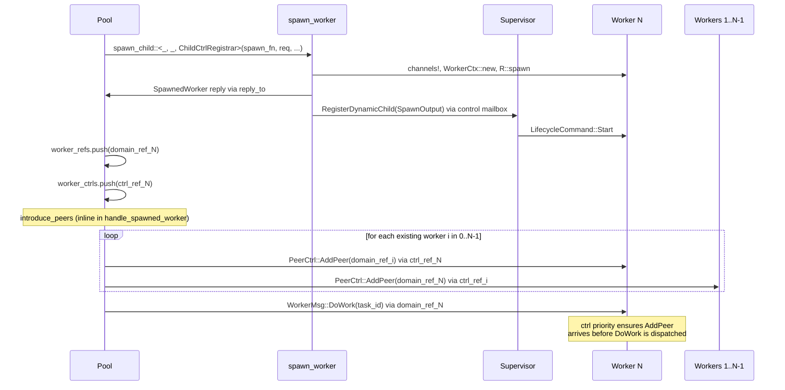

# Spawn Architecture

> Related: 02 (hsm-engine), 08 (supervision), 11 (dynamic-actors), 15 (composable-context-crates), 16 (declarative-wiring), 17 (blox-toml-source-of-truth)

## 1. Overview

Spawning is the process by which a running actor creates a new child actor at runtime —
after the executor has started. In Bloxide, spawning is **decoupled from the supervisor**.
The supervisor's job is lifecycle management (monitoring, restart, shutdown); it does not
spawn children. A requesting blox (e.g., the Pool) owns the concrete spawn types, calls a
runtime spawn helper to create the child, and the spawn helper notifies the supervisor by
sending a registration message on the supervisor's control mailbox.

This decoupling keeps the supervisor generic. The supervisor's event enum carries only
lifecycle types — `ActorId`, `ActorRef<LifecycleCommand, R>`, `ChildPolicy`. No
app-specific types, no spawn-request generics, no factory trait bounds. The supervisor
never sees the application's concrete spawn request type.

### Core ideas

1. **Spawn functions are `fn` pointers.** The application provides a stateless `fn`
   pointer at wiring time. No trait object, no captured state, no `Box<dyn>`. All
   per-request state flows through a concrete `SpawnRequest` enum. The function is
   monomorphized at the wiring site.

2. **Factory injection via constructor fields.** The `fn` pointer is injected into the
   requesting blox's context as a constructor field (`foo_factory: fn(...) -> ...`),
   provided by the wiring layer from a Layer 3 impl crate.

3. **Peer introduction for connecting actors.** After spawning, the requesting blox
   introduces the new child to existing peers using `introduce_peers` from the
   `bloxide-peers` crate, which sends bidirectional `AddPeer` messages on each actor's
   control channel.

4. **KillCapability as the ripcord mechanism.** Kill is a type-level property of the runtime,
   encoded via the `KillCapability<R>` trait. Tokio uses `Kill` (external kill via
   `tokio::task::AbortHandle::abort()`); Embassy uses `NoKill` (no-op, `Handle = ()`). No trait
   objects, no dynamic dispatch, no heap allocation in the kill path. Kill is the
   ripcord — used only for unresponsive actors that can't cooperate. For cooperative
   self-termination, use `ChildPolicy::Abort` (sends `AbortCommand` on the abort mailbox).

5. **Per-child abort mailboxes.** Each dynamically spawned child has a dedicated abort
   mailbox (`ActorRef<AbortCommand, R>`). The supervisor sends `AbortCommand::Abort` on this
   mailbox (cooperative self-termination — the child exits cleanly via its select loop).
   For unresponsive actors, `ChildPolicy::Kill` calls `R::Kill::kill(kill_handle)` (ripcord —
   external kill that bypasses the task entirely).

6. **Spawn lifecycle: create → wire peers → start.** The spawn helper creates the child,
   sends a registration message to the managing blox, and the managing blox sends
   `LifecycleCommand::Start`. The child reports `Started` → `Alive` → `Done`/`Failed`
   through the existing lifecycle event channel.

---

## 2. Design Principles

1. **No unsupervised children.** Every child — static or dynamic — is registered with the
   supervisor via `RegisterChild` or `RegisterDynamicChild`. The supervisor is the sole
   gateway for lifecycle management. No child exists without the supervisor knowing.

2. **Spawning is owned by the requester, not the supervisor.** The blox that wants a child
   (e.g., the Pool) owns the concrete spawn types (`SpawnRequest`, `SpawnedWorker`, the
   spawn function). It calls a runtime spawn helper that creates the child, spawns the
   task, and sends `RegisterDynamicChild` to the supervisor. The supervisor never sees
   the spawn request type.

3. **No `Box`, no `dyn`, no dynamic dispatch.** The spawn function is a `fn` pointer
   (concrete, monomorphized). All messages are fully typed. Dispatch is monomorphized at
   compile time. Required for Embassy/microcontroller (no heap).

4. **The supervisor is just another blox.** Standard codegen from `blox.toml`. No
   `event_name`, no `mailboxes_type`, no `feature_generics` escape hatches — the event
   enum and context struct come from the standard `[event]` / `[context]` sections.
   The supervisor's `blox.toml` is identical for static and dynamic
   apps — the `dynamic` feature is on the *requesting* blox and the *runtime*, not the
   supervisor.

5. **Spawning is integrated into the lifecycle system.** The spawn helper creates the
   child, sends `RegisterDynamicChild` to the supervisor, and the supervisor sends
   `LifecycleCommand::Start`. The child's lifecycle flows through the existing
   `ChildLifecycleEvent` channel (`Started` → `Alive` → `Done`/`Failed` → `Stopped`/
   `Aborted`). No new lifecycle event types are needed.

6. **Spawning is async by design.** The requesting blox sends a spawn request (on its own
   channel), the spawn helper creates the child and sends `RegisterDynamicChild` to the
   supervisor, and the spawn helper sends the app-specific handles back to the requester
   via a reply channel. The child's own initialization (which may be slow) happens in the
   child's task and flows back as `Started` through the lifecycle channel.

7. **Everything is codegen-ed.** The `blox.toml` is the source of truth. No hand-written
   event enum, no hand-written mailboxes, no hand-written `MachineSpec` impls. The
   supervisor's `blox.toml` uses only standard codegen features.

8. **The supervisor is a reference implementation, not a hardcoded singleton.** The
   supervision traits (`ChildGroup`, `ChildPolicy`, `ChildCtrl`) and the runtime
   capabilities (`SpawnCap`, `run` with `RunConfig::supervised`) are the reusable layer. Any blox can
   include `ChildGroup<R>` in its context and implement supervision. The
   `bloxide-supervisor` blox is the standard reference; other bloxes can compose the same
   traits differently via `ChildRegistrar<R>`.

9. **Capabilities are mailboxes, not trait objects.** Each platform capability is a
   command enum sent on a separate per-child mailbox. The supervisor sends messages on
   typed channels; the concrete handles stay on the receiving side. No `Arc<dyn>`, no
   `Option<Capability>` trait object, no dynamic dispatch. Kill is the first capability;
   the pattern extends to suspend, resume, inspect, etc.

---

## 3. Architecture

### 3.1 Crate Layout

```
bloxide-core              ← engine + runtime capabilities
  BloxRuntime, MachineSpec, lifecycle types
  lifecycle module: LifecycleCommand, ChildLifecycleEvent, AbortCommand
  capability module: DynamicChannelCap, StaticChannelCap,
    KillCapability<R> trait + NoKill, DYNAMIC_ACTOR_ID_BASE
  runloop module: run() + RunConfig (re-exported by the runtimes)

bloxide-spawn/            ← spawn capability (separate crate)
  SpawnCap (TaskHandle, KillHandle, spawn, kill_handle, kill)
  Kill (KillCapability impl requiring SpawnCap)
  SpawnOutput<R>, SpawnFn<R, Req>, ChildRegistrar<R>, ChildCtrlRegistrar
  spawn_child<R, Req, C>

bloxide-child-management/ ← reusable child tracking (separate crate)
  ChildGroup<R>             ← per-child tracking, policy application, phase management
  ChildEntry<R>, ChildPhase, ChildAction
  ChildPolicy, GroupShutdown
  ChildGroupBuilder (dynamic-channel variant)
  control module: ChildCtrl, RegisterChild, RegisterDynamicChild
  actions module: start_children, stop_all_children, handle_done_or_failed,
    record_started, record_stopped, record_aborted, record_killed, record_alive,
    deregister_done, register_child, handle_register_dynamic_child, handle_health_check

bloxide-supervisor/       ← the supervisor blox (codegen-ed from blox.toml)
  blox.toml                ← source of truth: states, context, transitions, events
  Cargo.toml               ← NO dynamic feature. Supervisor is feature-free.
  src/generated/           ← codegen output (ctx.rs, topology.rs, spec_skeleton.rs, events.rs)
  src/lib.rs               ← re-exports (SupervisorCtx, SupervisorEvent, SupervisorSpec, SupervisorState)
  src/concrete_spec.rs     ← concrete spec for in-crate tests
  src/tests.rs             ← tests
  (NO control.rs, NO spawn.rs, NO actions.rs — those live in
   bloxide-child-management and bloxide-spawn)

bloxide-tokio/            ← Tokio runtime
  run() + RunConfig re-exports (from bloxide-core)
  channels!, dyn_channels!, next_actor_id!, spawn_timer!, spawn_child!,
    actor_task_supervised!, root_task! macros
  ChildGroupBuilder re-export (from bloxide-child-management)
  SpawnCap impl: TaskHandle = JoinHandle<()>, KillHandle = tokio::task::AbortHandle
  KillCapability impl: type Kill = Kill

bloxide-embassy/          ← Embassy runtime (no dynamic spawning)
  run() + RunConfig re-exports (static children only)
  ChildGroupBuilder (static-channel variant, in supervision module)
  KillCapability impl: type Kill = NoKill

bloxide-test-runtime/     ← in-memory test runtime
  TestRuntime: BloxRuntime + DynamicChannelCap + SpawnCap
  KillCapability impl: type Kill = Kill (kill is a documented no-op —
    TestRuntime runs no real tasks)
  Channel capacity IS enforced on try_send

bloxide-peers/            ← peer introduction (PeerCtrl, AddPeer, RemovePeer, introduce_peers)

pool-messages/            ← Pool's message types (plain data only)
  PoolMsg, WorkerMsg, SpawnWorker, DoWork, WorkDone, PeerResult

blox-ctx-pool-ref/        ← Pool's domain context crate (carries ActorRefs)
  SpawnRequest<Ctrl, R>    ← concrete spawn request enum
  SpawnedWorker<Ctrl, R>   ← spawn reply with the child's refs

tokio-pool-demo-impl/     ← Pool's impl crate (owns the spawn function)
  spawn_worker (fn), handle_spawn_worker, handle_spawned_worker, ...
```

### 3.2 The Spawn Function

The spawn function lives in the **application's impl crate**, not the supervisor's context
crate. It is a `fn` pointer — concrete, monomorphized, no captured state.

```rust
// In the application's impl crate (e.g., tokio-pool-demo-impl)

use bloxide_child_management::ChildPolicy;
use bloxide_core::{
    capability::DynamicChannelCap,
    lifecycle::{AbortCommand, ChildLifecycleEvent, LifecycleCommand},
    messaging::{Envelope, ActorRef},
    spec::MachineSpec,
    StateMachine,
};
use bloxide_peers::PeerCtrl;
use bloxide_spawn::{SpawnCap, SpawnOutput};
use bloxide_tokio::{run, RunConfig, TokioRuntime};
use blox_ctx_pool_ref::{SpawnRequest, SpawnedWorker};
use pool_messages::WorkerMsg;
use worker_blox::WorkerCtx;

/// The concrete spawn function. A stateless fn — no captured state.
/// All per-request state comes through SpawnRequest.
///
/// The function:
///   1. Allocates an actor ID and creates channels for the child —
///      lifecycle, domain, control, and an abort mailbox
///   2. Constructs the child's context (app-specific)
///   3. Spawns the child task, running run() with
///      RunConfig::supervised_with_abort (abort mailbox support)
///   4. Sends the app-specific reply via the request's reply_to field
///   5. Returns SpawnOutput for supervisor registration (includes abort_ref
///      and kill_handle)
///
/// The function is fast: channel creation and spawn() are non-blocking. The
/// child's own initialization (which may be slow) runs in the child's task
/// and reports back via lifecycle events.
///
/// The function is generic over the worker spec type `S`: the system-level
/// codegen monomorphizes it with the concrete `WorkerSpec` (real action
/// closures) instead of the blox-crate-level stub spec (invariant #18).
pub fn spawn_worker<S>(
    req: SpawnRequest<PeerCtrl<WorkerMsg, TokioRuntime>, TokioRuntime>,
    notify: ActorRef<ChildLifecycleEvent, TokioRuntime>,
) -> SpawnOutput<TokioRuntime>
where
    S: MachineSpec<Ctx = WorkerCtx<TokioRuntime>>,
    S::Event: From<Envelope<PeerCtrl<WorkerMsg, TokioRuntime>>> + From<Envelope<WorkerMsg>>,
{
    match req {
        SpawnRequest::Worker { task_id: _, reply_to, pool_ref } => {
            let worker_id = TokioRuntime::alloc_actor_id();

            // Create channels for the child
            let (ctrl_ref, ctrl_rx) =
                TokioRuntime::channel::<PeerCtrl<WorkerMsg, TokioRuntime>>(worker_id, 16);
            let (domain_ref, domain_rx) = TokioRuntime::channel::<WorkerMsg>(worker_id, 16);
            let (lifecycle_ref, lifecycle_rx) =
                TokioRuntime::channel::<LifecycleCommand>(worker_id, 4);
            let (abort_ref, abort_rx) = TokioRuntime::channel::<AbortCommand>(worker_id, 4);

            // Construct the child's context — plain fields, no behavior generic
            let worker_ctx = WorkerCtx::new(worker_id, pool_ref);
            let machine = StateMachine::<S>::new(worker_ctx);

            // Spawn the child task with abort mailbox support (non-blocking).
            let notify_sender = notify.sender();
            let task_handle = TokioRuntime::spawn(async move {
                run(
                    machine,
                    (ctrl_rx, domain_rx),
                    RunConfig::<TokioRuntime>::supervised_with_abort(
                        lifecycle_rx,
                        abort_rx,
                        notify_sender,
                    ),
                    worker_id,
                )
                .await
            });

            // Convert the JoinHandle (not Clone) into a kill handle (Clone)
            // so it can be stored in RegisterDynamicChild and cloned from
            // &Event by the supervisor's action function.
            let kill_handle = TokioRuntime::kill_handle(task_handle);

            // Send app-specific handles back to the requester
            let _ = reply_to.try_send(
                worker_id,
                SpawnedWorker {
                    child_id: worker_id,
                    domain_ref: domain_ref.clone(),
                    ctrl_ref: ctrl_ref.clone(),
                },
            );

            // Return what the supervisor needs for lifecycle management + kill.
            // The kill_handle flows to the managing blox via
            // SpawnOutput::kill_handle → RegisterDynamicChild::kill_handle →
            // ChildEntry::kill_handle. The managing blox uses it as the
            // ripcord for unresponsive children (§3.13).
            SpawnOutput {
                child_id: worker_id,
                lifecycle_ref,
                abort_ref,     // abort capability mailbox (send side)
                kill_handle,   // cloneable ripcord for external kill
                policy: ChildPolicy::Stop,
            }
        }
    }
}
```

The wiring layer provides this function to the runtime spawn helper (§3.12) as a
`SpawnFn<R, SpawnRequest<Ctrl, R>>` `fn` pointer — monomorphized at the wiring site. For
a spawn function generic over the spec type (like `spawn_worker<S>` above), the codegen
emits a closure wrapper that fills in the system-level concrete spec
(`(|req, notify| spawn_worker::<WorkerSpec<TokioRuntime>>(req, notify)) as _`); for a
plain function it emits a path expression with a cast (`spawn_worker as _`).

The `SpawnFn` type alias is defined in `bloxide-spawn` (alongside `SpawnCap`) so any blox
can name the type without depending on a specific runtime:

```rust
// In bloxide-spawn (alongside SpawnCap)

/// A spawn function creates a child actor and returns the handles the
/// supervisor needs for lifecycle management and capability control.
///
/// This is a `fn` pointer, not a trait. The application provides the
/// concrete function at wiring time. The function is stateless — all
/// per-request state comes through the request parameter.
pub type SpawnFn<R, Req> = fn(
    req: Req,
    notify: ActorRef<ChildLifecycleEvent, R>,
) -> SpawnOutput<R>;
```

#### Actor ID allocation

The child's actor ID comes from `R::alloc_actor_id()` (`DynamicChannelCap`), whose
counter starts at `DYNAMIC_ACTOR_ID_BASE = 256` (bloxide-core `capability.rs`).
Compile-time wiring — the proc-macro counter behind `channels!`, `dyn_channels!`,
`next_actor_id!`, and `spawn_timer!` — hands out small sequential IDs starting at 1
(at most 255 statically wired actors per system; each expansion carries a
compile-time assert against `DYNAMIC_ACTOR_ID_BASE`, so hitting the limit is a
compile error), so
dynamically spawned actors can never collide with statically wired ones.

### 3.3 The Spawn Request

The spawn request lives in the **application's domain context crate** (e.g.,
`blox-ctx-pool-ref`) — not in the messages crate. Messages crates hold plain data only;
`SpawnRequest` and `SpawnedWorker` carry `ActorRef`s, so they live in the context crate
(AGENTS.md invariant #3). The types are generic over the child's control message type
`Ctrl` (instantiated with `PeerCtrl<WorkerMsg, R>`) and the runtime `R`.

```rust
// In the application's domain context crate (e.g., blox-ctx-pool-ref)

use bloxide_core::{capability::BloxRuntime, messaging::ActorRef, ActorId};
use pool_messages::{PoolMsg, WorkerMsg};

/// A spawn request. Concrete enum — no associated types.
/// All state needed to construct the child is carried in the request,
/// not captured in a factory struct. This makes the spawn function stateless.
#[derive(Debug, Clone)]
pub enum SpawnRequest<Ctrl: Send + 'static, R: BloxRuntime> {
    Worker {
        task_id: u32,
        reply_to: ActorRef<SpawnedWorker<Ctrl, R>, R>, // where to send the handles back
        pool_ref: ActorRef<PoolMsg, R>,                // so the worker can talk to the pool
    },
    // Future variants: JobRunner { ... }, Scheduler { ... }, etc.
}

/// The reply sent back to the requester with the child's handles.
#[derive(Debug, Clone)]
pub struct SpawnedWorker<Ctrl: Send + 'static, R: BloxRuntime> {
    pub child_id: ActorId,
    pub domain_ref: ActorRef<WorkerMsg, R>,
    pub ctrl_ref: ActorRef<Ctrl, R>,
}
```

`SpawnRequest` lives in `blox-ctx-pool-ref`, not in `bloxide-supervisor`. The
supervisor never imports it, never names it, never matches on it. The Pool calls the
runtime spawn helper directly, passing the request by value (§3.12). The supervisor's
control channel only carries `RegisterDynamicChild`, which the spawn helper sends after
the child is created.

### 3.4 SpawnOutput

`SpawnOutput<R>` lives in `bloxide-spawn` because it is not supervisor-specific. Any blox
that manages children — the standard supervisor, a user's custom job dispatcher, a load
balancer — needs the same lifecycle refs, kill ref, abort handle, and policy from a spawn
operation.

```rust
// In bloxide-spawn

use bloxide_core::capability::{BloxRuntime, KillCapability};
use bloxide_core::lifecycle::{AbortCommand, LifecycleCommand};
use bloxide_core::messaging::{ActorId, ActorRef};
use bloxide_child_management::ChildPolicy;

/// What a spawn function returns — the lifecycle and capability refs needed
/// to register the child with whatever blox manages it.
///
/// This type carries only lifecycle types and capability mailbox refs. The
/// app-specific handles (domain_ref, ctrl_ref, etc.) go back to the requester
/// via the spawn request's reply-to channel, not through here.
///
/// The `kill_handle` is the cloneable ripcord: the spawn function gets a
/// `TaskHandle` from `R::spawn()`, converts it to a `KillHandle` via
/// `R::kill_handle()`, and passes it here so the managing blox can call
/// `R::Kill::kill(handle)` for unresponsive children. For `NoKill` runtimes
/// this is `()`.
pub struct SpawnOutput<R: BloxRuntime> {
    /// The allocated actor ID for the new child.
    pub child_id: ActorId,
    /// Channel for sending lifecycle commands (Start, Stop, Reset).
    pub lifecycle_ref: ActorRef<LifecycleCommand, R>,
    /// Abort mailbox (send side). The managing blox sends AbortCommand
    /// here; the child's task receives it and self-terminates (cooperative).
    pub abort_ref: ActorRef<AbortCommand, R>,
    /// Cloneable kill handle for external task kill (the ripcord). The
    /// managing blox calls `R::Kill::kill(handle)` when the child is
    /// unresponsive. `()` for `NoKill` runtimes, `R::KillHandle` for `Kill`
    /// runtimes. Must be `Clone` so action functions can extract it from
    /// `&Event` (the HSM engine passes `&Event`, not `&mut Event`).
    pub kill_handle: <R::Kill as KillCapability<R>>::Handle,
    /// Supervision policy for this child.
    pub policy: ChildPolicy,
}
```

### 3.5 ChildRegistrar — Decoupling Spawn from the Supervisor

The spawn helper (§3.12) works with **any** blox that manages children, not just the
standard supervisor. A user might write a custom job dispatcher, a load balancer, or
their own supervisor variant — each with its own control protocol and registration
message type.

The `ChildRegistrar` trait bridges the generic spawn helper to a blox-specific
registration protocol:

```rust
// In bloxide-spawn

/// A blox that manages spawned children implements this to define how
/// `SpawnOutput` is wrapped into its own control-plane message type.
///
/// The associated `RegisterMsg` is the message type the spawn helper sends
/// on the managing blox's control mailbox after a child is spawned.
///
/// The standard supervisor implements this with `RegisterMsg = ChildCtrl<R>`.
/// A user's custom blox implements it with their own message type.
pub trait ChildRegistrar<R: BloxRuntime> {
    type RegisterMsg: Send + 'static;

    /// Wrap a `SpawnOutput` into the managing blox's registration message.
    fn register(output: SpawnOutput<R>) -> Self::RegisterMsg;
}
```

The standard registrar implementation, `ChildCtrlRegistrar`, also lives in
`bloxide-spawn` — it bridges `SpawnOutput` and `ChildCtrl` (from
`bloxide-child-management::control`), and `bloxide-spawn` is the only crate that can
name both without a dependency cycle:

```rust
// In bloxide-spawn

/// Registrar for the standard child-management control plane
/// (`ChildCtrl<R>`, from `bloxide-child-management`).
pub struct ChildCtrlRegistrar;

impl<R: BloxRuntime> ChildRegistrar<R> for ChildCtrlRegistrar {
    type RegisterMsg = ChildCtrl<R>;

    fn register(output: SpawnOutput<R>) -> ChildCtrl<R> {
        ChildCtrl::RegisterDynamicChild(RegisterDynamicChild {
            id: output.child_id,
            lifecycle_ref: output.lifecycle_ref,
            abort_ref: output.abort_ref,
            kill_handle: output.kill_handle,
            policy: output.policy,
        })
    }
}
```

The spawn helper is generic over `C: ChildRegistrar<R>`. The wiring codegen injects the
appropriate `ChildRegistrar` type based on which blox manages the children in the
`system.toml`.

### 3.6 The Abort Mailbox

Abort is a **message**, not a function call on a trait object. The managing blox sends an
`AbortCommand` on a per-child abort mailbox. The child's task (wrapped in
`run` with `RunConfig::supervised_with_abort`) receives it and self-terminates cooperatively.

```rust
// In bloxide-core (lifecycle module)

/// Command enum for the abort mailbox.
///
/// Sent by the managing blox (supervisor or custom) when `ChildPolicy::Abort` fires.
/// The child's task receives this on its abort mailbox and self-terminates
/// cooperatively (no callbacks fire, but the task exits cleanly via its select loop).
///
/// This is the first instance of the capability-as-mailbox pattern.
/// Future capabilities (suspend, resume, inspect) follow the same
/// pattern: a command enum sent on a per-child mailbox.
#[derive(Debug, Clone)]
pub enum AbortCommand {
    /// Abort the child cooperatively. No `on_exit` callbacks, but the task
    /// exits cleanly by breaking out of its select loop. Returns `Aborted`.
    Abort { child_id: ActorId },
}
```

The abort mailbox is created by the spawn function (§3.2) alongside the lifecycle and
domain channels. The send side (`abort_ref`) goes into `SpawnOutput` → the managing blox's
registration message → the managing blox's child list. The receive side (`abort_rx`) goes
to `run` with `RunConfig::supervised_with_abort` which listens on it in the child's task.

### 3.7 ChildCtrl Enum

The supervisor's control-plane enum, owned by the platform
(`bloxide-child-management::control`, spec 20: Platform Feature Pattern) — the standard
supervisor is just the reference consumer. No `Spawn` variant — spawning is decoupled
from the supervisor. A user's custom child-managing blox can define its own control enum
(see §3.5 `ChildRegistrar`).

```rust
// In bloxide-child-management (control module)

/// Child-management control-plane messages delivered through a dedicated
/// control mailbox.
///
/// There is no `Spawn` variant — spawning is decoupled from the managing blox.
/// The spawn helper calls `spawn_child()` (in `bloxide-spawn`) which sends
/// `RegisterDynamicChild` on the control mailbox after the child is created.
pub enum ChildCtrl<R: BloxRuntime> {
    /// Register a static child (wired at startup, no abort capability).
    /// The child's channels already exist (created by the wiring layer).
    /// The supervisor just tracks it for lifecycle management.
    RegisterChild(RegisterChild<R>),

    /// Register a dynamically spawned child (has abort capability + kill handle).
    /// Sent by the spawn helper after creating the child. Carries the
    /// abort_ref and kill_handle for external kill (see §3.8).
    RegisterDynamicChild(RegisterDynamicChild<R>),

    /// Trigger one health-check round.
    HealthCheckTick,
}
```

The supervisor's control enum is the same for static and dynamic apps. Dynamic spawning
doesn't add a variant — it just means `RegisterChild` arrives at runtime (from the spawn
helper) instead of at startup (from the wiring layer), plus `RegisterDynamicChild` carries
the kill capability fields.

### 3.8 RegisterChild and RegisterDynamicChild

`RegisterChild` is for static children (wired at startup, no kill capability).
`RegisterDynamicChild` is for dynamically spawned children (has `abort_ref` +
`kill_handle`). Both are variants of `ChildCtrl<R>`.

Two separate structs avoid `Option` on the kill fields — the type system encodes the
capability (static children don't have `abort_ref`):

```rust
// In bloxide-child-management (control module)

/// Register a static child (wired at startup). No abort capability.
/// Used by the wiring layer for Embassy and static Tokio children.
pub struct RegisterChild<R: BloxRuntime> {
    pub id: ActorId,
    pub lifecycle_ref: ActorRef<LifecycleCommand, R>,
    pub policy: ChildPolicy,
}

/// Register a dynamically spawned child. Has an abort capability mailbox
/// and a kill handle (ripcord).
/// Used by the spawn helper when SpawnCap is available.
///
/// The `kill_handle` is `Clone` (it's `R::KillHandle`, which requires
/// `Clone` on the `SpawnCap` trait). This allows the supervisor's action
/// function to clone the `kill_handle` from `&Event` (the HSM engine passes
/// `&Event`, not `&mut Event`).
pub struct RegisterDynamicChild<R: BloxRuntime> {
    pub id: ActorId,
    pub lifecycle_ref: ActorRef<LifecycleCommand, R>,
    /// Abort capability mailbox (send side).
    pub abort_ref: ActorRef<AbortCommand, R>,
    /// Cloneable kill handle for external task kill (the ripcord).
    /// `()` for NoKill runtimes, `R::KillHandle` for Kill runtimes.
    pub kill_handle: <R::Kill as KillCapability<R>>::Handle,
    pub policy: ChildPolicy,
}
```

Both variants are available regardless of runtime — `RegisterDynamicChild` is just a struct
with an `abort_ref` field; it doesn't require `R: SpawnCap` to name the type (the
`ActorRef<AbortCommand, R>` only needs `R: BloxRuntime`). Two action functions (in
`bloxide-child-management::actions`) handle them: `register_child` adds a static child
via `ChildGroup::add` and sends `Start`; `handle_register_dynamic_child` adds a dynamic
child via `ChildGroup::add_dynamic` (storing the `abort_ref` and `kill_handle`) and sends
`Start`.

### 3.9 The Supervisor Event Enum

```rust
// GENERATED by codegen — NOT hand-written

/// The event type for supervisor state machines.
/// One enum, no spawn-request generic, no Spawn variant.
#[derive(Debug)]
pub enum SupervisorEvent<R: BloxRuntime> {
    /// Lifecycle command (Start/Reset/Stop/Ping).
    Lifecycle(LifecycleCommand),
    Child(Envelope<ChildLifecycleEvent>),
    Control(Envelope<ChildCtrl<R>>),
}

// From impls — standard, no coherence problem
impl<R: BloxRuntime> From<LifecycleCommand> for SupervisorEvent<R> { ... }
impl<R: BloxRuntime> From<Envelope<ChildLifecycleEvent>> for SupervisorEvent<R> { ... }
impl<R: BloxRuntime> From<Envelope<ChildCtrl<R>>> for SupervisorEvent<R> { ... }
```

`SupervisorEvent<R>` has no spawn-request parameter and no `Spawn` variant. The event enum
is identical for static and dynamic apps — there is no `dynamic` feature on the supervisor
crate. The codegen auto-generates the `Lifecycle` variant (with `From<LifecycleCommand>`,
`LIFECYCLE_TAG`, `LifecycleEvent` impl, and helper methods) as the first variant in every
event enum — the supervisor gets it for free, same as every other blox.

The generated wrapper closures match on `&SupervisorEvent<R>` and extract the payload;
the action functions themselves take `&ChildLifecycleEvent` or `&ChildCtrl<R>` directly
(never the consumer's event enum — spec 20: Platform Feature Pattern).

### 3.10 The Supervisor Context

```rust
// GENERATED by codegen — NOT hand-written

pub struct SupervisorCtx<R: BloxRuntime> {
    pub self_id: ActorId,
    pub children: ChildGroup<R>,
    pub child_notify: ActorRef<ChildLifecycleEvent, R>,
    pub pending: ChildAction,
}
```

`self_id` is the auto-emitted first field; `children` and `child_notify` are constructor
params; `pending` is a zero-initialized state field (`SupervisorCtx::new(self_id,
children, child_notify)`).

No `spawn_fn` field. No factory field. No spawn-request generic. No
`#[cfg(feature = "dynamic")]` on any field. The supervisor context is the same for static
and dynamic apps. The supervisor doesn't spawn — it only registers and manages lifecycle.

### 3.11 ChildGroup and ChildEntry

`ChildGroup<R>` (in `bloxide-child-management`) is the managing blox's child list. Each
`ChildEntry` carries an `abort_ref` (an `ActorRef<AbortCommand, R>`) for the cooperative
abort message, and a `kill_handle` (`<R::Kill as KillCapability<R>>::Handle`) for the
external-kill ripcord. Both are `Option` — `None` for static children registered via
`RegisterChild`, `Some` for dynamic children registered via `RegisterDynamicChild`.

```rust
// In bloxide-child-management

struct ChildEntry<R: BloxRuntime> {
    id: ActorId,
    lifecycle_ref: ActorRef<LifecycleCommand, R>,
    policy: ChildPolicy,
    stopped: bool,
    phase: ChildPhase,
    /// The child's task is gone (killed or aborted) — its mailboxes are dead,
    /// so lifecycle commands (e.g. `stop_all`) must not be sent to it.
    task_gone: bool,
    awaiting_alive: bool,
    /// Abort capability mailbox (send side). None for static children
    /// registered via RegisterChild (no abort capability).
    abort_ref: Option<ActorRef<AbortCommand, R>>,
    /// Cloneable kill handle for external task kill (ripcord). None for static
    /// children. Consumed by R::Kill::kill(handle) when ChildPolicy::Kill fires.
    /// This is R::KillHandle (Clone), not R::TaskHandle (not Clone).
    kill_handle: Option<<R::Kill as KillCapability<R>>::Handle>,
}

pub struct ChildGroup<R: BloxRuntime> {
    children: Vec<ChildEntry<R>>,
    shutdown: GroupShutdown,
}
```

The `Option` on `abort_ref` is an `Option` on a *mailbox ref* (cheap, cloneable, no `dyn`).
The `Option` on `kill_handle` is an `Option` on a *concrete type* selected at the type
level (`()` for Embassy, `R::KillHandle` for Tokio). Neither is a trait object. The
`Option` exists because `ChildGroup` is a single type that handles both static and dynamic
children — the `Option` encodes "this child has an abort mailbox" vs "this child doesn't."

Children are registered via two methods:

- **`ChildGroup::add(id, lifecycle_ref, policy)`** — static children. **Panics** if the
  policy is `ChildPolicy::Kill` or `ChildPolicy::Abort`: those policies need the
  kill/abort handles that only dynamic spawn provides.
- **`ChildGroup::add_dynamic(id, lifecycle_ref, abort_ref, kill_handle, policy)`** —
  dynamically spawned children; stores the abort/kill capability.

`ChildGroup::handle_done_or_failed` evaluates the child's `ChildPolicy` when a `Stopped`
or `Failed` lifecycle event arrives — four variants:

- **`ChildPolicy::Kill`** (ripcord): Takes the `kill_handle`, calls `R::Kill::kill(handle)`.
  External kill — works even if the child is stuck. No callbacks fire. Emits
  `ChildLifecycleEvent::Killed` on the notify channel, sets phase to
  `PermanentlyDone` and `task_gone = true`, then checks group shutdown.
- **`ChildPolicy::Abort`** (cooperative): Sends `AbortCommand::Abort` on the child's
  `abort_ref`. The child self-terminates via its run loop and later reports `Aborted`.
  The entry is marked `PermanentlyDone` + `task_gone = true` immediately (the abort is
  fire-and-forget; the late `Aborted` event is informational only).
- **`ChildPolicy::Reset`**: Sends `Reset` to the child. Reset goes directly
  to `initial_state()` — the child reports `Started`, no separate `Start` needed. Sets
  phase to `ResetPending`.
- **`ChildPolicy::Stop`**: Sends **no command** — the child already self-stopped
  (suspended in Init) or failed (parked in its error state). Marks the entry
  `PermanentlyDone` and checks group shutdown.

```rust
// In ChildGroup::handle_done_or_failed (simplified)

if policy == ChildPolicy::Kill {
    // Ripcord: external kill. Works even if the child is stuck and
    // never polls the abort mailbox. For NoKill runtimes this is a no-op
    // (kill(()) does nothing). For Kill runtimes this calls AbortHandle::abort().
    let kill_handle = self.children[idx].kill_handle.take();
    if let Some(handle) = kill_handle {
        R::Kill::kill(handle);
    }
    // Kill is synchronous — emit the Killed event directly.
    let _ = notify.try_send(from, ChildLifecycleEvent::Killed { child_id });
    self.children[idx].phase = ChildPhase::PermanentlyDone;
    self.children[idx].task_gone = true;
    return self.check_shutdown();
}
if policy == ChildPolicy::Abort {
    // Cooperative: send abort message. The child self-terminates
    // via the poll cycle in run() with RunConfig::supervised_with_abort.
    if let Some(abort_ref) = &self.children[idx].abort_ref {
        let _ = abort_ref.try_send(from, AbortCommand::Abort { child_id });
    }
    // Marked PermanentlyDone immediately; the later Aborted event is a no-op
    // here (record_aborted finalizes the same fields).
    self.children[idx].phase = ChildPhase::PermanentlyDone;
    self.children[idx].task_gone = true;
    return self.check_shutdown();
}
if policy == ChildPolicy::Reset {
    // Reset goes directly to initial_state() — no separate Start needed.
    let _ = lifecycle_ref.try_send(from, LifecycleCommand::Reset);
    self.children[idx].phase = ChildPhase::ResetPending;
    return ChildAction::Continue;
}
// Stop: the child is already stopping or has failed — mark done for this epoch.
self.children[idx].phase = ChildPhase::PermanentlyDone;
self.check_shutdown()
```

A child that reports `Done` (clean self-termination via `Decision::Done`) bypasses the
policy entirely: `ChildGroup::deregister` removes the entry — `Done` is success, not a
fault — and returns the group shutdown decision so shutdown still progresses when the
last child completes.

All other `ChildGroup` methods (shutdown logic, phase tracking, health
check) are standard lifecycle management. The `ChildGroup` sends a message instead of
calling a trait method for abort — the capability-as-mailbox pattern.

### 3.12 The Runtime Spawn Helper

The spawn helper lives in `bloxide-spawn`. It is the bridge between
the requesting blox and whatever blox manages children. It calls the app's spawn function
and sends the registration message (typed by `C: ChildRegistrar<R>`) to the managing
blox's control mailbox.

```rust
// In bloxide-spawn

/// Spawn a supervised child actor.
///
/// Called by the requesting blox (e.g., the Pool) — NOT by the supervisor.
/// The requesting blox provides the spawn function and the request.
///
/// This helper:
///   1. Calls the spawn function to create the child (channels, context, task)
///   2. Sends the registration message (typed by C::RegisterMsg) to the
///      managing blox's control mailbox
///
/// The supervisor receives the registration message and starts managing the
/// child's lifecycle. The supervisor never sees the request type.
///
/// # Type Parameters
///
/// - `R` — the runtime
/// - `Req` — the application's concrete spawn request type
/// - `C` — the `ChildRegistrar` implementation. Determines how `SpawnOutput`
///   is wrapped into the managing blox's control-plane message.
///   For the standard supervisor, `C = ChildCtrlRegistrar`.
pub fn spawn_child<R, Req, C>(
    spawn_fn: SpawnFn<R, Req>,
    req: Req,
    control_ref: &ActorRef<C::RegisterMsg, R>,
    notify_ref: &ActorRef<ChildLifecycleEvent, R>,
    from: ActorId,
) -> Result<(), R::TrySendError>
where
    R: BloxRuntime,
    Req: Send + Clone + 'static,
    C: ChildRegistrar<R>,
{
    // 1. Call the spawn function — creates channels, constructs child, spawns task
    let output: SpawnOutput<R> = spawn_fn(req, notify_ref.clone());

    // 2. Wrap output into the managing blox's registration message and send it
    let msg = C::register(output);
    control_ref.try_send(from, msg)?;

    Ok(())
}
```

The requesting blox (e.g., the Pool) calls `spawn_child` directly, specifying
`C = ChildCtrlRegistrar` as the type parameter to wire the `SpawnOutput` into
the supervisor's `ChildCtrl::RegisterDynamicChild` message:

```rust
// In the pool's impl crate — the Pool calls spawn_child directly

use bloxide_spawn::{spawn_child, ChildCtrlRegistrar};

let result = spawn_child::<_, _, ChildCtrlRegistrar>(
    ctx.spawn_fn,
    req,
    &ctx.spawn_ref,   // supervisor control mailbox
    &ctx.notify_ref,  // child lifecycle event mailbox
    ctx.self_id,
);
```

`SpawnFn`, `ChildRegistrar`, and `ChildCtrlRegistrar` are all defined in `bloxide-spawn`
so any blox can name them without a runtime or supervisor dependency. The `ChildCtrl`
message type itself comes from `bloxide-child-management::control`.

### 3.13 `run()` with `RunConfig::supervised_with_abort`

The abort mailbox's receiving end lives in the unified run loop itself — there is
no separate wrapper function. `run()` in `bloxide-core`
(`crates/bloxide-core/src/runloop.rs`) polls the abort mailbox alongside the
lifecycle stream and domain mailboxes when the config supplies one:

```rust
// bloxide-core::runloop — one loop for all runtimes:
let config = RunConfig::supervised_with_abort(lifecycle_rx, abort_rx, supervisor_notify);
run(machine, domain_mailboxes, config, actor_id).await;
```

The abort path is **cooperative** — the child's task polls the abort mailbox in its
poll cycle and self-terminates when it receives `AbortCommand::Abort`:

1. **Cooperative self-termination (abort):** When `AbortCommand::Abort` is received,
   the run loop reports `DispatchOutcome::Aborted` to the supervisor and returns.
   This is the cooperative path — the child exits cleanly but no `on_exit`
   callbacks fire.

2. **External kill (ripcord — `ChildPolicy::Kill`):** If the task is stuck (e.g.,
   blocked on a long `await` that doesn't yield to the poll cycle), the
   `KillHandle` stored in `ChildEntry` is used to call `R::Kill::kill(handle)` for
   an immediate external abort. This bypasses the task entirely — no cooperation,
   no callbacks. It is the safety net for unresponsive tasks.

The poll priority is: lifecycle stream (highest) → abort mailbox → domain
mailboxes. This ensures abort is serviced before domain messages so a cooperative
abort can be processed promptly when the task next yields.

The `TaskHandle` from `R::spawn()` is converted to a cloneable `KillHandle` via
`R::kill_handle()` in the spawn function, then flows to the supervisor via
`SpawnOutput::kill_handle` → `RegisterDynamicChild::kill_handle` →
`ChildEntry::kill_handle`. In the common case, self-termination via the poll cycle
is sufficient and the external kill is never invoked. The external
`R::Kill::kill(handle)` is the ripcord for unresponsive tasks that don't yield.

For static children (wired at startup, no abort mailbox), the existing
`run` with `RunConfig::supervised` (without abort support) is used unchanged.

> **Note:** `run()` and all `RunConfig` constructors — including
> `RunConfig::supervised_with_abort` — are **runtime-generic**: they live in
> `bloxide-core` (`crates/bloxide-core/src/runloop.rs`) and are simply re-exported by
> the runtime crates (`bloxide_tokio::run`, `bloxide_embassy::run`). There is no
> Tokio-specific variant of the loop. Embassy wires static children with
> `RunConfig::supervised` (no abort stream, `NoKill`).

### 3.14 The Pool's Spawn Action

The Pool handles spawning in its own state machine. When it receives a `SpawnWorker`
message, it calls the runtime spawn helper directly. The Pool owns the `spawn_fn` (a `fn`
pointer stored in its context) and the `spawn_ref` (the managing blox's control mailbox
ref).

Action functions take **concrete parameters** — the generated concrete spec extracts
individual context fields and passes them in (accessor traits were eliminated; see spec
06). From `crates/impl/tokio-pool-demo-impl/src/lib.rs` (simplified):

```rust
// In the pool's impl crate (tokio-pool-demo-impl)

/// Spawn a new worker via the supervisor, then set in-flight flag.
pub fn handle_spawn_worker<R: BloxRuntime>(
    self_id: ActorId,
    self_ref: &ActorRef<PoolMsg, R>,
    spawn_fn: &SpawnFn<R, SpawnRequest<PeerCtrl<WorkerMsg, R>, R>>,
    spawn_ref: &ActorRef<ChildCtrl<R>, R>,
    notify_ref: &ActorRef<ChildLifecycleEvent, R>,
    spawn_reply_ref: &ActorRef<SpawnedWorker<PeerCtrl<WorkerMsg, R>, R>, R>,
    pending_task_id: &mut u32,
    spawn_in_flight: &mut bool,
    pending: &mut u32,
    spawn_worker: &SpawnWorker,   // event payload, extracted by the wrapper
) -> ActionResult {
    let task_id = spawn_worker.task_id;
    *pending_task_id = task_id;
    *spawn_in_flight = true;
    *pending += 1;

    let req = SpawnRequest::Worker {
        task_id,
        reply_to: spawn_reply_ref.clone(),
        pool_ref: self_ref.clone(),
    };
    // Call spawn_child directly — the Pool owns the spawn_fn
    // and the managing blox's control_ref (wired as spawn_ref).
    ActionResult::from(spawn_child::<_, _, ChildCtrlRegistrar>(
        *spawn_fn, req, spawn_ref, notify_ref, self_id,
    ))
}
```

If the control mailbox is full, `spawn_child` returns `Err` and the resulting
`ActionResult` carries the failure — the transition's guard can route it (e.g. to an
error state).

The Pool's spawn-related context fields (from `crates/bloxes/pool/blox.toml`, gated by
the Pool's `dynamic` feature):

```rust
// In PoolCtx — present only with the Pool's `dynamic` feature

/// The spawn function (fn pointer, provided at wiring time).
pub spawn_fn: SpawnFn<R, SpawnRequest<PeerCtrl<WorkerMsg, R>, R>>,

/// Ref to the managing blox's control mailbox — used to send the registration
/// message. For the standard supervisor, it's ActorRef<ChildCtrl<R>, R>.
pub spawn_ref: ActorRef<ChildCtrl<R>, R>,

/// Ref to the managing blox's child-notify mailbox — passed to the spawn
/// function so the child can report lifecycle events.
pub notify_ref: ActorRef<ChildLifecycleEvent, R>,

/// The Pool's own secondary mailbox for SpawnedWorker replies.
pub spawn_reply_ref: ActorRef<SpawnedWorker<PeerCtrl<WorkerMsg, R>, R>, R>,
```

---

## 4. Factory Injection via Constructor Fields

The spawn function is injected into the requesting blox's context as a **constructor
field** — a `fn` pointer provided at wiring time. The naming convention is
`foo_factory: fn(...) -> ...` (or `spawn_fn: SpawnFn<R, Req>`). The codegen
includes constructor-only fields in the context's `new()` constructor.

The factory lives in a **Layer 3 impl crate** consumed by the wiring binary — the only
place that knows the concrete child type (`WorkerCtx`, `WorkerSpec`). This keeps the
parent blox decoupled from the child's concrete type (upholding the invariant: blox crates
never import impl crates) and means the parent does not need any `SpawnCap` bound — it
only needs `R: BloxRuntime`.

The wiring layer provides `spawn_fn` via `source = "factory"` in `system.toml`:

```toml
[actors.inject]
spawn_fn = { source = "factory", crate = "tokio_pool_demo_impl", function = "spawn_worker" }
```

The codegen emits a **path expression with a cast** (`::tokio_pool_demo_impl::spawn_worker
as _`) for a plain function, or a **monomorphizing closure** (`(|req, notify|
::tokio_pool_demo_impl::spawn_worker::<WorkerSpec<TokioRuntime>>(req, notify)) as _`)
when the factory crate is a dynamic actor's `impl_crate` and the function is generic
over the spec type. One source declaration, two output shapes, selected automatically.

The factory is a plain field on the context struct; the generated concrete spec passes
it (and the other fields the action declares) to the action function as individual
parameters:

```rust
// In the generated PoolCtx — plain field on the context struct
pub struct PoolCtx<R: BloxRuntime> {
    pub spawn_fn: SpawnFn<R, SpawnRequest<PeerCtrl<WorkerMsg, R>, R>>,
    // ...
}
```

---

## 5. Peer Introduction

When a parent spawns a child that needs to communicate with other running actors (e.g., a
Pool introducing a new Worker to existing Workers), the parent uses **peer introduction**
after spawning. The `bloxide-peers` crate provides the `introduce_peers` helper, which
sends bidirectional `AddPeer` messages on each actor's control channel.

### The introduce_peers Function

```rust
// In bloxide-peers

/// Introduce two actors to each other by sending AddPeer on both control channels.
pub fn introduce_peers<M, R>(
    from: ActorId,
    a_id: ActorId,
    a_ref: ActorRef<M, R>,
    a_ctrl: ActorRef<PeerCtrl<M, R>, R>,
    b_id: ActorId,
    b_ref: ActorRef<M, R>,
    b_ctrl: ActorRef<PeerCtrl<M, R>, R>,
) -> ActionResult
where
    M: Send + 'static,
    R: BloxRuntime,
{
    // try_send AddPeer { peer_id: b_id, peer_ref: b_ref } on a_ctrl,
    // then AddPeer { peer_id: a_id, peer_ref: a_ref } on b_ctrl
}
```

Each actor receives the other's domain `ActorRef` on its control channel. The control
channel is separate from the domain channel, so existing message ordering is unaffected.

### Domain-Specific Peer Control via `bloxide-peers`

The pool and worker use the generic `PeerCtrl<WorkerMsg, R>` from the `bloxide-peers`
crate directly — no domain-specific control enum is needed. The `PeerCtrl` type is
generic over the domain message type (`WorkerMsg`), so it carries the right `ActorRef`
type for peer introduction. Context crates provide action functions for peer management.

```rust
// In bloxide-peers
pub enum PeerCtrl<M, R: BloxRuntime> {
    AddPeer(AddPeer<M, R>),
    RemovePeer(RemovePeer),
}

pub struct AddPeer<M, R: BloxRuntime> {
    pub peer_id: ActorId,
    pub peer_ref: ActorRef<M, R>,
}
```

`PeerCtrl<WorkerMsg, R>` is a second mailbox entry in the actor's `Mailboxes` tuple. There is no
new recv loop: the same single `poll_next` / dispatch cycle handles both domain messages
and control messages.

### Split Domain/Ctrl Ref Pattern

Each dynamically spawned child that participates in peer-to-peer messaging has **two
distinct `ActorRef`s**:

| Ref | Type | Purpose |
|-----|------|---------|
| Domain ref | `ActorRef<WorkerMsg, R>` | Application messages (DoWork, etc.) |
| Ctrl ref | `ActorRef<PeerCtrl<WorkerMsg, R>, R>` | Peer control (AddPeer, RemovePeer) |

The parent stores both in its context and uses them for different purposes:
- Domain ref: send work messages and keep the channel alive (self-sender invariant)
- Ctrl ref: introduce the child to other children via `introduce_peers`

The child actor's `Mailboxes` tuple places ctrl at index 0 (highest priority) and the
domain channel at index 1. This guarantees that `AddPeer` commands sent by the parent are
processed before any `DoWork` message — even if both are enqueued before the child has
processed anything. See [07-typed-mailboxes.md](07-typed-mailboxes.md) for the polling
priority semantics.

### Peer Introduction Sequence

The sequence for adding worker N (with N-1 workers already running):


```mermaid
sequenceDiagram
    participant Pool
    participant Factory as spawn_worker
    participant Sup as Supervisor
    participant NewWorker as Worker N
    participant OldWorker as Workers 1..N-1

    Pool->>Factory: spawn_child::<_, _, ChildCtrlRegistrar>(spawn_fn, req, ...)
    Factory->>NewWorker: channels!, WorkerCtx::new, R::spawn
    Factory->>Pool: SpawnedWorker reply via reply_to
    Factory->>Sup: RegisterDynamicChild(SpawnOutput) via control mailbox
    Sup->>NewWorker: LifecycleCommand::Start

    Pool->>Pool: worker_refs.push(domain_ref_N)
    Pool->>Pool: worker_ctrls.push(ctrl_ref_N)

    Note over Pool: introduce_peers (inline in handle_spawned_worker)
    loop for each existing worker i in 0..N-1
        Pool->>NewWorker: PeerCtrl::AddPeer(domain_ref_i) via ctrl_ref_N
        Pool->>OldWorker: PeerCtrl::AddPeer(domain_ref_N) via ctrl_ref_i
    end

    Pool->>NewWorker: WorkerMsg::DoWork(task_id) via domain_ref_N
    Note over NewWorker: ctrl priority ensures AddPeer<br/>arrives before DoWork is dispatched
```

The Pool inlines the peer-introduction loop directly in `handle_spawned_worker`,
calling `bloxide_peers::introduce_peers` for each existing worker. This sends
bidirectional `AddPeer` messages so the new worker knows about all existing
workers and vice versa:

```rust
// In tokio-pool-demo-impl handle_spawned_worker — inline peer introduction
// (individual ctx fields are passed in as concrete params)
for i in 0..worker_refs.len() {
    bloxide_peers::introduce_peers(
        self_id,
        worker_refs[i].id(),
        worker_refs[i].clone(),
        worker_ctrls[i].clone(),
        new_worker_id,
        new_domain_ref.clone(),
        new_ctrl_ref.clone(),
    );
}
// then DoWork is sent to the new worker, and its refs are stored:
worker_refs.push(new_domain_ref);
worker_ctrls.push(new_ctrl_ref);
```

### Batch Spawn (Known Topology)

When a parent spawns a fixed set of actors whose cross-references are all known at spawn
time, wire them directly at construction without a control channel:

```rust
// Both actors are constructed before either is spawned.
// Cross-refs are injected directly into each Ctx.
let ((ctrl_a, domain_a), mbox_a) =
    channels! { PeerCtrl<WorkerMsg, TokioRuntime>(16), WorkerMsg(16) };
let ((ctrl_b, domain_b), mbox_b) =
    channels! { PeerCtrl<WorkerMsg, TokioRuntime>(16), WorkerMsg(16) };

let ctx_a = WorkerCtx::new(domain_a.id(), domain_b.clone());
let ctx_b = WorkerCtx::new(domain_b.id(), domain_a.clone());

// run() is the unified run loop (bloxide-core, re-exported by the runtime);
// RunConfig::unsupervised() auto-starts and exits on stop.
tokio::spawn(run(
    StateMachine::<WorkerSpec<_>>::new(ctx_a),
    mbox_a,
    RunConfig::<TokioRuntime>::unsupervised(),
    domain_a.id(),
));
tokio::spawn(run(
    StateMachine::<WorkerSpec<_>>::new(ctx_b),
    mbox_b,
    RunConfig::<TokioRuntime>::unsupervised(),
    domain_b.id(),
));
```

Use batch spawn when all peers are known before any task starts. Use domain control types
when peers are discovered incrementally at runtime.

---

## 6. KillCapability and SpawnCap

### 6.1 KillCapability Trait

The kill capability is a property of the **runtime**, not the supervisor. Embassy has no
`SpawnCap` and cannot externally abort tasks. Tokio has `SpawnCap` and can. This choice is
encoded at the type level via the `KillCapability<R>` trait — a type-level enum, not a
trait object. The runtime picks the variant; the supervisor is monomorphized for whichever
it is.

```rust
// In bloxide-core (capability module)

/// Type-level kill capability for a runtime.
///
/// `NoKill` — no external task kill (Embassy, static-only). `Handle = ()` (ZST).
/// `Kill`   — external kill via `SpawnCap::kill(handle)` (Tokio, dynamic).
///            `Kill` lives in `bloxide-spawn`, not here, because it requires
///            the `SpawnCap` bound.
///
/// This is a type-level enum, not a trait object. The runtime picks the
/// variant; the supervisor is monomorphized for whichever it is.
///
/// The `Handle` type is the cloneable `KillHandle` from `SpawnCap`, NOT the
/// `TaskHandle`. This is because the handle must be `Clone` so it can be
/// extracted from `&Event` in action functions (the HSM engine passes `&Event`,
/// not `&mut Event`). The spawn function calls `SpawnCap::kill_handle()` to
/// convert the non-Clone `TaskHandle` into the Clone `KillHandle` before
/// placing it in RegisterDynamicChild.
pub trait KillCapability<R: BloxRuntime> {
    type Handle: Clone + Send + 'static;
    fn kill(handle: Self::Handle);
}

/// No kill capability — static runtimes (Embassy). Handle = () (ZST).
pub struct NoKill;
impl<R: BloxRuntime> KillCapability<R> for NoKill {
    type Handle = ();
    fn kill(_: ()) {}
}
```

```rust
// In bloxide-spawn (Kill requires the SpawnCap bound, so it cannot
// live in bloxide-core)

/// Kill capability via `SpawnCap::kill`. Used by dynamic runtimes (Tokio).
pub struct Kill;
impl<R: BloxRuntime + SpawnCap> KillCapability<R> for Kill {
    type Handle = R::KillHandle;
    fn kill(handle: R::KillHandle) {
        R::kill(handle);
    }
}
```

On `BloxRuntime`:

```rust
pub trait BloxRuntime: Clone + Send + 'static {
    // ... associated types for channels, streams, errors ...

    /// Kill capability. NoKill for static runtimes, Kill for dynamic.
    /// Determines the Handle type stored in ChildEntry::kill_handle —
    /// () (ZST) for NoKill, R::KillHandle for Kill.
    ///
    /// Each runtime impl specifies this explicitly (no default — associated
    /// type defaults are unstable on stable Rust).
    type Kill: KillCapability<Self>;
}
```

Runtime implementations:
- **Embassy**: `type Kill = NoKill`. No `SpawnCap` impl. `Handle = ()` (ZST, zero space).
- **Tokio**: `type Kill = Kill`. Requires `TokioRuntime: SpawnCap`.
  `Handle = tokio::task::AbortHandle`.
- **TestRuntime** (`runtimes/bloxide-test-runtime`): `type Kill = Kill` with a
  documented no-op kill — TestRuntime runs no real tasks, so `SpawnCap::kill` /
  `kill_handle` do nothing. It implements `DynamicChannelCap` + `SpawnCap`, and channel
  capacity **is** enforced on `try_send`.

**Key properties:**
- `ChildGroup<R>` is bounded by `R: BloxRuntime` only — no `SpawnCap` bound leaks.
- The `SpawnCap` bound is satisfied at the runtime impl site, not in the supervisor crate.
- For Embassy: `ChildEntry::kill_handle` is `Option<()>` (ZST, zero space). No `alloc`.
- For Tokio: `ChildEntry::kill_handle` is `Option<KillHandle>`. Stored by value, no `Arc`.
- No trait object. No dynamic dispatch. No heap allocation in the kill path.

### 6.2 SpawnCap Trait

`SpawnCap` is the Tier 2 capability for runtimes that support spawning actor tasks at
runtime. It extends `DynamicChannelCap` and provides the task handle types and methods
that `KillCapability` builds upon.

```rust
// In bloxide-spawn

/// Tier 2 capability for runtimes that support spawning actor tasks at runtime.
///
/// The associated `TaskHandle` type is returned by `spawn` and is used to
/// produce a `KillHandle` (the cloneable ripcord). For Tokio,
/// `TaskHandle = JoinHandle<()>` and `KillHandle = tokio::task::AbortHandle`.
///
/// All types are concrete, by-value — no Arc<dyn>, no dynamic dispatch.
pub trait SpawnCap: DynamicChannelCap {
    /// Handle to a spawned task. Used to derive a KillHandle.
    /// Consumed by kill_handle. NOT Clone.
    type TaskHandle: Send + 'static;

    /// Cloneable handle for external task kill. Must be Clone so it can
    /// be extracted from &Event in action functions. () for runtimes
    /// without external kill.
    type KillHandle: Clone + Send + 'static;

    /// Spawn a future as an independent task and return a handle.
    fn spawn(future: impl Future<Output = ()> + Send + 'static) -> Self::TaskHandle;

    /// Derive a cloneable kill handle from a task handle.
    /// The task handle is consumed; the task continues running (drop does not kill).
    fn kill_handle(handle: Self::TaskHandle) -> Self::KillHandle;

    /// Kill a spawned task immediately via its kill handle. No callbacks fire —
    /// the task is dropped in-place. The handle is consumed and cannot be reused.
    fn kill(handle: Self::KillHandle);
}
```

Tokio's implementation:

```rust
// In bloxide-tokio

impl SpawnCap for TokioRuntime {
    type TaskHandle = tokio::task::JoinHandle<()>;
    type KillHandle = tokio::task::AbortHandle;

    fn spawn(future: impl Future<Output = ()> + Send + 'static) -> Self::TaskHandle {
        tokio::spawn(future)
    }

    fn kill_handle(handle: Self::TaskHandle) -> Self::KillHandle {
        handle.abort_handle()
    }

    fn kill(handle: Self::KillHandle) {
        handle.abort();
    }
}
```

The kill path in full:
1. `SpawnCap::spawn()` returns `TaskHandle` (not `Clone`)
2. `SpawnCap::kill_handle(task_handle)` converts to `KillHandle` (`Clone`)
3. `KillHandle` stored in `SpawnOutput::kill_handle` → `RegisterDynamicChild::kill_handle` → `ChildEntry::kill_handle`
4. When `ChildPolicy::Kill` fires: `R::Kill::kill(kill_handle)` → `R::kill(kill_handle)` → `AbortHandle::abort()`

### 6.3 Abort vs Kill — Two Termination Paths

Termination uses two distinct mechanisms — cooperative abort and ripcord kill:

1. **Cooperative abort (`ChildPolicy::Abort`):** The supervisor sends `AbortCommand::Abort`
   on the child's abort mailbox (polled in the select loop of
   `run` with `RunConfig::supervised_with_abort`). The child breaks out of the run loop, reports
   `Aborted`, and exits cleanly. No `on_exit` callbacks fire, but the task shuts down
   cooperatively. This is the common case for terminating responsive dynamic actors.

2. **External kill / ripcord (`ChildPolicy::Kill`):** If the task is stuck (not yielding
   to the run loop), `R::Kill::kill(handle)` is called with the `KillHandle` stored in
   `ChildEntry::kill_handle`. This bypasses the task entirely — no cooperation, no
   callbacks. For `NoKill` runtimes (Embassy), the ripcord is a no-op — `kill(())` does
   nothing. For `Kill` runtimes (Tokio), this calls `AbortHandle::abort()`.

Both `Abort` and `Kill` result in permanent termination — no restart, no reset.
`ChildGroup::handle_done_or_failed` sets the phase to `ChildPhase::PermanentlyDone` and
`task_gone = true` for both (so `stop_all` skips their dead mailboxes). The difference
is cooperation: `Abort` lets the child exit cleanly, `Kill` forces it — and because the
kill is synchronous, the Kill path also emits `ChildLifecycleEvent::Killed` on the
notify channel, mirroring the `Aborted` event the run loop emits on the cooperative
path.

---

## 7. The Full Spawn Flow

```
Pool                      Spawn Helper            Managing Blox            Child Task
  |                            |                       |                       |
  | 1. Pool receives           |                       |                       |
  |    SpawnWorker msg         |                       |                       |
  |    (from bootstrap or      |                       |                       |
  |     another actor)         |                       |                       |
  |                            |                       |                       |
  | 2. Pool calls              |                       |                       |
  |    spawn_child::<_,_,      |                       |                       |
  |    ChildCtrlRegistrar>    |                       |                       |
  |    (spawn_fn, req,         |                       |                       |
  |     spawn_ref, notify_ref, |                       |                       |
  |     self_id)               |                       |                       |
  |--------------------------->|                       |                       |
  |                            |                       |                       |
  |                            | 3. spawn_fn(req, notify):                     |
  |                            |    create channels    |                       |
  |                            |    (lifecycle, domain,|                       |
  |                            |     ctrl, abort)      |                       |
  |                            |    construct WorkerCtx|                       |
  |                            |    R::spawn(task)     |                       |
  |                            |    R::kill_handle()   |                       |
  |                            |    → KillHandle in    |                       |
  |                            |      SpawnOutput      |                       |
  |                            |---------------------->|                       |
  |                            |                       |                       | 4. Child runs
  |                            |                       |                       |    run() with RunConfig::
  |                            |                       |                       |    supervised_with_abort
  |                            |                       |                       |    (polls lifecycle,
  |                            |                       |                       |     abort, domain streams)
  |                            |                       |                       |
  |                            | 5. spawn_fn sends     |                       |
  |                            |    SpawnedWorker reply|                       |
  |                            |    via reply_to       |                       |
  |<---------------------------|                       |                       |
  |                            |                       |                       |
  |                            | 6. Send registration  |                       |
  |                            |    msg via            |                       |
  |                            |    C::register(output)|                       |
  |                            |    on control mailbox |                       |
  |                            |---------------------->|                       |
  |                            |                       | 7. handle_register_  |
  |                            |                       |    dynamic_child:    |
  |                            |                       |    add_dynamic to    |
  |                            |                       |    ChildGroup,       |
  |                            |                       |    store abort_ref + |
  |                            |                       |     kill_handle,     |
  |                            |                       |    send Start        |
  |                            |                       |---------------------->|
  |                            |                       |                       |
  |                            |                       |    8. Child reports  |
  |                            |                       |    Started via notify |
  |                            |                       |<----------------------|
  |                            |                       | 9. record_started:   |
  |                            |                       |    mark child Running |
  |                            |                       |                       |
  | 10. Pool has worker refs,  |                       |                       |
  |     sends DoWork to worker |                       |                       |
  |--------------------------------------------------------------------->|
  |                            |                       |                       |
  |                            |                       | 11. Child reports   |
  |                            |                       | Stopped/Failed via   |
  |                            |                       |     notify            |
  |                            |                       |<----------------------|
  |                            |                       | 12. handle_done_or_  |
  |                            |                       |     failed: apply    |
  |                            |                       |     child policy     |
  |                            |                       |     (a Done report   |
  |                            |                       |  deregisters instead)|
  |                            |                       |                       |
  |                            |                       | [if ChildPolicy::Abort]|
  |                            |                       | 13a. Send ONLY       |
  |                            |                       |  AbortCommand::Abort |
  |                            |                       |  on the abort mailbox|
  |                            |                       |---------------------->|
  |                            |                       |                       | 14a. Child's run loop
  |                            |                       |                       |      polls the abort
  |                            |                       |                       |      mailbox, reports
  |                            |                       |                       |      Aborted, exits
  |                            |                       |                       |      cooperatively
  |                            |                       |                       |
  |                            |                       | [if ChildPolicy::Kill]|
  |                            |                       | 13b. Call ONLY       |
  |                            |                       |  R::Kill::kill(      |
  |                            |                       |  kill_handle) — no   |
  |                            |                       |  message is sent;    |
  |                            |                       |  emit Killed on      |
  |                            |                       |  notify              |
  |                            |                       |                       | 14b. Task destroyed
  |                            |                       |                       |      externally (future
  |                            |                       |                       |      dropped in-place,
  |                            |                       |                       |      no cooperation)
```

> **Function boundary note:** Steps 3–5 all execute inside the `spawn_fn` call body (the
> `spawn_worker` function). Step 6 is the `spawn_child` helper's code, which runs after
> `spawn_fn` returns — it calls `C::register(output)` to send the registration message to
> the managing blox. The boundary between `spawn_fn` and `spawn_child` is the `return` of
> `SpawnOutput`.

Steps 2-6 are fast (run-to-completion in the spawn helper): channel creation +
`R::spawn()` + `RegisterDynamicChild` send are non-blocking. Step 4 (the child's own
initialization) is async — it runs in the child's task and reports back via `Started`
(step 8). The supervisor doesn't wait for the child to initialize; it registers the child
when `RegisterDynamicChild` arrives (step 7) and tracks lifecycle as events arrive.

The async round-trip (steps 1 → 5) is inherent to the actor model: the Pool sends a
request and waits for the reply. The Pool's `Spawning` state tracks this wait. The spawn
helper is fast — it doesn't block.

---

## 8. The Spawn Lifecycle

The spawn lifecycle follows a **create → wire peers → start** sequence. Spawning is
integrated into the existing lifecycle system through the control channel — no new
lifecycle event types are needed.

### Lifecycle stages

- **Birth**: The spawn helper creates the child (channels, context, task) and sends the
  registration message (via `C::register(output)`) to the managing blox's control mailbox.
  For the standard supervisor: `ChildCtrl::RegisterDynamicChild(RegisterDynamicChild
  { id, lifecycle_ref, abort_ref, kill_handle, policy })`. The managing blox registers it
  in its child list.

- **Start**: The managing blox sends `LifecycleCommand::Start` to the child (in the
  registration action — `register_child` / `handle_register_dynamic_child` — immediately
  after adding to the child list). The child reports
  `Started` via the notify channel.

- **Running**: The child reports `ChildLifecycleEvent::Started` → `Alive`.

- **Completion**: The child reports `Done` or `Failed`.

- **Restart**: The supervisor sends `Reset`. Reset goes directly to `initial_state()` —
  the child reports `Started` (not `Reset`). No separate `Start` command is needed.

- **Shutdown**: The supervisor sends `Stop`, child reports `Stopped`. Task suspended in Init.

- **Abort** (`ChildPolicy::Abort`): The supervisor sends `AbortCommand::Abort` on the
  child's `abort_ref`. The child self-terminates cooperatively via its select loop and
  reports `Aborted`. No `on_exit` callbacks fire, but the task exits cleanly. Permanently
  done — no restart.

- **Kill** (`ChildPolicy::Kill`): The supervisor calls `R::Kill::kill(kill_handle)` (ripcord —
  external kill for stuck tasks). No cooperation, no callbacks. For `NoKill` runtimes the
  ripcord is a no-op. Permanently dead — no restart.

### Registration: the entry point

The `RegisterChild` message is the entry point for static children. The
`RegisterDynamicChild` message is the entry point for dynamic children. Both go to the
supervisor's control mailbox, handled by the `register_child` /
`handle_register_dynamic_child` actions (in `bloxide-child-management::actions`): add to
`ChildGroup`, send `Start`. The only difference is `RegisterDynamicChild` carries
an `abort_ref` and `kill_handle` that the supervisor stores for `ChildPolicy::Abort` and
`ChildPolicy::Kill`.

`RegisterChild`/`RegisterDynamicChild` is the *only* message the supervisor receives about
a new child. There is no separate `Spawn` event. The spawn helper (outside the supervisor)
creates the child and sends `RegisterDynamicChild`. The supervisor's state machine handles
it as a normal control event — the same code path used for static children wired at
startup, plus storing the abort capability fields.

### Lifecycle state flow

```mermaid
stateDiagram-v2
    [*] --> Init
    Init --> Running : "Start command received via lifecycle mailbox"
    Init --> Running : "Start enters initial_state (if initial_state is also Running)"
    Init --> Error : "Start enters error state"
    Running --> Running : "domain events (stay / self-transition)"
    Running --> Init : "Decision::Stop → machine returns to Init"
    Running --> [*] : "Decision::Done → clean self-termination, task ends"
    Running --> Error : "transition to error state (is_error)"
    Running --> Running : "Reset → initial_state (Decision::Reset or LifecycleCommand::Reset)"
    Running --> Aborted : "ChildPolicy::Abort (AbortCommand)"
    Running --> Killed : "ChildPolicy::Kill (ripcord)"
    Error --> [*] : "task exits only if exit_on_fail (supervised: stays alive for Reset)"
    Aborted --> [*] : "task exits cooperatively (permanently done)"
    Killed --> [*] : "task killed externally (permanently dead)"
```

> **Note**: The lifecycle model has **five levels**: `reset → stop → done → abort → kill`
> (see [02-hsm-engine.md](02-hsm-engine.md) for the full model). `Decision::Stop` suspends
> the machine in `Init` (producing `DispatchOutcome::Stopped`); `Decision::Done` is the
> clean self-termination — the same exit-chain + `on_init_entry` ritual as `Stop`, then
> the task **ends** and the supervisor deregisters the child. The transition's actions
> run BEFORE the decision is evaluated.
>
> The run loop (`run()` in `bloxide-core/src/runloop.rs`) exits when:
> - `DispatchOutcome::Aborted` is observed (always)
> - `DispatchOutcome::Done` is observed (always — clean self-termination)
> - any polled stream (lifecycle, abort, or all domain mailboxes) returns
>   `Poll::Ready(None)` — stream closed
> - `DispatchOutcome::Stopped` is observed **and** `exit_on_stop` is set
> - `DispatchOutcome::Failed` is observed **and** `exit_on_fail` is set
>
> Supervised configs (`RunConfig::supervised`, `RunConfig::supervised_with_abort`) set
> both flags **false**: a supervised task stays alive on `Stopped` (suspended in `Init`,
> waiting for `Start`/`Reset`) **and** on `Failed` (parked in its absorbing error state,
> so the supervisor's `ChildPolicy` can `Reset` it). `RunConfig::root`,
> `RunConfig::unsupervised`, and `RunConfig::bare` set both **true**.

The child's `run` with `RunConfig::supervised` loop (or `run` with `RunConfig::supervised_with_abort` for dynamic
children) handles lifecycle reporting automatically — it converts `DispatchOutcome` to
`ChildLifecycleEvent` and sends it to the supervisor's `child_notify` mailbox.

---

## 9. Static vs Dynamic

### Static spawning (Embassy / no_std)

- `bloxide-supervisor` — no `dynamic` feature (there is no `dynamic` feature)
- No `spawn_fn` field in supervisor context
- No `Spawn` variant in `ChildCtrl`
- Children registered via `RegisterChild` (no abort_ref) — channels created at wiring time
  by `ChildGroupBuilder::add_child`
- Supervisor manages lifecycle only — sends Start/Stop/Reset
- `ChildPolicy::Abort` and `ChildPolicy::Kill` are not available (no abort mailbox, no
  `SpawnCap` — `ChildGroup::add` panics if either is registered for a static child).
  Use `Reset` or `Stop`.
- `R: BloxRuntime` only — no `SpawnCap` needed
- The Pool blox doesn't have `spawn_fn` — it's not wired
- `run` with `RunConfig::supervised` (without abort support) is used
- `type Kill = NoKill` — `Handle = ()` (ZST)

### Dynamic spawning (Tokio / std)

- `bloxide-supervisor` — same as static (no `dynamic` feature on supervisor)
- `spawn_fn: SpawnFn<R, SpawnRequest<PeerCtrl<WorkerMsg, R>, R>>` field in **the Pool's** context (not the
  supervisor's)
- `spawn_ref` points to supervisor's control mailbox (for `RegisterDynamicChild`)
- The Pool calls `spawn_child::<_, _, ChildCtrlRegistrar>` (from `bloxide-spawn`) directly
- `R: BloxRuntime + SpawnCap` — runtime supports task spawning
- Application provides `spawn_fn` at wiring time
- The spawn helper creates children (including abort mailbox) and sends
  `RegisterDynamicChild` to the supervisor
- Supervisor registers and manages lifecycle — same code path as static, plus stores
  `abort_ref` and `kill_handle` for `ChildPolicy::Abort` and `ChildPolicy::Kill`
- `ChildPolicy::Abort` sends `AbortCommand::Abort` on `abort_ref` (cooperative self-termination)
- `ChildPolicy::Kill` calls `R::Kill::kill(kill_handle)` (ripcord — external kill)
- `run` with `RunConfig::supervised_with_abort` (with abort mailbox support) is used
- `type Kill = Kill` — `Handle = tokio::task::AbortHandle`

The `dynamic` feature is on the **Pool's** crate, not the supervisor's. The Pool gates its
`spawn_fn` field, `spawn_ref` field, and spawn-related transitions behind
`#[cfg(feature = "dynamic")]`. The supervisor has no `dynamic` feature at all.

### Feature-Aware Wiring

`collect_ctor_fields` in `system_wiring.rs` is feature-aware. It reads the `feature`
attribute on context fields (already present in `blox.toml`) and skips fields whose
feature is not enabled in the current build configuration. The `system.toml` lists all
inject entries unconditionally — the codegen tolerates an inject entry whose target
field exists but is feature-gated off (the injection is cfg'd out together with the
field), while an inject entry naming a field that does not exist at all is a hard
error.

This keeps `system.toml` feature-agnostic (it describes the full system topology; Cargo
features determine which parts are active). The feature knowledge lives in `blox.toml`.

---

## 10. The Wiring

Wiring is fully specified elsewhere: [16-declarative-wiring.md](16-declarative-wiring.md)
describes the `system.toml` manifest (inject sources — including `source = "factory"`
for the spawn `fn` pointer — supervision strategies, bootstrap messages) and the codegen
behind it (the ref symbol table and the supervisor two-phase wiring split, moved there
from this document). [17-blox-toml-source-of-truth.md](17-blox-toml-source-of-truth.md)
defines the schema and the round-trip contract (`cargo blox generate` is the mandatory
first step after checkout — generated files are not committed). The running example in
both is the real `apps/tokio-pool-demo/system.toml`.

---

## 11. Why `fn` Pointer Instead of Trait

A `fn` pointer is the simplest type that works:

1. **Concrete type.** `SpawnFn<R, Req>` is `fn(Req, ...) -> SpawnOutput<R>`. No associated
   types, no trait bounds, no generics beyond `R` and `Req`. The event enum doesn't carry
   `SpawnRequest` at all (it's in the Pool's mailbox, not the supervisor's). No coherence
   problem.

2. **No captured state.** All per-request state goes through `SpawnRequest`. The Pool
   passes `pool_ref` (its `self_ref`) in the request. The spawn function is stateless. No
   factory struct to store, no lifetime issues, no cloning.

3. **Monomorphized.** The `fn` pointer is resolved at compile time. The wiring layer
   provides the concrete function. No `Box<dyn>`, no dynamic dispatch.

4. **No abort-capability threading in the spawn function.** The abort mailbox is created
   inside the spawn function (alongside the lifecycle channel). The `KillHandle` from
   `R::kill_handle()` is returned in `SpawnOutput`. The supervisor gets the `abort_ref`
   (send side) and the `kill_handle` (ripcord). No trait object threading, no `&'static`
   hack, no `static` singleton.

5. **If state is needed in the future:** the state can go in the `SpawnRequest`
   (per-request), in the Pool's context (shared — context structs are plain fields), or in a
   `&'static` (compile-time constant). For the common case, `fn` pointer + request data is
   sufficient. If a future use case genuinely needs captured state that can't go in the
   request, the `fn` pointer can be replaced with a small concrete struct that implements
   `Fn` — but that's a future decision, not needed now.
