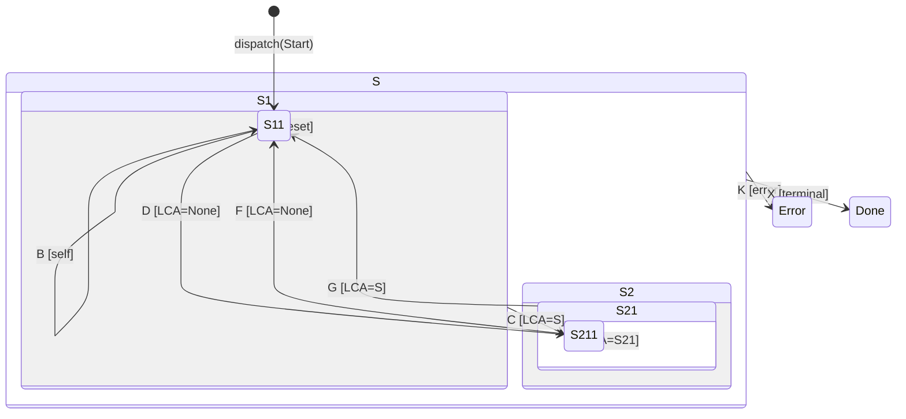

# Blox Spec: `BhsmTst`

## Purpose

The BhsmTst (Bloxide HSM Test) actor is a pedagogical demonstration of deep hierarchical state machine mechanics. It exercises every transition topology: self-transitions, parent→child transitions, cross-sibling transitions, deep cross-subtree transitions, and top-level catch-all transitions. Every state entry and exit prints its name, producing output identical to the classic QHsmTst console example from Miro Samek's "Practical UML Statecharts".

## Crate Location

- Blox crate: `crates/bloxes/bhsm-tst/`
- Messages crate: `crates/messages/bhsm-tst-messages/`
- Actions crate: `crates/actions/bhsm-tst-actions/` (minimal — no mutable state)

## State Hierarchy



> `[Init]` is engine-implicit (not in the `BhsmTstState` enum). The actor enters Init at construction and waits. `dispatch(BhsmTstEvent::Lifecycle(LifecycleCommand::Start))` exits Init and enters `S→S1→S11`. `dispatch(BhsmTstEvent::Lifecycle(LifecycleCommand::Reset))` exits all states and re-enters Init.
> `S`, `S1`, `S2`, `S21` are composite states (never active). `S11`, `S211`, `Error`, `Done` are leaf states.

## States

| State | Kind | Description |
|-------|------|-------------|
| `[Init]` | engine-implicit | Waiting for `dispatch(Start)` |
| `S` | composite, top-level | Catch-all for H, I, K, X events |
| `S1` | composite | Parent of S11 |
| `S11` | leaf, initial | Initial state. Handles A, B, D. |
| `S2` | composite | Parent of S21 |
| `S21` | composite | Parent of S211. Handles C (bubbled), E, G. |
| `S211` | leaf | Handles F (deep cross back) |
| `Error` | leaf, error | `is_error()` returns true. Supervisor restarts. |
| `Done` | leaf, terminal | `is_terminal()` returns true. Supervisor stops group. |

## Events

| Event | Handled by | Transition | LCA | Demonstrates |
|-------|-----------|------------|-----|-------------|
| `A` | `S11` | `S11→S11` | `S1` | Self-transition at leaf |
| `B` | `S11` | `S11→S11` | `S1` | Same mechanics, different print |
| `C` | `S1` (bubbled) | `S11→S211` | `S` | Cross-sibling via parent |
| `D` | `S11` | `S11→S211` | None | Deep cross-subtree (full exit/entry) |
| `E` | `S21` | `S211→S211` | `S21` | Parent→child (single ancestor) |
| `F` | `S211` | `S211→S11` | None | Deep cross back |
| `G` | `S21` | `S211→S11` | `S` | Mid-level cross |
| `H` | `S` | `any→S11` | None | Top-level reset (full chain) |
| `I` | `S` | stay | — | Top-level absorb |
| `K` | `S` | `any→Error` | None | Error state (supervisor restart) |
| `X` | `S` | `any→Done` | None | Terminal (supervisor shutdown) |

Lifecycle control (`Start`, `Reset`, `Stop`) is handled by the runtime — these do not appear as domain events.

## Context

```rust
#[derive(BloxCtx)]
pub struct BhsmTstCtx {
    pub self_id: ActorId,
}
```

No behavior field — this is a pure topology demonstration. `BhsmTstCtx::new(actor_id)` is the only constructor.

## Entry / Exit Actions

Every state has `on_entry` and `on_exit` that print `{state}-ENTRY;` and `{state}-EXIT;`.

| State | on_entry | on_exit |
|-------|----------|---------|
| `[Init]` (engine) | — | — |
| `S` | print `s-ENTRY;` | print `s-EXIT;` |
| `S1` | print `s1-ENTRY;` | print `s1-EXIT;` |
| `S11` | print `s11-ENTRY;` | print `s11-EXIT;` |
| `S2` | print `s2-ENTRY;` | print `s2-EXIT;` |
| `S21` | print `s21-ENTRY;` | print `s21-EXIT;` |
| `S211` | print `s211-ENTRY;` | print `s211-EXIT;` |
| `Error` | print `error-ENTRY;` | print `error-EXIT;` |
| `Done` | print `done-ENTRY;` | print `done-EXIT;` |

## LCA Exit/Entry Examples

### `S11 → S211` via event D (deep cross-subtree, LCA = None)
```
source_path: [S, S1, S11]
target_path: [S, S2, S21, S211]
LCA = None (no common user ancestor → full exit/entry)

Exit:   S11.on_exit  ← s11-EXIT;
        S1.on_exit   ← s1-EXIT;
        S.on_exit    ← s-EXIT;
Entry:  S.on_entry   ← s-ENTRY;
        S2.on_entry  ← s2-ENTRY;
        S21.on_entry ← s21-ENTRY;
        S211.on_entry← s211-ENTRY;
```

### `S11 → S211` via event C (bubbled to S1, LCA = S)
```
source_path: [S, S1, S11]
target_path: [S, S2, S21, S211]
LCA = S (index 0)

Exit:   S11.on_exit  ← s11-EXIT;
        S1.on_exit   ← s1-EXIT;
Entry:  S2.on_entry  ← s2-ENTRY;
        S21.on_entry ← s21-ENTRY;
        S211.on_entry← s211-ENTRY;
```
> `S.on_exit` does NOT fire — this is an intra-subtree transition.

### `S211 → S211` via event E (bubbled to S21, LCA = S21)
```
source_path: [S, S2, S21, S211]
target_path: [S, S2, S21, S211]
LCA = S21 (index 2)

Exit:   S211.on_exit ← s211-EXIT;
Entry:  S211.on_entry← s211-ENTRY;
```

### `any → S11` via event H (top-level reset, LCA = None)
```
source_path: [S, ...]  (from any substate)
target_path: [S, S1, S11]
LCA = None (exits all the way out, re-enters from S)

Exit:   (full chain from current leaf up through S)
        S.on_exit    ← s-EXIT;
Entry:  S.on_entry   ← s-ENTRY;
        S1.on_entry  ← s1-ENTRY;
        S11.on_entry ← s11-ENTRY;
```

### `any → Error` via event K
```
source_path: [S, ...]  (from any substate)
target_path: [Error]
LCA = None

Exit:   (full chain from current leaf up through S)
        S.on_exit    ← s-EXIT;
Entry:  Error.on_entry← error-ENTRY;  (is_error() → supervisor reports Failed)
```

### `any → Done` via event X
```
source_path: [S, ...]  (from any substate)
target_path: [Done]
LCA = None

Exit:   (full chain from current leaf up through S)
        S.on_exit    ← s-EXIT;
Entry:  Done.on_entry ← done-ENTRY;   (is_terminal() → supervisor reports Done)
```

## Interactive Demo

The `bhsm-tst-demo` binary reads stdin commands:

| Key | Action |
|-----|--------|
| A–I, K, X | Send corresponding `BhsmTstMsg` variant |
| R | Dispatch `LifecycleCommand::Reset` |
| Q | Dispatch `LifecycleCommand::Stop` |
| ? | Print usage |

Run with: `RUST_LOG=info cargo run --example bhsm-tst-demo`

## Acceptance Criteria

- [ ] `dispatch(Start)` enters `S11` through `S→S1→S11`; prints `s-ENTRY; s1-ENTRY; s11-ENTRY;`
- [ ] `A` in `S11` self-transitions: prints `s11-A; s11-EXIT; s11-ENTRY;`
- [ ] `D` in `S11` cross-subtree to `S211`: full exit `S11,S1,S` then entry `S2,S21,S211`
- [ ] `C` in `S11` bubbles to `S1`, transitions to `S211`: exit `S11,S1`, entry `S2,S21,S211`
- [ ] `E` in `S211` bubbles to `S21`, transitions to `S211` (parent→child): exit `S211`, entry `S211`
- [ ] `F` in `S211` cross back to `S11`: full exit/entry chain
- [ ] `G` in `S211` bubbles to `S21`, transitions to `S11`: exit `S211,S21,S2`, entry `S,S1,S11`
- [ ] `H` from any state resets to `S11`: full exit/entry chain
- [ ] `I` at top level (`S`) is absorbed — stay, no transition
- [ ] `K` from any state transitions to `Error`: `is_error()` returns true, supervisor restarts
- [ ] `X` from any state transitions to `Done`: `is_terminal()` returns true, supervisor shuts down
- [ ] `R` (LifecycleCommand::Reset) resets actor to `Init→S11`
- [ ] `Q` (LifecycleCommand::Stop) sends actor to Init (suspended)
- [ ] Unknown events bubble to root and are silently dropped
